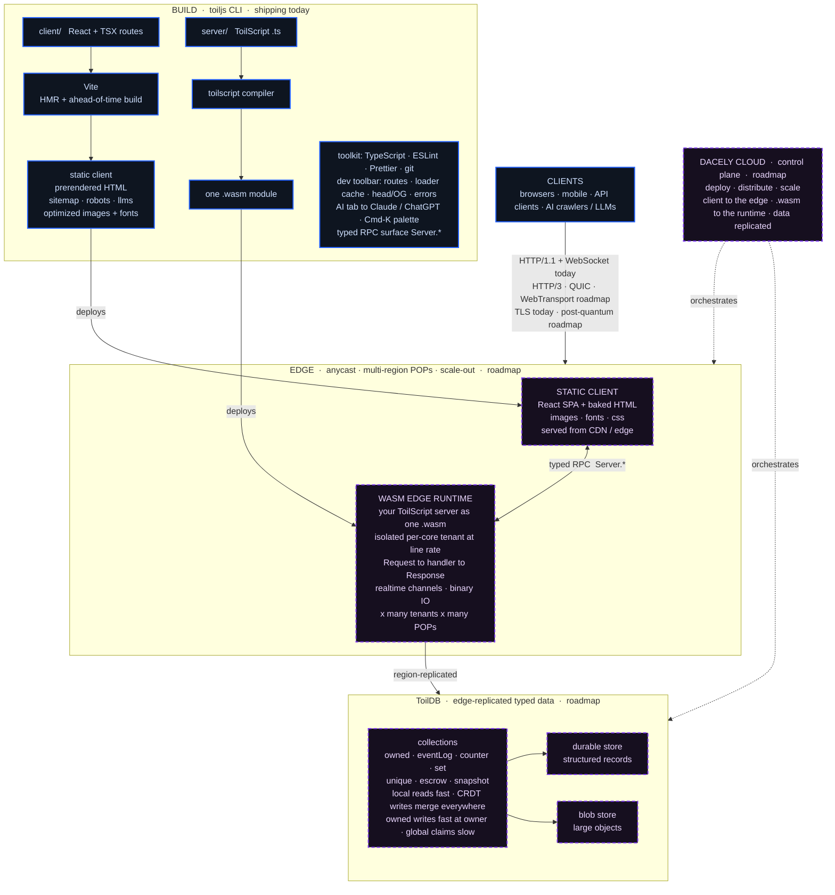

<div align="center">


# ToilJS

### The fullstack React framework, built for hyperscale.

#### The first universal client and server framework.

<sub>Nothing to configure: routing, data, SEO, top-tier tooling, and full AI support, all built in.</sub>

<br/>

[](https://www.npmjs.com/package/toiljs)
[](https://www.typescriptlang.org/)
[](https://react.dev/)
[](#the-server-toilscript--webassembly)
[](./LICENSE)

<br/>


</div>

---

**ToilJS is a complete fullstack framework: a React frontend and a typed server, with everything in between already built and wired.** Routing, data loading, caching, SEO, site search, an image and font pipeline, realtime, a dev toolbar with AI, a strict toolchain, and a compiled server, all configured for you. You run one command and start building your app, not your stack.

A normal React project is a renderer plus a dozen libraries you choose, install, configure, and keep in sync: a router, a data layer, an image pipeline, SEO tags, a server, lint and format rules. ToilJS replaces all of it with one toolchain whose parts already know about each other. Nothing to assemble, nothing to glue, nothing to configure.

```bash
npx toiljs create my-app
cd my-app
npm run dev
```

Drop a `.tsx` file in `client/routes/` and it is a route: typed, code-split, prefetched, with its data loaded before render. Your `server/` is written in **ToilScript** (TypeScript syntax) and compiles to a single WebAssembly module. You configured nothing.

<div align="center">

```
                          your app
        ┌──────────────────────┬──────────────────────┐
        │       client/        │        server/        │
        │   React + TSX        │    ToilScript (.ts)    │
        │   static SPA bundle  │   ──▶  WebAssembly     │
        └──────────┬───────────┴───────────┬───────────┘
                   │                        │
            CDN / static host        WASM edge runtime
                                     (typed RPC between them)
```

</div>

The client is fully static (host it anywhere). The server is portable WebAssembly. The two are separated by design and joined by a typed contract, so the frontend can ship to a CDN while the backend runs wherever WebAssembly does.

## Everything, at a glance

This is the full surface area. Every row works the moment `create` finishes, no plugins to install, no config to write.

|  |  |
| --- | --- |
| **Zero config** | One command scaffolds a working app. You never write an `index.html`, a `main.tsx`, a router, or a Vite / build config. The framework generates and owns all of it. |
| **Routing** | File-based. Dynamic, catch-all, optional catch-all, route groups, nested layouts, templates, loading and error boundaries, parallel slots, and intercepting routes. Every `href` and `params` is typed against your real files. |
| **Navigation** | `Link` / `NavLink`, programmatic `navigate` / `back` / `forward` / `refresh`, hover and viewport prefetch, scroll restoration, instant back/forward, and animated view transitions. |
| **Data** | A `loader` resolves before render. `useAction` / `<Form>` write then revalidate. An LRU loader cache with per-route `revalidate`. No fetch waterfalls, no `useEffect` data fetching. |
| **Rendering + SEO** | Per-route `<head>` baked into static HTML at build, plus `sitemap.xml`, `robots.txt`, `llms.txt`, OpenGraph, Twitter, JSON-LD, canonical, theme-color, early hints. SSG via `generateStaticParams`. |
| **Search** | Built-in site search over a compiler-baked metadata index, ranked, with a `usePageSearch` hook. Plus `llms.txt` so AI crawlers can read your site. |
| **Assets** | Imported images compressed to webp and resized via Vite + sharp. Fonts preloaded. React split into its own long-lived chunk. The build logs what it saved. |
| **Components** | Drop-in `Image` (no layout shift, lazy, blur), `Script` (load strategies, dedupe), `Form`, `Slot`, `Head`, all on a typed `Toil` global, zero imports. |
| **Realtime** | Typed WebSocket channels: `connectChannel` / `useChannel`, with reconnect built in, text or binary frames. |
| **Server** | A typed ToilScript server compiled to a portable, native-speed module. `Request` / `Response` REST handlers, binary IO on both sides, and a typed RPC surface generated from your server. |
| **Agentic DX** | A dev toolbar with a live AI tab (hand off page context to Claude or ChatGPT), a Cmd+K palette, and scaffolded agent files (CLAUDE.md, AGENTS.md, Cursor, Copilot). |
| **Toolkit** | Strict TypeScript, ESLint, and Prettier shipped as presets, plus optional git init. Tailwind v4, Sass, Less, and Stylus a flag away. |
| **CLI** | `create`, `dev`, `build`, `start`, `configure`, `doctor` (with `--json` for CI), and `update`. |

## Routing

The filesystem is the router. Every convention below is implemented.

| File or folder | Route |
| --- | --- |
| `index.tsx` | `/` |
| `about.tsx` | `/about` |
| `blog/[id].tsx` | `/blog/:id` |
| `docs/[...slug].tsx` | catch-all |
| `docs/[[...slug]].tsx` | optional catch-all |
| `(marketing)/about.tsx` | route group, adds no URL segment |
| `layout.tsx` | wraps the segment, persists across navigation |
| `template.tsx` | a layout that re-mounts on every navigation |
| `loading.tsx` | Suspense fallback while the route and its data load |
| `error.tsx` | error boundary for the segment |
| `global-error.tsx` | catches errors in the root layout itself |
| `404.tsx` | not-found page |
| `@modal/...` | parallel slot, placed with `<Toil.Slot name="modal" />` |
| `@modal/(.)photo/[id]` | intercepting route: modal on soft nav, full page on reload |

Navigation comes with it:

- **`<Toil.Link>`** and **`<Toil.NavLink>`** (active class + `aria-current`), with `href` checked against your real routes.
- **`navigate` / `back` / `forward` / `refresh`**, plus **`useRouter`**, **`useNavigate`**, **`useLocation`**, **`usePathname`**, **`useParams`**, **`useSearchParams`**, **`useNavigationPending`**.
- **Hover and viewport prefetching**, so chunks (and data) are warm before you click. Respects `saveData` and `data-no-prefetch`.
- **Scroll restoration** on back/forward, scroll-to-`#hash`, and scroll-to-top on new routes.
- **Instant navigation**: visited pages render synchronously, no flash.
- **View transitions** (`client.viewTransitions: true`) for animated page changes, respecting `prefers-reduced-motion`.

## Data and caching

Read with a `loader`, write with an action. Both keep the UI in sync without manual refetching, and the client caches loader results so repeat navigations are instant.

```tsx
export const loader = async ({ params }: Toil.LoaderArgs) => fetchPost(params.id);
export const revalidate: Toil.Revalidate = 10; // reuse for 10s, false = forever, omit = every nav

function SaveButton({ title }: { title: string }) {
    const save = Toil.useAction((t: string) => api.save(t), { revalidate: true });
    return (
        <button disabled={save.pending} onClick={() => void save.run(title)}>
            {save.pending ? 'Saving' : 'Save'}
        </button>
    );
}
```

- **`loader`** resolves in parallel with the route chunk; the page suspends until ready (its `loading.tsx` shows).
- **`useLoaderData(loader)`** is typed straight from the loader, no generics.
- **Client cache**: an LRU of loader results keyed by path + search, with `revalidate` set per route (seconds, `false` for forever, or per-navigation). Prefetched entries are reused on commit.
- **`useAction`** and **`<Toil.Form>`** track pending and error state and revalidate the routes you name on success. `router.revalidate()` / `revalidate(href)` bust the cache after a mutation.

## Rendering and SEO

A single-page app serves an empty shell. ToilJS pre-renders each route's `<head>` at build, so Google, Facebook, Discord, Slack, and the AI crawlers see real per-page tags without running your JavaScript.

```ts
// toil.config.ts
export default defineConfig({
    client: {
        seo: {
            url: 'https://example.com',
            title: 'My App',
            openGraph: { siteName: 'My App', type: 'website', image: '/og.png' },
            twitter: { card: 'summary_large_image' },
            jsonLd: { '@context': 'https://schema.org', '@type': 'WebSite' },
            themeColor: '#2563ff', // also the Discord / Slack embed accent
            preconnect: ['https://cdn.example.com'],
            robots: { ai: 'allow' },
        },
    },
});
```

- **Per-route `metadata`** (or `generateMetadata` derived from the loader's data) wins per page over layout defaults.
- **Static prerender** writes a `<route>/index.html` for every static route with that route's head baked in. **SSG** enumerates dynamic routes via `generateStaticParams` and bakes per-URL HTML.
- **`robots.txt`**, **`sitemap.xml`**, and **`llms.txt`** generated together.
- Full **OpenGraph**, **Twitter card**, **JSON-LD**, **canonical**, **theme-color**, and **`preconnect` / `dns-prefetch`** early hints. Output is XSS-hardened.

### AI search, on by default

Turn on SEO and the build emits an `llms.txt` describing your site for language models, plus a `robots.txt` with explicit per-bot rules. Allow or block GPTBot, OAI-SearchBot, ChatGPT-User, ClaudeBot, anthropic-ai, Google-Extended, PerplexityBot, CCBot, Applebot-Extended, Bytespider, Amazonbot, and Meta-ExternalAgent with one switch:

```ts
seo: { llms: { instructions: 'Docs live at /docs.' }, robots: { ai: 'disallow' } }
```

Your users get search too. The compiler bakes a static index of every page's title, description, and keywords, and `Toil.usePageSearch` (or the pure `searchPages`) returns ranked, navigable results.

## Assets and the Vite build

ToilJS owns Vite, for the dev server and for the ahead-of-time production build, and does the boring optimization for you. The build tells you what it did:

```
$ npm run build
  ✓ optimized 3 images
  client/hero.png
    → images/hero.webp   148.0 kB → 19.3 kB  -87%
  ✓ preloaded 2 fonts
    → fonts/inter-latin.woff2   24.10 kB
```

- **Images** (Vite imagetools + sharp): every imported raster is compressed to webp, with resize and reformat via `?w=400;800&format=webp&as=srcset`. The build logs the savings.
- **Fonts**: bundled `@font-face` fonts get a `<link rel="preload">` so text paints sooner, also logged.
- **Chunking**: React is split into its own long-lived chunk; assets land in tidy `images/`, `fonts/`, and `css/` folders.
- **Node polyfills** (`Buffer`, `global`, `process`) for libraries that expect them.
- **Styling**: plain CSS out of the box, with Sass, Less, Stylus, and Tailwind v4 a `toiljs configure` away.

You never write an `index.html`, a `main.tsx`, or a Vite config. The framework generates and owns them.

## Components

Zero-import, on the `Toil` global:

- **`Image`** drops in for ``: reserves space (no layout shift), lazy-loads, async-decodes, `priority` for the LCP image, `fill` + `objectFit`, optional blur placeholder.
- **`Script`** loads external or inline scripts with a `strategy` (`afterInteractive` / `lazyOnload` / `beforeInteractive`), deduplicated so a script never runs twice.
- **`Form`** submits to an action without a reload, revalidates on success, exposes pending state, optionally resets fields.
- **`Slot`** renders a parallel `@slot` route, the basis for modal overlays.
- **`Head`** / **`useHead`** / **`useTitle`** set the title and `<meta>` / `<link>` tags imperatively and compose across the tree.

## Realtime

A typed WebSocket channel to the server, built in.

```tsx
const messages = Toil.useChannel<Message>('/chat');
```

`connectChannel` / `useChannel` / `resolveChannelUrl` handle connection, reconnection, and message decoding, text or binary frames.

## The server: ToilScript + WebAssembly

Your backend is written in **ToilScript**, a TypeScript-syntax language that compiles to WebAssembly. You write request handlers; the compiler produces a single portable `.wasm` module.

```ts
// server/HelloHandler.ts
export class HelloHandler extends ToilHandler {
    handle(req: Request): Response {
        if (req.path == '/api/hello') return Response.json('{"hello":"world"}');
        return Response.notFound();
    }
}
```

- **REST handlers**: `Request` (method, path, headers, body) in, `Response` out, with `text` / `html` / `json` / `notFound` / `badRequest` / `internalError` helpers and the full set of HTTP methods.
- **Binary IO on both sides**: `DataWriter`, `DataReader`, `FastMap`, and `FastSet` are shared client and server globals (and `toiljs/io`), so you can move structured bytes instead of paying the JSON tax.
- **Typed RPC (preview)**: tag a server function and the compiler generates a typed `Server.*` surface on the client, end to end, no hand-written glue. The typed pipeline is in place today; the network transport is landing next.

`toiljs start` self-hosts the built client and a WebSocket channel on [hyper-express](https://github.com/kartikk221/hyper-express) (backed by uWebSockets.js) for local and small deployments. For where this is headed at scale, see [The road to hyperscale](#the-road-to-hyperscale).

## Agentic tooling

`toiljs dev` injects a floating toolbar (stripped from production builds entirely, no flag, no leftover bytes) that surfaces the framework's live state: the matched route, params, and active slots; the loader cache with revalidate and clear buttons; the live `<head>` with an OpenGraph preview and an SEO checklist; resolved config flags and versions; a captured error log; and toggles for view and loader transitions. Press **Cmd/Ctrl+K** for a command palette to jump to any route or run a dev action.

It also ships an **AI tab**: hand off the current page's context (and its source) to Claude or ChatGPT in one click, or wire a provider for inline answers. The API key is read server-side only and never reaches the browser.

```ts
import { defineConfig, AiProvider } from 'toiljs/compiler';

export default defineConfig({
    client: {
        devtools: {
            ai: {
                provider: AiProvider.Anthropic, // or AiProvider.OpenAI, or a custom endpoint
                model: 'claude-sonnet-4-6',
                apiKeyEnv: 'ANTHROPIC_API_KEY', // read by the dev server only
            },
        },
    },
});
```

And the `toiljs create` wizard scaffolds assistant files (CLAUDE.md, AGENTS.md, Cursor, and Copilot configs) so your repo is ready for coding agents on day one.

## The toolkit is the standard

ToilJS sets the toolchain so nobody argues about it. Strict TypeScript, ESLint (typescript-eslint, react-hooks, react-refresh, @eslint-react), and Prettier come configured and enforced from the first commit, shipped as `toiljs/tsconfig`, `toiljs/eslint`, and `toiljs/prettier`. New apps extend them automatically and can init git in the same step. Opt in to as much as you want, nothing to copy, nothing to bikeshed.

## CLI

```
toiljs create [name]   scaffold a new app (template, styling, AI files, git, package manager)
toiljs dev             dev server with HMR
toiljs build           ahead-of-time production build
toiljs start           self-host the built client + WebSocket channel
toiljs configure       toggle styling and asset features on an existing app
toiljs doctor          diagnose project setup and dependencies (--json for CI)
toiljs update          check for and apply dependency updates (-y to apply all)
```

`toiljs create` is interactive (template, CSS preprocessor, Tailwind, AI assistant files, image optimization, git, install, package manager), or fully scriptable with flags and `--yes`.

## One file does a lot

```tsx
// client/routes/posts/[id].tsx  ->  /posts/:id
interface Post {
    title: string;
}

export const metadata: Toil.Metadata = { title: 'Post' };       // SEO, baked into the HTML at build

export const loader = async ({ params }: Toil.LoaderArgs): Promise<Post> => {
    const res = await fetch(`/api/posts/${params.id}`);         // runs before render, no useEffect
    return res.json();
};

export default function PostPage() {
    const post = Toil.useLoaderData(loader);                    // typed Post, no generics
    return (
        <article>
            <h1>{post.title}</h1>
            <Toil.Link href="/posts">All posts</Toil.Link>      {/* href is type-checked */}
        </article>
    );
}
```

No imports. `Toil` is a fully-typed global, tree-shaken at build. The page renders with its data already loaded.

## Architecture

One pipeline, from your editor to planetary scale. The build pipeline and the React client ship today; the edge runtime, the ToilDB data layer, and Dacely Cloud are the roadmap (marked in purple).



<details>
<summary>Same diagram as plain ASCII (for npm and text-only views)</summary>

```
┌──────────────────────────────────────────────────────────────────────────┐
│  BUILD  ·  toiljs CLI                                            [today]  │
│                                                                          │
│   client/  React + TSX routes ──▶ Vite (HMR · ahead-of-time build) ──┐   │
│   server/  ToilScript (.ts)   ──▶ toilscript compiler ──▶ one .wasm  │   │
│                                                                      │   │
│   toolkit  TypeScript · ESLint · Prettier · git   (opt-in presets)   │   │
│   dev      toolbar: routes · loader cache · head/OG · errors         │   │
│            AI tab → Claude / ChatGPT · ⌘K palette                     │   │
│   emits    static client · prerendered HTML · sitemap·robots·llms    │   │
│            optimized images / fonts · typed RPC surface (Server.*)    │   │
└───────────────────────────────────────────────────────────────┬─────┬───┘
                                                       deploys ▼ │     │ ▼
┌──────────────────────────────────────────────────────────────────────────┐
│  CLIENTS                                                                  │
│  browsers   ·   mobile webviews   ·   API clients   ·   AI crawlers/LLMs  │
└───────────────────────────────────┬──────────────────────────────────────┘
            HTTP/1.1 + WebSocket  [today]   │   HTTP/3 · QUIC · WebTransport  [soon]
                        TLS  [today]        │   post-quantum transport       [soon]
                                            ▼
╔══════════════════════════════════════════════════════════════════════════╗
║  EDGE   ·   anycast · multi-region POPs · scale-out                [soon] ║
║                                                                          ║
║   ┌─────────────────────────┐        ┌─────────────────────────────────┐ ║
║   │  STATIC CLIENT          │        │  WASM EDGE RUNTIME              │ ║
║   │  React SPA + baked HTML │        │  your ToilScript server as one │ ║
║   │  images · fonts · css   │   typed│  .wasm, run as an isolated      │ ║
║   │  served from CDN / edge │◀──RPC─▶│  per-core tenant at line rate   │ ║
║   │                         │ Server.*  Request ▶ handler ▶ Response   │ ║
║   │  llms·robots·sitemap    │        │  realtime channels · binary IO  │ ║
║   └─────────────────────────┘        └───────────────┬─────────────────┘ ║
║        instant, cacheable                  × many tenants × many POPs     ║
╚═══════════════════════════════════════════════════════╪══════════════════╝
                                                         ▼   region-replicated
╔══════════════════════════════════════════════════════════════════════════╗
║  ToilDB   ·   edge-replicated, typed data layer                    [soon] ║
║                                                                          ║
║   collections:  owned · eventLog · counter · set · unique · escrow ·     ║
║                 snapshot          (the method name tells you the cost)   ║
║   local reads fast  ·  CRDT writes merge everywhere                       ║
║   owned writes fast at the owner  ·  global claims explicitly slow        ║
║                                                                          ║
║      ┌──────────────────────┐            ┌──────────────────────┐        ║
║      │  durable store       │            │  blob store          │        ║
║      │  structured records  │            │  large objects       │        ║
║      └──────────────────────┘            └──────────────────────┘        ║
╚═══════════════════════════════════════════════════════╪══════════════════╝
                                                         ▼
╔══════════════════════════════════════════════════════════════════════════╗
║  DACELY CLOUD   ·   control plane: deploy · distribute · scale     [soon] ║
║  push your app ─▶ client to the edge, .wasm to the runtime, data replicated ║
╚══════════════════════════════════════════════════════════════════════════╝

  [today] shipping now      [soon] architecture + roadmap, not yet GA
```

</details>

---

## The road to hyperscale

> **Architecture and roadmap.** This section is where Toil is going, not what ships in the box today. The framework above is real and usable now; the platform below is the design it is being built toward.

The reason the client is static and the server is WebAssembly is that the WebAssembly runs on a runtime engineered from scratch for the edge. Toil's backend treats your compiled server as an isolated tenant and is built to serve it at line rate, so the same app that runs on your laptop is designed to scale out across the edge without a rewrite.

<div align="center">


</div>

- **A purpose-built WebAssembly edge runtime.** Your server runs as an isolated WebAssembly tenant on a runtime engineered for line-rate, multi-gigabit throughput and per-tenant isolation, not on a general-purpose Node process.
- **HTTP/3 and WebTransport.** Bidirectional streams and datagrams over QUIC for interactive, multiplexed realtime, beyond the WebSocket channel that ships today.
- **ToilDB, an edge-replicated data layer.** Typed collections declared in ToilScript, where the method name tells you the cost: local reads are fast, appends and CRDT counters/sets merge everywhere, owned writes are fast at the owner, and rare global claims are explicitly slow. Hyperscale data, without a per-query consistency knob to get wrong.
- **Post-quantum-ready transport.** Forward-looking encryption for the edge as the QUIC layer lands.
- **Dacely Cloud.** Managed hosting for the whole stack: push your app, the static client goes to the edge and your WebAssembly server runs on the runtime above.

This is the spine the framework was shaped around. Today you write a typed, file-based React app with a WebAssembly server; the roadmap is the platform that runs it at planetary scale.

## Tech

<div align="center">


</div>

React 19, TypeScript, Vite, [ToilScript](https://www.npmjs.com/package/toilscript) (TypeScript syntax, compiles to WebAssembly), Vite imagetools + sharp, ESLint (typescript-eslint, react-hooks, react-refresh, @eslint-react), Prettier, Tailwind v4 (optional).

## Start

```bash
npx toiljs create my-app
```

Everything in the framework half of this README is already on. You just build the app.

<div align="center"><br/><sub>Apache-2.0 · <a href="https://toil.org">toil.org</a></sub></div>
