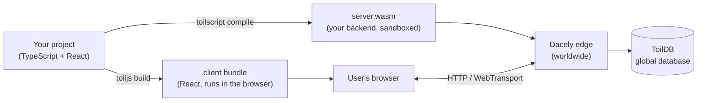

# toiljs

toiljs is a full-stack web framework. You write your **frontend in React** and your **backend in
TypeScript**, and toiljs turns the backend into a tiny, fast **WebAssembly** program that runs at the edge
(on servers close to your users, all over the world). One language, one project, one deploy.

If you have used Next.js, this will feel familiar: file-based routes, server code next to client code, a dev
server with hot reload. The difference is what happens underneath. Your server code is compiled by
**toilscript** (a TypeScript-to-WebAssembly compiler) into a sandboxed `.wasm` module, and it runs on the
**Dacely edge** with a built-in worldwide database (**ToilDB**), streaming, background jobs, and auth all
included.

## The mental model



- **client/** is your React app (pages, components, styles). It runs in the browser.
- **server/** is your backend (routes, database, auth). It compiles to WebAssembly and runs on the edge.
- **shared/** is the typed bridge: toiljs generates a client here so the browser calls your server with full
  type safety.

## Hello, toiljs

```ts
// server/routes/Hello.ts  (a backend HTTP route)
import { Response } from 'toiljs/server/runtime';

@rest('hello')
class Hello {
    @get('/')
    public hi(): Response {
        return Response.text('Hello from the edge!\n');
    }
}
```

```tsx
// client/routes/index.tsx  (a frontend page)
export default function Home() {
    return <main><h1>Welcome</h1></main>;
}
```

Run `toiljs dev`, open the browser, and both are live with hot reload. That is the whole loop.

## Learn toiljs

**Understand toil first**
- [Understanding toil](./introduction/README.md): what toil is and the one big idea, then
  [why toil and who it is for](./introduction/why-toil.md),
  [the modern stack you get](./introduction/modern-stack.md),
  [how it works](./introduction/how-it-works.md),
  [what makes it hyper-scalable](./introduction/hyperscale.md),
  [how it is distributed](./introduction/distributed.md),
  [toil versus other frameworks](./introduction/vs-other-frameworks.md), and
  [why it is built this way](./introduction/design-principles.md).

**Start here**
- [Getting started](./getting-started/README.md): install, create a project, project structure, your first
  app, and migrating an existing React app.
- [The CLI](./cli/README.md): `dev`, `build`, `create`, `doctor`, and every flag.
- [Deploy](./getting-started/deploy.md): build for production, self-host it, and how the managed edge fits in.

**Build the frontend**
- [Frontend overview](./frontend/README.md), [Routing](./frontend/routing.md),
  [Navigation](./frontend/navigation.md), [Components](./frontend/components.md),
  [Rendering and SSR](./frontend/rendering.md), [Styling](./frontend/styling.md),
  [Images](./frontend/images.md), [Metadata and SEO](./frontend/metadata.md),
  [Fetching data](./frontend/data-fetching.md), [Scripts](./frontend/scripts.md),
  [Search](./frontend/search.md), [The Toil global (reference)](./frontend/toil-global.md).

**Build the backend**
- [Backend overview](./backend/README.md), [HTTP routes (`@rest`)](./backend/rest.md),
  [Typed RPC (`@service`/`@remote`)](./backend/rpc.md), [Data types (`@data`)](./backend/data.md).

**The database (ToilDB)**
- [Database overview and choosing a family](./database/README.md), [Setup (`@database`)](./database/setup.md),
  [Documents](./database/documents.md), [Unique](./database/unique.md), [Counters](./database/counters.md),
  [Events](./database/events.md), [Views and `@derive`](./database/views.md),
  [Membership](./database/membership.md), [Capacity](./database/capacity.md).

**Auth**: [the full auth guide](./auth/README.md) covers post-quantum login, sessions, and `ToilUserId`;
[customizing the auth emails](./auth/emails.md) shows how to brand the verification, reset, and 2FA mail.

**Realtime and background**
- [Streams](./realtime/README.md) and [channels](./realtime/channels.md), [Daemons and scheduled
  jobs](./background/daemons.md), [Derived views (`@derive`)](./background/derive.md).

**Platform services**
- [Caching](./services/caching.md), [Rate limiting](./services/ratelimit.md),
  [Environment and secrets](./services/environment.md), [Email and 2FA](./services/email.md),
  [Analytics](./services/analytics.md), [Crypto](./services/crypto.md), [Cookies](./services/cookies.md),
  [Time](./services/time.md).

**Concepts and reference**
- [Writing toiljs correctly (AI + human quick rules)](./concepts/ai-guide.md),
  [Compute tiers (L1 to L4)](./concepts/tiers.md), [Types (u64, u256, and friends)](./concepts/types.md),
  [Every decorator](./concepts/decorators.md), [Configuration](./concepts/config.md),
  [Security and SRI](./concepts/security.md).
