# Auth, sessions, and `@user`

toiljs ships a complete authentication primitive: a post-quantum login
(ML-DSA-44, password-derived), HMAC-signed session cookies, a `@auth` route
guard, and a `@user` type that makes the signed-in user available — fully typed,
with no type argument — on both the server (`AuthService.getUser()`) and the
generated client (`getUser()`).

`AuthService` is an ambient global (no import). The pieces:

- **`@user`** — declares the authenticated user's shape and registers it as
  *the* user type.
- **`@auth`** — guards a route (or a whole `@rest` class): a valid session is
  required or the request is rejected with `401`.
- **`AuthService`** — the server runtime: verify a login, mint/read/clear a
  session, and `getUser()`.
- **client `Auth` + generated `getUser()`** — derive the keypair from a
  password, register/login, and read the user for display.

## Flow at a glance

Register sends only a public key; login proves identity with a one-time
signature the server verifies (it never holds a secret); `@auth` then checks the
HMAC-signed session cookie on every guarded request.

```mermaid
sequenceDiagram
    autonumber
    actor U as User
    participant C as Browser<br/>toiljs/client Auth
    participant S as Edge wasm<br/>AuthService
    participant DB as Your store<br/>accounts + challenges

    rect rgb(14, 21, 32)
    Note over U,DB: Register, the password never leaves the browser
    U->>C: Auth.register(username, password)
    C->>C: Argon2id, then ML-DSA-44 keypair,<br/>keep public key, zeroize secret key
    C->>S: POST /auth/register { username, publicKey 1312 B }
    S->>DB: store Account { username, publicKey }
    S-->>C: 200 ok
    end

    rect rgb(22, 15, 31)
    Note over U,DB: Login, the server holds no secret
    U->>C: Auth.login(username, password)
    C->>S: GET /auth/challenge { username }
    S->>DB: create + store challenge (cid, nonce, iat, exp)
    S-->>C: { cid, aud, nonce, iat, exp }
    C->>C: re-derive keypair,<br/>sign buildLoginMessage(...) once
    C->>S: POST /auth/login { cid, signature 2420 B }
    S->>DB: atomic consume challenge(cid)
    S->>S: rebuild message from stored values,<br/>verifyLogin via crypto.mldsa_verify
    alt signature valid
        S-->>C: 200 + Set-Cookie __Host-toil_sess (HttpOnly, signed)<br/>and __Secure-toil_user (readable, display only)
    else invalid or unknown user
        S-->>C: 401, constant time, anti-enumeration
    end
    end

    rect rgb(13, 25, 18)
    Note over U,DB: Guarded request, the @auth guard
    U->>C: open or call an @auth route
    C->>S: request, cookies sent automatically
    S->>S: @auth checks AuthService.hasSession(),<br/>verify HMAC + expiry on __Host-toil_sess
    alt valid session
        S->>S: handler runs,<br/>AuthService.getUser() returns the @user
        S-->>C: 200 response
    else missing or invalid session
        S-->>C: 401 before the handler and body-decode
    end
    C->>C: getUser() reads __Secure-toil_user,<br/>untrusted, UI only
    end
```



The two cookies are the trust boundary: the HttpOnly `__Host-toil_sess` is the
only one the server trusts (it re-verifies its signature and expiry every
request), while the readable `__Secure-toil_user` exists solely so the client
`getUser()` can show a name without a round-trip and must never gate anything.

## `@user`

Mark one class per program as the user type. It becomes a `@data` codec (so it
serializes into the session) and the return type of `getUser()` everywhere.

```ts
@user
class Account {
  username: string = '';
  admin: bool = false;
  score: u64 = 0;
}
```

There is exactly one `@user` per program; a second one is a compile error.

## `@auth`

Put `@auth` on a route, or on the `@rest` class to guard every route in it. The
generated dispatcher checks for a valid, unexpired session **before** the
handler runs (and before any body-decode or cache write); without one it returns
`401 unauthorized`.

```ts
@rest('session')
class Session {
  @auth
  @get('/me')
  public me(): Response {
    const u = AuthService.getUser();        // Account | null, auto-typed
    if (u == null) return Response.text('no session\n', 401);
    return Response.bytes(new DataWriter()
      .writeString(u.username)
      .writeBool(u.admin)
      .writeU64(u.score)
      .toBytes());
  }

  @auth
  @post('/logout')
  public logout(): Response {
    return Response.text('bye\n', 200)
      .setCookie(AuthService.clearSession())
      .setCookie(AuthService.clearUserCookie());
  }
}
```

`@auth` on the class form guards all routes:

```ts
@auth
@rest('admin')
class Admin { /* every route requires a session */ }
```

## `AuthService` (server)

`AuthService` is a global namespace. The session methods read the ambient
request (`Server.currentRequest`), so `getUser()`/`hasSession()` take no
argument and are only meaningful during a dispatch.

### Sessions

| Member | Signature | Notes |
| --- | --- | --- |
| `getUser()` | `getUser(): AuthUser \| null` | The signed-in user, decoded from the verified session, auto-typed to your `@user` class. |
| `hasSession()` | `hasSession(): bool` | Whether the request carries a valid, unexpired session. What `@auth` calls. |
| `getSessionBytes()` | `getSessionBytes(): Uint8Array \| null` | The raw verified `@user` codec bytes, or `null`. |
| `mintSession(userData, ttlSecs?)` | `mintSession(userData: Uint8Array, ttlSecs: u64 = 86400): Cookie` | Build the signed `__Host-toil_sess` cookie carrying `userData` (i.e. `user.encode()`). HttpOnly, Secure, SameSite=Lax. |
| `clearSession()` | `clearSession(): Cookie` | A `Set-Cookie` that clears the session. |
| `userCookie(userData, ttlSecs?)` | `userCookie(userData: Uint8Array, ttlSecs: u64 = 86400): Cookie` | The readable `__Secure-toil_user` companion cookie for the client's `getUser()`. Secure, **not** HttpOnly. Display-only. |
| `clearUserCookie()` | `clearUserCookie(): Cookie` | Clears the companion cookie. |
| `setSecret(secret)` | `setSecret(secret: Uint8Array): void` | Set the HMAC secret used to sign sessions. Call once at startup. |
| `DEFAULT_SESSION_TTL_SECS` | `u64 = 86400` | 24h default lifetime. |
| `SESSION_COOKIE` / `USER_COOKIE` | `string` | `__Host-toil_sess` / `__Secure-toil_user`. |

To log a user in, mint both cookies on the success response:

```ts
@post('/dev-login')
public devLogin(ctx: RouteContext): Response {
  const u = new Account();
  u.username = new DataReader(ctx.request.body).readString();
  const data = u.encode();
  return Response.text('ok\n', 200)
    .setCookie(AuthService.mintSession(data, 3600))  // HttpOnly signed session
    .setCookie(AuthService.userCookie(data, 3600));  // readable companion
}
```

The session payload is `u8 version | u64 iat | u64 exp | bytes userData`, sealed
with HMAC-SHA256 via `SecureCookies.signed`. `getSessionBytes()` verifies the
signature, checks expiry against `Time.nowSeconds()`, and returns the `userData`
bytes; `getUser()` decodes those into your `@user` class.

### The server secret

Sessions are signed with a server secret that must be **identical on every edge
instance** and **never shipped to the client**. There is no host-config secret
mechanism yet, so set it at startup:

```ts
// in main.ts, once
AuthService.setSecret(/* 32 bytes, build-time constant or deployment secret */);
```

If you do not call `setSecret`, a well-known **DEV placeholder** is used so local
development works out of the box. That default is insecure by design — a real
deployment must override it.

### Post-quantum login

The login primitive proves identity without the server ever holding a secret:

- The client derives an **ML-DSA-44** (FIPS 204) keypair from the password via
  **Argon2id**, keeps only the 1312-byte public key on the account, and signs a
  login challenge.
- The server rebuilds the exact signed message from its own stored values and
  verifies the 2420-byte signature with `crypto.mldsa_verify` (verify-only; the
  host never holds a secret key).

`AuthService` provides the message construction and verification:

| Member | Signature | Notes |
| --- | --- | --- |
| `LOGIN_CONTEXT` | `string = 'qauth:login:v1'` | FIPS 204 signing context (domain separator). Byte-identical on client and server. |
| `PUBLIC_KEY_LEN` / `SIGNATURE_LEN` | `i32` | `1312` / `2420`. |
| `buildLoginMessage(sub, aud, cid, nonce, iat, exp)` | `(string, string, Uint8Array, Uint8Array, u64, u64): Uint8Array` | The canonical login message `M`, fixed binary layout. Call it with the server's **own** stored values, never client-echoed fields. |
| `verifyLogin(publicKey, message, signature)` | `(Uint8Array, Uint8Array, Uint8Array): bool` | Verifies under `LOGIN_CONTEXT`; size-checks first. |

The challenge → verify flow (see `examples/basic/server/routes/Auth.ts` for the
full template, including the anti-enumeration and atomic challenge-consume
requirements) ends with: rebuild the message, `verifyLogin(...)`, then
`mintSession(account.encode())` on success. Account and challenge **storage is
the app's** — a tenant's wasm memory is wiped per request, so back them with an
external store and make challenge-consume an atomic fetch-and-delete.

## The client half

The client SDK lives in `toiljs/client` and never lets the password leave the
browser:

```ts
import { Auth } from 'toiljs/client';

await Auth.register(username, password); // derive keypair, send only the public key
await Auth.login(username, password);    // fetch challenge, sign once, submit {cid, sig}
```

`register`/`login` stretch the password with Argon2id into a 32-byte seed,
expand it to the ML-DSA-44 keypair, and zeroize the secret key and seed the
instant signing is done. There is no recovery: the password *is* the key.

### `getUser()` on the client

The generated `shared/server.ts` exports a typed, no-argument `getUser()` that
reads the readable `__Secure-toil_user` companion cookie and decodes it with the
generated `@user` codec:

```ts
import { getUser } from './shared/server';

const user = getUser(); // Account | null, fully typed
if (user) showName(user.username);
```

This is **display-only and untrusted**: a client can forge the companion cookie,
fooling only its own UI. The server re-verifies the HttpOnly signed session on
every `@auth` request, so authorization never depends on the readable cookie.

## Security checklist

- Set a real `AuthService.setSecret(...)` in production; the same value on every
  instance; never in a client bundle.
- The session cookie is HttpOnly + Secure + `__Host-` scoped; the companion
  cookie is readable and untrusted — only ever use it for display.
- Always verify server-side. `getUser()` (server) decodes a signature-verified,
  expiry-checked session; the client `getUser()` does not and must not gate
  anything sensitive.
- Login storage (accounts, challenges) is yours to provide and must consume
  challenges atomically to defeat signature replay.
