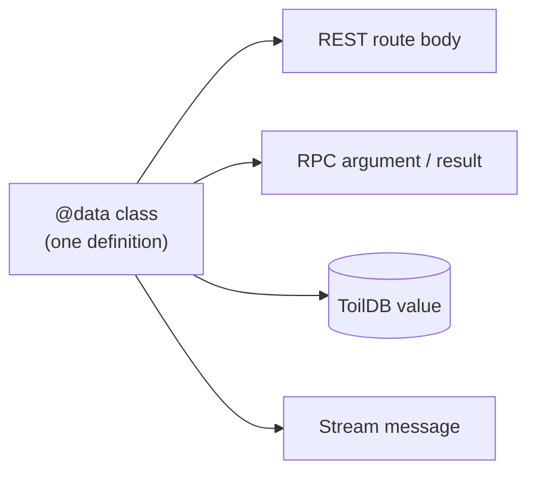

# Data types (`@data`)

`@data` turns a plain class into a typed value that can travel safely between your frontend and your WASM backend, and in and out of the database, with both a binary and a JSON codec generated for you.

## What `@data` is

A **codec** is a pair of functions: one that turns a value into bytes (encode), and one that turns those bytes back into a value (decode). Any time data crosses a boundary (browser to server, server to database, one WASM call to another) it has to become bytes and back. Writing that by hand is tedious and easy to get wrong.

`@data` writes it for you. You declare a class with typed fields, tag it `@data`, and the compiler synthesizes a deterministic binary codec and a JSON codec on the class. The exact same class is also generated into your `shared/server.ts`, so the browser and the WASM backend agree on the format down to the byte.

```ts
@data
class Player {
    username: string = '';
    admin: bool = false;
    score: u64 = 0;
}
```

That is a complete, serializable type. Note every field has a **default value**; that is required (the generated decoder and the client constructor use it).

## Why and when

`@data` is the backbone of almost everything that moves in a toiljs app:

- **Request and response bodies** for [`@rest`](./rest.md) routes.
- **Arguments and return values** for [`@service` / `@remote`](./rpc.md) calls.
- **Values stored in [ToilDB](../database/README.md)**.
- **Sessions**, [stream](../realtime/README.md) messages, and any custom payload you design.

Whenever a route, an RPC method, or the database needs a structured value, that value is a `@data` class. You will define these constantly.



## What the compiler generates

From your `@data` class, the compiler adds these members:

| Member | What it does |
| --- | --- |
| `encode(): Uint8Array` | Serialize to bytes, with a 4-byte type-id prefix. |
| `static decode(buf): T` | Rebuild a value from bytes produced by `encode()`. |
| `encodeInto(w: DataWriter)` | Serialize without the type-id frame, for nesting inside another value. |
| `static decodeFrom(r: DataReader): T` | The matching read, for nested values. |
| `toJSON()` / `static fromJSON(v)` | The JSON codec (large integers become decimal strings, so `JSON.parse` keeps them exact). |
| `static dataId(): u32` | A stable hash (FNV-1a) of the class name, written as the type-id prefix. |

You mostly do not call these directly; routes, RPC, and the database call them for you. But they are there when you need them (for example `value.toJSON().toString()` to build a `Response.json`).

## Supported field types

A `@data` field may be:

- a scalar: `u8` through `u256`, `i8` through `i256`, `f32`, `f64`, `bool`;
- a `string`;
- a `Uint8Array` (a raw byte buffer);
- a nested `@data` class;
- an array `T[]` of any of the above.

For the number types (why `u64` is a `bigint` on the client, when to reach for `u256`, and so on), see [Types](../concepts/types.md).

Give every field a default. The layout is exactly the field declaration order (this matters, see [gotchas](#gotchas)).

## Nested `@data`, arrays, and bytes

`@data` classes compose. A field can be another `@data` class, an array, or a byte buffer, and it all encodes and decodes as one value:

```ts
@data
class Tag {
    label: string = '';
    weight: f32 = 0;
}

@data
class Document {
    id: u64 = 0;
    title: string = '';
    tags: Tag[] = [];            // array of nested @data
    authors: string[] = [];      // array of strings
    thumbnail: Uint8Array = new Uint8Array(0); // raw bytes
}
```

`Document.encode()` walks the whole tree: it writes `id`, `title`, each `Tag` (via `encodeInto`), each author string, and the raw `thumbnail` bytes, in field order. `Document.decode(bytes)` reads them back in the same order. On the JSON side, a `Uint8Array` field becomes a JSON array of byte numbers, and nested `@data` fields become nested JSON objects.

## Using `@data` in a route

A route's body parameter and its return value are `@data` values. Which codec runs depends on the route's stream mode (see [REST bodies](./rest.md#request-and-response-bodies)):

```ts
// JSON route (the default): body from JSON.parse, result via toJSON()
@post('/')
public create(input: NewPlayer): Player { /* ... */ }

// Binary route: body via decode(), result via encode()
@route({ method: Methods.POST, path: '/blob', stream: DataStream.Binary })
public blob(input: FileData): FileResult { /* ... */ }
```

- In a **JSON** route, the incoming body is `JSON.parse`d and revived with the type's `fromJSON`, and the returned value is serialized with `toJSON()`.
- In a **Binary** route, the incoming body is `decode`d and the returned value is `encode`d.

You do not call the codec yourself in either case; you just declare the types.

## The raw codec: `DataWriter` and `DataReader`

Sometimes you want to lay out bytes by hand: a custom body, a session token, a challenge message, a wire format someone else defined. For that, use the codec directly. It lives in the `data` module:

```ts
import { DataWriter, DataReader } from 'data';
```

This is the same codec `@data` classes are built from, and it has a byte-for-byte identical TypeScript version in `toiljs/io` (`src/io/codec.ts`), so your browser code can read and write the exact same bytes the WASM backend does.

### `DataWriter`

Every write method returns the writer, so calls chain.

| Method | Signature | Wire format |
| --- | --- | --- |
| `writeU8` / `writeI8` | `(v): DataWriter` | 1 byte |
| `writeU16` / `writeI16` | `(v): DataWriter` | 2 bytes, little-endian |
| `writeU32` / `writeI32` | `(v): DataWriter` | 4 bytes, LE |
| `writeU64` / `writeI64` | `(v): DataWriter` | 8 bytes, LE |
| `writeF32` / `writeF64` | `(v): DataWriter` | 4 / 8 bytes, IEEE-754 LE |
| `writeBool` | `(v): DataWriter` | 1 byte (`1` / `0`) |
| `writeBytes` | `(b: Uint8Array): DataWriter` | `u32` length (LE) + the raw bytes |
| `writeString` | `(s: string): DataWriter` | `u32` length (LE) + UTF-8 bytes |
| `writeU128` / `writeI128` | `(v): DataWriter` | two `u64` limbs (lo, hi) |
| `writeU256` / `writeI256` | `(v): DataWriter` | four `u64` limbs |
| `length` | `(): i32` | bytes written so far |
| `toBytes` | `(): Uint8Array` | an exact-length copy of the buffer |

### `DataReader`

Reads are **bounds-safe**: reading past the end of the buffer never crashes. Instead the read returns a zero or empty default and flips the reader's public `ok` flag to `false`. Check `ok` after a sequence of reads to catch a truncated or malformed buffer.

| Method | Signature | On over-read |
| --- | --- | --- |
| `readU8` / `readI8` | `(): integer` | `0` |
| `readU16`..`readU64`, `readI16`..`readI64` | `(): integer` | `0` |
| `readF32` / `readF64` | `(): float` | `0` |
| `readBool` | `(): bool` | `false` |
| `readBytes` | `(): Uint8Array` | empty array |
| `readString` | `(): string` | `""` |
| `readU128` / `readI128` / `readU256` / `readI256` | `(): bignum` | `0` |
| `remaining` | `(): i32` | bytes left unread |
| `ok` | `bool` (field) | `false` once any read over-ran |

### Encode and decode, both directions

```ts
import { DataWriter, DataReader } from 'data';

// Encode: a version byte, a name, a score, then a blob.
const out = new DataWriter()
    .writeU8(1)
    .writeString('alice')
    .writeU64(1234)
    .writeBytes(payload)
    .toBytes();

// Decode: read the fields back in the exact same order.
const r = new DataReader(out);
const version = r.readU8();
const name = r.readString();
const score = r.readU64();
const blob = r.readBytes();
if (!r.ok) return Response.badRequest('truncated');
```

The order of reads must match the order of writes exactly. The layout is the format.

## JSON vs binary: which to use

You usually pick this at the route level (see [REST bodies](./rest.md#request-and-response-bodies)), but the trade-off is the same everywhere:

- **JSON** is human-readable and understood by every tool. Pick it for endpoints a browser or a third party calls directly. Large integers ride as decimal strings so they stay exact.
- **Binary** is smaller, faster, and lossless for big numbers. Pick it for app-to-app traffic and anything performance sensitive. RPC always uses binary under the hood.

## Gotchas

- **Field order is the format.** The binary layout is exactly your field declaration order. Reordering fields, or changing a field's type, is a breaking change: old bytes will decode wrong. To evolve a format safely, add new fields at the **end** (and, for hand-rolled payloads, bump a leading version byte).
- **Every field needs a default.** The generated decoder and the client constructor rely on it. A field with no default will not compile as `@data`.
- **`encode()` carries a type id; `encodeInto` does not.** The 4-byte `dataId()` prefix lets a decoder confirm it is reading the type it expected. When nesting one `@data` inside another, `encodeInto` / `decodeFrom` skip that frame (the outer type already identifies the whole value).
- **Endianness.** The WASM codec is little-endian. The `toiljs/io` codec defaults to little-endian too, and also accepts a per-call big-endian flag for network formats. Keep both ends on the same setting.
- **Plain JSON numbers lose precision above 2^53.** That is why `@data` sends 64-bit-and-larger integers as decimal strings over JSON. If you hand-build JSON, do the same, or use the binary codec.
- **`DataReader` never throws; check `ok`.** An over-read returns a default and sets `ok = false`. Always check `ok` after decoding untrusted bytes.

## Related

- [Types](../concepts/types.md): `u64`, `u256`, `f64`, and how each maps to `number` or `bigint`.
- [HTTP routes (`@rest`)](./rest.md): where `@data` bodies and return values are used, and the JSON vs binary route modes.
- [Typed RPC](./rpc.md): `@data` as RPC arguments and results, and the generated client classes.
- [The database](../database/README.md): storing `@data` values in ToilDB.
- [Backend overview](./README.md): where `@data` fits in the request lifecycle.
