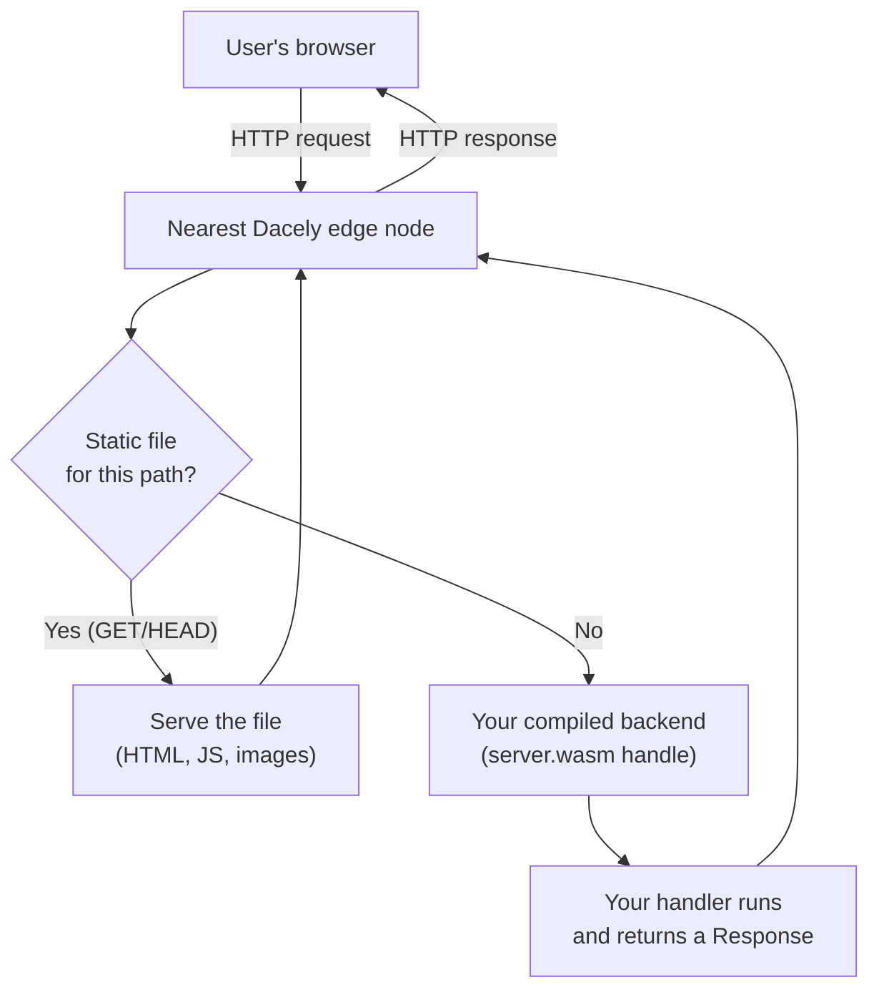
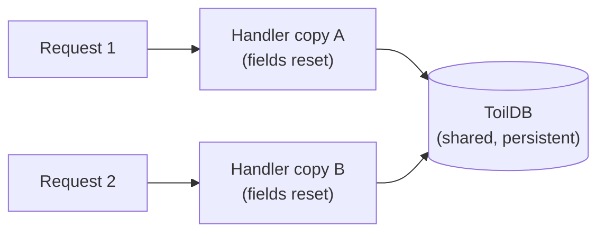

# Backend overview

Your backend is TypeScript that toilscript compiles into a small, sandboxed WebAssembly program, which runs on the Dacely edge and answers every request.

## What the backend is

In a toiljs project, everything under `server/` is your backend. You write it in TypeScript, the same language as your frontend. But it does not run in a browser and it does not run in Node. Instead, a compiler called **toilscript** turns it into **WebAssembly** (often shortened to **WASM**): a compact, fast, portable binary format that many kinds of servers can run safely.

That compiled program is then deployed to the **Dacely edge**. Two pieces of jargon to unpack there:

- **The edge** means a fleet of servers spread across many cities around the world. When a user makes a request, it is served by the edge node physically closest to them. Close means fast: less distance for the data to travel, so lower latency. You do not pick a region or manage servers; your one compiled backend runs everywhere at once.
- **Sandboxed** means your WASM program runs inside a locked box. It cannot open files, reach the operating system, or make raw network connections on its own. The only way it can touch the outside world is through a small, fixed set of **host functions** that toiljs provides (read the request, build a response, query the database, send an email, and so on). Every one of those calls is metered and bounded, so a buggy or hostile backend cannot crash the node or read another app's data. This is what makes it safe to run thousands of different apps on the same shared edge.

You never call the WASM boundary by hand. You write normal TypeScript classes and functions, tag them with decorators (like `@rest` or `@service`), and the compiler wires everything up.

> New to decorators? A **decorator** is the `@name` you write just above a class or method. It attaches meaning to that code without changing what the code does line by line. toiljs uses decorators to say "this class is an HTTP controller" or "this method is callable from the browser." See [Decorators](../concepts/decorators.md).

## The request lifecycle

Here is what happens, end to end, when a browser talks to your backend.



Step by step:

1. The request lands on the closest edge node.
2. The edge first checks whether the path is a **static file** it can serve directly (your built frontend: HTML pages, JavaScript bundles, images). If so, it serves the file and never wakes your code. This is fast and free.
3. Otherwise the edge hands the request to your compiled backend by calling its single WASM export, `handle`.
4. Inside, toiljs decodes the raw bytes into a friendly [`Request`](./rest.md#the-request-object) object and calls your handler's `handle(req)` method.
5. Your handler returns a [`Response`](./rest.md#building-a-response). toiljs encodes it back into bytes.
6. The edge sends that response to the browser.

The key mental model: your backend is a pure function of the request. Bytes in, bytes out, one request at a time.

## Stateless by default

A **fresh copy** of your handler serves each request. Any fields you set on a controller do not survive to the next request, and the request might even be served by a different edge node on the other side of the world. This is called being **stateless**.

That is a feature, not a limitation: it is what lets your backend scale to the whole planet with no coordination. When you need data to persist between requests (a user account, a counter, a list of posts), you store it in the built-in global database, **ToilDB**. See [the database section](../database/index.md).



## The three surfaces

Your backend can expose three different kinds of endpoint. Each is opted into with a decorator, and each has its own page:

| Surface | Decorator | What it is | When to use it |
| --- | --- | --- | --- |
| **HTTP REST** | `@rest` + `@get`/`@post`/... | Plain HTTP routes with paths, methods, and status codes. | A public API, webhooks, anything a browser, `curl`, or a third party calls directly. See [REST](./rest.md). |
| **Typed RPC** | `@service` / `@remote` | Server functions your own frontend calls like local async functions, fully type-checked end to end. | Talking from your own React app to your own backend. See [RPC](./rpc.md). |
| **Realtime** | `@stream` | A long-lived connection where the server keeps state per connected client. | Chat, live cursors, notifications, anything push-based. See [Realtime](../realtime/index.md). |

REST and RPC are the everyday tools. Most apps use both: REST for anything the outside world calls, RPC for your own frontend. They are not exclusive; you can use all three in one project.

All of these share the same building block for their data: **`@data` classes**, which are typed structs that travel safely between the browser and your WASM backend. See [Data types](./data.md).

## Where your handler lives

REST, RPC, and streams self-register: you tag a class and the compiler adds it to the right dispatcher. A tiny amount of glue lives in `server/main.ts`, which imports your route files and names your top-level handler class. In a typical project you rarely touch `main.ts`; you add route and service files and they are discovered automatically.

Your handler class extends `ToilHandler` and overrides `handle`. The common pattern is to try the REST dispatcher first, then fall back to your own logic:

```ts
import { Method, Request, Response, Rest, ToilHandler } from 'toiljs/server/runtime';

export class AppHandler extends ToilHandler {
    public handle(req: Request): Response {
        // Try every @rest controller. Returns the first match, or null.
        const hit = Rest.dispatch(req);
        if (hit != null) return hit;

        // Your own hand-written endpoints can go here.
        if (req.path == '/health') return Response.text('ok\n');

        // "I have no answer for this path": let the edge serve it (a static
        // file, the client app) instead of returning a hard 404.
        return Response.unhandled();
    }
}
```

RPC calls (to the reserved path `/__toil_rpc`) are handled by the framework before your `handle` runs, so you do not dispatch them yourself.

If your project is REST-only, you do not even need a custom handler; toiljs ships a ready-made one. See [REST](./rest.md#dispatch-and-the-404-fallback).

## Compute tiers

The request/response backend described here is the default and most common tier, called **L1**. toiljs also has higher tiers for long-lived connections (streams) and scheduled background work (daemons), each compiled into its own WASM artifact from the same project. You opt into a tier just by adding its entry file and surface decorator. For the full picture, see [Compute tiers](../concepts/tiers.md).

## Related

- [HTTP routes (`@rest`)](./rest.md): paths, methods, params, and responses.
- [Typed RPC (`@service`/`@remote`)](./rpc.md): calling the server from your frontend with end-to-end types.
- [Data types (`@data`)](./data.md): the serializable structs everything uses.
- [The database (ToilDB)](../database/index.md): where persistent state lives.
- [Compute tiers](../concepts/tiers.md): L1 request, L2/L3 stream, L4 daemon.
- [Realtime streams](../realtime/index.md): the `@stream` surface.
