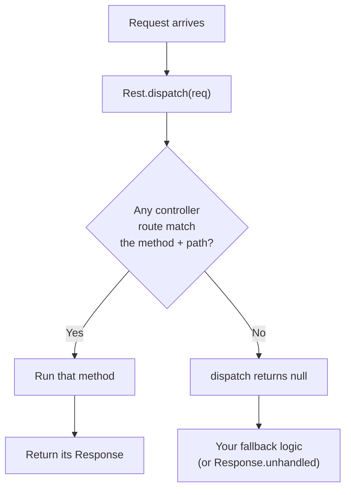

# HTTP routes (`@rest`)

Expose a real HTTP API by tagging a class `@rest` and its methods with an HTTP verb; toiljs generates the router for you.

## Why and when

Use `@rest` when something outside your own frontend needs to call your backend over plain HTTP: a webhook from another service, a public API, a mobile app, a `curl` script, or a browser hitting a URL directly. REST endpoints are ordinary URLs with ordinary HTTP methods and status codes, so any HTTP client understands them.

If instead you are calling your own backend from your own React frontend, [typed RPC](./rpc.md) is usually nicer (you get end-to-end types and skip URL wrangling). The two live happily side by side.

## The shape of a route

A REST route is a method on a class. The class decorator says where the class is mounted; the method decorator says which HTTP method and path it answers.

```ts
import { Response, RouteContext } from 'toiljs/server/runtime';

@rest('players')                 // this controller is mounted at /players
class Players {
    @get('/:id')                 // answers GET /players/:id
    public get(ctx: RouteContext): Response {
        const id = ctx.param('id');
        return Response.json(`{"id":"${id}"}`);
    }
}
```

Save that file, import it once (see [How routes are discovered](#how-routes-are-discovered)), and `GET /players/42` returns `{"id":"42"}`. That is a working endpoint.

## `@rest`: mounting a controller

`@rest` marks a class as a route **controller** (a group of related routes) and mounts it at a URL prefix.

```ts
@rest('api')                            // mounted at /api
@rest('/')                              // or @rest('') : mounted at the root
@rest({ stream: DataStream.Binary })    // root mount, binary body codec by default
```

- The string is the mount prefix. `"api"`, `"/api"`, and `"api/"` all normalize to `/api`. `""` and `"/"` mean the root.
- The object form sets class-wide defaults. `stream: DataStream.Binary` makes every route in the class use the binary body codec instead of JSON (more on that in [Request and response bodies](#request-and-response-bodies)).

The full URL of a route is the controller prefix joined with the method path. With `@rest('api')` and `@get('/todos/:id')`, the route is `GET /api/todos/:id`.

## Verb decorators

Each HTTP method has a decorator that takes the route path:

```ts
@get('/path')     @post('/path')    @put('/path')     @patch('/path')
@del('/path')     @head('/path')    @options('/path')
```

Note the delete decorator is `@del`, not `@delete` (the word `delete` is reserved in TypeScript, so it cannot be a decorator name).

### `@route`: the explicit form

`@route` is the general form. Reach for it when you want to set the body codec per route, or you just prefer an object:

```ts
@route({ method: Methods.POST, path: '/upload', stream: DataStream.Binary })
public upload(body: FileData): FileResult { /* ... */ }
```

`method` (from the `Methods` enum) and `path` are required; `stream` is optional and overrides the controller default. `Methods` and `DataStream` are global enums (like the decorators themselves, they need no import).

## Path parameters

A path segment written as `:name` is a **path parameter**: it captures whatever the request has in that position. Read it with `ctx.param('name')`.

```ts
@get('/todos/:id/items/:itemId')
public getItem(ctx: RouteContext): Response {
    const id = ctx.param('id');          // "42" for /todos/42/items/9
    const itemId = ctx.param('itemId');  // "9"
    return Response.json(`{"todo":"${id}","item":"${itemId}"}`);
}
```

Matching is **segment-exact**: the request path must have the same number of `/`-separated segments, the static segments must match literally, and each `:param` captures one segment. The query string is removed before matching. A captured param is always a string; convert it yourself if you need a number (for example `u64.parse(ctx.param('id'))`).

## Method parameters: reading the request

A route method may declare zero, one, or two parameters. toiljs looks at their types to decide what to pass:

- a parameter typed `RouteContext` receives the [request context](#the-routecontext-object) (path params, query, headers, raw body);
- any other type is treated as the **request body**, decoded into that [`@data`](./data.md) type.

```ts
@get('/status')
public status(): StatusResponse { /* no body, no context */ }

@get('/user/:id')
public getUser(ctx: RouteContext): User { /* context only */ }

@post('/create')
public create(input: NewTodo): Todo { /* body only */ }

@post('/user/:id/score')
public addScore(input: ScoreDelta, ctx: RouteContext): Player {
    const id = ctx.param('id');          // body AND context
    /* ... */
}
```

The order of the two parameters does not matter; toiljs classifies them by type.

## Return types

You return one of two things from a route, and toiljs encodes it for you:

| You return | toiljs sends |
| --- | --- |
| a [`@data`](./data.md) value | The value serialized (JSON by default, binary if the route is in binary mode). Status `200`. |
| a `Response` | Exactly that response: your status, headers, cookies, and body, untouched. |
| `void` (nothing) | `204 No Content`. |

Returning a `@data` value is the short path when you just want to send the data. Returning a `Response` gives you full control: a custom status, extra headers, cookies, caching. Use whichever fits.

```ts
// Short path: return the data, let toiljs serialize it as JSON.
@get('/me')
public me(): Player { return currentPlayer(); }

// Full control: custom 404, a header, and the body serialized by hand.
@get('/:id')
public get(ctx: RouteContext): Response {
    const id = u64.parse(ctx.param('id'));
    if (!store.has(id)) return Response.notFound();
    return Response.json(store.get(id).toJSON().toString())
        .setHeader('cache-control', 'no-store');
}
```

## Request and response bodies

Every route is either a **JSON route** (the default) or a **Binary route**. This decides how request bodies are decoded and response values are encoded:

- **JSON**: the request body is parsed as JSON and revived into your `@data` type; the response value is serialized to JSON. Best for endpoints a browser or a third party calls directly, because JSON is universally readable.
- **Binary**: the request body and response use toiljs's compact binary codec (`DataWriter`/`DataReader`). Smaller and faster, and exact for very large integers. Best for app-to-app traffic and anything performance sensitive.

Set the mode on the whole controller with `@rest({ stream: DataStream.Binary })`, or per route with `@route({ ..., stream: DataStream.Binary })`. Full detail on both codecs is in [Data types](./data.md).

> Large integers and JSON: numbers of 64 bits or more (`u64`, `i64`, `u128`, `u256`, and friends) are sent over JSON as decimal strings, so they stay exact at any size (plain JSON numbers would lose precision). The generated client turns them back into `bigint`. See [Types](../concepts/types.md).

## The `RouteContext` object

`RouteContext` is your window into the incoming request. toiljs builds one and passes it to any route method that declares a `RouteContext` parameter.

| Member | Signature | What it gives you |
| --- | --- | --- |
| `request` | `Request` | The raw request (method, path, headers, body). |
| `param` | `param(name: string): string` | A captured path param, or `""` if absent. |
| `query` | `query(name: string): string` | A query-string value (`?q=hi`), or `""` if absent. Not URL-decoded in v1. |
| `header` | `header(name: string): string \| null` | A request header, case-insensitive, or `null`. |
| `text` | `text(): string` | The raw request body decoded as UTF-8 text. |
| `clientIp` | `clientIp(): string` | The connecting client's IP, or `""` if unavailable. |

`clientIp()` is the real socket address the edge observed, not a forgeable header like `X-Forwarded-For`, so it is safe to key rate limits, geo lookups, or audit logs on it.

## The `Request` object

The raw request. You get it as `ctx.request`, or directly as the argument to a hand-written `handle(req)`.

**Fields:**

| Field | Type | Notes |
| --- | --- | --- |
| `method` | `Method` | `GET`, `POST`, `PUT`, `DELETE`, `PATCH`, `HEAD`, `OPTIONS`, or `UNKNOWN`. |
| `path` | `string` | The path, including the query string. |
| `headers` | `Array<Header>` | Ordered list; a `Header` is `{ name, value }`. |
| `body` | `Uint8Array` | The raw request body bytes. |

**Methods:**

| Method | Signature | Notes |
| --- | --- | --- |
| `header` | `header(name: string): string \| null` | Case-insensitive lookup, `null` if absent. |
| `cookies` | `cookies(): CookieMap` | Parses the `Cookie` header (values percent-decoded); cached per request. |
| `cookie` | `cookie(name: string): string \| null` | A single cookie value, or `null`. |

The `Method` enum and the `Header` class are exported from `toiljs/server/runtime`.

## Building a response

`Response` is what you return. Create one with a static factory, then chain instance methods to add headers, cookies, and caching. Every instance method returns the same `Response`, so calls chain.

### Static factories

| Factory | Signature | Status | Content-Type |
| --- | --- | --- | --- |
| `Response.text` | `text(body: string, status = 200)` | 200 | `text/plain; charset=utf-8` |
| `Response.html` | `html(body: string, status = 200)` | 200 | `text/html; charset=utf-8` |
| `Response.json` | `json(body: string, status = 200)` | 200 | `application/json; charset=utf-8` |
| `Response.bytes` | `bytes(body: Uint8Array, status = 200)` | 200 | `application/octet-stream` |
| `Response.empty` | `empty(status)` | custom | (none) |
| `Response.notFound` | `notFound()` | 404 | text |
| `Response.badRequest` | `badRequest(msg = 'bad request')` | 400 | text |
| `Response.internalError` | `internalError(msg = 'internal error')` | 500 | text |
| `Response.unhandled` | `unhandled()` | 404 | text, plus a marker header (see below) |

`Response.json` takes an **already-serialized** string, not an object. Build it from a `@data` value with `value.toJSON().toString()`, or return the `@data` value directly and let toiljs serialize it (usually simpler).

### Instance methods

| Method | Signature | What it does |
| --- | --- | --- |
| `setHeader` | `setHeader(name, value): Response` | Appends a header (call again to add more). |
| `setCookie` | `setCookie(cookie: Cookie): Response` | Appends a `Set-Cookie`. |
| `setCookieKV` | `setCookieKV(name, value): Response` | Shorthand for a cookie with no attributes. |
| `clearCookie` | `clearCookie(name, path = '/', domain = ''): Response` | Emits a deletion cookie (empty value, `Max-Age=0`). |
| `cache` | `cache(edgeTtlMinutes, browserTtlSeconds = 0, privateScope = false, allowAuth = false): Response` | Marks the response cacheable. See [Caching](../services/caching.md). |
| `cacheFor` | `cacheFor(minutes): Response` | Shorthand for edge-caching for N minutes. |

```ts
return Response.json('{"id":42}')
    .setHeader('x-trace', traceId)
    .setCookieKV('seen', '1')
    .cacheFor(5);
```

See [Cookies](../services/cookies.md) for the full cookie builder and [Caching](../services/caching.md) for the caching rules.

## How dispatch works

Every `@rest` controller registers itself into a global `Rest` registry when its module loads. At request time, `Rest.dispatch(req)` walks the controllers and tries their routes.



Matching order is deterministic: controllers are tried in the order their modules load, and routes within a controller in declaration order. The **first match wins**, so put more specific routes before catch-all ones.

## How routes are discovered

`toiljs build` scans every file under `server/` and finds your decorated classes on its own, so a route file is picked up as soon as it exists. To keep a plain `toilscript` run (and your editor) seeing the same set, projects also `import` each route file once in `server/main.ts`:

```ts
// server/main.ts (excerpt)
import './routes/Players';
import './routes/Todos';
```

Adding a new controller is two steps: write the file, add the one-line import.

## Dispatch and the 404 fallback

Inside your handler, the usual pattern is: try REST first, then fall through to anything else.

```ts
const hit = Rest.dispatch(req); // Response, or null if nothing matched
if (hit != null) return hit;
return Response.unhandled();     // no route matched here
```

There are two different 404s, and the difference matters:

- **`Response.notFound()`** means "I looked, and that resource does not exist." It is sent to the client as a plain `404`.
- **`Response.unhandled()`** means "this server has no route for that path." It is a `404` carrying a marker header (`x-toil-unhandled`). The edge (and the dev server) reads that marker and tries to serve the path another way: a static file, or the client-side app. The marker is stripped before anything reaches the browser.

Rule of thumb: return `unhandled()` when a path is simply not yours to handle, and `notFound()` when the path is yours but the specific thing is missing.

If your project is REST-only, you do not need a custom handler at all. toiljs ships `RestHandler`, which does exactly the dispatch-then-`unhandled` dance:

```ts
import { Server, RestHandler } from 'toiljs/server/runtime';
Server.handler = () => new RestHandler();
```

## Guards: auth, rate limits, caching

You can stack extra decorators on a route (or a whole controller) to protect or cache it. They compose with the verb decorators:

```ts
@rest('admin')
class Admin {
    @get('/stats')
    @auth                       // reject with 401 if there is no valid session
    @ratelimit({ perMinute: 30 })
    public stats(): Stats { /* ... */ }
}
```

- `@auth` requires a valid signed session, else the request is rejected with `401` before your method runs. See the [Auth guide](../auth/README.md).
- `@ratelimit` caps how often a caller may hit the route. See [Rate limiting](../services/ratelimit.md).
- Response caching is opt-in per response with `.cache(...)` / `.cacheFor(...)`. See [Caching](../services/caching.md).

## A complete CRUD example

A small in-memory players API showing create, read, update, and delete. In a real app you would store players in [ToilDB](../database/README.md) instead of a local map, because each request gets a fresh handler (see [statelessness](./README.md#stateless-by-default)); this example keeps it in memory to stay focused on routing.

```ts
// server/models/NewPlayer.ts
@data
export class NewPlayer {
    name: string = '';
}
```

```ts
// server/models/Player.ts
@data
export class Player {
    id: u64 = 0;
    name: string = '';
    score: i64 = 0;
}
```

```ts
// server/routes/Players.ts
import { Response, RouteContext } from 'toiljs/server/runtime';
import { NewPlayer } from '../models/NewPlayer';
import { Player } from '../models/Player';

// A stand-in store. Real apps use ToilDB (see the database section).
const store = new Map<u64, Player>();
let nextId: u64 = 1;

@rest('players')
class Players {
    // CREATE: POST /players  (JSON body -> Player)
    @post('/')
    public create(input: NewPlayer): Player {
        const p = new Player();
        p.id = nextId++;
        p.name = input.name;
        p.score = 0;
        store.set(p.id, p);
        return p;                     // 200 with the player as JSON
    }

    // READ: GET /players/:id
    @get('/:id')
    public get(ctx: RouteContext): Response {
        const id = u64.parse(ctx.param('id'));
        if (!store.has(id)) return Response.notFound();
        return Response.json(store.get(id).toJSON().toString());
    }

    // UPDATE: PUT /players/:id  (JSON body -> Player)
    @put('/:id')
    public update(input: NewPlayer, ctx: RouteContext): Response {
        const id = u64.parse(ctx.param('id'));
        if (!store.has(id)) return Response.notFound();
        const p = store.get(id);
        p.name = input.name;
        return Response.json(p.toJSON().toString());
    }

    // DELETE: DELETE /players/:id
    @del('/:id')
    public remove(ctx: RouteContext): Response {
        const id = u64.parse(ctx.param('id'));
        if (!store.has(id)) return Response.notFound();
        store.delete(id);
        return Response.empty(204);   // 204 No Content
    }
}
```

Calling it from anywhere:

```sh
curl -X POST localhost:5173/players -d '{"name":"Ada"}'
curl localhost:5173/players/1
curl -X PUT localhost:5173/players/1 -d '{"name":"Ada Lovelace"}'
curl -X DELETE localhost:5173/players/1
```

Because `@rest` also generates a typed fetch client, your React frontend can call the same routes without writing URLs:

```ts
await Server.REST.players.create({ body: new NewPlayer('Ada') });
await Server.REST.players.get({ params: { id: 1 } });
```

See [RPC and the generated client](./rpc.md#the-rest-fetch-client) for that client.

## Gotchas

- **Fields do not persist.** A fresh controller instance serves each request, so instance fields reset every time and are never shared between requests or edge nodes. Persist to [ToilDB](../database/README.md).
- **`Response.json` wants a string.** Pass an already-serialized JSON string (or return the `@data` value directly). Passing an object will not do what you expect.
- **`@del`, not `@delete`.** `delete` is a reserved word, so the decorator is `@del`.
- **Query values are not URL-decoded in v1.** `ctx.query('q')` returns the raw value; decode it yourself if it may contain percent-encoding.
- **Path matching is exact on segment count.** `/todos/:id` does not match `/todos/1/extra`. Add a route for the longer path.
- **`notFound()` vs `unhandled()`.** Returning `notFound()` from your top handler stops the edge from falling through to static files or the client app. Use `unhandled()` for "not my path."

## Related

- [Data types (`@data`)](./data.md): the request and response body structs, and the JSON vs binary codecs.
- [Typed RPC](./rpc.md): call your backend from your frontend with end-to-end types (and the generated REST fetch client).
- [Backend overview](./README.md): the request lifecycle and handler model.
- [Cookies](../services/cookies.md), [Caching](../services/caching.md), [Rate limiting](../services/ratelimit.md): response helpers and guards.
- [Auth](../auth/README.md): protecting routes with `@auth`.
- [The database](../database/README.md): persisting data between requests.
