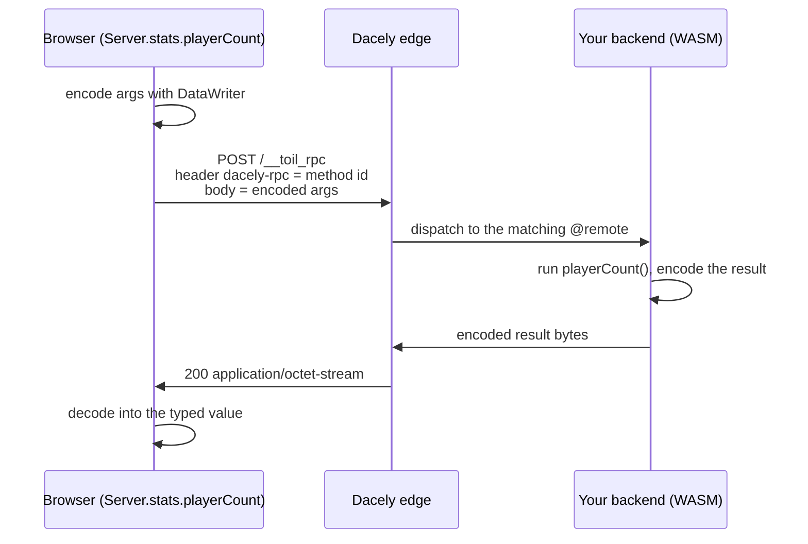

# Typed RPC (`@service` / `@remote`)

Write a server function, tag it `@remote`, and call it from your React frontend like a local async function, with the argument and return types checked end to end.

## What RPC is

**RPC** stands for Remote Procedure Call. The idea is old and simple: call a function that actually runs somewhere else (here, on the edge) as if it were a normal function in your own code. You write a method on the server, and on the client you `await` it. No URLs, no `fetch`, no manual JSON. Just a function call.

toiljs makes that call **fully typed**. When you build the server, it generates a TypeScript file (`shared/server.ts`) describing every callable function, its arguments, and its return type. Your frontend imports nothing extra: a global object called `Server` is available with all of it typed. If you change a server function's signature and rebuild, your frontend code stops type-checking until you fix the call. The client can never drift from the server.

## Why and when

Use RPC when **your own frontend** talks to **your own backend**. It is the most ergonomic and safest way to do that:

- End-to-end types: rename a field on the server, and the client sees it immediately.
- No plumbing: no route paths to invent, no request or response shapes to hand-write.
- Exact numbers: 64-bit-and-larger integers arrive as `bigint`, never rounded.

Use [`@rest`](./rest.md) instead when the caller is **not** your frontend: a webhook, a third-party integration, a public API, a mobile client, or anything that speaks in plain URLs and HTTP methods. RPC uses one internal endpoint and a binary wire format, so it is not meant to be called by hand.

You can use both in the same project. A common split: RPC for your app's own screens, REST for everything public.

## Declaring callable functions

Two decorators expose server code to the client:

- **`@remote`** on a top-level function makes it directly callable.
- **`@service`** on a class groups related `@remote` methods under a namespace.

```ts
// server/services/Stats.ts
import { store } from '../core/store';

@service
class Stats {
    @remote
    public playerCount(): i32 {
        return store.size;
    }
}
```

```ts
// server/services/remotes.ts
@remote
function ping(n: i32): i32 {
    return n + 1;
}
```

That is the whole server side. Build the server and the client can call them.

## Calling from the frontend

The generated client surfaces everything on a global `Server`. A `@service` becomes a namespace keyed by the class name with a lowercase first letter (`Stats` becomes `stats`). A free `@remote` sits directly on `Server`. Every call returns a `Promise`.

```ts
// anywhere in your React app, no import needed
const count = await Server.stats.playerCount(); // number
const next = await Server.ping(41);             // number  -> 42
```

Autocomplete, argument checking, and the return type all come from `shared/server.ts`, which the build regenerates every time (and `toiljs dev` regenerates on save), so it is always in sync.

## The round trip

Here is what actually happens under that innocent-looking `await`.



A few facts worth knowing:

- Every callable has a stable numeric **method id** (a hash of `"Service.method"` or the function name). The client sends it in the `dacely-rpc` header; the server dispatches on it.
- Arguments and results travel in the compact **binary `@data` codec** (see [Data types](./data.md)), so large integers are exact and payloads are small.
- The endpoint is a single reserved path, `/__toil_rpc`. You never route it yourself; the framework handles it before your `handle` runs.

## RPC is stateless too

Just like a REST controller, a fresh service instance serves each call. Fields you set on a `@service` class do not survive between calls. If two calls need to share data, that data lives in [ToilDB](../database/index.md), not in an instance field. See [statelessness](./index.md#stateless-by-default).

## Argument and return types

Arguments and return values may be scalars, arrays, or [`@data`](./data.md) classes, in both directions. Here is how toilscript's types map to what you see on the TypeScript client:

| ToilScript type | TypeScript type |
| --- | --- |
| `u8`, `u16`, `u32`, `i8`, `i16`, `i32`, `f32`, `f64` | `number` |
| `u64`, `i64`, `u128`, `i128`, `u256`, `i256` | `bigint` |
| `bool` | `boolean` |
| `string` | `string` |
| a `@data` class `T` | `T` (the generated class) |
| `T[]` | `T[]` |

Integers of 64 bits or more become `bigint` on the client, so they are exact at any magnitude. See [Types](../concepts/types.md) for the full number story.

Passing a `@data` value is just as easy as a scalar. Construct it on the client and pass it in:

```ts
import { NewPlayer } from './shared/server';

const created = await Server.roster.add(new NewPlayer('Ada')); // returns a typed Player
```

The `@data` classes in `shared/server.ts` share a byte-for-byte identical codec with the server, so values round-trip exactly.

## Reading and writing the database from a `@remote`

A `@remote` can use the database, but with a safety default: **a plain `@remote` is read-only.** If it tries to write to ToilDB, the compiler rejects it. To let a `@remote` write, add `@action`:

```ts
@service
class Roster {
    @remote
    public count(): i32 {                 // read-only: fine to just read
        return db.players.count();
    }

    @remote
    @action                               // opts into writes
    public add(input: NewPlayer): Player {
        return db.players.create(/* ... */);
    }
}
```

`@query` is the explicit opposite of `@action`: it marks a function read-only on purpose (the default for a `@remote`, so you rarely need to write it). These are ToilDB **function kinds**; the full rules, including what each kind may and may not do, are in the [database docs](../database/index.md). The takeaway for RPC: reads work out of the box, and a write needs `@action`, so a read-only endpoint can never silently mutate your data.

## Guarding a `@remote`

Guards stack on a `@remote` exactly as they do on a REST route:

```ts
@service
class Stats {
    @remote
    @auth                       // reject with 401 when there is no valid session
    public secretCount(): i32 {
        return store.size;
    }
}
```

The RPC dispatcher enforces `@auth` (and `@ratelimit`) the same way the REST router does: the guard runs first, and an unauthenticated call gets a `401` before your method body executes. See the [Auth guide](../auth/index.md) and [Rate limiting](../services/ratelimit.md).

## The generated `Server` surface

`shared/server.ts` declares `Server` as a global with a shape like this (schematic):

```ts
declare global {
  const Server: {
    // free @remote functions
    ping(n: number): Promise<number>;

    // @service classes, keyed by lowercased name
    readonly stats: {
      playerCount(): Promise<number>;
      secretCount(): Promise<number>;
    };

    // @rest controllers get a fetch client under REST (see below)
    readonly REST: { /* ... */ };

    // @stream classes get a client under Stream (see the realtime docs)
    readonly Stream: { /* ... */ };
  };
}
```

You never edit this file; the build regenerates it. If a `Server` method throws that it is "unavailable," the generated client has not loaded yet: run the server build (or `toiljs dev`, which does it on save).

## The REST fetch client

`@rest` controllers also get a typed client, under `Server.REST.<controller>.<route>`. It is real `fetch` code (because REST is just HTTP), and it is handy when you want your frontend to call a route you also expose publicly:

```ts
// controller @rest('players') with a create route taking a NewPlayer body
const player = await Server.REST.players.create({
    body: new NewPlayer('Ada'),   // present only if the route takes a body
    // params: { id: 7 },         // present only if the path has :params
    query: { ref: 'home' },       // optional
    headers: { 'x-trace': id },   // optional
});
```

The wrapper builds the URL, substitutes `:params`, appends `query`, sends the request, throws on a non-2xx status, and decodes the response into the route's return type. A route declared to return `Response` resolves to the raw `fetch` `Response` so you can inspect headers or stream it yourself. See [REST](./rest.md) for the routes themselves.

## RPC vs REST at a glance

| | RPC (`@service` / `@remote`) | REST (`@rest`) |
| --- | --- | --- |
| Caller | Your own frontend | Anyone (browser, webhook, third party, `curl`) |
| Client | `Server.svc.method(args)` | `Server.REST.ctrl.route(args)`, or plain `fetch` |
| URL shape | One internal endpoint | Real paths and HTTP methods you design |
| Wire format | Compact binary `@data` | JSON (or binary), your choice |
| Types | End to end, automatic | End to end for the generated client |
| Best for | App-internal calls | Public APIs, integrations, webhooks |

## Gotchas

- **RPC is not a public API.** It uses one reserved endpoint and a binary format meant for the generated client. If an outside system needs to call in, expose a [`@rest`](./rest.md) route.
- **Instance fields do not persist.** A fresh service instance serves every call. Shared state belongs in [ToilDB](../database/index.md).
- **Writes need `@action`.** A plain `@remote` is read-only; the compiler rejects a database write unless the method is `@action`.
- **Rebuild after signature changes.** `shared/server.ts` is generated. If autocomplete looks stale, rebuild the server (`toiljs dev` does this on save).
- **`bigint`, not `number`, for 64-bit values.** A `u64`/`i64`/`u256` argument or return is a `bigint` on the client. Pass `10n`, not `10`.

## Related

- [Data types (`@data`)](./data.md): the structs your RPC arguments and results are made of, and the binary codec they travel in.
- [HTTP routes (`@rest`)](./rest.md): the public-facing alternative, and the `Server.REST` fetch client.
- [Types](../concepts/types.md): `u64`, `u256`, and how they map to `number` / `bigint`.
- [The database](../database/index.md): `@action` vs `@query`, and persisting state.
- [Fetching data on the frontend](../frontend/data-fetching.md): using `Server.*` from your React components.
- [Auth](../auth/index.md): guarding a `@remote` with `@auth`.
