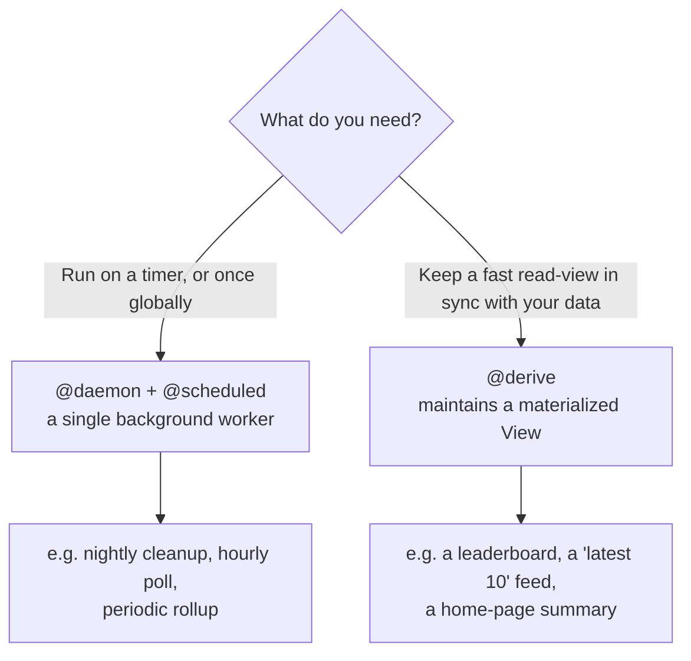

# Background work

Background work is code that runs **without a user waiting for it**: on a timer, once globally, or automatically after your data changes. toiljs gives you two tools for it, `@daemon` and `@derive`, and this page helps you pick the right one.

## Why background work

Most of your server code runs **because a user asked**: a browser hits a [route](../backend/rest.md) or calls an [RPC](../backend/rpc.md), your handler runs, and a response goes back. But some work does not belong on that path:

- It should happen **on a schedule** (every hour, every night at 2am), not when a request happens to arrive.
- It would be **too slow** to do inside a request, so you want it precomputed and ready.
- It must happen **exactly once across the whole world**, not once per user and not once per server.

That is background work. In toiljs there are two kinds, and they solve two different problems.

## The two tools



### `@daemon`: a scheduled, global worker

A [daemon](./daemons.md) is one long-lived background worker for your whole app. It runs on a **schedule** you set (an interval like every 5 minutes, or a cron time like "9:15 on weekdays"), and there is exactly **one** of it worldwide at any moment (a "singleton"). Use it for work that is driven by **time** or that must run **once globally**:

- clean up stale rows every night;
- poll an external API every few minutes;
- send a daily digest email;
- roll up yesterday's numbers into a summary.

### `@derive`: keep a read-view up to date

A [derive](./derive.md) is not on a timer. It runs **automatically whenever the data it depends on changes**, and its job is to keep a precomputed **View** (a read-optimized copy of your data) fresh. Use it when a page needs data that is **expensive to compute on every read**, like a leaderboard or a "latest 10 comments" list, so the read itself stays a single cheap lookup:

- fold an [events](../database/events.md) log into a "latest N" list;
- total up [counters](../database/counters.md) into a scoreboard;
- assemble a home-page summary from several sources.

## Which one do I reach for?

| Question                                              | Use          |
| ----------------------------------------------------- | ------------ |
| "Run this every hour / at midnight."                  | `@daemon`    |
| "Do this once for the whole app, not per server."     | `@daemon`    |
| "Poll or call an outside service on a schedule."      | `@daemon`    |
| "This page's data is too slow to compute per request."| `@derive`    |
| "Keep a leaderboard / feed in sync as data changes."  | `@derive`    |

A simple rule of thumb: if the trigger is **the clock**, use a `@daemon`. If the trigger is **a change to your data** and the goal is a fast read, use a `@derive`.

They also combine well. A `@daemon` might do a heavy nightly aggregation and write a summary row, while a `@derive` keeps a small live view fresh on every write. They are different tiers of the edge and are covered on their own pages.

## `@job`: the widest database surface for background work

`@daemon` and `@derive` decide **where and when** background code runs. `@job` answers a different question: **what a function is allowed to do to the database.** It is one of the ToilDB **function kinds** (the same family as `@query`, `@action`, and `@derive`), and it grants the **widest** data surface of them all.

A **function kind** is a label the compiler puts on a backend function to gate which database operations it may issue. This is a safety rail: a read-only endpoint physically cannot write, and an expensive scan cannot run on the hot request path. The kinds line up from narrowest to widest:

| Kind       | Typical trigger           | Point reads | **Scan** (`latest`, membership `list`) | Writes            | `publish` a View |
| ---------- | ------------------------- | ----------- | -------------------------------------- | ----------------- | ---------------- |
| `@query`   | a `@get` / plain `@remote`| yes         | no                                     | no                | no               |
| `@action`  | a `@post` / `@action`     | yes         | no                                     | yes (bounded)     | no               |
| `@derive`  | your data changed         | yes         | yes                                    | append / counter add only | yes      |
| `@job`     | you drive it (background) | yes         | yes                                    | yes (all)         | yes              |

A **scan** is a read that can fan out across many rows (like "the newest 50 events" via `events.latest`, or "every member of this set" via `membership.list`). Scans are **barred from request handlers** because a request must stay fast and bounded. `@derive` and `@job` run **off the request path**, so they are the only kinds allowed to scan.

### When to reach for `@job`

Use `@job` when a piece of background work needs **more** database power than the default:

- it must **scan** (fold `events.latest`, walk `membership.list`), and/or
- it must **publish a View** *while also* doing arbitrary writes (`create`, `patch`, `delete`). A `@derive` can publish a View but cannot `patch` or `delete` a record; a `@job` can do everything.

The compiler accepts `@job` on a method, including a `@daemon`'s `@scheduled` method. Tag a scheduled task `@job` when it needs that full surface (say, a nightly repair that scans a log, fixes rows, and republishes a summary View). A plain, **untagged** `@scheduled` method runs with the **`@action`** surface instead: point reads plus bounded writes, which is all most rollups and cleanups need.

```ts
@daemon
class Jobs {
    // A plain scheduled method: point reads + bounded writes (the @action surface).
    @scheduled('1h')
    rollup(): void { /* get a counter, patch a summary row */ }

    // A scheduled method that also needs SCANS and to PUBLISH a View: tag it @job.
    @scheduled('1d')
    @job
    nightlyRepair(): void {
        // @job unlocks scan-class reads (events.latest / membership.list)
        // and publishing a View, on top of ordinary reads and writes.
    }
}
```

### `@job` versus `@derive`

They overlap (both run off the request path, both may scan, both may publish a View), but they are triggered differently and sized differently:

- **`@derive`** is **change-triggered**: it re-runs automatically whenever its source data changes, and its narrow job is to keep one **View** in sync. It cannot `create` / `patch` / `delete` records (only append, counter-add, and publish). Reach for it when a read is too slow and you want it kept fresh on every write.
- **`@job`** is **you-drive-it** background work (typically a `@scheduled` daemon method) with the **full** write surface. Reach for it when the work is clock-driven or one-off and needs to both scan and mutate freely.

> **Rule of thumb.** Clock-driven and needs the full database surface: a `@job` (usually inside a `@daemon`). Change-driven and only maintains a View: a `@derive`. Clock-driven with modest reads and writes: a plain `@scheduled` method (no `@job` needed).

For the complete permission grid see the [function-kind matrix](../database/setup.md#how-access-is-gated-query-action-and-friends), and for the decorator itself see [every decorator](../concepts/decorators.md#database-function-kinds-data-access-policy).

## Related

- [Daemons and scheduled jobs](./daemons.md): `@daemon`, `@scheduled`, interval vs cron, and how a single global worker fails over safely.
- [Derived views (`@derive`)](./derive.md): keeping a materialized View in sync with its source data.
- [Compute tiers (L1 to L4)](../concepts/tiers.md): where daemons and request handlers each run on the edge.
- [Views](../database/views.md) and [Events](../database/events.md): the database families a `@derive` reads from and writes to.
