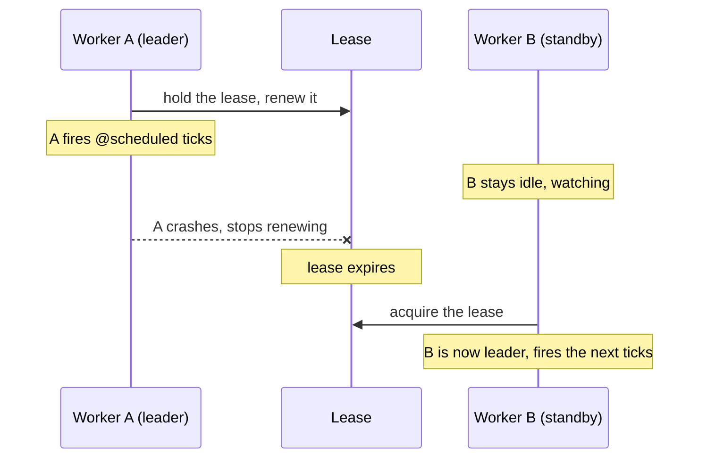

# Daemons (`@daemon` / `@scheduled`)

A `@daemon` is a single, long-lived background worker for your whole app. You mark a class `@daemon`, add `@scheduled` methods that fire on a timer, and the Dacely edge keeps exactly **one** copy of it running worldwide, restarting it elsewhere if the machine it is on fails.

## What a daemon is

The word "daemon" (say "DEE-mon") is an old computing term for a program that runs quietly in the background, not tied to any single user. That is exactly what this is.

Compare the three ways your server code can run:

| Kind                            | How many run                         | Lives for                     |
| ------------------------------- | ------------------------------------ | ----------------------------- |
| [Request handler](../backend/rest.md) (`@rest`) | a fresh one per request              | one request                   |
| [Stream box](../realtime/streams.md) (`@stream`) | one per open connection              | one connection                |
| **Daemon** (`@daemon`)          | **exactly one for the whole app**    | as long as it holds the lease |

Because it is a single, resident instance, its fields persist across scheduled runs (a request handler forgets everything after each request; a daemon does not). It is the right home for work that must happen **once globally on a cadence**, not once per user and not once per server.

```ts
@daemon
class Jobs {
    @scheduled('1h')
    hourly(): void {
        // Runs once an hour, on the one elected worker. Put recurring background
        // work here: rollups, cleanup, polling an upstream, and so on.
    }
}
```

## `@scheduled`: run on a cadence

A `@scheduled` method fires on a schedule. The single string argument is the cadence, and it comes in two flavours.

### Interval schedules

An **interval** fires every fixed span of time. Write a number followed by a unit: `s` (seconds), `m` (minutes), `h` (hours), or `d` (days). The number must be at least 1, and the span may not exceed 7 days.

```ts
@scheduled('30s') everyHalfMinute(): void { /* ... */ }
@scheduled('5m')  everyFiveMinutes(): void { /* ... */ }
@scheduled('1h')  hourly(): void { /* ... */ }
@scheduled('1d')  daily(): void { /* ... */ }
```

### Cron schedules

A **cron** expression fires at wall-clock times ("every weekday at 9:15", "midnight on the first of the month"). Use it when you care about the actual time of day, not just a repeating gap. A cron spec is five fields separated by spaces, in this order:

```
minute  hour  day-of-month  month  day-of-week
```

toiljs recognises a cron spec by the spaces in it (an interval has none).

```ts
@scheduled('15 9 * * 1-5')   // 09:15, Monday to Friday
weekdayMorning(): void { /* ... */ }

@scheduled('0 0 1 * *')      // 00:00 on the 1st of every month
monthlyReset(): void { /* ... */ }
```

Cron times are evaluated in **UTC** and are **minute-granular** (the smallest cron step is one minute). A `*` means "every value" for that field.

### Rules

- A `@scheduled` method takes **no arguments and returns `void`**.
- A daemon class may have **several** `@scheduled` methods, each on its own cadence.
- Because only the one elected worker fires them, a task runs **once per tick for the whole app**, never once per server.

### `onStart`: run once at boot

A daemon may also declare a plain `onStart(): void` method (not decorated). It runs **once**, when the daemon box first starts on the elected worker. Use it to set up state or kick off a long-running loop.

```ts
@daemon
class Jobs {
    onStart(): void {
        // one-time setup when this daemon becomes active
    }

    @scheduled('1h')
    hourly(): void { /* ... */ }
}
```

## No backfill: missed runs are skipped, not replayed

This is the single most important thing to understand about scheduling.

If the daemon is down when a tick was due (say the leader failed and a standby is still taking over), or if the clock jumps forward, toiljs does **not** go back and run all the ticks you missed. It simply fires the **next** due run and moves on. This is called a **no-backfill** policy.

Two practical consequences:

1. **Design tasks to be safe to skip.** "Recompute the summary" is fine to miss (the next run fixes it). "Charge every user once" is not, unless you make it idempotent.
2. **Make tasks idempotent where a missed run matters.** Idempotent means running it twice (or catching up later) has the same effect as running it once. For example, "set yesterday's total to X" is idempotent; "add 1 to a counter" is not.

## One global worker, with safe failover

There is exactly **one** daemon running for your app at any moment. A second machine keeps a **warm standby** ready but idle. If the active worker's hold on the job expires (it crashed, lost the network, or was shut down), the standby takes over and fires the following runs.

The mechanism is a **lease**. Think of the lease as a "who is in charge" token that only one worker can hold at a time, and that has to be renewed to keep. Only the worker holding the lease (the **leader**) runs the schedule.



The important guarantee: **two workers never run the same tick at the same time.** This is called **at-most-once** scheduling. The trade-off is the no-backfill behaviour above: to be sure a tick is never run twice, the edge would rather skip the in-flight tick when a leader is lost than risk running it on two machines. You never start, stop, or place the daemon yourself; the edge elects the leader and drives it.

## Leadership fencing: side effects only run on the leader

A subtle risk with a warm standby is a "split brain": for a brief moment, two workers might both think they are the leader. To make that harmless, toiljs **fences** every side effect behind a leadership check. A **side effect** is anything that changes the outside world:

- **Database writes** (creating, patching, deleting rows, adding to counters, appending events, publishing views).
- **Outbound HTTP calls** (`http_call`, described below).

These run **only** on the confirmed leader. If code that is not the leader tries one, the edge refuses it (a "not leader" error) rather than let it happen twice. Plain **reads** and computation are not fenced (they are safe to do anywhere). So even if two workers briefly overlap, only one of them can actually write or call out. You do not write the fencing yourself; it is automatic. The upshot: put your writes and outbound calls in `@scheduled` methods freely, and trust that they happen once.

## `daemon.*` host calls

A daemon has a small set of host abilities beyond ordinary computation:

- **Database access.** A daemon reads and writes [ToilDB](../database/index.md) with the same collection handles you use in a route or a derive (`.get`, `.add`, `.append`, `.publish`, and so on). Writes are leader-fenced as described above.
- **Outbound HTTP (`http_call`).** A daemon can call an external service (to poll an API, post to a webhook). This is the one place your server code reaches out to the internet, so it is deliberately restricted:
  - It is **leader-only** (fenced, like any side effect).
  - It is **SSRF-bounded**. SSRF (server-side request forgery) is an attack where code is tricked into calling internal addresses it should not reach. The edge resolves the target host and blocks private or internal addresses, so a daemon cannot use `http_call` to poke around inside the network.
  - It is **metered**: making many calls or pulling huge responses costs budget, which caps abuse.
- **Leadership info** (`is_leader`, `current_epoch`). A daemon can check whether it is currently the leader, which is useful for guarding a long `onStart` loop.

> **Note:** In `toiljs dev` (the single-process local emulator), the daemon is always the leader (there is nothing to fail over to), and `http_call` is stubbed to return a "call failed" result rather than make real network requests. Everything else, including the schedule and your database writes, runs exactly as it does on the edge.

## The `main.daemon.ts` file (a separate tier)

Like streams, daemons live in their **own entry file**, `server/main.daemon.ts`, and compile into their **own artifact**, `build/server/release-cold.wasm`. Importing your `@daemon` module there pulls it into that artifact.

```ts
// server/main.daemon.ts
import { revertOnError } from 'toiljs/server/runtime/abort/abort';

import './daemon/Jobs'; // add each @daemon module here

// NOTE: unlike main.ts / main.stream.ts, the daemon entry does NOT re-export the
// request runtime. A daemon artifact exposes its schedule hooks, not the request handler.
export function abort(message: string, fileName: string, line: u32, column: u32): void {
    revertOnError(message, fileName, line, column);
}
```

`toiljs build` produces `release-cold.wasm` automatically when your project declares a `@daemon` surface:

```sh
$ ls build/server/*.wasm
build/server/release.wasm          # L1 request   (@rest / @service)
build/server/release-stream.wasm   # L2/L3 stream  (@stream)
build/server/release-cold.wasm     # L4 daemon     (@daemon)
```

There is **at most one** `@daemon` class per project, and it is a compile error to put a `@daemon` in the request build. See [Compute tiers](../concepts/tiers.md) for how one source tree becomes three artifacts.

## Worked example: a periodic rollup

A common daemon job: every hour, read a running total and store a small summary so pages can show it with one cheap read. This reads a [counter](../database/counters.md) and writes a summary [document](../database/documents.md); the write only takes effect on the leader.

```ts
// server/models/StatKey.ts and Summary.ts (@data types)
@data
class StatKey {
    name: string = 'signups';
    constructor(name: string = 'signups') { this.name = name; }
}

@data
class Summary {
    total: u64 = 0;
    updatedAt: u64 = 0;
}

// server/data/StatsDb.ts
@database
class StatsDb {
    @collection static signups: Counter<StatKey>;
    @collection static summary: Documents<StatKey, Summary>;
}

// server/daemon/Jobs.ts
@daemon
class Jobs {
    @scheduled('1h')
    rollup(): void {
        const key = new StatKey('signups');
        const total = StatsDb.signups.get(key);   // a read (allowed anywhere)

        const s = new Summary();
        s.total = total;
        s.updatedAt = <u64>(Date.now() / 1000);
        StatsDb.summary.patch(key, s);            // a write: runs only on the leader
    }
}
```

Now any request handler can serve the summary with a single keyed read, and it is never more than an hour stale. Because the write is fenced to the leader and the rollup is idempotent (it *sets* the total rather than adding to it), a missed or failed-over tick is harmless: the next hourly run simply refreshes it.

## When not to use a daemon

- **When a user is waiting for the result.** Do that work in a [route](../backend/rest.md) or [RPC](../backend/rpc.md), on the request path.
- **When you need a fast read-view kept in sync with data changes.** That is a [`@derive`](./derive.md), which runs on every write rather than on a timer.
- **When you need exactly-once, never-skipped execution.** Scheduling is at-most-once with no backfill, so make tasks idempotent or safe to skip. A daemon is not a guaranteed job queue.

## Related

- [Background overview](./index.md): daemons versus `@derive`, and which to reach for.
- [Derived views (`@derive`)](./derive.md): keep a read-view in sync on every write.
- [Compute tiers (L1 to L4)](../concepts/tiers.md): the daemon runs on the L4 global tier.
- [Counters](../database/counters.md), [Documents](../database/documents.md), [Events](../database/events.md): the data a daemon reads and writes.
