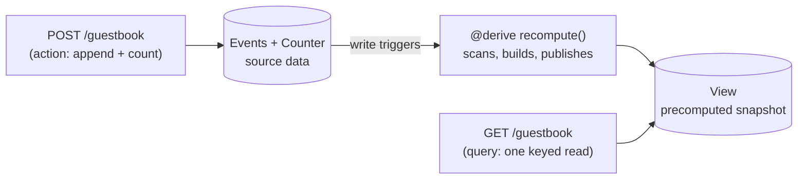

# Derived views (`@derive`)

A `@derive` keeps a fast, precomputed **View** of your data in sync automatically. You write a method that reads your source data and publishes a summary; toiljs re-runs it whenever the source data changes, so your pages can read the summary with one cheap lookup instead of doing the work on every request.

## The problem it solves

Some reads are expensive. "Show the 10 newest comments" means scanning an [events](../database/events.md) log. "Show the leaderboard" means totalling up scores. A **scan** (walking many rows to build a result) can fan out across an unbounded amount of data, and that is too slow and too unpredictable to do while a user waits.

So toiljs **bars scans on the request path**. A [route](../backend/rest.md) handler runs under a restricted mode:

- A `@get` runs as a **query** (reads only, no scans).
- A `@post` / `@put` / `@patch` / `@del` runs as an **action** (keyed reads and writes, still no scans).

If you cannot scan in a route, how do you show "the latest 10"? You precompute it. A `@derive` does the scan **off** the request path, folds the result into a [View](../database/views.md) (a read-optimized snapshot stored by key), and your route reads that View with a single keyed lookup, which is not a scan and so is allowed.



## A worked example: a guestbook

Here is the whole pattern in one database class: an [events](../database/events.md) log of signatures, a [counter](../database/counters.md) of how many there are, and a [View](../database/views.md) that holds the ready-to-serve page.

```ts
@data
class GuestKey {
    room: string = 'main';
    constructor(room: string = 'main') { this.room = room; }
}

@database
class GuestbookDb {
    @collection static entries: Events<GuestKey, GuestEntry>;  // a source: the log
    @collection static totals: Counter<GuestKey>;              // a source: the count
    @collection static book: View<GuestKey, GuestbookView>;    // the view we publish

    // Recompute the view from the sources. It MAY scan and publish; a route may not.
    @derive
    recompute(): void {
        const key = new GuestKey('main');
        const view = new GuestbookView();
        view.total = GuestbookDb.totals.get(key);          // a keyed read
        view.entries = GuestbookDb.entries.latest(key, 10); // a scan: allowed here
        GuestbookDb.book.publish(key, view);               // publish the snapshot
    }
}
```

The route then writes to the sources and reads the view:

```ts
@rest('guestbook')
class Guestbook {
    @get('/')
    list(): GuestbookView {
        const key = new GuestKey('main');
        const view = GuestbookDb.book.get(key);   // one keyed read, not a scan
        return view == null ? new GuestbookView() : view; // empty until first publish
    }

    @post('/')
    sign(input: NewMessage): GuestbookView {
        const key = new GuestKey('main');
        GuestbookDb.entries.append(key, new GuestEntry(input.author, input.message, 0));
        GuestbookDb.totals.add(key, 1);
        // The @derive republishes `book` right after this action returns, so GET
        // serves the new entry. The action just acks with the new total (a counter
        // read is allowed here; scanning the entries list is not).
        const view = new GuestbookView();
        view.total = GuestbookDb.totals.get(key);
        return view;
    }
}
```

Sign the guestbook twice and the total climbs across requests, because the data lives in the database (and its view), not in module memory.

## What a `@derive` may do

A `@derive` runs under a special **derive** mode that is more powerful than a route:

| Ability                                      | Query (`@get`) | Action (`@post` ...) | Derive       |
| -------------------------------------------- | :------------: | :------------------: | :----------: |
| Keyed reads (`.get`, counter total)          | yes            | yes                  | yes          |
| Writes (`create`, `patch`, `add`, `append`)  | no             | yes                  | yes          |
| **Scans** (`events.latest`, membership list) | **no**         | **no**               | **yes**      |
| `view.publish` / `view.append`               | no             | no                   | yes          |

So a derive is exactly the place to do the reads and scans a route cannot, and to publish the result.

## Declaring a derive

A `@derive` is a method on your [`@database`](../database/setup.md) class, next to the collections it reads and the View it writes.

```ts
@database
class MyDb {
    @collection static events: Events<Key, Fact>;  // a source
    @collection static home: View<Key, HomePage>;  // the materialized view

    @derive
    rebuild(): void {
        // read sources, build the value, publish it
    }
}
```

Rules:

- A `@derive` method takes **no arguments and returns `void`**.
- A database may declare **multiple** `@derive` methods; each runs independently.
- The View value and its key are ordinary [`@data`](../backend/data.md) types, so they round-trip through the codec like any other stored value.

## When a derive runs

You never call a derive yourself. The runtime runs it for you at two moments:

1. **After a write to a source.** When a request writes one of the database's source collections (an `events.append`, a `counter.add`, a document `create` or `patch`), that database's derives run **right after the response is produced**, so the view reflects the new data on the next read. Many writes to one database in a single request are **coalesced** into one recompute (it does not run once per write).

2. **On box load.** When a server box starts, hot-reloads, or notices the underlying data changed out of band, the views are rebuilt from their sources **before the first read is served**. This is also where a value type's [`@migrate`](../backend/data.md) runs against old stored events, as the derive re-reads and republishes them.

A derive's own `view.publish` never re-triggers it, so there is no infinite loop.

The same code runs under `toiljs dev` (the in-process emulator) and on the production edge, with no flags or wiring to change.

## Guarantees and limitations

**Guarantees**

- **It converges to a correct snapshot.** Publishes are last-writer-wins (the host versions each publish so a later one always supersedes an earlier one), and a derive recomputes from the source of truth, so the view always ends up matching its sources.
- **Reads stay cheap.** A route serves the view with a single keyed lookup, never a scan.

**Limitations (read these)**

- **It recomputes from scratch each time.** A derive re-reads its sources and republishes on every trigger. That makes it a great fit for a view built from a **bounded** read: the latest N, a counter total, a small set. It is not designed to fold an **unbounded, ever-growing** log incrementally; doing that efficiently is a separate, more advanced pattern.
- **It is eventually consistent, by a moment.** The view is republished right after the writing request finishes, so there is a tiny window where a reader could see the pre-write view. For most pages (a feed, a leaderboard) that is invisible and fine.
- **`view.publish` is derive-only.** Routes cannot publish; they can only read the view. That is the whole point: the expensive build happens off the request path.

## When not to use a derive

- **When the read is already cheap.** If a route can answer with a plain keyed `.get`, you do not need a view at all.
- **When you need it on a timer, not on a data change.** Recomputing "yesterday's report" at 2am is a [daemon](./daemons.md) job, not a derive (a derive is triggered by writes, not by the clock).
- **When the source is an unbounded full-history fold.** See the limitation above; keep derives to bounded reads.

## Related

- [Views](../database/views.md): the `View<K, V>` family a derive publishes into, and how to read it.
- [Events](../database/events.md): the append-only log a derive commonly folds into a view.
- [Counters](../database/counters.md): running totals a derive can read.
- [Background overview](./index.md): `@derive` versus `@daemon`, and which to reach for.
- [Data types (`@data`)](../backend/data.md): the value and key types a view stores.
