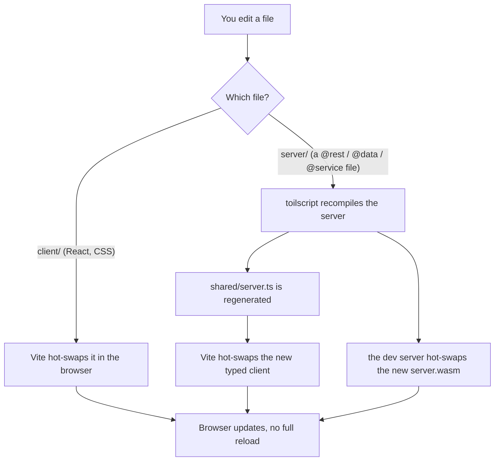
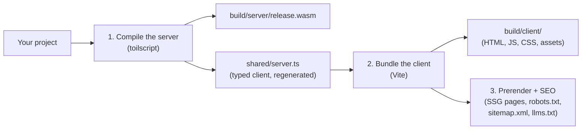
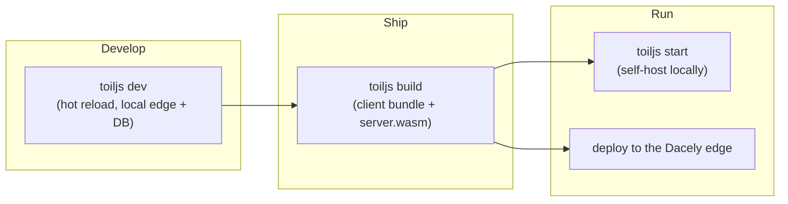

# The toiljs CLI

The `toiljs` command is how you scaffold, run, build, self-host, and diagnose a toiljs app. This page lists every command and every flag, with copy-pasteable examples.

## What it is

When you install the `toiljs` package, it adds one executable to your project: `toiljs`. Everything you do day to day (start the dev server, produce a production build, check your setup) goes through it.

You almost never type the full path. A freshly scaffolded project already has npm scripts that call it, so you run `npm run dev` and `npm run build`. When you want a command that has no script (like `doctor` or `db`), run it with `npx`:

```bash
npx toiljs doctor
```

`toiljs` needs **Node.js 24 or newer** (older versions will not run it).

## Command overview

| Command | What it does |
| --- | --- |
| `toiljs create [name]` | Scaffold a brand new toiljs app in a new folder. |
| `toiljs dev` | Start the local development server with hot reload. |
| `toiljs build` | Produce the optimized production build (client bundle + server WebAssembly). |
| `toiljs start` | Self-host the built app on a fast production HTTP server. |
| `toiljs configure` | Turn styling features (Sass/Less/Stylus, Tailwind) on or off in an existing project. |
| `toiljs doctor` | Diagnose your project setup and (with `--fix`) repair common wiring. |
| `toiljs update` | Check npm for newer dependency versions and apply the ones you pick. |
| `toiljs db <action>` | Inspect, reset, snapshot, or restore the local dev database. |
| `toiljs help` | Print the built-in help. Also `--help` or `-h`. |
| `toiljs --version` | Print the installed toiljs version. Also `-v`. |

Run `toiljs help` any time to see this list in your terminal.

## Global behavior

A few things apply to every command.

- **`--root <dir>`**: run the command against a project in another directory instead of the current one. Every command accepts it.
- **Automatic update check**: on every run (including `npm run dev`, which calls the CLI under the hood), toiljs quietly asks the npm registry whether a newer `toiljs` exists and prints a one-line notice on stderr if you are behind. It never blocks or slows the command in a meaningful way (the answer is cached for an hour and the network call is capped at two seconds). To turn it off, set the environment variable `TOILJS_NO_UPDATE_CHECK=1`. It also respects the common `NO_UPDATE_NOTIFIER` and `CI` variables.

```bash
# Run any command against a project in another folder.
toiljs build --root ./apps/marketing

# Silence the "newer version available" notice.
TOILJS_NO_UPDATE_CHECK=1 toiljs dev
```

## `toiljs create`

Scaffolds a new project into a new folder. By default it is interactive: it asks a short series of questions (project name, template, styling, and so on), then writes the files and installs dependencies. Pass flags to skip questions, or `-y` to accept every default and run with no questions at all.

```bash
# Interactive: answer the prompts.
npx toiljs create

# Give it a name up front.
npx toiljs create my-app

# Fully non-interactive (great for scripts and CI).
npx toiljs create my-app --yes --template app --style css
```

### What it sets up

Every new project comes wired for you: the enforced TypeScript, ESLint, and Prettier presets, file-based routing, a `toil.config.ts`, a `toilconfig.json` (the server compiler settings), a `.gitignore`, and the editor settings that make the toilscript language plugin work. It also scaffolds a `server/migrations/` folder (where ToilDB schema migrations live) and, unless you opt out, a set of AI assistant helper files.

The scaffolded `package.json` includes these scripts:

| Script | Runs |
| --- | --- |
| `npm run dev` | `toiljs dev` |
| `npm run build` | `toiljs build` |
| `npm run build:server` | `toiljs build --server` |
| `npm run lint` | `eslint client` |
| `npm run typecheck` | `tsc --noEmit` |
| `npm run format` | `prettier --write ...` |

### Generated docs and AI-assistant pointers

Every project carries a full copy of this documentation set at `.toil/docs/`. You do not maintain it: toiljs regenerates it from the installed toiljs version on every `toiljs dev` and `toiljs build`, so it always matches the version you are on. Do not edit those files by hand (your changes are overwritten on the next dev or build).

Unless you opt out, `toiljs create` also writes small **pointer files** at the project root that tell AI coding assistants to read `.toil/docs/` before touching the project: `CLAUDE.md` (Claude Code), `AGENTS.md` (Codex and others), `.cursor/rules/toiljs.mdc` (Cursor), and `.github/copilot-instructions.md` (GitHub Copilot). These are written once, committed, and yours to edit. Control them with `--ai` / `--no-ai` (when you pass neither, `create` asks).

### create options

| Flag | Meaning |
| --- | --- |
| `[name]` | The project folder name (a positional argument). If omitted, you are asked. |
| `-t, --template <app\|minimal>` | `app` is the full starter (landing page, layout, styles, demo routes). `minimal` is just a layout and a home route. Default `app`. |
| `--style <css\|sass\|less\|stylus>` | Which CSS flavor to set up. Default `css` (plain CSS). |
| `--tailwind` / `--no-tailwind` | Add or skip Tailwind CSS (v4). Off by default. |
| `--ai` / `--no-ai` | Include or skip AI assistant files (like `CLAUDE.md`). When omitted, you are asked. |
| `--images` / `--no-images` | Enable or skip build-time image optimization. On by default. |
| `--git` / `--no-git` | Initialize a git repository. When omitted, you are asked (default yes). |
| `--install` / `--no-install` | Install dependencies after scaffolding. When omitted, you are asked (default yes). |
| `--pm <npm\|pnpm\|yarn\|bun>` | Which package manager to install with. Default `npm`. |
| `-y, --yes` | Accept all defaults and skip every prompt. |

For a walkthrough, see [Create a project](../getting-started/create-project.md).

## `toiljs dev`

Starts the local development server with hot reload, so you edit a file and the browser updates in place. This is the command you leave running while you build.

```bash
npm run dev
# or, to pick a port:
npx toiljs dev --port 4000
```

### What the dev server emulates

The whole point of the dev server is to run your app locally the same way the real Dacely edge runs it in production, so what you see locally is what you ship. It emulates three things:

1. **The edge.** For a project with a server (any project with a `toilconfig.json`), a small local HTTP server takes the public port and dispatches incoming requests into your compiled `server.wasm` using the exact same request envelope the production edge uses. Anything your server does not claim (page routes, static assets, the hot-reload websocket) is proxied to Vite behind the scenes. So your React frontend and your WebAssembly backend run together, on one URL, exactly like production.
2. **The database.** ToilDB runs in-process as a local emulator. Every family (documents, views, unique, events, counters, membership, capacity) works, and the data is written to `.toil/devdata.json` so it survives restarts. You manage that file with [`toiljs db`](#toiljs-db).
3. **The host functions.** The platform services your server code calls (email, environment variables and secrets, time, crypto, rate limiting, auth) are wired up locally so they behave like the edge. Email actually sends if you configure a provider (see [Email](../services/email.md)).

A **client-only** project (no `toilconfig.json`) just gets the plain Vite dev server on your port, unchanged.

### How hot reload works



Client edits go straight through Vite's hot module replacement. Server edits trigger a toilscript rebuild: toiljs recompiles your backend, regenerates `shared/server.ts` (the typed client the browser imports to call your server), and hot-swaps the recompiled WebAssembly, all without you touching the browser. Rebuilds are debounced (grouped over about 150 milliseconds) so a "save all" or a formatter pass does not trigger a storm of builds.

If your project has an `emails/` folder, the dev server also prints an email-preview URL at `/__toil/emails`.

### dev options

| Flag | Meaning |
| --- | --- |
| `--port <n>` | Port to listen on. Default `3000` (or `client.port` from your config). |
| `--root <dir>` | Run against a project in another directory. |

Press `Ctrl+C` to stop. toiljs restores your terminal and force-exits even if a native listener is slow to close, so you never end up with an orphaned dev server rebuilding in the background.

## `toiljs build`

Produces the optimized production build. Run this before you deploy or before `toiljs start`.

```bash
npm run build
# or build only the server:
npx toiljs build --server
```

### What it produces

A full build runs in a careful order so the pieces line up:



1. **The server is built first.** toilscript compiles every decorated server file (not just the entry) into `build/server/release.wasm`, and regenerates `shared/server.ts`. Doing this first means the client always bundles against a current, correct typed server client. A project that also declares `@stream` or `@daemon` surfaces compiles those into their own artifacts (`release-stream.wasm`, `release-cold.wasm`).
2. **The client is bundled** by Vite into `build/client/` (your HTML, JavaScript, CSS, and optimized assets). The dev toolbar and error overlay are stripped out of the production bundle.
3. **Static pages and SEO files are generated**: any route that opts into static generation is prerendered to HTML, and if you configured `client.seo`, toiljs writes `robots.txt`, `sitemap.xml`, and `llms.txt`. Routes that opt into server-side rendering get their HTML-with-holes templates baked for the edge.

### build options

| Flag | Meaning |
| --- | --- |
| `--server` | Build **only** the server (recompile the wasm and regenerate `shared/server.ts`), and skip the client bundle. Fast when you only touched backend code. This is what `npm run build:server` runs. |
| `--root <dir>` | Run against a project in another directory. |

A client-only project (no `toilconfig.json`) skips step 1 and just bundles the client.

## `toiljs start`

Self-hosts the app you just built, on a fast production HTTP server (hyper-express, backed by uWebSockets.js). It serves your static client, runs your `server.wasm` for dynamic requests, does server-side rendering, supports daemons, and exposes a `/_toil` websocket channel. Use it to run your app on your own machine or server instead of deploying to the Dacely edge.

```bash
npm run build      # start needs a build to serve
npx toiljs start
npx toiljs start --port 8080 --host 0.0.0.0 --threads 4
```

`start` fails fast if there is no build yet (it looks for `build/client/index.html`), so run `toiljs build` first.

### start options

| Flag | Meaning |
| --- | --- |
| `--port <n>` | Port to listen on. Default `3000` (or `client.port`). |
| `--host <host>` | Address to bind. Default `127.0.0.1` (loopback only). Pass `0.0.0.0` to accept connections from other machines. |
| `--threads <n>` | Number of HTTP worker processes. Default is automatic (one per available CPU). Pass `1` to disable the worker pool. `--workers` is an accepted alias. This can also be set as `server.threads` in your config. |
| `--root <dir>` | Run against a project in another directory. |

## `toiljs configure`

Toggles a project's client styling features (the CSS preprocessor and Tailwind) after the fact, on an existing app. It detects your current setup, asks what you want, then rewrites the stylesheets and your app entry's imports, edits `package.json`, and syncs `node_modules` so removed packages are actually uninstalled.

```bash
# Interactive.
npx toiljs configure

# Non-interactive: switch to Sass and turn Tailwind on.
npx toiljs configure --style sass --tailwind
```

### configure options

| Flag | Meaning |
| --- | --- |
| `--style <css\|sass\|less\|stylus>` | Switch the CSS preprocessor. |
| `--tailwind` / `--no-tailwind` | Turn Tailwind on or off. |
| `--images` / `--no-images` | Turn build-time image optimization on or off (sets `client.images` in your config). |
| `--no-install` | Edit the files but do not run the package manager. You then run install yourself. |
| `--root <dir>` | Run against a project in another directory. |

Passing any of `--style`, `--tailwind`, or `--images` makes the command non-interactive (it skips the prompts you did not answer with a flag). See [Styling](../frontend/styling.md) for the full picture.

## `toiljs doctor`

Read-only project diagnostics. It gathers facts from disk (your `package.json`, lockfiles, the resolved config, your app entry, `index.html`, your routes, and the server target), runs a set of checks, and prints a grouped report. It never changes anything unless you pass `--fix`, and it never crashes on a partial or non-toiljs project (missing pieces just become warnings or failures). It exits with a non-zero status when any check **fails** (warnings do not fail), so it is safe to run in CI.

```bash
# Human-readable report.
npx toiljs doctor

# Machine-readable, for CI.
npx toiljs doctor --json

# Auto-repair the common wiring.
npx toiljs doctor --fix
```

### What it checks

The report is grouped:

| Group | Example checks |
| --- | --- |
| **Environment** | Node.js version, that `toiljs` and its peer dependencies (React, TypeScript, and so on) are installed and new enough, that a lockfile exists, and that your scripts do not wrap `toiljs` in a stray `npx`. |
| **Project + routing** | The `client/` and `routes/` folders exist, `index.html` has a `<div id="root">`, your app entry calls `mount(...)` with the `slots` argument, at least one route exists, no two routes collide on the same URL, and no asset paths are written in a way that 404s on nested routes. |
| **Config + assets** | Your `toil.config` loads, the base path is well formed, `client.seo` has a `url` if SEO is configured, and your styling packages are actually installed. |
| **Server / WASM** | The `toilconfig.json` and its entry files exist, `toilscript` is installed, a compiled `.wasm` exists, the typed-RPC wiring is in place, your `@rest` controllers are actually dispatched, the Prettier and editor plugins are wired, and a `migrations/` folder exists. |
| **Security** | If your server uses auth, whether `AUTH_SESSION_SECRET` is set (an unset secret means sessions fall back to a published dev key, which is forgeable). |

### What `--fix` repairs

`--fix` only touches a server project (one with a `toilconfig.json`), and it repairs the wiring that is easy to get wrong or that older projects predate:

- adds `--rpcModule shared/server.ts` to your server build scripts,
- adds `shared` and the `shared/*` path alias to `tsconfig.json`,
- adds `shared/server.ts` to `.gitignore`,
- lifts the `toilscript` version floor if it is too old,
- adds the `toiljs/prettier-plugin` to your Prettier config (so Prettier does not choke on server decorators),
- adds the toilscript language-service plugin to your server `tsconfig.json` and points VS Code at the workspace TypeScript (so the editor stops false-flagging `@database` collections and `@data` members),
- refreshes the editor-only server globals declaration file.

It is idempotent: it only writes files it actually needs to change, and it tells you which ones changed and which need a manual edit (for example a `tsconfig.json` that contains comments). If it changed `package.json`, run your installer afterward.

### doctor options

| Flag | Meaning |
| --- | --- |
| `--json` | Emit machine-readable JSON instead of the human report (the banner is suppressed so stdout stays valid JSON). |
| `--fix` | Repair the server wiring in place, as above. |
| `--root <dir>` | Run against a project in another directory. |

## `toiljs update`

A friendly wrapper over `npm-check-updates`. It checks the registry for newer versions of your dependencies, groups them by how big the jump is (major, minor, patch), lets you pick which to apply (or `-y` to apply all), bumps `package.json`, and runs your package manager's install. It also makes sure your `server/migrations/` folder exists (older projects predate it). `npm-check-updates` runs via `npx`, so it never becomes a permanent dependency of your project.

```bash
# Interactive picker.
npx toiljs update

# Apply everything, non-interactively.
npx toiljs update --yes

# Only patch-level updates.
npx toiljs update --target patch
```

### update options

| Flag | Meaning |
| --- | --- |
| `-y, --yes` | Apply all available updates without the picker. |
| `--target <latest\|minor\|patch\|newest\|greatest>` | How far to bump. Default `latest`. |
| `--root <dir>` | Run against a project in another directory. |

## `toiljs db`

Manages the local dev database: the on-disk ToilDB store your dev server writes to `.toil/devdata.json`. Use it to inspect data, wipe a corrupt state, save a snapshot to share as a fixture, or restore one. The snapshot is exactly the JSON the dev database uses, so an exported file imports cleanly.

```bash
# See what is stored.
npx toiljs db status

# Wipe all dev data.
npx toiljs db reset

# Save a snapshot (to a file, or to stdout if you omit the file).
npx toiljs db export fixture.json

# Restore a snapshot.
npx toiljs db import fixture.json

# Print the on-disk path (scriptable).
npx toiljs db path
```

### db actions

| Action | What it does |
| --- | --- |
| `status` (alias `info`) | Show the database path, its size, and per-family row counts. |
| `reset` (alias `purge`) | Delete all dev data (removes `devdata.json`). |
| `export [file]` | Write a formatted snapshot to `file`, or to stdout if you omit it (pipe-friendly). |
| `import <file>` | Replace the dev database with the snapshot in `file`. It refuses a file that is not a valid snapshot. |
| `path` | Print the `devdata.json` path and nothing else. |

The dev database is per-project and lives under `.toil/`, which is gitignored. See [Database setup](../database/setup.md) for what actually populates it.

## The dev, build, and deploy flow

Here is how the commands fit together across your workflow.



- **Develop** with `toiljs dev`. Everything runs locally and reloads as you type.
- **Ship** with `toiljs build`. This produces the artifacts: the client bundle in `build/client/` and the server WebAssembly in `build/server/`.
- **Run** the build two ways: `toiljs start` self-hosts it on your own machine, or you deploy the same build to the Dacely edge to serve it worldwide.

## Gotchas

- **`start` needs a build.** `toiljs start` serves what is in `build/`. Run `toiljs build` first, or it exits with an error.
- **Run `toiljs`, not `npx toiljs`, inside npm scripts.** Under `npm run`, `node_modules/.bin` is already on your PATH, so an extra `npx` layer is redundant and can leave your terminal in a broken input mode after `Ctrl+C`. `doctor` warns about this; the scaffold gets it right.
- **`--host` and `--threads` are `start`-only.** `toiljs dev` always binds locally and does not take `--host` or `--threads`.
- **`--server` builds the backend only.** Use it while iterating on server code, but run a full `toiljs build` before you deploy so the client bundle is current.
- **The update notice is not an error.** The "newer toiljs available" line is informational and prints to stderr. Set `TOILJS_NO_UPDATE_CHECK=1` to hide it.

## Related

- [Installation](../getting-started/installation.md) and [Create a project](../getting-started/create-project.md)
- [Project structure](../getting-started/project-structure.md)
- [Configuration reference (`toil.config.ts`)](../concepts/config.md)
- [Styling](../frontend/styling.md)
- [Database setup](../database/setup.md) and the [database overview](../database/README.md)
- [Compute tiers (L1 to L4)](../concepts/tiers.md)
