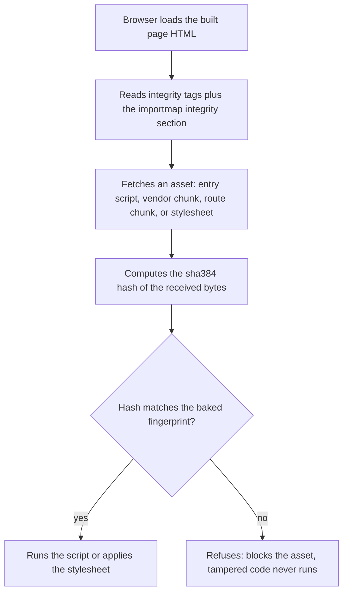

# Security

Security in toil is not a single feature you switch on. It is a set of defaults that are already on, spread across the whole stack, so that the safe path is also the default path.

## The model

Toil is built for **defense in depth**: many independent layers, so that one weak spot is not one breach. The goal is the top of our internal security bar, the Resilience and Scale Grade (see [../../RSG.md](../../RSG.md)), where each of these holds at the same time:

- All traffic is encrypted in transit with modern TLS (Transport Layer Security, the encryption every `https://` connection uses).
- The login design never lets the server see a password it could reuse.
- Secrets never live in your code.
- The browser verifies every asset it loads before running it.
- There is no implicit trust between the parts of the system (zero trust): each request is checked on its own merits.

The rest of this page walks through each layer and points to where it is documented in full.

## The backend is a sandbox

Every site (every tenant) on toil runs inside a **sandbox**: a walled-off compartment that can only touch what the host explicitly hands it, and can never reach the host itself or another tenant. Your server code is compiled to **WebAssembly** (wasm, a portable binary instruction format that runs in a tightly controlled virtual machine), and the edge loads each tenant as its own isolated wasm module.

That isolation is backed by **hard per-host limits**, enforced by the host and not by your code:

- **A committed-memory cap.** Each tenant may commit only a bounded amount of real memory (on the order of tens of MiB). A tenant cannot grow without bound and starve its neighbors.
- **A gas meter.** "Gas" is a per-request compute budget: every unit of work costs gas, and when a request runs out, the host stops it. A tenant cannot spin forever on the request path.
- **Rate limits.** How often one client may call a route is capped (see [Transport and rate limiting](#transport-and-rate-limiting) below).
- **Hostile-wasm containment.** The runtime is hardened to run untrusted, even deliberately malicious, wasm without letting it escape.

The point of all of this: a buggy or malicious tenant can crash or hang only itself. It cannot escape its sandbox, exhaust the host, or read or corrupt another tenant's data.

## Passwords: post-quantum login

Toil ships a complete login system you turn on with one line, and it is built so the server never handles a usable password. See [../auth/README.md](../auth/README.md) for the overview and [../auth/how-it-works.md](../auth/how-it-works.md) for the mechanism.

Here is why that matters. The pattern almost the whole internet uses is "send the password over TLS, then hash it on the server." That is the accepted baseline, but it caps security below the top grade, because for a moment the server holds a live, replayable credential. Anything that reads server memory or a stray log line at the wrong instant walks away with real passwords, and that is one of the most common breach paths in practice.

Toil designs that surface away. The proof that you know your password happens without the password ever crossing the wire in a form anyone can replay, so a fully breached server still yields no usable credentials.

## Subresource Integrity (SRI) on the client bundle

This is the layer that protects the code running in your users' browsers.

### The risk

Your app's JavaScript and CSS are static files served over the network, often through a CDN (Content Delivery Network, the fleet of edge caches that sits between your server and the browser). If any point in that path is compromised (the host, a cache, or the network itself), an attacker can serve **tampered** JavaScript or CSS: a modified bundle that steals sessions, skims form input, or rewrites the page. The browser, on its own, has no way to know the bytes it received are not the bytes you shipped.

### What toil does at build time

**Subresource Integrity (SRI)** is a browser feature that closes this gap. You attach a cryptographic fingerprint of a file to the tag that loads it, and the browser refuses to use the file unless its bytes match that fingerprint.

At build time (verified in [../../src/compiler/sri.ts](../../src/compiler/sri.ts)), toil adds that fingerprint to every **local** asset tag in the built HTML:

- every `<script src=...>`,
- every `<link rel="modulepreload" href=...>`,
- every `<link rel="stylesheet" href=...>`.

To each it adds two attributes: `integrity="sha384-<base64>"` and `crossorigin="anonymous"`.

- **`sha384`** is the hash algorithm: the file's bytes are run through SHA-384 (a member of the SHA-2 family), producing a fixed fingerprint that changes if even one byte changes. The `integrity` value is that fingerprint, base64-encoded, with a `sha384-` prefix.
- **`crossorigin="anonymous"`** is required for the browser to actually verify the fingerprint. It is a no-op when the asset is same-origin, so adding it is always safe.

Tags that are not toil's to hash are left completely untouched: external URLs (anything with a scheme like `https:`, a protocol-relative `//cdn/...`, or a `data:` URI), inline scripts (a `<script>` with no `src`), and any tag that already carries its own `integrity`.

### Why an import map is also emitted

A per-tag `integrity` only protects the **entry** script: the one file named directly in the tag. But a modern app is an ES module graph (ECMAScript modules, the browser's native `import` system). The entry script statically imports other chunks (for example the shared React vendor chunk), and it lazily pulls in each route with a dynamic `import()` as the user navigates. Those follow-on files are fetched by the browser's **module loader**, which does **not** inherit the entry tag's `integrity`. Without more, everything past the entry point would be unverified.

So toil also emits an **import map**: a `<script type="importmap">` tag (a standard browser mechanism for describing module resolution). Its `integrity` section maps every emitted JavaScript chunk to its own `sha384` fingerprint. This is the platform mechanism that extends verification to the module loader's fetches, so the **full** dynamic `import()` graph is covered, not just the entry tag. Browsers that do not yet support the `integrity` key simply ignore it (progressive enhancement: nothing breaks on older browsers, they just get one fewer check).

### Why it stays stable

A fingerprint is only useful if it keeps matching the bytes actually served. Toil guarantees that by **content-hashing** every asset it puts SRI on: the build tool (Vite) names each JavaScript chunk and each CSS file with a hash of its own contents baked into the URL (verified in [../../src/compiler/vite.ts](../../src/compiler/vite.ts)). Because the URL is pinned to the exact bytes, the fingerprint baked into the HTML can never falsely mismatch.

This prevents a real failure mode. Imagine a stylesheet kept a stable URL but its bytes changed on a new deploy. A user still holding an older HTML page (with the old baked fingerprint) would fetch the new bytes, the hashes would disagree, and the browser would **block** the stylesheet, breaking the page for that user. Content-hashing sidesteps this: new bytes get a new URL, so old HTML keeps pointing at the old bytes, and every fingerprint always matches. (Images and fonts keep stable names on purpose: they carry no SRI and are often referenced by fixed path.)

### What the browser does

For each asset that carries an `integrity` value (from a tag or from the import map), the browser hashes the bytes it received and compares them to the expected fingerprint. If they match, it runs the script or applies the stylesheet. If they do not match, it refuses: the asset is blocked and tampered code never runs.

### When it applies

SRI is part of the **production build output**. The dev server hands the browser un-hashed modules straight from Vite, where SRI would be meaningless, so it is not applied there. You get the protection automatically in what you ship, with nothing to configure.

## Secrets

Secrets (API keys, signing keys, and the like) are **never compiled into the wasm**. They are provided per-host at runtime through the secure environment store and read with `Environment.getSecure(key)`, which is kept strictly separate from the plain-variable `Environment.get(key)`: a secret can never leak out through a code path that only reads plain config. Because secrets live outside your code, they are never in your repository or its history. See [../services/environment.md](../services/environment.md) for the full model.

## Transport and rate limiting

All traffic runs over modern **TLS**, so nothing sensitive travels in the clear. The edge speaks **HTTP/3** (built on QUIC, a faster, head-of-line-blocking-free transport) with graceful fallback to HTTP/2 and HTTP/1.1, so newer clients get the modern path and older clients still connect and work.

On top of that, you can cap how often a client may hit any given route. Adding the `@ratelimit` decorator to a route makes the edge reject a client that goes over the limit **before your code runs**, which blunts brute-force and abuse and helps absorb bursts and denial-of-service (DDoS) pressure at the edge rather than inside your handler. Only routes that opt in pay any cost; everything else stays on the untouched fast path. See [../services/ratelimit.md](../services/ratelimit.md) for the strategies and per-user (keyed) limits.

## Related

- [Authentication](../auth/README.md): the post-quantum login system and `@auth`-guarded routes.
- [Environment](../services/environment.md): plain variables versus secrets, and where they live.
- [Rate limiting](../services/ratelimit.md): the `@ratelimit` decorator, strategies, and keyed limits.
- [Design principles](../introduction/design-principles.md): the ideas the framework is built on.
