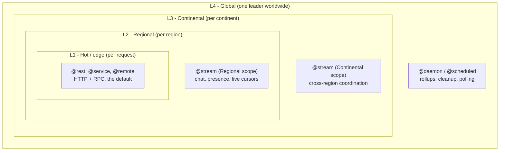

# Compute tiers

Your toiljs backend runs across four **compute tiers**, from a per-request handler at the very edge (L1) up to a single worldwide coordinator (L4). You write one project; the build decides which code belongs to which tier.

## What a tier is

A **tier** is a place your server code runs, defined by two things: how *close* it sits to the user, and how *long* one copy of it lives. The Dacely **edge** is a fleet of servers in many cities. Some work wants to run as close to the user as possible for speed. Other work wants exactly one copy in the whole world so it stays coordinated. A tier is the framework's answer to "where and for how long should this piece of code live?"

There are four tiers, named L1 through L4. The number is the **scope**: L1 is the smallest and nearest (one edge node), and each higher number widens the scope until L4 covers the entire globe.



Read the diagram as concentric rings: L1 is the inner ring nearest the user, and each outer ring is a wider, longer-lived scope. Most of your code lives in the innermost ring.

## The four tiers at a glance

| Tier | Name | How close | How many copies | Lives for | Runs |
| --- | --- | --- | --- | --- | --- |
| **L1** | Hot / edge | The exact node nearest the user | A fresh one per request | One request | `@rest`, `@service` / `@remote` |
| **L2** | Regional | A region (a group of nearby cities) | One box per connection | The connection | `@stream` (Regional scope) |
| **L3** | Continental | A continent | One box per connection | The connection | `@stream` (Continental scope) |
| **L4** | Global / daemon | One place worldwide | Exactly one leader (plus a warm standby) | Until redeployed | `@daemon`, `@scheduled` |

The tier names come straight from the edge runtime (its node roles are `Hot`, `Regional`, `Continental`, and `Daemon`).

## L1: Hot (request/response)

**What:** a plain request-in, response-out handler. This is the default tier and where most code lives.

**How it behaves:** a fresh copy of your handler serves each request, on whatever node is nearest the caller. Nothing you store on a field survives to the next request, because the next request may be a brand-new copy on the other side of the planet. This is called being **stateless**. It is what lets your app scale to the whole world with no coordination. When you need something to persist, you write it to [ToilDB](../database/README.md), the shared database.

L1 is the lowest latency tier: the code runs on the node the user already reached, so there is no extra hop.

```ts
// L1: a fresh box per request. `hits` does NOT persist across requests.
@rest('hello')
class Hello {
    private hits: i32 = 0; // reset every request

    @get('/')
    public greet(): Response {
        this.hits = this.hits + 1; // always 1
        return Response.text('hi\n');
    }
}
```

See [REST](../backend/rest.md) and [RPC](../backend/rpc.md).

## L2 and L3: streams (long-lived connections)

**What:** a **stream** is a long-lived connection (think a chat socket) where the server keeps state *per connected client* for as long as they stay connected.

**How it behaves:** when a client connects, the edge creates one resident **box** (one running copy of your `@stream` class) and pins it to a single worker. That same box handles every message from that client and is torn down when they leave. Because the box stays alive, its fields *do* persist across events, unlike L1. This is what makes a running message count, a game session, or a live cursor possible.

A `@stream` picks its scope with `@stream({ scope })`:

- **`StreamScope.Regional`** puts the box in the user's region (L2). Closest, lowest latency, smallest blast radius. Use it for per-connection state that only that one client cares about.
- **`StreamScope.Continental`** puts the box at a continent-wide node (L3). A little farther, but many clients across a continent can be steered to the *same* box, which is what you want when connected users must share state (a shared room, a leaderboard everyone updates).

The trade-off is the theme of this whole page: nearer (L2) is faster; wider (L3) lets more clients coordinate on one box.

```ts
// L2/L3: the box is resident, so `count` survives every message.
@stream({ scope: StreamScope.Regional })
class Echo {
    private count: i32 = 0;

    @connect onConnect(): StreamOutbound {
        this.count = 0;
        return StreamOutbound.accept();
    }
    @message onMessage(pkt: StreamPacket): StreamOutbound {
        this.count = this.count + 1; // persists across events
        return StreamOutbound.empty();
    }
    @close onClose(): void { /* box torn down after this */ }
}
```

See [Realtime streams](../realtime/streams.md).

## L4: the daemon (global coordination)

**What:** the daemon is a single, elected leader for your whole app, running recurring background work on a schedule.

**How it behaves:** unlike every other tier, there is exactly **one** live daemon box in the entire world for your domain (with a warm standby ready to take over if the leader fails). It is not tied to any request or connection. It wakes on a cadence (an interval like `"1h"`, or a cron schedule) and does coordination work: rolling up analytics, cleaning up expired rows, polling an upstream API. Because there is only ever one leader, a `@scheduled` task runs **at most once** per due tick across the planet, which is exactly what you want for work that must not double-fire.

L4 is the highest-latency, most-consistent tier: it is far from any single user, but it is the one place where "do this exactly once, globally" is true.

```ts
// L4: one leader worldwide runs this hourly.
@daemon
class Jobs {
    @scheduled('1h')
    hourly(): void {
        // rollups, cleanup, polling an upstream, ...
    }
}
```

See [Daemons](../background/daemons.md).

## How code is routed to a tier

You do not configure tiers. You opt into one by adding an **entry file** with the right name and using the matching **surface decorator**. A surface decorator is the top-level decorator that says what kind of endpoint a class is (`@rest`, `@stream`, `@daemon`).

At build time, `toiljs build` runs the compiler once per tier and hands each pass only the code that belongs to it. Each tier compiles into its own WebAssembly file (its own `.wasm` **artifact**), so the request build never carries stream or daemon code, and vice versa.

| Entry file (`server/`) | Surface decorator | Artifact | Tier |
| --- | --- | --- | --- |
| `main.ts` | `@rest`, `@service` / `@remote` | `release.wasm` | L1 request |
| `main.stream.ts` | `@stream` | `release-stream.wasm` | L2 / L3 stream |
| `main.daemon.ts` | `@daemon`, `@scheduled` | `release-cold.wasm` | L4 daemon |

Shared building blocks carry no tier of their own. Your [`@data` classes](../backend/data.md) and your [`@database` schema](../database/README.md) are compiled into *every* artifact, because any tier may need to read or write the database. The stream and daemon tiers are opt-in: a project with no `@stream` and no `@daemon` just builds the single `release.wasm` and behaves exactly like a request-only app.

For the entry-file conventions and the full build flow, see [Project structure](../getting-started/project-structure.md).

## Why tiers matter: latency vs consistency

Picking a tier is a trade-off between two things a junior developer should keep in mind:

- **Latency** (how fast a single user gets an answer): lower tiers win. L1 runs on the node the user already reached.
- **Consistency and shared state** (many actors agreeing on one thing): higher tiers win. L4 has exactly one copy in the world, so it is trivially consistent, but it is far from everyone.

A rule of thumb:

- Answering one request as fast as possible: **L1**.
- Keeping per-connection state for one live client: **L2**.
- Letting many connected clients across a continent share one box's state: **L3**.
- Doing a job exactly once, globally, on a schedule: **L4**.

## Gotchas

- **L1 fields reset every request.** If you set a field in one request and read it in the next, it will be gone. Persist to [ToilDB](../database/README.md) instead.
- **A project using `@stream` may not also declare `@service` or `@remote`** anywhere (the compiler enforces this). Streams and RPC live in different artifacts. Keep them in separate entry files (`main.stream.ts` vs `main.ts`).
- **There is at most one `@daemon` class per project.** It compiles only into the cold artifact; a `@daemon` in the request build is a compile error.
- **Higher tier is not "better".** Do not reach for L4 to hold shared state you read on every request; that adds a long hop. Use the database for shared reads, and the daemon only for scheduled, run-once work.

## Related

- [Backend overview](../backend/README.md): the L1 request model in depth.
- [REST](../backend/rest.md) and [RPC](../backend/rpc.md): the L1 surfaces.
- [Realtime streams](../realtime/streams.md): the L2 / L3 surface and `StreamScope`.
- [Daemons](../background/daemons.md) and [@derive](../background/derive.md): scheduled and background work.
- [The database (ToilDB)](../database/README.md): where shared, persistent state lives.
- [Decorators](./decorators.md): the full list of surface decorators and their tiers.
- [Project structure](../getting-started/project-structure.md): entry files and the build.
