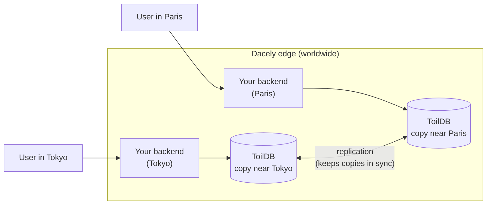
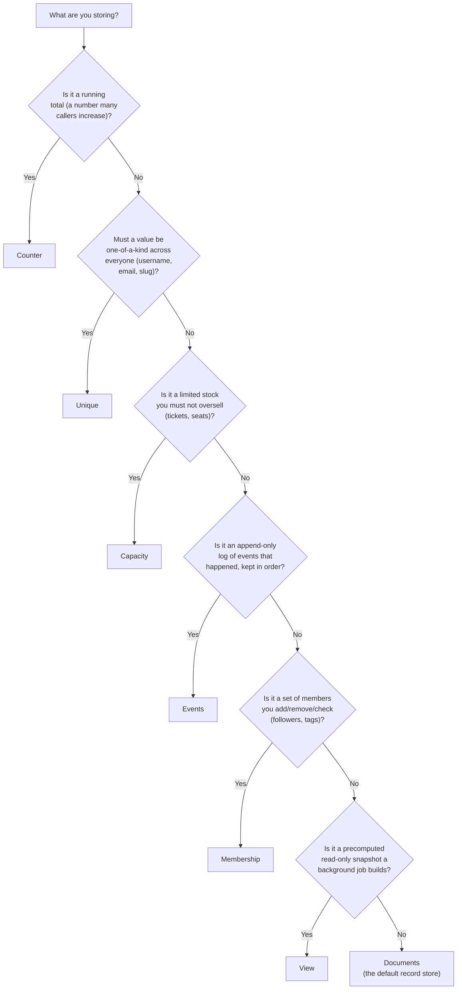

# ToilDB

ToilDB is the database built into toiljs. It is **global**, it needs **no setup or connection string**, and your backend talks to it with plain typed method calls.

If you have used Postgres, MySQL, or MongoDB before, ToilDB will feel a little different, and this page explains why. If you have never used a database, that is fine too: read on and every term is defined as it appears.

## What "a globally distributed edge database" means

Let us take that phrase one word at a time.

- A **database** is a place your program stores data so it is still there on the next request. Your handler runs, finishes, and forgets everything in memory (a fresh WebAssembly instance runs each request), so anything you want to keep, a user account, a like count, a guestbook entry, has to go into a database.
- The **edge** is a network of servers spread around the world, each one physically close to some of your users. Your compiled backend runs on the edge server nearest whoever is calling it. (For the full picture of where code runs, see [Tiers](../concepts/tiers.md).)
- **Globally distributed** means the database is not one machine in one city. Its data lives on many machines in many regions at once. A user in Tokyo and a user in Paris each read from a copy near them, so reads are fast everywhere instead of fast in one place and slow everywhere else.

Put together: ToilDB is storage that lives out on that same worldwide edge, next to your code, so a database read does not have to fly across an ocean and back.



You never pick a region, open a connection, or run a migration script. You declare what you want to store (see [Setup](./setup.md)) and ToilDB is there.

## Why seven families instead of one big "table"

Most databases give you one general-purpose tool: a table (or a collection) that you read and write however you like. That is flexible, but on a system spread across the whole planet, the flexible tool is also the slow and error-prone tool. The classic example is a counter. If two servers on opposite sides of the world both try to do "read the number, add one, write it back" at the same moment, one of the two increments is silently lost, because each read the same starting value.

ToilDB solves this by giving you **seven specialized collection types**, called **families**. Each family is tuned for one job and exposes only the operations that are safe and fast for that job. A counter family, for instance, has no "set to this value" operation at all: you can only `add` a delta, and the database merges concurrent deltas from around the world without losing any. You cannot misuse it, because the unsafe operation does not exist.

So instead of one generic table you reach for, you pick the family that matches what you are doing. Picking the right one is the main skill, and the guide below walks you through it.

The seven families are:

| Family | It stores | Read a page |
| --- | --- | --- |
| **Documents** | Records you look up by id (users, posts, orders). | [Documents](./documents.md) |
| **Unique** | A claim on a value that must be one-of-a-kind (usernames, emails, slugs). | [Unique](./unique.md) |
| **Counter** | A running total that many callers increment at once (likes, views). | [Counters](./counters.md) |
| **Events** | An append-only log of things that happened (feeds, audit trails). | [Events](./events.md) |
| **Capacity** | A limited quantity you hand out without overselling (tickets, seats). | [Capacity](./capacity.md) |
| **Membership** | Sets of "who belongs to what" (followers, tags, room members). | [Membership](./membership.md) |
| **View** | A precomputed, read-optimized snapshot (home pages, leaderboards). | [Views](./views.md) |

## The one idea shared by all seven: key then value

Every family, underneath, works the same way: it maps a **key** to a **value**.

- A **key** is how you find your data. Think of it as the label on a drawer: a user id, a username, a room name.
- A **value** is what is in the drawer: the user record, the owner of a username, the members of a room.

In ToilDB, both the key and the value are ordinary TypeScript classes that you tag with `@data`. The `@data` tag tells toilscript (the compiler that turns your backend into WebAssembly) how to pack that class into bytes for storage and unpack it again. You write a normal class with normal fields, give each field a default, and the compiler does the rest.

```ts
// A key: how you address one record.
@data
class UserId {
  id: string = '';
  constructor(id: string = '') { this.id = id; }
}

// A value: what you store under that key.
@data
class User {
  id: string = '';
  name: string = '';
  score: u64 = 0;
}
```

You then declare a collection that maps that key type to that value type, for example `Documents<UserId, User>`. Every family is generic over its key and value types in exactly this way, so once you understand `@data` keys and values you understand all seven. The full `@data` reference is on the [data types page](../backend/data.md); how to declare collections is on [Setup](./setup.md).

## Eventual consistency, in plain words

Because ToilDB keeps copies of your data in many regions, there is one honest trade-off you need to understand: **eventual consistency**.

Every key has one **home**: a single region that officially owns that key's data. All **writes** to a key travel to its home, where they are applied one at a time, in order. That is what makes writes safe: even if a thousand servers write the same key at once, the home lines them up so nothing is lost or corrupted.

**Reads**, on the other hand, are served from the copy nearest the reader, which is fast but may be a beat behind. After a write lands at the home, it takes a brief moment (usually milliseconds) to fan out to the other regions' copies. During that moment, a reader in another region might still see the previous value. The copies always catch up; they are *eventually* consistent, not *instantly* consistent everywhere.

What this means in practice:

- **It is usually invisible.** The lag is tiny, and most apps never notice.
- **Do not assume a write is visible everywhere the instant it returns.** For example, right after you create a record, a read from a far-away region might briefly not see it yet.
- **Some families are stronger.** Because writes to a single key are serialized at its home, operations that must never race, claiming a unique username, reserving the last ticket, are decided at the home and are safe. The Unique and Capacity families lean on this so two callers can never both win. See [Unique](./unique.md) and [Capacity](./capacity.md).

Each family page spells out its own consistency behavior, so you always know what to expect.

## Choosing a family: the decision guide

Start from what you are trying to do, not from a data structure. This table maps a real need to the family that was built for it.

| I need to... | Use | Why |
| --- | --- | --- |
| Store and update a thing I look up by id (a user, a post, an order). | **Documents** | The general-purpose record store: create, read, update, delete by key. |
| Guarantee a value is used by only one owner across the whole world (username, email, slug). | **Unique** | Claims are decided at the key's home, so two people cannot claim the same name. |
| Count something that many people bump at the same time (likes, page views, stock tally). | **Counter** | Concurrent `add`s from anywhere merge without ever losing an increment. |
| Keep a growing list of things that happened, in order (activity feed, audit log). | **Events** | Append-only: you add events and read the newest, but never edit history. |
| Hand out a limited quantity and never sell more than exist (tickets, seats, inventory). | **Capacity** | Reserve/confirm/cancel holds at the home prevent overselling. |
| Track which members belong to a set (followers, tags, room members, permissions). | **Membership** | Add/remove/check membership without loading a whole record to edit a list. |
| Serve a precomputed, ready-to-render result quickly (leaderboard, home page snapshot). | **View** | A background job computes it once; requests read it with a single fast lookup. |

If two families seem to fit, this flowchart resolves it. Read it top to bottom.



A quick sanity check when you land somewhere: **Documents is the default.** If you are storing "a thing with fields that I update by id," it is almost always Documents. The other six exist for the specific jobs above where Documents would be slow, unsafe under concurrency, or awkward.

Real apps mix families freely. The demo guestbook, for example, uses **Events** for the log of signatures, a **Counter** for the running total, and a **View** for the ready-to-serve snapshot, all in one small feature.

## Where to go next

- [Setup](./setup.md): declare a database, its collections, and reach them from a handler.
- [Documents](./documents.md): the general-purpose record store (start here).
- [Unique](./unique.md), [Counters](./counters.md), [Events](./events.md), [Views](./views.md), [Membership](./membership.md), [Capacity](./capacity.md): the specialized families.

## Related

- [Setup](./setup.md): how to declare `@database`, `@collection`, and `@data` types.
- [Data types (`@data`)](../backend/data.md): the typed keys and values every family uses.
- [Tiers](../concepts/tiers.md): where your backend and its data run.
- [Decorators](../concepts/decorators.md): `@query`, `@action`, `@derive`, and friends.
