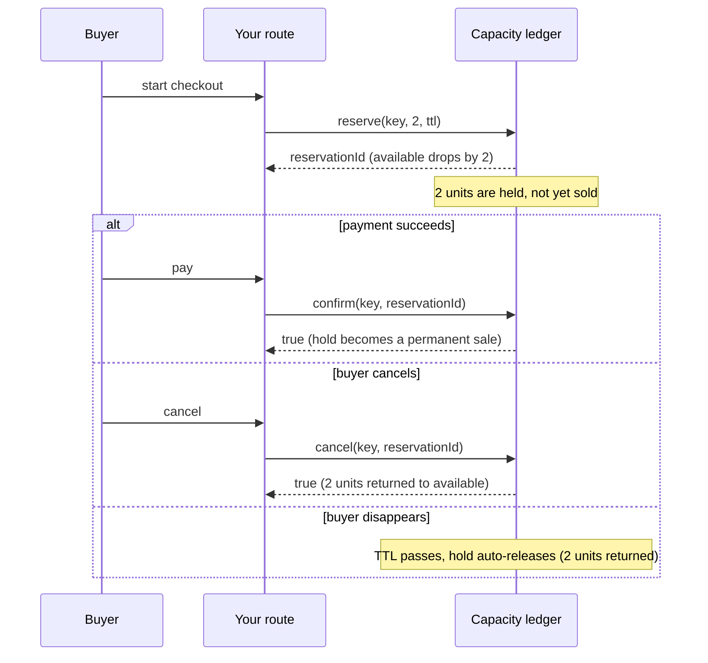

# Capacity (limited stock without overselling)

A `Capacity` collection models a **finite resource that must never be oversold**:
concert tickets, seats, limited-drop stock, rate grants. It uses a two-phase
`reserve` then `confirm`/`cancel` pattern so two buyers can never grab the same
last unit.

## What and why

Some resources are strictly limited. There are 100 tickets, and selling 101 is a
real, expensive mistake. The classic bug is a race: two requests both read "1
left", both decide they can sell it, and both sell it. Now you have oversold.

A `Capacity` collection prevents that. Instead of "read, then decrement" (two
steps a race can slip between), it does an atomic **hold**: the check that enough
is available and the decrement happen as one indivisible step, at one place. And
it adds a second phase so a shopper who starts a checkout but never pays does not
lock up stock forever.

The lifecycle has three moves:

- **`reserve`**: hold some units for a short time. The units come out of
  "available" immediately, and you get back a **reservation id**. If there is not
  enough available, the reserve fails (and nothing is oversold).
- **`confirm`**: the shopper paid. Turn the hold into a permanent sale.
- **`cancel`**: the shopper backed out. Release the hold back to available.

If a hold is neither confirmed nor cancelled within its time limit (its **TTL**,
time to live), it **auto-releases**. So an abandoned checkout heals itself.



Use `Capacity` whenever selling one too many is unacceptable: tickets, seats,
inventory for a limited drop, a pool of licences, or any "N and no more" resource.

## Why not just a counter?

A [Counter](./counters.md) can only `add` and `get`. To sell a ticket with a
counter you would read the remaining count, check it is above zero, and then
subtract one. Those are separate steps. Two requests can both read "1 left"
before either subtracts, and both proceed: **oversold**. A counter has no way to
atomically check-and-decrement, and no notion of a temporary hold that expires.

`Capacity` fixes both problems:

- The availability check and the hold are **one atomic step**, so contenders are
  serialized: the first reserve takes the unit, the second sees zero available
  and fails.
- The two-phase **reserve then confirm/cancel** means an unpaid, abandoned
  checkout does not permanently consume stock: its hold expires on the TTL.

If a small over- or under-count is harmless (likes, page views, an
approximate inventory display), a counter is simpler and cheaper. If overselling
by one is a real problem, use `Capacity`.

## The type

```ts
Capacity<K>
```

`Capacity` has a single type parameter, the **key** (`K`): it picks *which*
resource. There is no value type, because the value is a private ledger the
platform manages for you (it tracks the total, the confirmed sales, and the live
holds). For one ticketed event, the key is the event id.

Declare it as a `@collection` field on a `@database` class:

```ts
@data
class ShowKey {
  show: string = '';
  constructor(show: string = '') { this.show = show; }
}

@database
class TicketsDb {
  @collection static seats: Capacity<ShowKey>;
}
```

## Operations

Five operations, matching the toilscript API exactly. Exact signatures:

| Operation | Signature | What it does |
| --- | --- | --- |
| `available` | `available(key: K): i64` | How many units can be reserved right now. |
| `reserve` | `reserve(key: K, amount: i64, ttlMs: i64): u64` | Hold `amount` units for `ttlMs` milliseconds. Returns a reservation id (> 0), or `0` if there was not enough. |
| `confirm` | `confirm(key: K, reservationId: u64): bool` | Turn a hold into a permanent sale. Returns whether the id was valid. |
| `cancel` | `cancel(key: K, reservationId: u64): bool` | Release a hold back to available. Returns whether it was released. |
| `setTotal` | `setTotal(key: K, total: i64): void` | Set the ceiling (seed or restock). Background task only. |

The core accounting the platform maintains for you:

```txt
available = total - confirmed - held
```

`total` is the ceiling you set. `confirmed` is units permanently sold. `held` is
units currently reserved but not yet confirmed. `available` never goes below zero.

### `available`

Reads how many units could be reserved right now. It is a keyed read, legal from
any handler including a `@get`.

```ts
const left = TicketsDb.seats.available(new ShowKey('jazz-night'));
```

### `reserve`

Holds `amount` units for `ttlMs` milliseconds and returns a reservation id. This
is the operation that prevents overselling.

```ts
const id = TicketsDb.seats.reserve(new ShowKey('jazz-night'), 2, 120_000); // hold 2 for 2 minutes
if (id == 0) {
  // Not enough available. This is a normal outcome, NOT an error: no oversell.
  return Response.conflict('sold out');
}
// id > 0: you now hold 2 units for up to 2 minutes. Keep the id.
```

Two things to know:

- A return of `0` means "not enough available". It is the safe, expected answer
  when the resource is (nearly) sold out. Always check for it.
- The hold auto-releases after `ttlMs` if you do not confirm or cancel it. Choose
  a TTL that covers a realistic checkout (a couple of minutes), not hours.

`reserve` is a **write**, so call it from an action handler (`@post`, `@put`,
`@patch`, `@del`), not from a `@get`.

### `confirm`

Turns a hold into a permanent sale. Call it once payment (or whatever finalizes
the deal) succeeds.

```ts
const ok = TicketsDb.seats.confirm(new ShowKey('jazz-night'), id);
// ok === true  -> the id was valid; those units are now permanently sold
// ok === false -> the id was unknown (never reserved, or already expired)
```

A confirmed sale is **permanent**: it can never be cancelled and its TTL never
reclaims it. Confirm is safe to call more than once for the same id (it stays
confirmed).

### `cancel`

Releases a hold back to available. Call it when the shopper backs out before
paying.

```ts
const released = TicketsDb.seats.cancel(new ShowKey('jazz-night'), id);
// released === true  -> the hold was released, units are available again
// released === false -> the id was unknown, already expired, OR already confirmed
```

You **cannot** cancel a confirmed sale (a sale is final). `cancel` returns `false`
in that case.

### `setTotal`

Sets the ceiling: the total number of units. You call it to **seed** a new
resource ("this show has 100 seats") and to **restock** ("we opened the balcony,
now 150"). Existing holds and confirmed sales are untouched; only the ceiling
moves, and `available` reflects the new total.

`setTotal` is a **privileged** operation: it may only run from a background task
(a `@job`), never from a request handler. Seeding and restocking are
administrative actions, so they live off the request path. See
[background tasks](../background/index.md).

```ts
@database
class TicketsDb {
  @collection static seats: Capacity<ShowKey>;

  // A background task seeds/restocks the ceiling. This runs off the request path.
  @job
  openSeats(): void {
    TicketsDb.seats.setTotal(new ShowKey('jazz-night'), 100);
  }
}
```

Note that lowering the total below what is already sold plus held does not
cancel anything (confirmed sales are permanent); `available` simply floors at
zero until holds clear.

## The lifecycle in words

1. **Seed.** A background `@job` calls `setTotal(key, 100)`. Now `available` is
   100.
2. **Reserve.** A buyer starts checkout. Your `@post` calls `reserve(key, 1,
   ttl)` and gets an id. `available` drops to 99. The unit is *held*, not sold.
3. **Finalize, one of:**
   - **Confirm.** Payment succeeds; your `@post` calls `confirm(key, id)`. The
     unit is now permanently sold. `available` stays 99.
   - **Cancel.** The buyer backs out; your `@post` calls `cancel(key, id)`. The
     unit returns to available; `available` goes back to 100.
   - **Expire.** The buyer vanishes. After `ttl` passes, the hold auto-releases;
     `available` goes back to 100 on its own.

At no point can the confirmed count exceed the total. That is the guarantee.

## Worked example: selling limited tickets

```ts
import { ShowKey } from '../models/ShowKey';
import { ReserveRequest } from '../models/ReserveRequest';
import { FinalizeRequest } from '../models/FinalizeRequest';
import { ReserveResult } from '../models/ReserveResult';

@database
class TicketsDb {
  @collection static seats: Capacity<ShowKey>;

  // Background task: seed the show's capacity (and restock if you reopen it).
  @job
  openSeats(): void {
    TicketsDb.seats.setTotal(new ShowKey('jazz-night'), 100);
  }
}

@rest('tickets')
class Tickets {
  // How many seats are left (a keyed read, legal in a GET).
  @get('/jazz-night/available')
  public left(): i64 {
    return TicketsDb.seats.available(new ShowKey('jazz-night'));
  }

  // Start checkout: hold the seats. Returns a reservation id, or 0 if sold out.
  @post('/jazz-night/reserve')
  public reserve(input: ReserveRequest): ReserveResult {
    const id = TicketsDb.seats.reserve(new ShowKey('jazz-night'), input.count, 120_000);
    // id === 0 means not enough available. No oversell; tell the buyer honestly.
    return new ReserveResult(id, id != 0);
  }

  // Payment succeeded: make the hold a permanent sale.
  @post('/jazz-night/confirm')
  public confirm(input: FinalizeRequest): bool {
    return TicketsDb.seats.confirm(new ShowKey('jazz-night'), input.reservationId);
  }

  // Buyer backed out before paying: release the hold.
  @post('/jazz-night/cancel')
  public cancel(input: FinalizeRequest): bool {
    return TicketsDb.seats.cancel(new ShowKey('jazz-night'), input.reservationId);
  }
}
```

The models:

```ts
@data
export class ReserveRequest {
  count: i64 = 1;
}

@data
export class FinalizeRequest {
  reservationId: u64 = 0;
}

@data
export class ReserveResult {
  reservationId: u64 = 0;
  ok: bool = false;
  constructor(reservationId: u64 = 0, ok: bool = false) {
    this.reservationId = reservationId;
    this.ok = ok;
  }
}
```

Even if a thousand people hit `reserve` at the same instant for the last few
seats, the ledger serializes them: the first buyers get ids, the rest get `0`.
The total is never exceeded.

## Consistency

Unlike most ToilDB families, `Capacity` is **strongly consistent**, and that is
the whole point. Every reserve/confirm/cancel for a key is routed to that key's
one home location and applied there in order, at a single serialization point. So
even though ToilDB spans many regions, there is exactly one place that decides
whether a reserve succeeds. That is what makes "never oversell" a hard guarantee
rather than a best effort. `available` reflects that home ledger.

## Gotchas

- **Check for `0` from `reserve`.** A `0` is "not enough available", the normal
  sold-out answer, not an error. Do not treat it as a failure to retry blindly.
- **Always finalize a reservation.** After a successful `reserve`, you should
  `confirm` it (paid) or `cancel` it (abandoned). If you do neither, the hold
  sits until its TTL expires, temporarily reducing availability.
- **Pick a sensible TTL.** Too short and a slow-but-real checkout loses its hold
  mid-payment. Too long and abandoned carts starve real buyers. A couple of
  minutes is typical for a checkout.
- **Confirmed sales are permanent.** You cannot `cancel` a confirmed sale, and
  its TTL never reclaims it. If you support refunds, model that as your own
  restock (raise `setTotal`), not as a cancel.
- **`reserve` is not automatically deduplicated.** Each call to `reserve` creates
  a new, distinct hold. If a client might retry the same reserve, avoid holding
  twice: reserve once, keep the returned id, and drive `confirm`/`cancel` off
  that id.
- **`setTotal` is background-only.** You cannot set the total from a route. Seed
  and restock from a `@job`.
- **There is a per-key cap on live holds.** A key can carry only so many
  simultaneous unconfirmed holds; a flood of holds beyond that is rejected as
  "not enough available" (and abandoned holds clear on their TTL). Normal traffic
  never hits this; it is a guardrail against a hold flood.

## Related

- [Counters](./counters.md): a running total when overselling is not a concern
  (and why it cannot guarantee a limit).
- [Documents](./documents.md): store the order/booking record that a confirmed
  sale produces.
- [background tasks](../background/index.md): where `setTotal` (seeding/restock)
  runs.
- [Data types (`@data`)](../concepts/types.md): how the capacity key is stored.
- [Decorators](../concepts/decorators.md): which handler kinds may reserve,
  confirm, and cancel.
