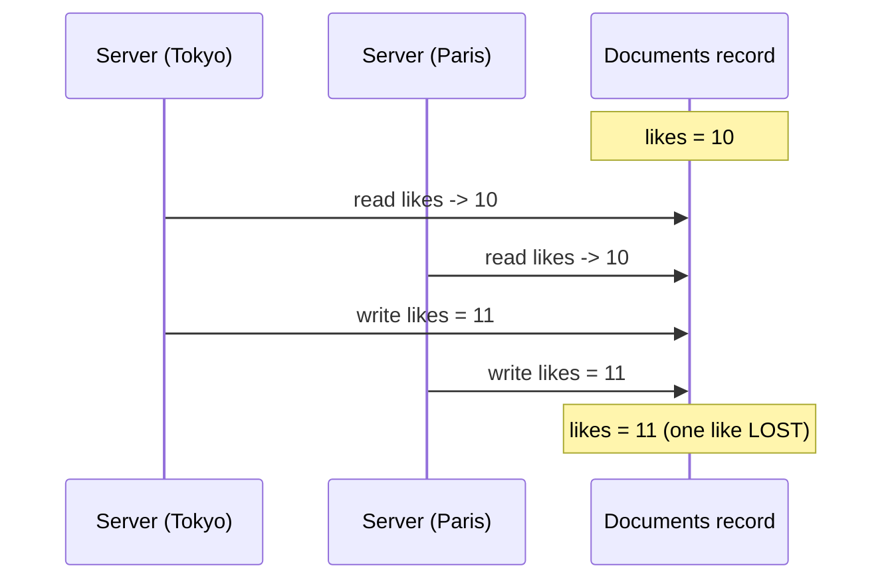

# Counters

The **Counter** family is a distributed running total that many callers can increase at the same time, from anywhere in the world, without ever losing a count. It is how you build likes, view counts, and inventory tallies correctly.

## What and why

A **Counter collection** maps a `@data` key to a single whole number. You do just two things with it: read the current total (`get`) and add to it (`add`). There is deliberately **no "set to this value"** operation, and that missing operation is the entire point of the family, as the next section explains.

Reach for a Counter whenever the thing you are storing is a number that many requests bump concurrently:

- likes or upvotes on a post
- page views or play counts
- a stock or quantity tally
- any "increase this by N" metric

Declare one by typing a `@collection` as `Counter<Key>`. Notice there is no value type: the value is always a number the database manages for you.

```ts
@data
class PostId {
  id: string = '';
  constructor(id: string = '') { this.id = id; }
}

@database
class AppDb {
  @collection static likes: Counter<PostId>;
  @collection static views: Counter<PostId>;
}
```

## The operations

`K` is the key type. The value is always a 64-bit signed integer (`i64`).

| Operation | Signature | Returns | Use it to |
| --- | --- | --- | --- |
| `get` | `get(key: K): i64` | the current total (`0` if nothing has been added) | read the count |
| `add` | `add(key: K, delta: i64): void` | nothing | change the count by `delta` (may be negative) |

`get` is a read (works in any function). `add` is a write, so it needs an **Action** (a `@post` route or an `@action`); see [Setup](./setup.md#how-access-is-gated-query-action-and-friends).

### `get`

`get` returns the current total. A counter that has never been touched reads as `0`, not `null`: there is no "absent" state to handle.

```ts
const likeCount: i64 = AppDb.likes.get(new PostId('p_42'));
```

### `add`

`add` changes the total by a delta. The delta can be positive to increase or negative to decrease:

```ts
AppDb.likes.add(new PostId('p_42'), 1);   // one more like
AppDb.likes.add(new PostId('p_42'), -1);  // undo a like
AppDb.stock.add(new SkuId('sku_9'), -3);  // sold three
```

`add` saturates at the `i64` limits: it will not wrap around from a huge positive to a negative if you somehow overflow. Note that `add` returns nothing, not the new total. If you need the total right after adding, call `get` (bearing in mind the consistency note below).

## Why a Counter, and not a number in a Documents record?

This is the question the family exists to answer, so it is worth walking through.

Suppose you stored the like count as a field in a Documents record and incremented it the obvious way: read the record, add one, write it back. Now two servers on opposite sides of the world each get a like at the same moment:



Both read `10`, both wrote `11`, and one like vanished. This is a **lost update**, and it happens whenever two callers do read-modify-write on the same value at once. It is not a rare edge case on a busy post; it is the normal case.

A Counter avoids this entirely because you never send a final value, you send a **delta**. Each server just says "add 1." The database merges the two deltas into "add 1, add 1 = add 2," so the total goes from 10 to 12 and nothing is lost. Deltas are **commutative** (the order they arrive in does not matter) and **additive**, so concurrent increments from anywhere in the world always combine correctly. That property is what "conflict-free" means: there is no conflict to resolve, because two adds are never at odds.

This is also why there is no `set` operation. A `set` would reintroduce the exact race above (two callers overwriting each other). By offering only `add`, the Counter family makes the lost-update bug impossible to write.

**Use a Counter when** the number is bumped concurrently by many requests. **Use a Documents field instead when** the number is only ever changed by a single logical owner in a controlled way (for example, a value you always overwrite with a freshly computed absolute figure, not an increment), where you would use `patch` to store the whole new value.

## Worked example: page views and likes

Here is a small feature that counts views on every read and likes on demand, then reports both.

```ts
import { Response, RouteContext } from 'toiljs/server/runtime';

@data
class PostId {
  id: string = '';
  constructor(id: string = '') { this.id = id; }
}

@data
class Stats {
  views: i64 = 0;
  likes: i64 = 0;
}

@database
class AppDb {
  @collection static views: Counter<PostId>;
  @collection static likes: Counter<PostId>;
}

@rest('posts')
class Posts {
  // POST /posts/:id/view  -> count a view, return the running totals (Action)
  @post('/:id/view')
  public view(ctx: RouteContext): Stats {
    const key = new PostId(ctx.param('id'));
    AppDb.views.add(key, 1);
    const s = new Stats();
    s.views = AppDb.views.get(key);
    s.likes = AppDb.likes.get(key);
    return s;
  }

  // POST /posts/:id/like  -> add a like (Action)
  @post('/:id/like')
  public like(ctx: RouteContext): Stats {
    const key = new PostId(ctx.param('id'));
    AppDb.likes.add(key, 1);
    const s = new Stats();
    s.views = AppDb.views.get(key);
    s.likes = AppDb.likes.get(key);
    return s;
  }

  // GET /posts/:id/stats  -> just read the totals (Query: read-only)
  @get('/:id/stats')
  public stats(ctx: RouteContext): Stats {
    const key = new PostId(ctx.param('id'));
    const s = new Stats();
    s.views = AppDb.views.get(key);
    s.likes = AppDb.likes.get(key);
    return s;
  }
}
```

Counting a view lives in a `@post` because it is a write (a counter `add`), even though it feels like part of a read. The `@get` stats route only reads, so it runs as a Query.

## Consistency notes

- **Counters are eventually consistent.** `get` returns the total known to the copy nearest you, which may briefly trail increments applied moments ago in other regions. The copies converge quickly, so the count catches up on its own.
- **No increment is ever lost.** That is the strong guarantee: every `add` from anywhere is eventually included in the total, because deltas merge. The total may be a little behind, but it is never wrong in the "lost a like" sense.
- **Monotonic when you only add positives.** If every `add` is positive, the total only ever goes up as it converges. Mixing in negative `add`s (undoing a like, selling stock) is fine and correct; it simply means the total is not monotonic.
- Because of the lag, do not treat the value `get` returns immediately after an `add` as a globally final figure. It is a fast, close-enough total, which is exactly right for likes and views.

## Gotchas

- **There is no `set`.** To move a counter to a specific number, add the difference (`add(key, target - get(key))`), but be aware that read-then-add reintroduces a race if two callers do it at once. Prefer to think in deltas.
- **`add` does not return the new total.** Call `get` after if you need it, remembering it may lag concurrent remote adds.
- **A never-touched counter reads `0`, not `null`.** There is no "does this counter exist" check; every key answers `0` until something is added.
- **Counters hold a number, not a record.** If you need per-key fields alongside the count, keep the record in [Documents](./documents.md) and the tally in a Counter, keyed the same way (the example above effectively does this with two counters).

## Related

- [ToilDB overview](./README.md): the seven families and how to choose.
- [Setup](./setup.md): declaring the collection and which function kinds may write.
- [Documents](./documents.md): when the number is part of a record you overwrite wholesale.
- [Events](./events.md): when you need the individual events, not just a total.
- [Data types (`@data`)](../backend/data.md): the counter's key type.
