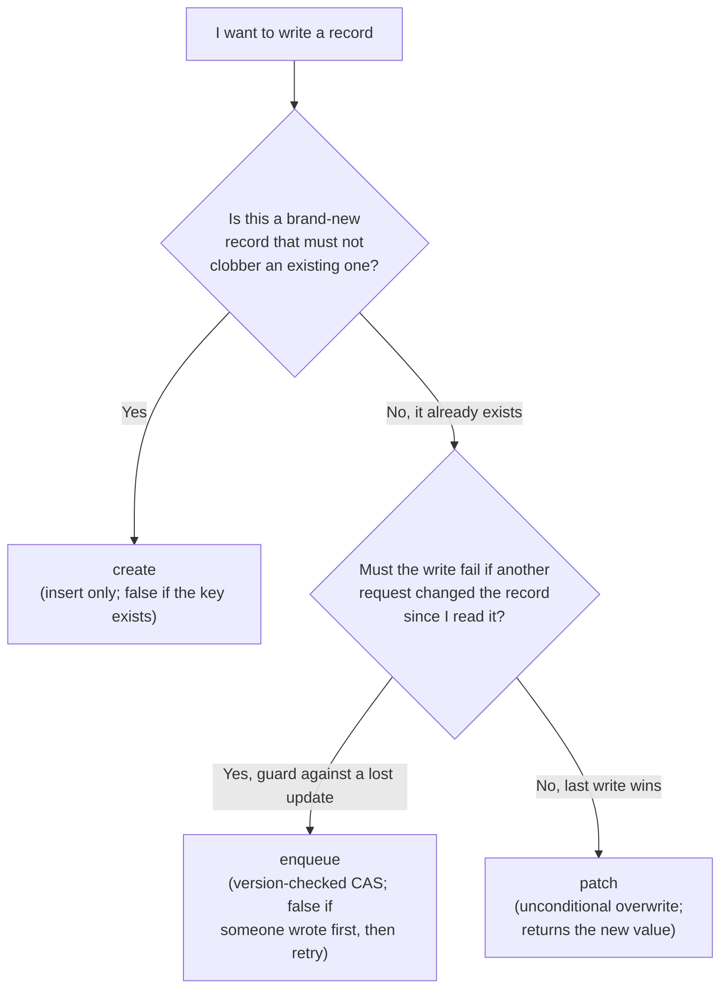

# Documents

The **Documents** family is ToilDB's general-purpose record store: you keep a value under a key and look it up, update it, or delete it by that key. It is the family you will use most, and the one to reach for whenever the other six do not obviously fit.

## What and why

A **Documents collection** maps a `@data` key to a `@data` value: one value per key, which you can read, replace, and remove. Think users by user id, posts by post id, orders by order number. If you are storing "a thing with fields that I look up and update by its id," this is the family.

Declare one by typing a `@collection` as `Documents<Key, Value>`:

```ts
@data
class UserId {
  id: string = '';
  constructor(id: string = '') { this.id = id; }
}

@data
class User {
  id: string = '';
  name: string = '';
  email: string = '';
  score: u64 = 0;
}

@database
class AppDb {
  @collection static users: Documents<UserId, User>;
}
```

## The operations

Here is every operation, its shape, and what it gives back. `K` is your key type, `V` your value type.

| Operation | Signature | Returns | Use it to |
| --- | --- | --- | --- |
| `get` | `get(key: K): V \| null` | the value, or `null` if absent | read one record |
| `require` | `require(key: K): V` | the value; **traps** if absent | read a record you are sure exists |
| `getMany` | `getMany(keys: K[]): Array<V \| null>` | one entry per key, in order, each value or `null` | read several records in one call |
| `exists` | `exists(key: K): bool` | `true` if the record is present | check presence without reading the value |
| `create` | `create(key: K, value: V): bool` | `true` if inserted, `false` if the key was already taken | add a **new** record without overwriting |
| `patch` | `patch(key: K, value: V): V` | the newly stored value; **traps** if the record is absent | replace an **existing** record's value |
| `enqueue` | `enqueue(key: K, value: V): bool` | `true` if applied, `false` if a concurrent write won first or the record is absent | a version-checked (compare-and-swap) overwrite of an existing record |
| `delete` | `delete(key: K): void` | nothing (idempotent) | remove a record |
| `getDelete` | `getDelete(key: K): V \| null` | the value that was there, or `null`; removes it atomically | consume a record exactly once |

Which kind of function may call which operation is covered in [Setup](./setup.md#how-access-is-gated-query-action-and-friends). In short: reads (`get`, `getMany`, `exists`) work anywhere; writes (`create`, `patch`, `enqueue`, `delete`, `getDelete`) need an **Action** (a `@post` route or an `@action`).

### Reading: `get`, `require`, `exists`, `getMany`

`get` is the everyday read. It returns the value or `null`, so you handle "not found" explicitly:

```ts
const user = AppDb.users.get(new UserId('u_123'));
if (user == null) {
  return Response.notFound();
}
// user is a fully typed User here
```

`require` is `get` for the case where absence is a bug, not a normal outcome: it returns the value directly and traps (aborts the request) if the record is missing. Use it only when you have already guaranteed the record exists.

`exists` answers "is there a record here?" without paying to decode the value. It is handy as a cheap precondition:

```ts
if (AppDb.users.exists(new UserId(name))) {
  // username already registered, do not overwrite
}
```

`getMany` reads several keys in a single operation. You hand it an array of keys; you get back an array the same length and in the same order, each entry either the value or `null` for a key that was absent. Reach for it instead of a loop of `get` calls when you already know the handful of keys you need.

```ts
const ids = [new UserId('a'), new UserId('b'), new UserId('c')];
const found: Array<User | null> = AppDb.users.getMany(ids);
// found[0] lines up with ids[0], and so on; each is a User or null
```

`getMany` is a **bounded batch of point reads**, not a scan: the number of keys you may pass is capped by the request budget, and it never walks the whole collection. There is no "get all records" operation on a request path, by design (an unbounded scan could fan out across a huge collection). If you need "the latest N of something," model it as [Events](./events.md) or precompute a [View](./views.md).

### Writing: `create` vs `patch` vs `enqueue`

These three all put a value under a key, but they differ in one important way each. Choosing correctly is the heart of using this family.



**`create` inserts a new record.** It only writes if the key is free. If the key already has a record, `create` does nothing and returns `false`. This is your tool for "sign up a new user" or "claim this order id," where accidentally overwriting an existing record would be a bug. Because every key is serialized at its home (see [eventual consistency](./README.md#eventual-consistency-in-plain-words)), `create` is race-safe: if two requests create the same key at the same instant, exactly one gets `true` and the other gets `false`.

```ts
const ok = AppDb.users.create(new UserId(input.id), input);
if (!ok) {
  return Response.text('that id is taken', 409);
}
```

**`patch` overwrites an existing record** and returns the value now stored. The record **must already exist**: `patch` on a missing key traps (aborts the request), so create it first. Despite the name, `patch` replaces the whole value; there is no field-level partial update, so read the current value, change the fields you want, and patch the whole thing back:

```ts
const current = AppDb.users.get(new UserId('u_123'));
if (current == null) return Response.notFound();
current.score = current.score + 10;
const saved: User = AppDb.users.patch(new UserId('u_123'), current);
// saved is what is now stored
```

**`enqueue` is a version-checked overwrite (a compare-and-swap).** Like `patch`, it replaces the whole value of an **existing** record, but it does so *only if the record has not changed since you read it*. A **compare-and-swap** (CAS) is exactly that: "write my new value, but only if the current value is still the one I saw." It returns a `bool`: `true` means your write was applied; `false` means either a concurrent write changed the record first (someone else beat you to it) or the record is absent. A `false` is **not an error**; it is the signal to **re-read and try again**. This approach is called **optimistic concurrency**: rather than locking the record, you assume nobody else will touch it, and you simply re-run the update on the rare occasion someone did.

Reach for `enqueue` when several requests may update the *same* record at once and you must not silently lose any of their changes. A plain `patch` cannot promise that: two overlapping patches clobber each other (the last writer wins and the earlier update just vanishes). The intended pattern for `enqueue` is always a read-modify-CAS **retry loop**:

```ts
const key = new UserId('u_123');
for (let attempt = 0; attempt < 5; attempt++) {
  const current = AppDb.users.get(key);      // 1. read the current value
  if (current == null) return Response.notFound();
  current.score = current.score + 10;        // 2. modify your copy
  if (AppDb.users.enqueue(key, current)) {   // 3. try to commit it
    return Response.text('ok');              //    true: applied, we are done
  }
  // false: someone wrote between our get and our enqueue.
  // Loop: re-read the now-newer value and reapply the change on top of it.
}
return Response.text('too much contention, try again later', 409);
```

Because every retry re-reads the latest value, the two updates **compose** (both `+10`s land) instead of one silently overwriting the other. If you do not need this guard (only one writer touches the key, or last-write-wins is genuinely fine), a plain `patch` is simpler and also hands you the stored value back directly.

> There is no single "create or overwrite" (upsert) call. To get that behavior, try `create` first and fall back to `patch` if the key was taken:
>
> ```ts
> const key = new UserId(input.id);
> if (!AppDb.users.create(key, input)) {
>   AppDb.users.patch(key, input);
> }
> ```

### Removing: `delete` and `getDelete`

`delete` removes a record. It is **idempotent**: deleting a key that is already gone is not an error, it just does nothing. So you can call it without first checking that the record exists.

```ts
AppDb.users.delete(new UserId('u_123'));
```

`getDelete` is the atomic **fetch-and-remove**: in one indivisible step it reads the current value and deletes it, returning what it removed (or `null` if there was nothing). "Atomic" here means no other request can slip in between the read and the delete, so exactly one caller can ever receive a given value. That makes it the right tool for **consume-once** data: one-time login challenges, single-use invite codes, password-reset tokens. The PQ-auth demo uses it to consume a login challenge exactly once, so a challenge cannot be replayed:

```ts
const challenge = AppDb.challenges.getDelete(new ChallengeId(cid));
if (challenge == null) return fail(); // unknown, already used, or expired
// ...verify against challenge...
```

If two requests race to `getDelete` the same key, only one gets the value; the other gets `null`. That is the guarantee a plain `get` then `delete` cannot give you, because two racers could both `get` the value before either `delete`s it.

## A full worked example: a small CRUD entity

Putting it together, here is a complete `notes` resource: create, read, update, and delete, backed by a Documents collection.

```ts
import { Response, RouteContext } from 'toiljs/server/runtime';

// ---- key + value ----
@data
class NoteId {
  id: string = '';
  constructor(id: string = '') { this.id = id; }
}

@data
class Note {
  id: string = '';
  title: string = '';
  body: string = '';
  updatedAt: u64 = 0;
}

// ---- database ----
@database
class NotesDb {
  @collection static notes: Documents<NoteId, Note>;
}

// ---- routes ----
@rest('notes')
class Notes {
  // GET /notes/:id  -> read one (Query: read-only)
  @get('/:id')
  public read(ctx: RouteContext): Response {
    const note = NotesDb.notes.get(new NoteId(ctx.param('id')));
    if (note == null) return Response.notFound();
    return Response.json(note.toJSON().toString());
  }

  // POST /notes  -> create a new one, refusing a duplicate id (Action: may write)
  @post('/')
  public create(input: Note): Response {
    input.updatedAt = <u64>(Date.now() / 1000);
    if (!NotesDb.notes.create(new NoteId(input.id), input)) {
      return Response.text('id already exists', 409);
    }
    return Response.json(input.toJSON().toString());
  }

  // POST /notes/:id  -> overwrite an existing note (Action)
  @post('/:id')
  public update(input: Note, ctx: RouteContext): Response {
    const key = new NoteId(ctx.param('id'));
    if (!NotesDb.notes.exists(key)) return Response.notFound();
    input.id = ctx.param('id');
    input.updatedAt = <u64>(Date.now() / 1000);
    const saved = NotesDb.notes.patch(key, input);
    return Response.json(saved.toJSON().toString());
  }

  // POST /notes/:id/delete  -> remove one (Action)
  @post('/:id/delete')
  public remove(ctx: RouteContext): Response {
    NotesDb.notes.delete(new NoteId(ctx.param('id')));
    return Response.text('deleted');
  }
}
```

That is a complete persistent CRUD entity. Run it under `toiljs dev` and the notes survive across requests; deploy it and the same code stores them worldwide on the edge.

## Consistency notes

Documents follows ToilDB's general model (see [the overview](./README.md#eventual-consistency-in-plain-words)):

- **Writes to one key are serialized at that key's home**, so `create` is race-safe and `patch`/`enqueue`/`getDelete` never corrupt a record under concurrency.
- **Reads are eventually consistent across regions.** Right after a write, a read from a far-away region may briefly still see the old value (or, for a just-created record, not see it yet). The copies converge within moments.
- Because `patch` replaces the whole value, two updates to *different* fields of the same record can clobber each other if they overlap (read-modify-write races). `enqueue`'s version check is exactly the guard against that: use the read-modify-CAS retry loop shown above so a lost update turns into a retry instead of silent data loss. If you find yourself contending on one hot record a lot, a counter or a set is often a better fit than a Documents value. See [Counters](./counters.md) and [Membership](./membership.md).

## Gotchas

- **`patch` requires an existing record.** Calling it on a missing key traps the request. Use `create` for new records, or the `create`-then-`patch` upsert pattern above.
- **`patch` replaces the whole value.** There is no field-level merge; read, modify, and write back the full value.
- **`enqueue` returning `false` is not a failure.** It means a concurrent write beat you to the record (or the record is absent), so re-read and retry in a loop; never ignore the return value or treat `false` as a hard error. `enqueue` also does not hand back the stored value; use `patch` when you want the value returned and last-write-wins is acceptable.
- **No "get all."** There is no scan on the request path. Use `getMany` for known keys, and [Events](./events.md) or a [View](./views.md) for "the latest N."
- **`getDelete`, not `get` + `delete`, for consume-once.** Only `getDelete` guarantees exactly one caller receives the value.

## Related

- [ToilDB overview](./README.md): the seven families and how to choose.
- [Setup](./setup.md): declaring the collection and which function kinds may write.
- [Data types (`@data`)](../backend/data.md): keys and values.
- [Counters](./counters.md): when you are really just counting.
- [Events](./events.md) and [Views](./views.md): for "the latest N" and precomputed reads.
