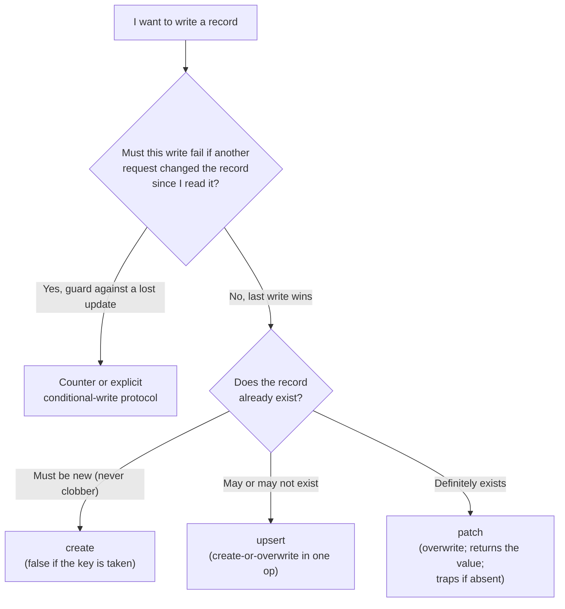

# Documents

The **Documents** family is ToilDB's general-purpose record store: you keep a value under a key and look it up, update it, or delete it by that key. It is the family you will use most, and the one to reach for whenever the other six do not obviously fit.

## What and why

A **Documents collection** maps a `@data` key to a `@data` value: one value per key, which you can read, replace, and remove. Think users by user id, posts by post id, orders by order number. If you are storing "a thing with fields that I look up and update by its id," this is the family.

Declare one by typing a `@collection` as `Documents<Key, Value>`:

```ts
@data
class UserId {
  id: string = '';
  constructor(id: string = '') { this.id = id; }
}

@data
class User {
  id: string = '';
  name: string = '';
  email: string = '';
  score: u64 = 0;
}

@database
class AppDb {
  @collection static users: Documents<UserId, User>;
}
```

## The operations

Here is every operation, its shape, and what it gives back. `K` is your key type, `V` your value type.

| Operation | Signature | Returns | Use it to |
| --- | --- | --- | --- |
| `get` | `get(key: K): V \| null` | the value, or `null` if absent | read one record |
| `require` | `require(key: K): V` | the value; **traps** if absent | read a record you are sure exists |
| `getMany` | `getMany(keys: K[]): Array<V \| null>` | one entry per key, in order, each value or `null` | read several records in one call |
| `exists` | `exists(key: K): bool` | `true` if the record is present | check presence without reading the value |
| `create` | `create(key: K, value: V): bool` | `true` if inserted, `false` if the key was already taken | add a **new** record without overwriting |
| `patch` | `patch(key: K, value: V): V` | the newly stored value; **traps** if the record is absent | replace an **existing** record's value |
| `upsert` | `upsert(key: K, value: V): UpsertResult` | `UpsertResult.Created` or `.Updated`; `.Conflict` on a `@unique` collision (nothing written) | create **or** overwrite in one op (last-writer-wins) |
| `enqueue` | `enqueue(key: K, value: V): bool` | acceptance status | submit a replacement of an existing record; not caller-observed CAS |
| `delete` | `delete(key: K): void` | nothing (idempotent) | remove a record |
| `getDelete` | `getDelete(key: K): V \| null` | the value that was there, or `null`; removes it atomically | consume a record exactly once |

Which kind of function may call which operation is covered in [Setup](./setup.md#how-access-is-gated-query-action-and-friends). In short: reads (`get`, `getMany`, `exists`) work anywhere; writes (`create`, `patch`, `upsert`, `enqueue`, `delete`, `getDelete`) need an **Action** (a `@post` route or an `@action`).

### Reading: `get`, `require`, `exists`, `getMany`

`get` is the everyday read. It returns the value or `null`, so you handle "not found" explicitly:

```ts
const user = AppDb.users.get(new UserId('u_123'));
if (user == null) {
  return Response.notFound();
}
// user is a fully typed User here
```

`require` is `get` for the case where absence is a bug, not a normal outcome: it returns the value directly and traps (aborts the request) if the record is missing. Use it only when you have already guaranteed the record exists.

`exists` answers "is there a record here?" without paying to decode the value. It is handy as a cheap precondition:

```ts
if (AppDb.users.exists(new UserId(name))) {
  // username already registered, do not overwrite
}
```

`getMany` reads several keys in a single operation. You hand it an array of keys; you get back an array the same length and in the same order, each entry either the value or `null` for a key that was absent. Reach for it instead of a loop of `get` calls when you already know the handful of keys you need.

```ts
const ids = [new UserId('a'), new UserId('b'), new UserId('c')];
const found: Array<User | null> = AppDb.users.getMany(ids);
// found[0] lines up with ids[0], and so on; each is a User or null
```

`getMany` is a **bounded batch of point reads**, not a scan: the number of keys you may pass is capped by the request budget, and it never walks the whole collection. There is no "get all records" operation on a request path, by design (an unbounded scan could fan out across a huge collection). If you need "the latest N of something," model it as [Events](./events.md) or precompute a [View](./views.md).

In `toiljs dev` and the current production host, one `getMany` call accepts up to **32 keys in a Query**, **64 in an Action**, or **1024 in background function kinds**. Each encoded key may be at most **4096 bytes**, and the complete encoded keys frame (the count, length prefixes, and key bytes) may be at most **2097152 bytes (2 MiB)**. Split a larger list into smaller calls; production also applies cumulative request budgets, so separate requests may be needed for a large job.

### Size limits and file uploads

A stored value may be at most **2097152 encoded bytes (2 MiB)**, including the `@data` message id, field lengths, and other codec overhead. The limit applies in both `toiljs dev` and production. A photo can be stored whole when its encoded record fits this limit; a photo with 2 MiB of raw content will exceed it once wrapped in a record. `create`, `patch`, `upsert`, and `enqueue` all enforce the same limit; changing the write method does not bypass it. Events, View values, Unique owners, and Membership members have the same encoded value cap.

Production also applies host-configured limits to individual database results and the total result bytes in a request. A `getMany` result includes all returned rows and their framing, so its key-count limit does not guarantee that the result fits. The local emulator enforces value, key, and batch-size caps, but does not emulate these result-byte budgets or production DB wait deadlines. Size reads for the deployed host's request budgets as well as the 2 MiB per-value cap.

For files larger than the encoded value or request budgets allow, store the content in external file storage and keep its reference and metadata in Documents, or store chunks under separate keys:

1. Give each upload an id and store each chunk under `(uploadId, chunkIndex)`. Reserve room below 2 MiB for the record's codec overhead, and choose smaller chunks if the deployed request result budget requires them. Check your complete encoded record and result sizes before writing it.
2. Store upload metadata separately: content type, total byte count, expected chunk count, and an expiry. Bound those counts and the number of chunks processed by any one request.
3. Validate that every expected chunk arrived before publishing a completed upload. Readers use the completion marker so an interrupted upload is not mistaken for a complete file. Retry chunk writes with `upsert` when replacing that chunk is acceptable.
4. Read known chunk keys with bounded `getMany` calls or individual `get` calls, keeping every result and the request's total under the deployed budgets. Remove abandoned chunks using background work. Allow for replication delay when verifying newly written chunks from a different cell.

The local HTTP request body limit is a separate **8 MiB** default: accepting an upload body does not make that body a valid database value. See [route execution and transport limits](../concepts/config.md#route-execution-and-transport-limits) and [upload expiry versus elapsed deadlines](../services/time.md#upload-expiry-versus-elapsed-deadlines).

### Writing: `create` vs `upsert` vs `patch` vs `enqueue`

These four all put a value under a key, but they differ in one important way each. Choosing correctly is the heart of using this family.


```mermaid
flowchart TD
    START["I want to write a record"] --> Q1{"Must this write fail if another<br/>request changed the record<br/>since I read it?"}
    Q1 -->|"Yes, guard against a lost update"| ENQUEUE["Counter or explicit<br/>conditional-write protocol"]
    Q1 -->|"No, last write wins"| Q2{"Does the record<br/>already exist?"}
    Q2 -->|"Must be new (never clobber)"| CREATE["create<br/>(false if the key is taken)"]
    Q2 -->|"May or may not exist"| UPSERT["upsert<br/>(create-or-overwrite in one op)"]
    Q2 -->|"Definitely exists"| PATCH["patch<br/>(overwrite; returns the value;<br/>traps if absent)"]
```

**`create` inserts a new record.** It only writes if the key is free. If the key already has a record, `create` does nothing and returns `false`. This is your tool for "sign up a new user" or "claim this order id," where accidentally overwriting an existing record would be a bug. Because every key is serialized at its home (see [eventual consistency](./README.md#eventual-consistency-in-plain-words)), `create` is race-safe: if two requests create the same key at the same instant, exactly one gets `true` and the other gets `false`.

```ts
const ok = AppDb.users.create(new UserId(input.id), input);
if (!ok) {
  return Response.text('that id is taken', 409);
}
```

**`patch` overwrites an existing record** and returns the value now stored. The record **must already exist**: `patch` on a missing key traps (aborts the request), so create it first. Despite the name, `patch` replaces the whole value; there is no field-level partial update, so read the current value, change the fields you want, and patch the whole thing back:

```ts
const current = AppDb.users.get(new UserId('u_123'));
if (current == null) return Response.notFound();
current.score = current.score + 10;
const saved: User = AppDb.users.patch(new UserId('u_123'), current);
// saved is what is now stored
```

**`enqueue` submits a replacement of an existing record.** Its current ABI carries
only the new value. It does not carry the version or bytes observed by your earlier
`get`, so it cannot protect an application read-modify-write from lost updates.
The production host may compare a version read *inside* the write operation; that
is not a comparison against the application's earlier read. A retry loop around
`get` and `enqueue` does not fix this gap. Acceptance also must not be treated as a
portable durable-commit acknowledgement.

Use a Counter for independent additive totals. Financial state spanning several
records requires a tested conditional-write/recovery protocol. The native host
now exposes `data.compare_exchange` (explicit expected bytes) and
`data.get_current` (owner read), mirrored by the development emulator. These are
low-level host imports; the typed Documents API does not yet wrap them. They
currently require local key ownership and reject remote-owner execution.

**`upsert` creates the record or overwrites it, in one operation.** It is the "just store this value, I do not care whether a row was already there" call, and it is the right tool for a save that runs repeatedly (a profile edit, a settings blob) where the first save inserts and every later save replaces. It returns an `UpsertResult` telling you which happened:

```ts
const key = new UserId('u_123');
const result = AppDb.users.upsert(key, user);
// result is UpsertResult.Created (row was absent) or UpsertResult.Updated (overwrote)
```

Before `upsert`, that meant two operations, `create` then `patch`:

```ts
// the old two-op idiom - upsert replaces it
if (!AppDb.users.create(key, user)) {
  AppDb.users.patch(key, user);
}
```

`upsert` collapses both into a single write, so the common "already exists" path costs one round trip instead of two.

Like `patch`, it is a **last-writer-wins** overwrite, not a compare-and-swap: concurrent upserts never fail or retry, the later one simply wins. That makes it correct for writing a **whole value**, and wrong for a read-modify-write of accumulating state (a running total, a like count) where a concurrent write would be silently lost, use a [Counter](./counters.md) for additive state or an explicit conditional-write protocol there. On a collection with a `@unique` field, `upsert` returns `UpsertResult.Conflict` (and writes nothing) when the value's unique field is already held by a **different** record, the one case it cannot resolve by overwriting:

```ts
const outcome = AppDb.handles.upsert(key, profile);
if (outcome == UpsertResult.Conflict) {
  return Response.text('that handle is taken', 409);
}
```

### Removing: `delete` and `getDelete`

`delete` removes a record. It is **idempotent**: deleting a key that is already gone is not an error, it just does nothing. So you can call it without first checking that the record exists.

```ts
AppDb.users.delete(new UserId('u_123'));
```

`getDelete` is the atomic **fetch-and-remove**: in one indivisible step it reads the current value and deletes it, returning what it removed (or `null` if there was nothing). "Atomic" here means no other request can slip in between the read and the delete, so exactly one caller can ever receive a given value. That makes it the right tool for **consume-once** data: one-time login challenges, single-use invite codes, password-reset tokens. The PQ-auth demo uses it to consume a login challenge exactly once, so a challenge cannot be replayed:

```ts
const challenge = AppDb.challenges.getDelete(new ChallengeId(cid));
if (challenge == null) return fail(); // unknown, already used, or expired
// ...verify against challenge...
```

If two requests race to `getDelete` the same key, only one gets the value; the other gets `null`. That is the guarantee a plain `get` then `delete` cannot give you, because two racers could both `get` the value before either `delete`s it.

## A full worked example: a small CRUD entity

Putting it together, here is a complete `notes` resource: create, read, update, and delete, backed by a Documents collection.

```ts
import { Response, RouteContext } from 'toiljs/server/runtime';

// ---- key + value ----
@data
class NoteId {
  id: string = '';
  constructor(id: string = '') { this.id = id; }
}

@data
class Note {
  id: string = '';
  title: string = '';
  body: string = '';
  updatedAt: u64 = 0;
}

// ---- database ----
@database
class NotesDb {
  @collection static notes: Documents<NoteId, Note>;
}

// ---- routes ----
@rest('notes')
class Notes {
  // GET /notes/:id  -> read one (Query: read-only)
  @get('/:id')
  public read(ctx: RouteContext): Response {
    const note = NotesDb.notes.get(new NoteId(ctx.param('id')));
    if (note == null) return Response.notFound();
    return Response.json(note.toJSON().toString());
  }

  // POST /notes  -> create a new one, refusing a duplicate id (Action: may write)
  @post('/')
  public create(input: Note): Response {
    input.updatedAt = <u64>(Date.now() / 1000);
    if (!NotesDb.notes.create(new NoteId(input.id), input)) {
      return Response.text('id already exists', 409);
    }
    return Response.json(input.toJSON().toString());
  }

  // POST /notes/:id  -> overwrite an existing note (Action)
  @post('/:id')
  public update(input: Note, ctx: RouteContext): Response {
    const key = new NoteId(ctx.param('id'));
    if (!NotesDb.notes.exists(key)) return Response.notFound();
    input.id = ctx.param('id');
    input.updatedAt = <u64>(Date.now() / 1000);
    const saved = NotesDb.notes.patch(key, input);
    return Response.json(saved.toJSON().toString());
  }

  // POST /notes/:id/delete  -> remove one (Action)
  @post('/:id/delete')
  public remove(ctx: RouteContext): Response {
    NotesDb.notes.delete(new NoteId(ctx.param('id')));
    return Response.text('deleted');
  }
}
```

That is a complete persistent CRUD entity. Run it under `toiljs dev` and the notes survive across requests; deploy it and the same code stores them worldwide on the edge.

## Consistency notes

Documents follows ToilDB's general model (see [the overview](./README.md#eventual-consistency-in-plain-words)):

- **Writes to one key are serialized at that key's home**, so `create` is race-safe and `patch`/`upsert`/`enqueue`/`getDelete` never corrupt a record under concurrency. `upsert` is last-writer-wins like `patch`: serialization means the writes do not tear, but the later one still overwrites the earlier, so it does not by itself prevent a lost update (use an explicit caller-observed conditional write for that).
- **Reads are eventually consistent across regions.** Right after a write, a read from a far-away region may briefly still see the old value (or, for a just-created record, not see it yet). The copies converge within moments.
- Because `patch` replaces the whole value, two updates to *different* fields of the same record can clobber each other if they overlap (read-modify-write races). Neither `patch` nor `enqueue` accepts an expectation from the earlier application read. If you find yourself contending on one hot record a lot, a counter or a set is often a better fit than a Documents value. See [Counters](./counters.md) and [Membership](./membership.md).

## Gotchas

- **`patch` requires an existing record.** Calling it on a missing key traps the request. Use `create` for new records, or `upsert` when the record may or may not exist yet.
- **`patch` replaces the whole value.** There is no field-level merge; read, modify, and write back the full value.
- **`enqueue` is not caller-observed CAS.** Do not use its boolean result as proof that a prior application read was still current.
- **`upsert` is last-writer-wins, not a merge.** It writes the whole value you pass, so it is for storing a complete value, not a read-modify-write of one field of a shared record. Two overlapping upserts do not error, but the earlier one is overwritten (lost). When several writers contend on one record and must not lose each other's changes, use an explicit conditional-write protocol or a [Counter](./counters.md).
- **No "get all."** There is no scan on the request path. Use `getMany` for known keys, and [Events](./events.md) or a [View](./views.md) for "the latest N."
- **`getDelete`, not `get` + `delete`, for consume-once.** Only `getDelete` guarantees exactly one caller receives the value.

## Related

- [ToilDB overview](./README.md): the seven families and how to choose.
- [Setup](./setup.md): declaring the collection and which function kinds may write.
- [Data types (`@data`)](../backend/data.md): keys and values.
- [Counters](./counters.md): when you are really just counting.
- [Events](./events.md) and [Views](./views.md): for "the latest N" and precomputed reads.
