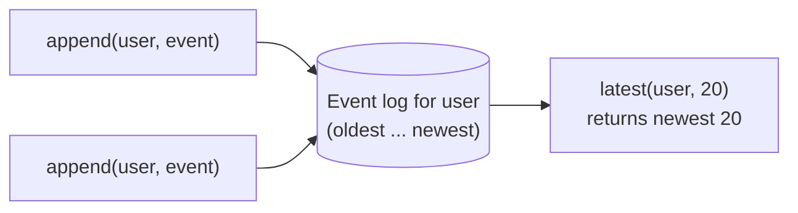

# Events (append-only logs)

An `Events` collection is an **append-only log**: a growing list of immutable
facts under a key. You add events to the end and read the newest ones back. You
never edit or delete an event once it is written.

## What and why

An "append-only log" means exactly two things happen to it:

1. You **append** a new event (it goes on the end).
2. You **read** events back (newest first).

That is it. There is no "update event 5" and no "delete event 3". Each event is a
permanent record of something that happened: "Ada signed the guestbook", "order
1234 was refunded", "user logged in from a new device".

Use an `Events` log when you care about the **history**, not just the latest
state:

- **Activity feeds:** "what happened in this room, newest first".
- **Audit trails:** a tamper-resistant record of every important action.
- **Event sourcing:** treat the log as the source of truth and compute other
  values (totals, summaries, leaderboards) from it.

If you only ever need the *current* value of something (a user's profile, a
shopping cart), use [Documents](./documents.md) instead. If you only need a
running total (likes, page views), use a [Counter](./counters.md). Events are
for keeping the full list of what happened.



## The type

An `Events` collection has two type parameters: the **key** (which log) and the
**event** (what each entry stores).

```ts
Events<K, V>
```

- `K` is the key type: it picks *which* log you are appending to. One key, one
  log. For a per-user activity feed, the key is the user id.
- `V` is the event type: the shape of a single entry. Both `K` and `V` are
  [`@data`](../concepts/types.md) classes so they can be stored as bytes.

You declare it as a `@collection` field inside a `@database` class:

```ts
@data
class UserKey {
  id: string = '';
  constructor(id: string = '') { this.id = id; }
}

@data
class Activity {
  action: string = '';   // 'login', 'post.create', 'comment', ...
  detail: string = '';
  at: u64 = 0;           // unix seconds
}

@database
class FeedDb {
  @collection static activity: Events<UserKey, Activity>;
}
```

The field name (`activity`) names the collection; the class name (`FeedDb`) names
the database. You reach the log through `FeedDb.activity`.

## Operations

There are three operations, exactly matching the [toilscript](../concepts/decorators.md)
API. Their exact signatures:

| Operation | Signature | What it does |
| --- | --- | --- |
| `append` | `append(key: K, event: V): void` | Add one event to the end of the log. |
| `appendOnce` | `appendOnce(key: K, eventId: string, event: V): bool` | Add one event, but only if that `eventId` was never seen before. |
| `latest` | `latest(key: K, limit: i32): V[]` | Read up to `limit` events, newest first. |
| `since` | `since(key: K, limit: i32): V[]` | Read the NEXT batch of events past a `@derive`'s checkpoint, oldest first. For folding a growing log incrementally. |

### `append`

The everyday operation. It adds one event and returns nothing.

```ts
FeedDb.activity.append(
  new UserKey('ada'),
  new Activity('login', 'from Paris', now),
);
```

`append` is a **write**, so you may call it from an action handler (`@post`,
`@put`, `@patch`, `@del`) but not from a read-only `@get`. See
[decorators](../concepts/decorators.md) for what each handler kind may do.

### `appendOnce` (idempotent append)

`appendOnce` adds an event **at most once** for a given id. "Idempotent" means
running it more than once has the same effect as running it once: the extra calls
change nothing.

Why you want this: networks retry. A client (or another service) may send the
same request twice because the first reply got lost. With plain `append`, that
double-delivery writes the event twice. With `appendOnce`, you pass a stable
`eventId` (a string you choose that is unique for that logical event), and the
log records it only once.

```ts
// `orderId` uniquely identifies this order event. If the request is retried,
// the second call is a no-op and the log still has exactly one entry.
const first = FeedDb.activity.appendOnce(
  new UserKey('ada'),
  `order-refunded:${orderId}`,   // the idempotency id
  new Activity('order.refund', orderId, now),
);
// first === true  -> this call appended the event
// first === false -> a previous call already appended it; nothing happened now
```

The return value tells you which happened:

- `true`: this call appended the event (it was the first with that id).
- `false`: a call with the same id already appended it, so this was a no-op.

Pick an `eventId` that is truly unique per event: an order id, a payment id, a
message uuid. Do not reuse one id for two different events, or the second will be
silently dropped as a "duplicate".

### `latest`

Reads the newest events back, up to a limit, newest first.

```ts
const recent = FeedDb.activity.latest(new UserKey('ada'), 20);
// recent[0] is the most recent event, recent[1] the next, ...
```

`latest` is a **scan**: it can walk many rows. Scans are barred on the request
path, so you **cannot** call `latest` from a `@get` or a `@post`. This is a
deliberate guardrail: a log can grow without bound, and a per-request scan would
get slower and more expensive as the log grows.

Instead you scan the log **off** the request path, in a
[`@derive`](../background/derive.md), and publish a small precomputed
[View](./views.md) that your routes read cheaply. The next section shows the full
pattern.

### `since` (incremental read for a `@derive`)

`latest` rescans the tail every time. For a log that grows without bound, that gets slower and slower. `since`
reads only the events you have **not folded yet**: the next batch past a saved cursor, oldest first, up to a
limit. It is how a [`@derive`](../background/derive.md) folds a huge log incrementally instead of rescanning
it from the start on every change.

You do not pass or manage the cursor. The host owns it: it seeds `since` from a durable checkpoint, advances
it as it hands you events, and saves it after your fold's view publish lands. So you just loop until the
batch is empty:

```ts
@derive
rollup(): void {
    const key = new StatsKey('global');
    const view = StatsDb.summary.get(key) ?? new Summary();   // the running view
    let batch = StatsDb.events.since(key, 500);
    while (batch.length > 0) {                                 // drain in bounded batches
        for (let i = 0; i < batch.length; i++) view.apply(batch[i]);
        batch = StatsDb.events.since(key, 500);
    }
    StatsDb.summary.publish(key, view);
}
```

Two rules:

- **`@derive` or `@job` only.** Like `latest`, `since` is a scan, so it is barred on the request path (`@get`
  / `@post`). Calling it there is rejected.
- **Your fold must be idempotent per event.** A rare crash-recovery case (a "healed" event that arrives at an
  older position) makes the host re-read the log from the start that one run, so applying an event twice must
  not change the result. Use set-style updates (`view.byId[e.id] = e.value`), not blind accumulation
  (`view.count += 1`). If your fold cannot be idempotent, use `latest` and recompute instead.

`since` is the efficient path; `latest` (recompute) is the simple path. See [`@derive`](../background/derive.md)
for the full picture.

## Worked example: an activity feed

Here is the whole loop: an action appends an event, a `@derive` folds the log
into a view, and a `@get` serves the view.

```ts
import { Activity } from '../models/Activity';
import { UserKey } from '../models/UserKey';
import { FeedView } from '../models/FeedView';
import { NewActivity } from '../models/NewActivity';

@database
class FeedDb {
  // The source of truth: every activity, appended forever.
  @collection static activity: Events<UserKey, Activity>;
  // The precomputed snapshot the GET serves: the newest 20 activities.
  @collection static feed: View<UserKey, FeedView>;

  // A @derive runs OFF the request path, so it is allowed to scan the log
  // (`latest`) and publish the view. The runtime runs it right after an append,
  // so the view reflects the new event on the next read.
  @derive
  rebuild(): void {
    const key = new UserKey('ada');           // (real code would loop per active user)
    const view = new FeedView();
    view.items = FeedDb.activity.latest(key, 20);
    FeedDb.feed.publish(key, view);
  }
}

@rest('feed')
class Feed {
  // GET reads the precomputed view: a single keyed read, NOT a scan.
  @get('/')
  public list(): FeedView {
    const view = FeedDb.feed.get(new UserKey('ada'));
    return view == null ? new FeedView() : view;
  }

  // POST appends one activity. The @derive republishes `feed` right after.
  @post('/')
  public record(input: NewActivity): FeedView {
    const at = <u64>(Date.now() / 1000);
    FeedDb.activity.append(new UserKey('ada'), new Activity(input.action, input.detail, at));
    // We do NOT scan here (that would be barred). We just acknowledge; the GET
    // serves the updated list from the view the derive rebuilds.
    return new FeedView();
  }
}
```

The two `@data` models:

```ts
@data
export class Activity {
  action: string = '';
  detail: string = '';
  at: u64 = 0;
}

@data
export class FeedView {
  items: Activity[] = [];
}
```

The key idea: the **log** is the durable history, and the **view** is a small,
read-cheap snapshot derived from it. Reads hit the view; the log grows quietly in
the background.

## Ordering and consistency

ToilDB is a **worldwide** database: your data lives in many regions at once. A
few honest details about what that means for events:

- **Ordering within a log is stable.** Each key (each log) has one "home" location
  where appends are serialized and stamped with an increasing sequence number. So
  `latest` always returns a consistent newest-first order for that key.
- **`latest` is newest first.** Index `0` is the most recent event.
- **Reads can lag slightly across regions.** An append is applied at the log's
  home first, then copied out to other regions in the background (this is called
  *asynchronous replication*, and the result is *eventual consistency*: given a
  little time, every region converges to the same log). A read served from a far
  region may briefly miss the very newest event. A `@derive` runs right after the
  append that triggered it, so the view it publishes reflects that write.
- **`appendOnce` dedups by your id.** The at-most-once guarantee is anchored to
  the `eventId` you pass, so retries are safe even across a flaky network.
- **A log grows without bound.** Appending never shrinks it. Keep events small,
  and read them through a bounded `latest(key, N)` in a derive rather than trying
  to hold the whole log in memory.

## Gotchas

- **You cannot read the log from a route.** `latest` is a scan and is only legal
  in a `@derive` or a `@job`. If you try to call it from a `@get`/`@post`, the
  compiler rejects it. Read a [View](./views.md) from your route instead.
- **Events are immutable.** There is no "edit" or "delete an event". If a fact
  changes, append a new event that records the change (for example, an
  `order.refund` event, not an edit to the original `order.create`).
- **Choose `eventId` carefully for `appendOnce`.** It must be unique per logical
  event. Reusing an id drops the new event as a duplicate.
- **Do not treat a counter as a log.** A [Counter](./counters.md) gives you a
  running total but forgets the individual events. If you need the list, use
  `Events`.

## Related

- [Documents](./documents.md): mutable, one value per key (edit in place).
- [Counters](./counters.md): a single running total per key.
- [Views](./views.md): the precomputed snapshot your routes read.
- [`@derive`](../background/derive.md): folds an event log into a View, off the
  request path.
- [Data types (`@data`)](../concepts/types.md): how keys and events are stored.
- [Decorators](../concepts/decorators.md): which handler kinds may append vs scan.
