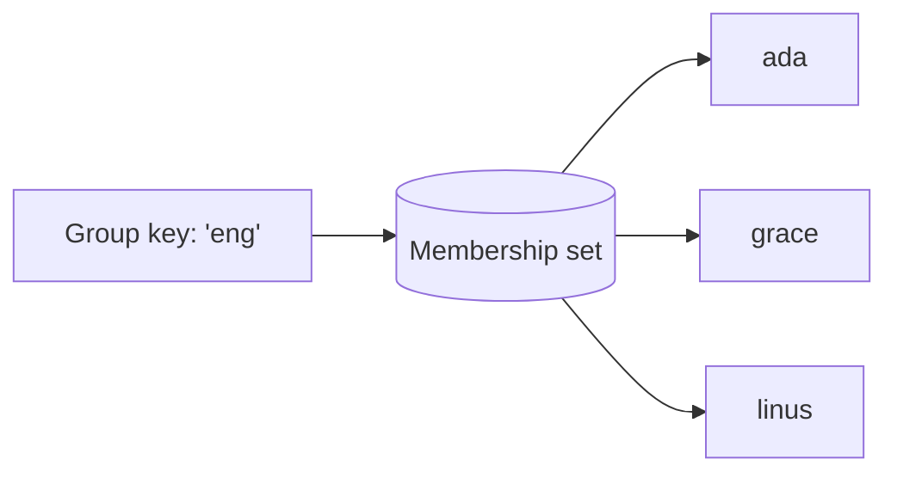

# Membership (sets and relationships)

A `Membership` collection stores **sets**: unordered groups of members under a
key. You add and remove members, ask whether a member is in the set, and list a
set's members. It is the natural fit for many-to-many relationships like group
members, followers, and tags.

## What and why

A "set" is a collection with no duplicates and no order: a member is either in it
or not. `Membership` gives you one set per key. The key names the set; each member
is one item in it.

This maps directly onto **many-to-many relationships**, where each thing on one
side can relate to many things on the other:

- **Group members:** the key is a group id, the members are user ids.
- **Followers:** the key is a user id, the members are the ids of their followers.
- **Tags:** the key is an article id, the members are tag names.
- **Access control:** the key is a resource id, the members are the users allowed
  in.

You could try to store these as an array field inside a [Document](./documents.md)
(for example `group.memberIds: string[]`). That works for **small, rarely-changed**
sets, but it has real limits:

| | Array in a Document | `Membership` set |
| --- | --- | --- |
| Add/remove one member | Read the whole array, edit it, write it all back | One direct `add`/`remove`, no read-modify-write |
| Concurrent edits | Two writers can clobber each other's array | Each `add`/`remove` is its own operation |
| Big sets | The whole array is loaded on every read/write | Members are stored separately; you read a bounded page |
| "Is X a member?" | Load the array and search it | One direct `contains` check |

Rule of thumb: a **handful** of stable items (a user's two or three roles) is fine
as an array in a Document. A set that **grows** or is **edited concurrently**
(followers, group members, tags across many articles) should be a `Membership`.



## The type

```ts
Membership<K, M>
```

- `K` is the key type: it picks *which* set. For group membership, the key is the
  group id.
- `M` is the member type: the shape of one member. For user membership, that is a
  user id. Both are [`@data`](../concepts/types.md) classes.

Declare it as a `@collection` field on a `@database` class:

```ts
@data
class GroupKey {
  group: string = '';
  constructor(group: string = '') { this.group = group; }
}

@data
class Member {
  userId: string = '';
  constructor(userId: string = '') { this.userId = userId; }
}

@database
class GroupsDb {
  @collection static members: Membership<GroupKey, Member>;
}
```

## Operations

Four operations, matching the toilscript API exactly. Exact signatures:

| Operation | Signature | What it does |
| --- | --- | --- |
| `contains` | `contains(key: K, member: M): bool` | Is `member` in the set? |
| `add` | `add(key: K, member: M): void` | Put `member` in the set (idempotent). |
| `remove` | `remove(key: K, member: M): void` | Take `member` out of the set (idempotent). |
| `list` | `list(key: K, limit: i32): M[]` | Up to `limit` members of the set. |

### `contains`

A direct membership check. It is a keyed read, so it is allowed from any handler,
including a read-only `@get`.

```ts
if (GroupsDb.members.contains(new GroupKey('eng'), new Member('ada'))) {
  // ada is in the 'eng' group
}
```

### `add` and `remove`

Both are **writes**, so you call them from an action handler (`@post`, `@put`,
`@patch`, `@del`), not from a `@get`. Both are **idempotent**: "idempotent"
means doing it again has no extra effect.

- `add` on a member already in the set: no change, no error.
- `remove` on a member not in the set: no change, no error.

```ts
GroupsDb.members.add(new GroupKey('eng'), new Member('ada'));     // ada joins
GroupsDb.members.add(new GroupKey('eng'), new Member('ada'));     // no-op, still one 'ada'
GroupsDb.members.remove(new GroupKey('eng'), new Member('linus')); // linus leaves (or no-op)
```

Because they are idempotent, you do not need to check `contains` before calling
them. Just `add` to join and `remove` to leave.

### `list`

Returns up to `limit` members of a set.

```ts
const roster = GroupsDb.members.list(new GroupKey('eng'), 100);
```

`list` is a **scan** (it can walk many rows), so it is barred on the request
path: you **cannot** call it from a `@get` or a `@post`. Like reading a whole
event log, listing a whole set belongs off the request path, in a
[`@derive`](../background/derive.md) or a `@job`, which publishes a
[View](./views.md) your routes read. The [worked example](#worked-example-group-membership)
below shows this.

`list` returns up to `limit` members. A set can be larger than one page, so treat
the result as "a bounded page of members", not necessarily "every member".

## Worked example: group membership

A user joins or leaves a group from a route; a derive lists the roster into a
view; a route reads the view. Membership checks happen directly in the route.

```ts
import { GroupKey } from '../models/GroupKey';
import { Member } from '../models/Member';
import { Roster } from '../models/Roster';
import { JoinRequest } from '../models/JoinRequest';

@database
class GroupsDb {
  // The set: who is in each group.
  @collection static members: Membership<GroupKey, Member>;
  // A precomputed roster for the GET (listing is a scan, barred on routes).
  @collection static roster: View<GroupKey, Roster>;

  @derive
  rebuild(): void {
    const key = new GroupKey('eng');
    const r = new Roster();
    r.users = GroupsDb.members.list(key, 500); // scan, allowed in a derive
    GroupsDb.roster.publish(key, r);
  }
}

@rest('groups')
class Groups {
  // GET the roster from the view (a keyed read, not a scan).
  @get('/eng')
  public list(): Roster {
    const r = GroupsDb.roster.get(new GroupKey('eng'));
    return r == null ? new Roster() : r;
  }

  // Direct membership check: `contains` is a keyed read, legal in a GET.
  @get('/eng/is-member')
  public isMember(userId: string): bool {
    return GroupsDb.members.contains(new GroupKey('eng'), new Member(userId));
  }

  // Join: `add` is idempotent, so joining twice is harmless.
  @post('/eng/join')
  public join(input: JoinRequest): bool {
    GroupsDb.members.add(new GroupKey('eng'), new Member(input.userId));
    return true; // the @derive rebuilds the roster view right after
  }

  // Leave: `remove` is idempotent, so leaving when not a member is harmless.
  @post('/eng/leave')
  public leave(input: JoinRequest): bool {
    GroupsDb.members.remove(new GroupKey('eng'), new Member(input.userId));
    return true;
  }
}
```

The models:

```ts
@data
export class Member {
  userId: string = '';
}

@data
export class Roster {
  users: Member[] = [];
}
```

The split is the point: `contains`/`add`/`remove` act on a single member and are
legal on the request path; `list` scans the whole set and lives in a derive that
feeds a view.

## Consistency

- **Add and remove serialize at the set's home.** Each set key has one home
  location where its writes are applied in order, so an `add` followed by a
  `remove` of the same member lands in that order and the set ends up correct.
- **Reads can lag slightly across regions.** ToilDB is worldwide. A change made
  at a set's home is copied to other regions in the background (asynchronous
  replication, giving eventual consistency: every region converges after a short
  delay). A `contains` or a `list` served from a far region may briefly miss a
  just-made change.
- **`add`/`remove` are idempotent**, so retries are safe: re-adding an existing
  member or re-removing an absent one does nothing.
- **A set can grow without bound.** Adding never shrinks it. Read it through a
  bounded `list(key, N)` in a derive, not all at once.

## Gotchas

- **You cannot `list` from a route.** `list` is a scan, legal only in a `@derive`
  or `@job`. To show a roster on a page, publish it to a [View](./views.md) from a
  derive and `get` that view in the route.
- **`list` returns a bounded page.** A large set may have more members than your
  `limit`. Do not assume the returned array is the entire set.
- **Sets are unordered.** Do not rely on the order `list` returns members in.
- **Use `Membership` for growth or concurrency.** A small, stable set is fine as
  an array in a Document. Reach for `Membership` when the set grows, is edited
  concurrently, or you frequently ask "is X a member?".

## Related

- [Documents](./documents.md): when a small array field is enough (and when it is
  not).
- [Views](./views.md): where a roster/list belongs so routes can read it cheaply.
- [`@derive`](../background/derive.md): runs `list` off the request path.
- [Data types (`@data`)](../concepts/types.md): how set keys and members are stored.
- [Decorators](../concepts/decorators.md): which handler kinds may add/remove vs scan.
