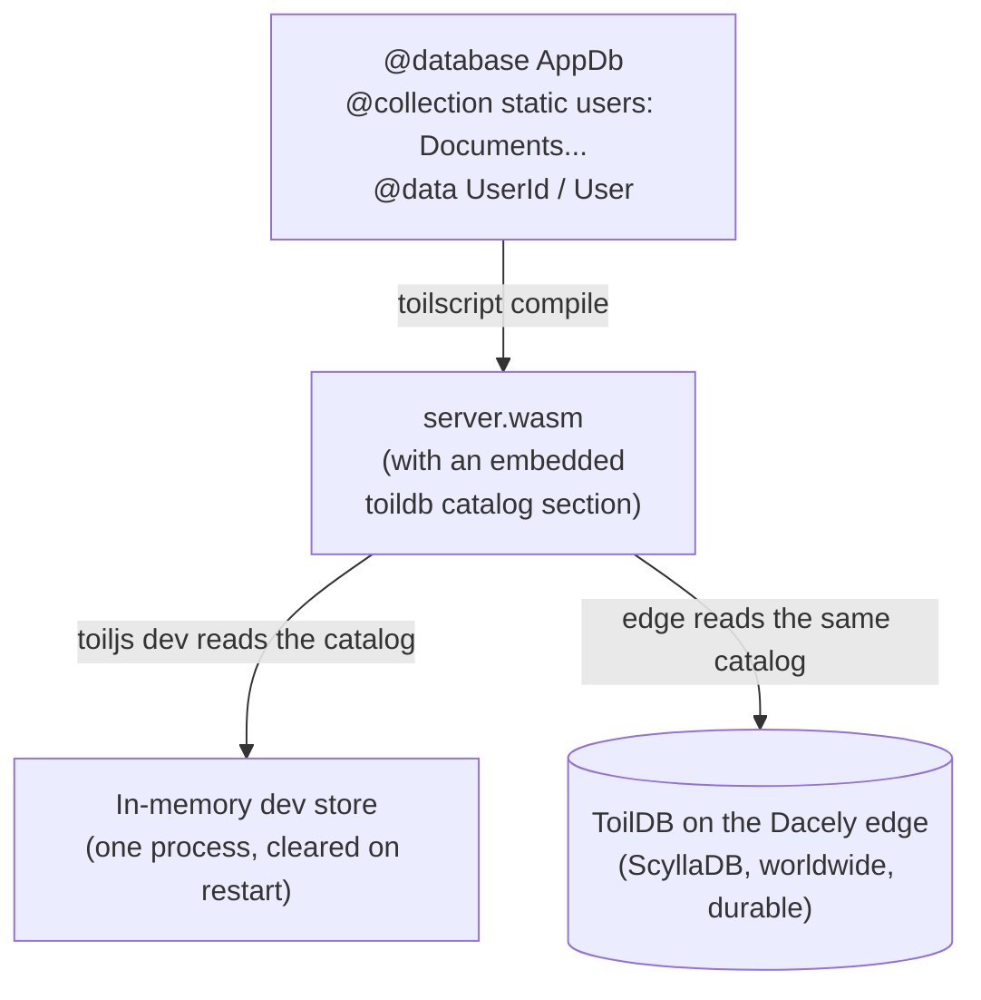

# Declaring a database

You set up ToilDB by **declaring** it in code: a `@database` class listing your collections, plus the `@data` key and value types those collections use. There is no schema file, no migration command, and no connection string.

## What and why

A **database declaration** tells toiljs three things at compile time: which collections exist, which family each one is, and what key and value types it stores. The compiler bakes that list into your server's WebAssembly, and both the dev server and the production edge read it back to set up your collections automatically. You declare; the platform provisions.

Reach for this on day one: before you can read or write any data, you need a `@database` with at least one `@collection`.

## How: the three pieces

A working database is always these three pieces together.

1. **`@data` key and value types.** Plain classes, tagged `@data`, that describe what you store.
2. **A `@database` class** whose static fields are `@collection`s, each typed by a family.
3. **A handler** (a `@rest` route or an RPC method) that reads and writes those collections.

Here is a complete, minimal example: a store of users you look up by id.

```ts
// A @data key: how you address one user.
@data
class UserId {
  id: string = '';
  constructor(id: string = '') { this.id = id; }
}

// A @data value: what you store for each user.
@data
class User {
  id: string = '';
  name: string = '';
  score: u64 = 0;
}

// The database declaration. Each @collection is one collection,
// typed by its family (here, Documents) with <Key, Value>.
@database
class AppDb {
  @collection static users: Documents<UserId, User>;
}

// A route that reads and writes the collection.
@rest('users')
class Users {
  @get('/:id')
  public getUser(ctx: RouteContext): User {
    const user = AppDb.users.get(new UserId(ctx.param('id')));
    return user == null ? new User() : user;
  }

  @post('/')
  public createUser(input: User): User {
    AppDb.users.create(new UserId(input.id), input);
    return input;
  }
}
```

That is the whole setup. Run `toiljs dev` and `AppDb.users` works immediately.

### The `@data` types

Both the key and the value are `@data` classes. `@data` is what makes a class storable: the compiler synthesizes a binary codec (pack to bytes, unpack from bytes) so ToilDB can persist it. The rules that matter here:

- **Give every field a default** (`= ''`, `= 0`, and so on). The decoder builds an empty instance and fills it, so it needs defaults.
- **A value type must be default-constructible** (creatable with `new User()` and no arguments). Keys often add a convenience constructor, as `UserId` does above, so you can write `new UserId('abc')`.
- Fields may be numbers (`u8`..`u256`, `i8`..`i256`, `f32`, `f64`), `bool`, `string`, another `@data` class, or an array of any of these.

The full reference, including how the same type becomes a typed client type, is on the [data types page](../backend/data.md).

### The `@database` class and `@collection` fields

```ts
@database
class AppDb {
  @collection static users: Documents<UserId, User>;
  @collection static likes: Counter<UserId>;
}
```

- `@database` marks the class as a database. You can have more than one `@database` class; each is a separate namespace of collections.
- Each `@collection` is one collection. Declare it as a **`static`** field with **no initializer**: you write the type, and the compiler wires up the actual handle for you.
- The field's **type is its family**: `Documents<K, V>`, `Counter<K>`, `Events<K, V>`, `Unique<K, V>`, `Membership<K, M>`, `Capacity<K>`, or `View<K, V>`. The compiler reads the family straight from this type, so getting it right here is how you pick a family (see [Choosing a family](./README.md#choosing-a-family-the-decision-guide)).

You reach a collection through the class, statically: `AppDb.users.get(...)`, `AppDb.likes.add(...)`. There is nothing to instantiate.

### Reaching collections from a handler

Any backend function can read and write collections by referencing them on the database class. What that function is allowed to do depends on its **kind**, covered next.

## How access is gated: `@query`, `@action`, and friends

ToilDB will not let every function do everything. Each backend function runs as one **function kind**, and each kind is allowed a different slice of database operations. This is a safety rail: a read-only endpoint physically cannot write, and an expensive scan cannot run on the hot request path.

You rarely write these decorators by hand, because routes get a sensible kind automatically:

- A **`@get`** route (a safe, read-only HTTP method) runs as a **Query**.
- A **`@post`** route (a mutating method) runs as an **Action**.
- A plain RPC **`@remote`** method defaults to a **Query** (read-only) because it has no HTTP method to infer from. Tag it `@action` if it writes.

You can override the default with `@query` or `@action` on the method when the automatic choice is wrong (for example, a `@get` that genuinely needs to write, though that is unusual).

What each kind may do:

| Kind | Set by | May do | May **not** do |
| --- | --- | --- | --- |
| **Query** | `@get`, plain `@remote`, or `@query` | Point reads: `get`, `getMany`, `exists`, `lookup`, `contains`, counter `get`, view `get`, capacity `available`. | Any write. Any scan. |
| **Action** | `@post` or `@action` | Everything a Query can, plus bounded writes: `create`, `patch`, `delete`, `getDelete`, `enqueue`, `append`, counter `add`, membership `add`/`remove`, unique `claim`/`release`, capacity `reserve`/`confirm`/`cancel`. | Scans. Publishing a View. |
| **Derive / Job** | `@derive` / `@job` (background work) | Reads including **scans** (`latest`, membership `list`), plus `publish` a View. | (Run off the request path; see below.) |

Two rules trip people up, so they are worth stating plainly:

- **Scans are barred from request handlers.** Reading "the newest N events" (`events.latest`) or "the members of this set" (`membership.list`) can fan out across many rows, so a `@get` or `@post` cannot call them. Do the scan in a `@derive` (a small function that recomputes a snapshot off the request path) and have the request read the snapshot. See [Views](./views.md) and [@derive](../background/derive.md).
- **Only a `@derive` or `@job` may `publish` a View.** Requests read views; background work writes them.

Both gates are enforced twice: the compiler rejects an illegal call at build time, and the edge rejects it again at runtime, so a hand-edited module cannot sneak past. For the decorator catalog, see [Decorators](../concepts/decorators.md).

## No manual provisioning: how it actually gets set up

You never create a table or run a migration. Here is the machinery, so the "it just works" is not a mystery.

When toilscript compiles your backend, it scans every `@database` class and writes a small catalog into the `.wasm` file: for each collection, its name, its family, its key and value type names, and the value's schema version. This catalog rides *inside* the compiled module.

Then, wherever your backend runs, the host reads that catalog once at startup and builds your collections to match:

- Under **`toiljs dev`**, the host is an in-process, in-memory emulator. It reads the catalog and stands up all seven families in memory. This is a development store: single process, single tenant, and cleared when you restart. It exists so you can build and test against real ToilDB behavior with no services to run.
- On the **Dacely edge**, the host is the real ToilDB, backed by a globally distributed ScyllaDB cluster. It reads the *same* catalog and serves the *same* operations, now durable and worldwide.

Because both sides read the same catalog, **the same code runs unchanged in dev and in production.** There is no connection string to swap and no provisioning step to run.



## Gotchas

- **Declare collections as `static` fields with no initializer.** Do not try to `new` a collection or assign a handle yourself; the compiler owns that.
- **Every `@data` field needs a default, and value types must be default-constructible.** A missing default fails to compile.
- **Dev data is not durable.** The `toiljs dev` store lives in memory and resets on restart. Do not rely on it to persist across dev runs; that is what the edge is for.
- **Changing a `@data` type is a format change.** Reordering fields or changing a field's type changes the stored layout. Add new fields at the end, and use a migration when you evolve a stored type. See [data types](../backend/data.md).
- **Pick the family at the type.** The family is read from the collection's declared type, so `Counter<K>` versus `Documents<K, V>` is a real, load-bearing choice, not a hint. Revisit [Choosing a family](./README.md#choosing-a-family-the-decision-guide) if unsure.

## Related

- [ToilDB overview](./README.md): the seven families and how to choose.
- [Documents](./documents.md): the general-purpose record family (a good first collection).
- [Data types (`@data`)](../backend/data.md): keys, values, and the codec.
- [Decorators](../concepts/decorators.md): `@database`, `@collection`, `@query`, `@action`, `@derive`.
- [@derive](../background/derive.md): recompute snapshots and run scans off the request path.
