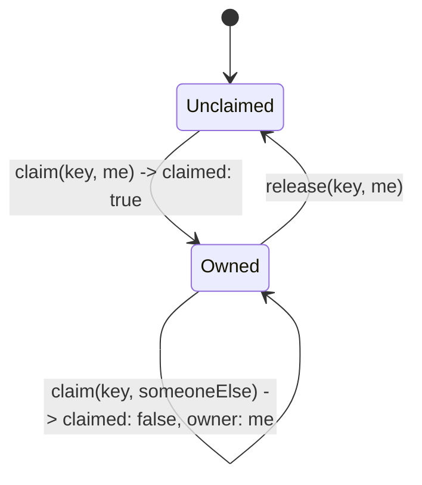

# Unique

The **Unique** family enforces that a value is claimed by only one owner across the entire world. It is how you make usernames, email addresses, and URL slugs one-of-a-kind, safely, even when two people try to grab the same one at the same instant.

## What and why

A **Unique collection** maps a `@data` **claim key** (the thing that must be unique, like a username) to a `@data` **owner value** (who or what claimed it, like a user id). At any moment a claim key is either **unclaimed** or **owned by exactly one owner**. The family gives you three operations: look up who owns a key, claim a key, and release it.

Reach for Unique whenever a value must be globally singular:

- usernames or handles
- email addresses
- URL slugs or workspace names
- any "reserve this name for me" scenario

Why not just check a Documents record first? Because a check-then-write has a race: two requests can both check "is `alice` free?", both see yes, and both create it. Unique closes that gap. The claim is decided at the key's single **home** (see [consistency](./README.md#eventual-consistency-in-plain-words)), where claims are processed one at a time, so exactly one of the two racers wins.

Declare one by typing a `@collection` as `Unique<ClaimKey, OwnerValue>`:

```ts
@data
class Username {
  name: string = '';
  constructor(name: string = '') { this.name = name; }
}

@data
class OwnerId {
  userId: string = '';
  constructor(userId: string = '') { this.userId = userId; }
}

@database
class AppDb {
  @collection static usernames: Unique<Username, OwnerId>;
}
```

## The operations

`K` is the claim-key type, `V` the owner value type.

| Operation | Signature | Returns | Use it to |
| --- | --- | --- | --- |
| `lookup` | `lookup(key: K): V \| null` | the current owner, or `null` if unclaimed | find out who owns a name |
| `claim` | `claim(key: K, value: V): ClaimResult<V>` | a `ClaimResult` (see below) | try to take a name for an owner |
| `release` | `release(key: K, value: V): void` | nothing; **traps** if you are not the owner | give a name back |

`lookup` is a read, so it works in any function. `claim` and `release` are writes, so they need an **Action** (a `@post` route or an `@action`); see [Setup](./setup.md#how-access-is-gated-query-action-and-friends).

### `ClaimResult`

`claim` returns a small object that tells you what happened:

```ts
class ClaimResult<V> {
  claimed: bool;      // true if YOU own the key now
  owner: V | null;    // when claimed is false, who owns it instead
}
```

- **`claimed == true`**: you own the key. This covers both a fresh claim and an **idempotent re-claim**: if you claim a key you already own (same owner value), you still get `true`, so retrying a claim is safe. `owner` is `null` in this case.
- **`claimed == false`**: someone else got there first. `owner` is their value, so you can tell the user "that name is taken."

### `lookup`

`lookup` just reads the current owner without changing anything:

```ts
const owner = AppDb.usernames.lookup(new Username('alice'));
if (owner == null) {
  // 'alice' is free
} else {
  // owner.userId currently holds 'alice'
}
```

Note that `lookup` is subject to [eventual consistency](./README.md#eventual-consistency-in-plain-words): a claim made moments ago in another region may not show up in a far-away `lookup` yet. Do not use `lookup` as your uniqueness guard. `lookup` is for display ("this name is taken by ..."); the real guarantee comes from `claim`, which is decided at the home and cannot race.

### `claim`

`claim` is the operation that actually enforces uniqueness. You pass the key and the owner value:

```ts
const result = AppDb.usernames.claim(new Username('alice'), new OwnerId('u_123'));
if (result.claimed) {
  // 'alice' is now yours
} else {
  // taken; result.owner is the current owner
}
```

Because claims are serialized at the key's home, this is race-safe. If two requests anywhere in the world call `claim('alice', ...)` at the same moment, the home applies them in order: the first gets `claimed: true`, the second gets `claimed: false` with the first as `owner`. There is no window where both win.

### `release`

`release` gives a claim back so the key becomes available again. Only the **current owner** may release: you pass both the key and the owner value, and if that value is not the current owner, `release` **traps** (aborts the request). This prevents one user from releasing another user's name.

```ts
AppDb.usernames.release(new Username('alice'), new OwnerId('u_123'));
```

Release when a name is being changed or an account is deleted, so the name returns to the pool.

## The claim / release lifecycle

A claim is a small state machine: unclaimed, owned, and back to unclaimed.



The key insight: **claiming is the guard, releasing is cleanup.** You claim to reserve, you release to free. A claim that is never released stays owned forever (there is no automatic expiry; if you want time-limited holds, that is what the [Capacity](./capacity.md) family's TTL reservations are for).

## Worked example: reserving a username on signup

The safe signup pattern is: claim the username first, then create the account, and if creating the account fails, release the claim so the name is not stranded.

```ts
import { Response } from 'toiljs/server/runtime';

@data
class Username {
  name: string = '';
  constructor(name: string = '') { this.name = name; }
}

@data
class OwnerId {
  userId: string = '';
  constructor(userId: string = '') { this.userId = userId; }
}

@data
class UserId {
  id: string = '';
  constructor(id: string = '') { this.id = id; }
}

@data
class User {
  id: string = '';
  username: string = '';
}

@data
class SignupInput {
  username: string = '';
  userId: string = '';
}

@database
class AppDb {
  @collection static usernames: Unique<Username, OwnerId>;
  @collection static users: Documents<UserId, User>;
}

@rest('signup')
class Signup {
  // POST /signup  (Action: may claim and write)
  @post('/')
  public signup(input: SignupInput): Response {
    const owner = new OwnerId(input.userId);

    // 1. Claim the username. This is the uniqueness guard.
    const claim = AppDb.usernames.claim(new Username(input.username), owner);
    if (!claim.claimed) {
      return Response.text('username taken', 409);
    }

    // 2. Create the account. If this fails, undo the claim so the name is free.
    const user = new User();
    user.id = input.userId;
    user.username = input.username;
    if (!AppDb.users.create(new UserId(input.userId), user)) {
      AppDb.usernames.release(new Username(input.username), owner);
      return Response.text('could not create account', 409);
    }

    return Response.json(user.toJSON().toString());
  }
}
```

Two things make this correct:

- **The claim happens before the account write**, so uniqueness is decided up front.
- **The claim is released if the follow-up write fails**, so a failed signup does not permanently burn a username.

Because `claim` is idempotent for the same owner, a client that retries the whole request after a network hiccup does not get a false "taken" error: the second `claim('alice', u_123)` returns `claimed: true` again.

## Consistency notes

- **`claim` and `release` are strongly consistent at the key's home.** Two callers can never both own the same key; the home serializes claims. This is the whole point of the family.
- **`lookup` is eventually consistent.** It reads a possibly-nearby copy, so a very recent claim from elsewhere may not appear yet. Never gate uniqueness on `lookup`; gate it on the result of `claim`.
- **Claims do not expire.** A claim stays until someone releases it. Use [Capacity](./capacity.md) if you need holds that auto-release after a timeout.

## Gotchas

- **Do not use `lookup` as the uniqueness check.** Its answer can be stale. Call `claim` and trust its `claimed` flag.
- **Release on failure and on account deletion.** A claim you forget to release stays owned forever, quietly blocking that name.
- **`release` traps for a non-owner.** Pass the correct owner value, or you abort the request. If you are not sure you own it, `lookup` first (for display) but expect `release` to enforce ownership regardless.
- **The owner value is data you choose.** Store enough in it (a user id, say) to know who holds the claim, so you can display and release it later.

## Related

- [ToilDB overview](./README.md): the seven families and how to choose.
- [Setup](./setup.md): declaring the collection and which function kinds may claim.
- [Documents](./documents.md): the account record you create alongside a claim.
- [Capacity](./capacity.md): time-limited holds that auto-release (a different kind of "reserve").
- [Data types (`@data`)](../backend/data.md): the claim key and owner value.
