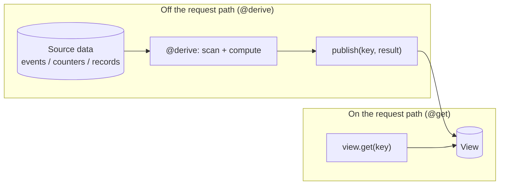

# Views (materialized views)

A `View` collection is a **precomputed, read-optimized result** that you publish
once and read many times. Reads are a single cheap keyed lookup, no scanning, no
recomputing.

## What and why

A "materialized view" is a fancy name for a simple idea: instead of computing an
answer every time someone asks, you compute it **once**, store the finished
answer, and just hand it out on each request. "Materialized" means the result is
made real and saved (as opposed to computed on the fly). "View" means it is a
read-friendly projection of your underlying data.

Think of a leaderboard. Computing "the top 10 players by score" means scanning
every player and sorting. You do not want to do that on every page load. So you
compute it in the background, save the finished top-10 list as a view, and every
page load just reads that saved list. Fast, cheap, and it does not get slower as
you add players.

Use a `View` when:

- A page needs a result that is **expensive to compute** (a scan, a sort, a fold
  over many rows).
- That result is **read far more often than it changes** (a home page, a feed, a
  leaderboard, a "latest N" list, a rendered summary).

The rule of thumb: if a route wants "the newest N of something" or "the top N of
something", that is a scan, and scans are barred on the request path. A `View`
is how you serve that result without scanning per request.



## The type

A `View` has two type parameters: the **key** (which view) and the **value**
(the precomputed result).

```ts
View<K, V>
```

- `K` is the key type: it picks *which* view to read or publish. For a single
  global leaderboard, the key can be a fixed constant like `'main'`.
- `V` is the value type: the finished result you serve. Both are
  [`@data`](../concepts/types.md) classes.

Declare it as a `@collection` field inside a `@database` class, alongside the
sources it is built from:

```ts
@database
class BoardDb {
  @collection static scores: Events<GameKey, ScoreEvent>;  // a source
  @collection static board: View<GameKey, Leaderboard>;    // the view
}
```

## Operations

A `View` has exactly two operations you use directly (plus `require`, a
convenience wrapper). Exact signatures:

| Operation | Signature | What it does |
| --- | --- | --- |
| `get` | `get(key: K): V \| null` | Read the published view, or `null` if nothing has been published yet. |
| `require` | `require(key: K): V` | Like `get`, but traps (aborts the request) if nothing is published. |
| `publish` | `publish(key: K, value: V): void` | Overwrite the view for `key` with a fresh result. |

### `get`

A plain keyed read. It is cheap and is allowed from **any** handler, including a
read-only `@get` route.

```ts
const board = BoardDb.board.get(new GameKey('main'));
if (board == null) {
  // Nothing published yet (e.g. brand-new game). Serve an empty default.
  return new Leaderboard();
}
return board;
```

Always handle the `null` case: until a `@derive` (or `@job`) has published at
least once, `get` returns `null`.

### `publish`

Overwrites the stored view with a new value. This is how the view gets its
content.

```ts
BoardDb.board.publish(new GameKey('main'), freshBoard);
```

`publish` is **restricted**: you may only call it from a
[`@derive`](../background/derive.md) or a `@job` (a background task), never from a
request handler (`@get`/`@post`/...). The compiler enforces this, and so does the
edge at runtime. The reason: a view is meant to be maintained off the request
path from the source of truth, not written ad hoc by whichever request happens to
run.

### How `publish` differs from a Documents write

A `View`'s `publish` looks like writing a value, but it is not the same as a
[Documents](./documents.md) `patch`/`create`. The differences matter:

| | `Documents` write (`create` / `patch`) | `View` `publish` |
| --- | --- | --- |
| Who may call it | Any action handler (`@post`, ...) | Only a `@derive` or `@job` |
| Meaning | The record IS the source of truth | The view is a **copy** derived from a source |
| Version control | You may version-check (optimistic concurrency) | The host assigns the version; a later publish always wins (last writer wins) |
| Read path | Standard keyed read | A read-optimized fast path (views are heavily read) |
| Who owns correctness | You (each writer edits the true value) | The derive (it recomputes from the source, so the view always converges) |

In short: a Document is the truth; a View is a saved snapshot of a computation
over the truth. If the view is ever wrong or stale, the derive just recomputes and
republishes it. You never hand-edit a view from a route.

## Automatic maintenance with `@derive`

You rarely call `publish` by hand. The normal pattern is a
[`@derive`](../background/derive.md): a method on your `@database` class that
reads the sources, builds the value, and publishes it. The runtime runs it for
you:

- **Right after a write to a source.** When a request writes one of the
  database's source collections (an `append`, a `counter.add`, a record write),
  the database's derives run right after the response is produced. So the view
  reflects the new data on the next read.
- **On box load.** When the server starts or reloads, the views are rebuilt from
  their sources before the first read is served.

You never call a derive yourself, and a derive's own `publish` never re-triggers
it. See [`@derive`](../background/derive.md) for the full rules.

## Worked example: a leaderboard

A game appends score events; a derive folds them into a top-10 list; a route
serves that list with a single `get`.

```ts
import { ScoreEvent } from '../models/ScoreEvent';
import { Leaderboard } from '../models/Leaderboard';
import { GameKey } from '../models/GameKey';
import { NewScore } from '../models/NewScore';

@database
class BoardDb {
  // The source of truth: every score, appended as it happens.
  @collection static scores: Events<GameKey, ScoreEvent>;
  // The materialized view: the current top entries, ready to serve.
  @collection static board: View<GameKey, Leaderboard>;

  // Off the request path: scan the recent scores, sort, publish the top 10.
  @derive
  rebuild(): void {
    const key = new GameKey('main');
    const recent = BoardDb.scores.latest(key, 500); // a scan, allowed in a derive
    const board = new Leaderboard();
    board.entries = topTen(recent);                 // your own sort/aggregate
    BoardDb.board.publish(key, board);
  }
}

@rest('leaderboard')
class LeaderboardRoutes {
  // GET reads the precomputed view: one keyed read, no scan.
  @get('/')
  public top(): Leaderboard {
    const board = BoardDb.board.get(new GameKey('main'));
    return board == null ? new Leaderboard() : board;
  }

  // POST records a score. The @derive rebuilds `board` right after.
  @post('/')
  public submit(input: NewScore): Leaderboard {
    BoardDb.scores.append(new GameKey('main'), new ScoreEvent(input.player, input.score));
    return new Leaderboard(); // ack; the GET serves the updated board from the view
  }
}
```

The models:

```ts
@data
export class ScoreEvent {
  player: string = '';
  score: u64 = 0;
}

@data
export class Leaderboard {
  entries: ScoreEvent[] = [];
}
```

A "latest N" view is the same shape: the derive calls `latest(key, N)` and
publishes the list. See the [Events](./events.md) page for that variant end to
end.

## Consistency

- **Last writer wins.** The host assigns each `publish` a version, and a later
  publish always supersedes an earlier one. Because a derive recomputes the whole
  view from the source of truth, the view converges to a correct snapshot; you do
  not need to coordinate concurrent publishes.
- **A view can be briefly stale.** ToilDB is worldwide, and a view is published
  at its home then copied to other regions in the background (asynchronous
  replication). A read from a far region can lag the newest publish by a moment.
  This is usually fine for the things views hold (feeds, leaderboards, summaries):
  a leaderboard that is a second behind is still a good leaderboard.
- **`get` returns `null` until the first publish.** Always default the empty case.

## Gotchas

- **`publish` is derive/job only.** You cannot publish from a route. If you need
  to update a view in response to a request, write the *source* (append an event,
  add to a counter) from the action and let the `@derive` republish.
- **Handle `null` from `get`.** A never-published view reads as `null`, not as an
  empty value. Return a sensible default.
- **A view is a copy, not the truth.** Never store data *only* in a view. Keep
  the real data in a source family (Documents, Events, Counters) and treat the
  view as a disposable, recomputable projection.
- **Keep views bounded.** A view value is read whole on every request, so build
  it from a bounded read (top N, latest N, a total), not the entire history.

## Related

- [`@derive`](../background/derive.md): the normal way a view is maintained.
- [Events](./events.md): the append-only log a view is often folded from.
- [Counters](./counters.md): another common source for a view (totals).
- [Documents](./documents.md): mutable source-of-truth records (and how a write
  differs from a publish).
- [Data types (`@data`)](../concepts/types.md): how view keys and values are stored.
