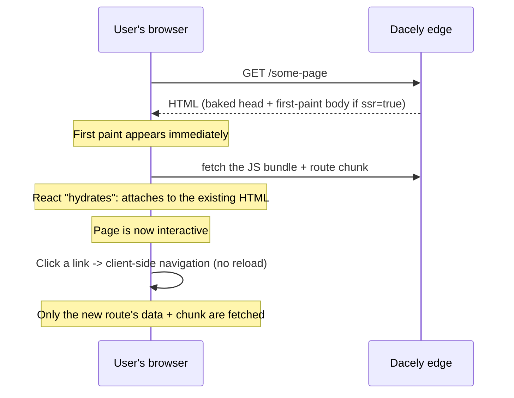

# Frontend

Your toiljs frontend is a React app with file-based routing that runs in the browser, and can also be rendered ahead of time on the server for a fast first paint and good SEO.

If you have written React before, everything here is familiar React: components, hooks, JSX. toiljs adds the parts a plain React app makes you wire up yourself: a router, data loading, `<head>` and SEO management, an image component, and a typed client for calling your backend. You get them for free and you do not import most of them, they live on a global called `Toil`.

## What "frontend" means here

A toiljs project has three top-level folders. The frontend is the first two:

- **`client/`** is your React app: pages, components, and styles. This is what runs in the user's browser.
- **`shared/`** is a typed bridge that toiljs generates for you. It lets the browser call your backend with full type safety (see [Fetching data](./data-fetching.md)).
- **`server/`** is your backend. It compiles to WebAssembly and runs on the edge. That is a separate section (see [Backend](../backend/README.md)).

Inside `client/`, the important pieces are:

| Path | What it is |
| --- | --- |
| `client/toil.tsx` | The entry file. It imports your routes and global styles and mounts the app. |
| `client/routes/` | Your pages. One file per URL (file-based routing). See [Routing](./routing.md). |
| `client/layout.tsx` | The root layout that wraps every page (a header, a footer, and so on). |
| `client/components/` | Your own reusable React components. |
| `client/styles/` | Your CSS. See [Styling](./styling.md). |
| `client/public/` | Static files served as-is (`favicon.ico`, images, `robots.txt`). |

The entry file is tiny, and you rarely touch it:

```tsx
// client/toil.tsx
import { routes, layout, notFound, globalError, slots } from 'toiljs/routes';
import './styles/main.css';

Toil.mount(routes, layout, notFound, globalError, slots);
```

`toiljs/routes` is a virtual module: the compiler scans `client/routes/` and generates the route table for you, so you never hand-maintain a list of pages. Adding a file under `client/routes/` adds a page.

## SPA, but with a server head start

By default a toiljs app is a single-page application (SPA). The word "SPA" means the browser loads one HTML shell, then JavaScript builds every page and swaps between them without a full reload. That makes navigation instant, but it has a classic weakness: the very first load shows a blank page until the JavaScript runs, and simple crawlers that do not run JavaScript see nothing useful.

toiljs closes that gap in two ways, both optional and both explained in [Rendering and SSR](./rendering.md):

1. **Build-time prerendering.** At build time toiljs bakes each route's `<head>` (title, description, Open Graph, and so on) into real HTML, so crawlers and link-preview bots see correct metadata even without running your code.
2. **Edge server-side rendering (SSR).** For routes you opt in with `export const ssr = true`, the edge fills in real first-paint HTML for the page body, then the browser "hydrates" it (attaches React to the already-drawn markup instead of redrawing it).

Here is the full life of one request, from a cold link click to a warm client-side app:



The key idea: the server gets you a correct first paint fast, and from then on the app runs entirely in the browser, fetching only small route chunks and data as you navigate.

## The `Toil` global

Most of the client API lives on a global object called `Toil`, so route files need no imports for the common things. A few examples you will meet across these pages:

```tsx
Toil.Link          // a client-side navigation link
Toil.NavLink       // a Link that knows when it is "active"
Toil.useParams()   // read dynamic URL params, e.g. { id } for /blog/[id]
Toil.useLoaderData // read data your route's loader fetched
Toil.Image         // an  that avoids layout shift and lazy-loads
Toil.useHead       // set the <title> and <meta> tags
Server.REST.*      // the typed fetch client for your backend
```

`Server` is also global (it is the typed backend client, see [Fetching data](./data-fetching.md)). Everything on `Toil` is fully typed: your editor autocompletes it, because toiljs generates a `toil-env.d.ts` that maps `Toil` onto the `toiljs/client` package.

The same fast data utilities your backend uses are available in client code too, as bare globals with no import: `FastMap` and `FastSet` (high-performance map and set collections), and `DataWriter` / `DataReader` (a compact binary codec for encoding and decoding buffers). They are handed to you the same way `Toil` and `Server` are, so you can write `new DataWriter()` straight in a component. See [Data types](../backend/data.md) for the codec and when to reach for it.

## The frontend pages

Read them in roughly this order:

- **[Routing](./routing.md)**: turn files into URLs. Index, nested, and dynamic pages; layouts and templates.
- **[Navigation](./navigation.md)**: move between pages. Links and active state, navigating in code, typed hrefs, prefetching, scroll restoration, and animated transitions.
- **[Components](./components.md)**: use your own React components, plus the toiljs primitives (`Image`, `Script`, `Form`, `Slot`, `Head`, and the SSR markers).
- **[Rendering and SSR](./rendering.md)**: what renders on the server versus in the browser, how hydration works, and the current SSR limitations.
- **[Styling](./styling.md)**: plain CSS, preprocessors (Sass / Less / Stylus), and Tailwind.
- **[Images](./images.md)**: the `Toil.Image` component, automatic blur placeholders, and how it stops layout shift.
- **[Metadata and SEO](./metadata.md)**: set the page title, description, and social-share tags per route.
- **[Fetching data](./data-fetching.md)**: call your backend with the generated typed clients, submit forms, and read who is logged in.
- **[Scripts](./scripts.md)**: load external or inline `<script>` tags with a loading strategy, using `Toil.Script`.
- **[Search](./search.md)**: the built-in, statically-baked page search and command palette (`usePageSearch`).
- **[The Toil global (reference)](./toil-global.md)**: a complete, grouped list of everything on the `Toil` object.

## Related

- [Getting started](../getting-started/README.md): install toiljs and create a project.
- [Project structure](../getting-started/project-structure.md): the full folder layout.
- [Backend overview](../backend/README.md): the `server/` side your frontend talks to.
- [The CLI](../cli/README.md): `toiljs dev`, `toiljs build`, and every flag.
