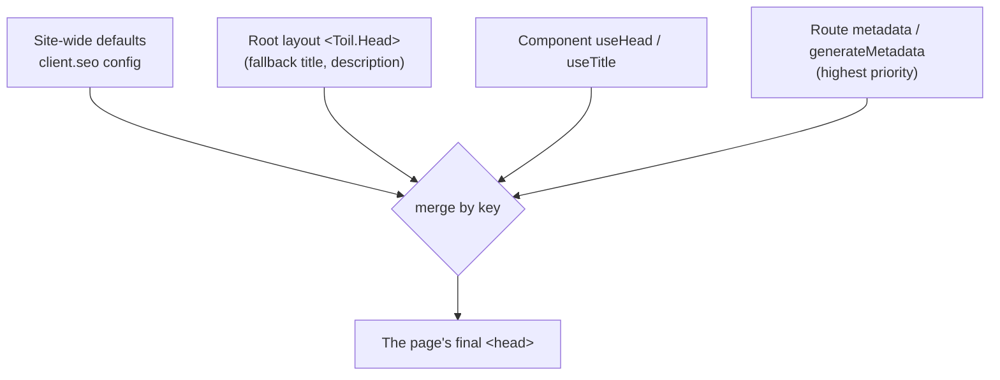

# Metadata and SEO

Metadata is the information in a page's `<head>`: its title, its description, and the tags that control how it looks when shared on social media or listed by a search engine. toiljs lets you set all of it per route, and bakes it into real HTML so crawlers see it even without running your JavaScript.

## The quick version

For most pages, `export const metadata` from the route file. That is it:

```tsx
// client/routes/features/seo.tsx
export const metadata: Toil.Metadata = {
  title: 'useReducer | React Hooks',
  description: 'Manage complex state transitions with a reducer function.',
  keywords: ['react', 'hooks', 'useReducer'],
  canonical: 'https://example.com/features/seo',
  openGraph: {
    title: 'useReducer | React Hooks',
    description: 'Manage complex state transitions with a reducer.',
    type: 'website',
  },
};

export default function SeoDemo() {
  return <main><h1>Route metadata</h1></main>;
}
```

The router applies this before the page paints (so the tab title updates with no flicker), and the build bakes it into the page's static HTML so search engines and link-preview bots read it directly.

## The `Metadata` fields

`Toil.Metadata` maps friendly fields onto the right `<meta>` and `<link>` tags for you:

| Field | Becomes |
| --- | --- |
| `title` | The document `<title>`. |
| `description` | `<meta name="description">`. |
| `keywords` | `<meta name="keywords">` (an array is joined with commas). |
| `canonical` | `<link rel="canonical">`. |
| `robots` | `<meta name="robots">`, e.g. `'noindex, nofollow'`. |
| `themeColor` | `<meta name="theme-color">` (the accent color of some link embeds). |
| `openGraph` | The `og:*` tags (title, description, type, url, image, siteName). |
| `meta` | Escape hatch: extra raw `<meta>` tags. |
| `link` | Escape hatch: extra raw `<link>` tags. |

Open Graph (the `og:*` tags) is the shared standard that Facebook, Discord, Slack, LinkedIn, and iMessage read to build a link preview card. Set `openGraph.image` (an absolute URL, ideally at least 1200 by 630 pixels) to control the preview picture:

```tsx
export const metadata: Toil.Metadata = {
  title: 'Our launch',
  description: 'Read the announcement.',
  openGraph: {
    title: 'Our launch',
    description: 'Read the announcement.',
    type: 'article',
    image: 'https://example.com/og/launch.png',
  },
};
```

## Dynamic metadata: `generateMetadata`

When the title depends on the URL or on fetched data (a blog post's title, a product name), export `generateMetadata` instead of a static object. It receives the route params, the query, and the route loader's data, and returns a `Metadata`:

```tsx
// client/routes/blog/[id].tsx
export const generateMetadata: Toil.GenerateMetadata = ({ params }) => ({
  title: `Blog post ${params.id}`,
  description: `Reading blog post ${params.id}.`,
});
```

Now `/blog/42` sets the tab to "Blog post 42". If your route has a `loader`, its data is passed in as `data`, so you can title a page from the content it loaded:

```tsx
export const loader = async ({ params }: Toil.LoaderArgs) =>
  Server.REST.blog.get({ params: { id: params.id } });

export const generateMetadata: Toil.GenerateMetadata = ({ data }) => ({
  title: data.title,
  description: data.excerpt,
});
```

## Imperative and stateful head: `useHead`, `useTitle`, `<Head>`

Sometimes the head depends on component state, not on the route. For that, set it from inside a component with `Toil.useHead`, `Toil.useTitle`, or the declarative `<Toil.Head>`. These apply for the component's lifetime and revert when it unmounts:

```tsx
export default function HeadDemo() {
  const [count, setCount] = useState(0);

  // The tab title updates every render as count changes.
  Toil.useTitle(`Clicked ${count} times`);

  Toil.useHead({
    meta: [{ name: 'description', content: `Clicked ${count} times.` }],
  });

  return <button onClick={() => setCount((c) => c + 1)}>Clicked {count}</button>;
}
```

The declarative form renders nothing and is equivalent:

```tsx
<Toil.Head
  title="Blog"
  meta={[{ name: 'description', content: 'Latest posts' }]}
/>
```

Use `useHead`/`useTitle` when the value is dynamic or lives in component state; use the `metadata` export when it is a static property of the route.

## How the pieces combine

Multiple things can contribute to the head at once: your site-wide defaults, a layout, and the page. They merge by key, with a clear priority. Later, more specific contributions win per key, and anything left unset falls through to a broader default:



- A **root layout** is the natural home for site-wide fallbacks (a default title and description for any page that sets none):

  ```tsx
  // client/layout.tsx
  <Toil.Head
    title="My Site"
    meta={[{ name: 'description', content: 'Planet-scale apps.' }]}
  />
  ```

- A **route's `metadata`** overrides those defaults for the keys it sets, while the layout still fills in everything the route leaves unset. So a page can set just a `title` and inherit the site description.

The rule of thumb: put fallbacks in the layout, put the specifics on the route.

## Build-time SEO for the whole site

Beyond per-route metadata, toiljs generates site-level SEO assets at build time from a `client.seo` block in `toil.config.ts`. These are baked into the HTML `<head>` and written as files, so JavaScript-less crawlers and AI bots get correct information:

```ts
// toil.config.ts
import { defineConfig } from 'toiljs/compiler';

export default defineConfig({
  client: {
    seo: {
      url: 'https://example.com',        // required for canonical/OG urls, sitemap
      title: 'My Site',
      description: 'Planet-scale apps from a single repo.',
      openGraph: {
        type: 'website',
        siteName: 'My Site',
        image: 'https://example.com/og.png',
      },
      twitter: { card: 'summary_large_image', site: '@mysite' },
      robots: { ai: 'allow' },           // allow or disallow known AI crawlers
      llms: { instructions: 'Docs live at /docs.' },
      jsonLd: { '@context': 'https://schema.org', '@type': 'WebSite', name: 'My Site' },
    },
  },
});
```

From this one block, the build:

- bakes the default `<title>`, `description`, Open Graph, Twitter card, and JSON-LD structured data into every page's HTML;
- overlays each route's own `metadata` on top and points that route's canonical and `og:url` at its own URL;
- generates `robots.txt` (with directives for AI crawlers like GPTBot and ClaudeBot), `sitemap.xml` (from your static routes), and `llms.txt` (a guidance file for AI crawlers).

You get correct, per-page SEO in the raw HTML with almost no manual tag writing. Confirm it with "View source" on a built page: the real title and tags are right there, not injected later by JavaScript.

## Per-request titles on server-rendered pages

For a page that is server-rendered (`export const ssr = true`), the backend can set a fresh `<title>` for each individual request (for example, a search page titled with the query the visitor typed). The edge splices that per-request title into the document before sending it, so the correct title is in the very first byte of HTML. This is a server-side API used in your `render` function; the frontend `metadata` above covers everything else. See [Rendering and SSR](./rendering.md) for how SSR pages are assembled.

## Gotchas

- **`generateMetadata` needs the data available.** It runs with the route loader's data, so it can only use what the loader returns. Fetch what the title needs in the loader.
- **Open Graph images must be absolute URLs.** A relative `/og.png` will not resolve for an external crawler. Use the full `https://...` URL (set `seo.url` and it can build them for you).
- **`seo.url` unlocks the site-level assets.** `sitemap.xml`, canonical links, and absolute OG urls all need the site's base `url`. Set it once in the config.
- **Static export vs runtime.** The `metadata` export is baked into HTML at build (great for crawlers) *and* applied at runtime on navigation. `useHead` runs only at runtime; a crawler that does not execute JS will not see it. Prefer the `metadata` export for anything that matters for SEO.

## Related

- [Rendering and SSR](./rendering.md): how the baked head and SSR title reach the browser.
- [Images](./images.md): producing the `og:image` for share previews.
- [Routing](./routing.md): where `metadata` and `generateMetadata` live in a route file.
- [Configuration](../concepts/config.md): the full `toil.config.ts` reference.
