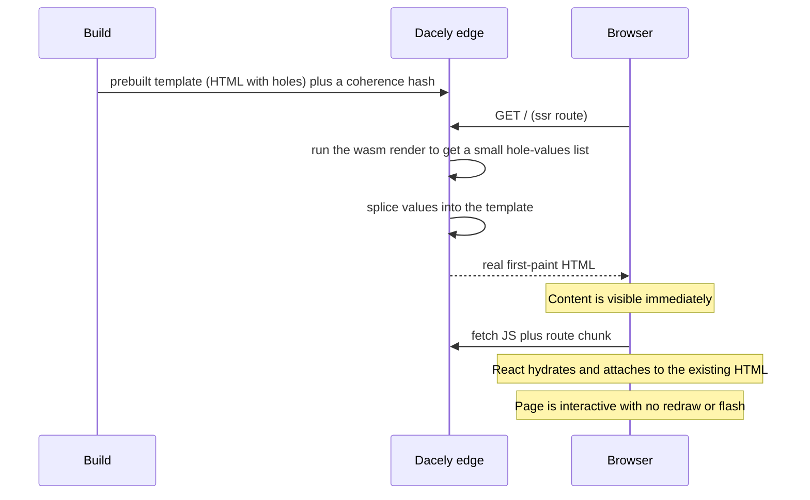
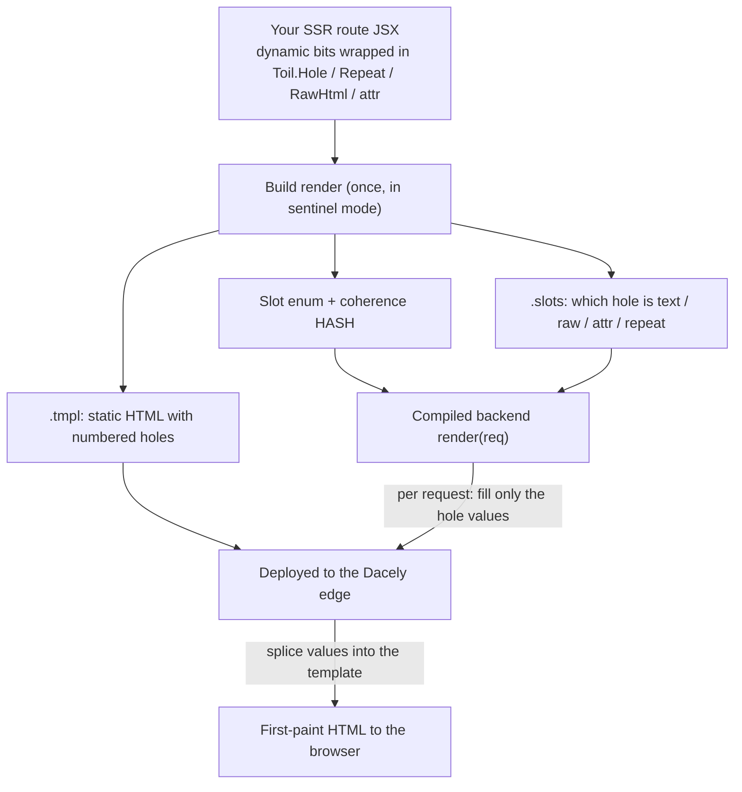

# Rendering and SSR

This page explains where your pages are built: in the browser, ahead of time at build, or on the server for each request. Getting this right is what makes a page paint fast and rank well.

## The three ways a page can render

A toiljs page can reach the user in three ways. You mostly get all three for free; the only one you opt into per page is edge SSR.

| Mode | Who builds the HTML | When | Good for |
| --- | --- | --- | --- |
| **Client rendering** | The browser, from JavaScript | On every visit | Interactive, per-user pages (a dashboard). The default. |
| **Build-time prerender** | The build, once | When you run `toiljs build` | Baking each route's `<head>` (SEO) into real HTML. Automatic. |
| **Edge SSR** | The edge server, per request | When you set `ssr = true` | A real first-paint page body plus SEO, for landing and content pages. |

Let us define the two words that trip people up:

- **Rendering** means turning your React components into HTML.
- **Hydration** means React attaching to HTML that already exists on the page (from the server) instead of throwing it away and redrawing it. Hydration is what makes a server-rendered page interactive without a flash.

## Client rendering (the default)

By default, toiljs ships a small HTML shell with an empty `<div id="root">`, plus your JavaScript. The browser downloads the JS, React runs, and it builds the page into `#root`. From then on, navigating between pages is pure JavaScript: only the next route's small code chunk and its data are fetched, and the page swaps in place with no reload.

This is fast to navigate and simple to reason about. Its one weakness is the *first* paint: until the JavaScript runs, `#root` is empty. For an app behind a login (a dashboard) that is fine, nobody is trying to index it. For a public landing page, you usually want one of the two server-assisted modes below.

## Build-time prerender (automatic SEO)

Every time you build, toiljs renders each static route once and bakes its resolved `<head>` (title, description, canonical link, Open Graph tags, and so on) into that route's HTML file. This happens for all routes with no extra work from you, and it is driven by the `metadata` you export from a route plus the site-wide `seo` config (see [Metadata and SEO](./metadata.md)).

The payoff: a crawler or a link-preview bot (Slack, Discord, iMessage) that fetches your page sees correct tags immediately, even though it does not run your JavaScript. "View source" on a built page shows the real title and meta tags, not an empty shell.

In production, `toiljs build` writes one prerendered HTML file per route (for example `about/index.html`), and the production static server (`npm start`) serves each route its own prerendered file rather than a single shared shell. That is how each page gets its own metadata in the raw HTML.

Build-time prerender covers the `<head>`. It does not, by itself, fill in the page *body*: for a client-rendered route the body is still built by React in the browser. To get real first-paint body HTML, opt the route into edge SSR.

### Prerendering dynamic routes with `generateStaticParams`

Build-time prerender bakes a `<head>` for every **static** route on its own. A **dynamic** route (`client/routes/blog/[id].tsx`, one file that serves `/blog/1`, `/blog/2`, and so on) has no single URL to prerender, so by default it gets none of that per-URL HTML. If you know the concrete URLs ahead of time (a fixed set of blog posts, product pages, or docs), you can opt the route into **static site generation (SSG)**, which means the build renders one HTML file per known URL: it enumerates each URL and writes a real `<url>/index.html` with that page's resolved metadata, plus a `sitemap.xml` entry. This is the toiljs analog of Next.js `generateStaticParams`.

You opt in by exporting `generateStaticParams` from the dynamic route. It returns one object per URL, keyed by the route's param names:

```tsx
// client/routes/blog/[id].tsx

// One entry per URL to prerender. `id` matches the [id] segment.
export const generateStaticParams: Toil.GenerateStaticParams = () => {
  return [{ id: '1' }, { id: '2' }, { id: '3' }];
};

// The build runs this once per URL, so each baked page gets its own <head>.
export const generateMetadata: Toil.GenerateMetadata = ({ params }) => ({
  title: `Blog post ${params.id}`,
  description: `Reading blog post ${params.id}.`,
});

export default function BlogPost() {
  const { id } = Toil.useParams();
  return <h1>Blog post {id}</h1>;
}
```

At build, that writes `blog/1/index.html`, `blog/2/index.html`, and `blog/3/index.html`, each with its own title and description in the raw HTML (so a crawler that does not run JavaScript sees them), and all three land in `sitemap.xml`. The param values also feed the route's `loader`, so per-URL metadata can depend on real data.

`generateStaticParams` is async-friendly (return a promise if you fetch the id list first) and completely opt-in: a dynamic route without it is untouched, and the whole pass is skipped when your project has no `seo` config. A catch-all segment (`[...slug]`) takes an array value: `{ slug: ['2024', 'hello'] }` fills the URL as `2024/hello`.

> Two things this is **not**: it is build-time prerender of the `<head>`, not edge SSR of the body. To also serve real body HTML for these URLs on first paint, add `export const ssr = true` as well (see below). And to make a dynamic route show up in the on-site [search index](./search.md) even though its title is dynamic, export `searchHints` (covered there), which is separate from `generateStaticParams`.

## Edge SSR (`ssr = true`)

For a route where you want the body content visible on first paint (a marketing page, an article), add one line:

```tsx
// client/routes/index.tsx
export const ssr = true;

export default function Home() {
  return (
    <section className="hero">
      <h1>Welcome</h1>
    </section>
  );
}
```

Now the Dacely edge sends a real, filled-in first paint for that page, and the browser hydrates it. The user sees content immediately, and React takes over without redrawing anything.

### How it works, in brief

toiljs does something clever to keep SSR cheap. It does not re-run React on the server for every request. Instead, at build time it renders the page once into a **template**: the static HTML with the dynamic bits punched out into named holes. Then, per request, your compiled backend fills only the hole values (a small list of "slot 3 = this text"), and the edge splices those values into the pre-baked template. The result is real first-paint HTML produced about as fast as serving a static file.



For SSR to hydrate cleanly, the HTML the server produced and the HTML the browser would produce must match byte-for-byte. toiljs guarantees this by escaping hole values exactly as React does and by carrying a hash that ties the running backend to the exact template it was built against. Authoring the server side of an SSR route (the hole markers in the page and the matching `render` function in `server/`) is a deeper topic that lives with the [backend](../backend/README.md). For most pages you only need `export const ssr = true` and to keep the page "SSR-safe" (below).

### Authoring an SSR route

`export const ssr = true` is all you need for a page whose body is fully static. The moment the body has a **dynamic bit** (a value that changes per request: a name from the URL, a list from a loader, a chunk of user HTML), you have to tell the build *where* that dynamic bit lives, so it can be punched out into a hole. You do that by wrapping the dynamic value in a **hole marker**.

Why is this necessary? The build renders your page once into a template. It cannot guess which `{expression}` in your JSX is a per-request value and which is a constant, so it does not try: any dynamic content you leave unwrapped gets frozen into the template as whatever value it happened to have during that one build render, and it will never update per request. The markers are the explicit "fill this in later" signal.

The markers live on the `Toil` global (so you do not import them), and they are **transparent in the browser**: `<Toil.Hole>` just renders its children, `<Toil.Repeat>` just maps its rows. They only behave differently during the build render, so your client-side app runs exactly as written.

| Marker | Use it for | Shape |
| --- | --- | --- |
| `Toil.Hole` | A single dynamic **text** value. | JSX element with `id` + children |
| `Toil.Repeat` | A **list**: a row template repeated over an `each` array. | JSX element with `id` + `each` + a render function |
| `Toil.RawHtml` | A block of **pre-rendered HTML** you trust (Markdown you rendered, say). | JSX element with `id` + `html` (+ optional `as`) |
| `Toil.attr` | A dynamic value in **attribute position** (an `href`, a `class`). | a **function** you call inside the attribute |
| `Toil.Island` | Content that must render **only in the browser** (the escape hatch). | JSX element with children |

`Toil.attr` is a function rather than an element because an attribute is not a child node, so it cannot be a JSX element. You call it right where the value goes.

Here is a full SSR route: a blog post whose title, body HTML, tag list, and author link all come from the route's `loader`.

```tsx
// client/routes/blog/[id].tsx
export const ssr = true;

// Runs on the server for the first paint, then again on the client to reproduce
// the same data so hydration matches (see "Keeping a route SSR-safe" below).
export const loader = async ({ params }: Toil.LoaderArgs) => {
  // Illustrative shape: { title, bodyHtml, tags, authorUrl }.
  return Server.REST.blog.get({ params: { id: params.id } });
};

export default function BlogPost() {
  const post = Toil.useLoaderData<typeof loader>();
  return (
    <article>
      <h1>
        <Toil.Hole id="title">{post.title}</Toil.Hole>
      </h1>

      {/* A dynamic attribute: call attr() in attribute position. */}
      <a href={Toil.attr('authorUrl', post.authorUrl)}>By the author</a>

      {/* A block of trusted, pre-rendered HTML. */}
      <Toil.RawHtml id="body" html={post.bodyHtml} />

      {/* A list: one row template, stamped once per item on the server. */}
      <ul>
        <Toil.Repeat id="tags" each={post.tags}>
          {(tag) => <li key={tag}>{tag}</li>}
        </Toil.Repeat>
      </ul>
    </article>
  );
}
```

A few rules that keep the template valid:

- **Every marker needs a stable `id`**: a short name unique within the page. The build maps each id to a numbered slot, so keep the ids constant across builds.
- **`Toil.Repeat` needs at least one row at build time.** It captures that first row as the sub-template for every row, so the build render must see sample data with one or more items (an empty `each` gives it nothing to capture).
- **`Toil.RawHtml` renders inside a wrapper element** (a `<div>` by default; pass `as="section"` to change the tag), and you own sanitising that HTML, exactly like React's `dangerouslySetInnerHTML`.

Anything that genuinely cannot run on the server (it reads `window`, calls `Date.now()`, or depends on the live URL) goes inside a `Toil.Island`, which renders nothing on the server and reveals its children only after hydration:

```tsx
<Toil.Island>
  <LiveClock />
</Toil.Island>
```

This is the flow from your marked-up JSX to the first-paint HTML:



#### Advanced: hand-writing the server `render`

You almost never do this. The compiler generates the server `render(req)` for an SSR route from the JSX above, so the hole ids line up automatically. But the server side is backed by a plain, hand-writable API for the rare case you need full control (an unusual template, or a value the compiler cannot derive). Your `render` returns a `SlotValues` object, filled with:

- `setText(slot, value)`: a text hole (React-escaped for you).
- `setRaw(slot, html)`: a raw-HTML hole (you own sanitising).
- `setAttr(slot, value)`: an attribute hole.
- `setRepeat(slot, rows)`: a repeat region, with the rows assembled through an `HtmlBuilder` (chain `.raw(...)`, `.text(...)`, `.attr(...)`).
- `setHeader(name, value)`, `setTitle(title)`, and `setStatus(code)`: response headers, a per-request `<title>`, and the status code.

`SlotValues` and `HtmlBuilder` live in `server/runtime/ssr/slots.ts`. The `setTitle` helper is the supported way to give an SSR page a data-driven `<title>` (a blog post's real title from its loader), overriding the one baked into the template. This is server (backend) code, so it belongs with the [backend](../backend/README.md).

### Keeping a route SSR-safe

Server rendering happens where there is no browser: no `window`, no `document`, no mouse. So an SSR route (and every layout above it) must render without touching browser-only APIs during that first render. Anything that must run only in the browser (reading `window`, using `Date.now()`, or router hooks that need the live URL) goes inside an **island**, a marker that renders nothing on the server and appears only after hydration.

If a route or one of its layouts throws while rendering on the server, toiljs does not ship a broken page. It **skips SSR for that route at build with a warning** and falls back to plain client rendering. So adding `ssr = true` is always safe: worst case you get client rendering plus a build warning telling you what to move into an island.

### Suspense markers and self-healing hydration

Under the hood the client wraps each route and layout in React `Suspense` boundaries that line up with what the server emitted, so hydration matches. If hydration ever does mismatch (the server HTML and the client's idea of the page disagree), React does the safe thing: it discards the server markup for that part and re-renders it on the client. You get a correct page either way. The cost of a mismatch is a small flash and some wasted work, not a broken page, which is why the guidance above (keep it SSR-safe, put browser-only bits in islands) is about smoothness, not correctness.

## Known SSR limitations

Be aware of these honest gaps as of today:

- **`template.tsx` is not server-rendered.** A `template.tsx` wrapper (the re-mounting cousin of a layout) is not part of the SSR output. A route under one still works: hydration self-heals to client rendering for that part.
- **Parallel slots (`@slot`) are not server-rendered.** Slot content (including intercepted modals) renders on the client after hydration, not in the first paint. Since slots are typically modals and overlays that appear on interaction, this is rarely a problem.
- **Islands have no first paint or SEO.** That is by design: an island is your "client only" escape hatch, so anything inside it is intentionally absent from the server HTML and from what crawlers see.
- **The client loader must reproduce the server's data.** For a hole whose value comes from the request (a query param), the route's client `loader` has to derive the same value the server used, or hydration will re-render that part. If the client cannot reproduce a value, put that content in an island.

## Which mode should I use?

- **Interactive, per-user page** (dashboard, settings): client rendering. Do nothing.
- **Public page that needs correct link previews and titles**: you already have build-time prerender. Do nothing extra.
- **Public page that should also show its content instantly on first load** (landing page, blog post, docs): add `export const ssr = true` and keep it SSR-safe.

## Related

- [Backend overview](../backend/README.md): where the server-side `render` for an SSR route lives.
- [Metadata and SEO](./metadata.md): what gets baked into the `<head>`.
- [Routing](./routing.md): layouts, templates, and slots.
- [Fetching data](./data-fetching.md): loaders and how their data seeds hydration.
