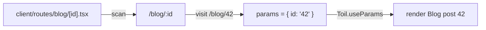

# Routing

toiljs uses file-based routing: every file under `client/routes/` becomes a page, and its path on disk becomes its URL. There is no route config to maintain, you create a file and the route exists.

This page is about **frontend** (browser) routing: the pages a user visits and how they navigate between them. Your **backend** HTTP endpoints use a different, decorator-based system (see [HTTP routes](../backend/rest.md)).

## The basic idea

Drop a React component at `client/routes/<something>.tsx`, `export default` it, and it is a page. The default export is the component that renders at that URL.

```tsx
// client/routes/about.tsx  ->  /about
export default function About() {
  return (
    <main>
      <h1>About us</h1>
    </main>
  );
}
```

Run `toiljs dev`, open `/about`, and it is there. Nothing else to register.

## How a file path becomes a URL

The compiler scans `client/routes/` and turns each file into a URL pattern with a small set of rules. Here is the whole mapping in one table:

| File under `client/routes/` | URL | What it is |
| --- | --- | --- |
| `index.tsx` | `/` | The home page. |
| `about.tsx` | `/about` | A static page. |
| `blog/index.tsx` | `/blog` | An index inside a folder. |
| `blog/[id].tsx` | `/blog/:id` | A **dynamic** page (one param). |
| `docs/[...slug].tsx` | `/docs/*` | A **catch-all** (one or more segments). |
| `files/[[...slug]].tsx` | `/files` and `/files/*` | An **optional** catch-all (zero or more). |
| `(marketing)/pricing.tsx` | `/pricing` | A **route group**: parens add no URL segment. |
| `@modal/photo/[id].tsx` | (a parallel slot, see below) | A named **slot**. |

The rules, spelled out:

- **`index`** means "the folder itself", so `blog/index.tsx` is `/blog`, and the top `index.tsx` is `/`.
- **Square brackets** mark a dynamic segment. `[id]` captures one path segment into a param named `id`. You read it with `Toil.useParams()`.
- **`[...name]`** is a catch-all: it captures the rest of the path (one segment or more) as a single `/`-joined string.
- **`[[...name]]`** is an *optional* catch-all: like `[...name]`, but it also matches the bare parent URL with nothing after it (the param is then absent).
- **Parentheses** like `(marketing)` create a **route group**: a folder that organizes files without adding anything to the URL. Handy for grouping pages that share a layout.



### Dynamic pages: reading the param

A file named with brackets gets its captured values from `Toil.useParams()`:

```tsx
// client/routes/blog/[id].tsx  ->  /blog/:id
export default function BlogPost() {
  const { id } = Toil.useParams();
  return (
    <main>
      <h1>Blog post {id}</h1>
    </main>
  );
}
```

Visiting `/blog/42` renders "Blog post 42". Param values are URL-decoded for you.

For a catch-all, the param is the whole tail joined with slashes:

```tsx
// client/routes/docs/[...slug].tsx  ->  /docs/*slug
export default function Docs() {
  const { slug } = Toil.useParams();
  // /docs/getting-started/install  ->  slug === "getting-started/install"
  return <main>{slug}</main>;
}
```

An optional catch-all (`[[...slug]]`) matches the bare parent too, so `slug` can be empty:

```tsx
// client/routes/files/[[...slug]].tsx  ->  matches /files AND /files/a/b
export default function Files() {
  const { slug } = Toil.useParams();
  // "/files" -> slug is undefined; "/files/a/b" -> slug === "a/b"
  return <main>{slug ?? '(the base /files page)'}</main>;
}
```

### When two routes could match

If a URL could match more than one pattern, toiljs picks the most specific one. Static segments win over dynamic (`:id`) segments, which win over catch-alls (`*slug`), and deeper routes win over shallower ones. So `/blog/new` prefers a literal `blog/new.tsx` over `blog/[id].tsx` if both exist. You do not configure this, it just does the intuitive thing.

## Special files

Some filenames are not pages, they are helpers that wrap or replace pages. They live alongside your routes and are never matched as a URL:

| Filename | Role |
| --- | --- |
| `layout.tsx` | Wraps the pages in its folder (and below). **Persists** across navigation. |
| `template.tsx` | Like a layout, but **re-mounts** on every navigation within it. |
| `loading.tsx` | Shown while the page (and its data) is loading. |
| `error.tsx` | Shown when the page throws (an error boundary). |
| `global-error.tsx` | The last-resort error boundary, wraps even the root layout. |
| `404.tsx` (or `not-found.tsx`) | Shown when no route matches. |

### Layouts

A `layout.tsx` receives the page (or nested layout) as `children` and renders around it. The root `client/layout.tsx` wraps every page. It is the natural home for your header, footer, and site-wide `<head>` defaults:

```tsx
// client/layout.tsx
import type { ReactNode } from 'react';
import Header from './components/Header';
import Footer from './components/Footer';

export default function Layout({ children }: { children?: ReactNode }) {
  return (
    <div className="app">
      <Header />
      <main className="content">{children}</main>
      <Footer />
    </div>
  );
}
```

Layouts nest by folder. A `client/routes/dashboard/layout.tsx` wraps every page under `/dashboard`, inside the root layout. Because a layout **persists** across navigations, state inside it (a sidebar's open/closed flag, a scroll position) survives when you move between its child pages.

### Templates vs layouts

A `template.tsx` looks like a layout but does the opposite on navigation: it **re-mounts** every time you move to a new page within it. Use a layout when state should persist (a nav sidebar), and a template when it should reset (an enter animation that should replay, or a counter that should start fresh per page).

### Loading and error states

Put a `loading.tsx` next to a page (or in a folder) and it shows automatically while that page's chunk and its `loader` data are still resolving:

```tsx
// client/routes/dashboard/loading.tsx
export default function Loading() {
  return <p>Loading dashboard...</p>;
}
```

Put an `error.tsx` there and it catches any error the page throws, showing a fallback instead of a blank screen. `global-error.tsx` sits outside the root layout, so it catches errors thrown by the layout itself.

## Route groups: shared layout, no URL change

Wrap a folder name in parentheses to group files without changing their URLs. This is the trick for "these three pages share one layout, but I do not want a `/legal` prefix":

```
client/routes/
  (legal)/
    layout.tsx      -> wraps both pages below
    privacy.tsx     -> /privacy   (NOT /legal/privacy)
    terms.tsx       -> /terms
```

## Parallel slots (`@slot`) and intercepting routes

This is an advanced feature; skip it until you need a modal that keeps the page behind it alive.

A folder starting with `@`, like `@modal`, is a **named slot**. It is a whole second route tree that matches the current URL *independently* of the main page, and renders wherever you place a `<Toil.Slot>`:

```tsx
// client/routes/gallery/layout.tsx
import type { ReactNode } from 'react';

export default function GalleryLayout({ children }: { children?: ReactNode }) {
  return (
    <div>
      {children}
      <Toil.Slot name="modal" />   {/* renders the @modal slot for this URL */}
    </div>
  );
}
```

The `@` folder adds nothing to the URL; it just says "these routes fill the slot named `modal`". A slot with no match renders nothing (or a `fallback` you pass).

An **intercepting route** is a slot route whose folder name starts with `(.)`, `(..)`, or `(...)`. It hijacks a *soft* (in-app) navigation to another URL and renders that URL's content inside the slot instead, while the main page stays mounted behind it. That is exactly how a "click a photo, see it in a modal over the gallery" pattern works, where reloading the page (a hard load) shows the full photo page instead:

```
client/routes/gallery/
  index.tsx                     -> /gallery
  photo/[id].tsx                -> /gallery/photo/:id  (full page, on hard load)
  @modal/(.)photo/[id].tsx      -> fills @modal on a soft click to that URL
```

The `(.)` markers mean: `(.)` same level, `(..)` up one level, `(...)` from the routes root. This tells the interceptor which real URL it is standing in for.

## Links and navigation

### `Toil.Link`

Use `Toil.Link` instead of a plain `<a>` for in-app links. It navigates client-side (no full page reload), and prefetches the target route's code on hover or focus so the click feels instant:

```tsx
<Toil.Link href="/about">About</Toil.Link>
```

`Link` accepts every normal anchor attribute (`className`, `target`, `rel`, `download`, and so on), plus a few toiljs controls:

| Prop | Default | What it does |
| --- | --- | --- |
| `replace` | `false` | Replace the current history entry instead of pushing a new one. |
| `scroll` | `true` | Scroll to the top after navigating. |
| `prefetch` | `true` | Prefetch the route on hover/focus. Set `false` to opt out. |

`Link` is smart about when *not* to intercept: external URLs, `target="_blank"`, `download`, `#hash` links, and modified clicks (Ctrl/Cmd/middle-click) all fall through to normal browser behavior. The `href` is typed to your project's real routes, so a typo is a compile error.

### `Toil.NavLink` and active state

`NavLink` is a `Link` that knows whether it points at the current page. When active it adds the class `active` (configurable) and `aria-current="page"`. This is what you want for a navigation bar that highlights the current section:

```tsx
<Toil.NavLink href="/blog" activeClassName="is-current">
  Blog
</Toil.NavLink>
```

You can also drive `className`, `style`, or `children` from the active state with a function:

```tsx
<Toil.NavLink href="/blog" className={({ isActive }) => (isActive ? 'on' : 'off')}>
  Blog
</Toil.NavLink>
```

By default a parent link is active for its sub-paths too (`/blog` is active on `/blog/42`). Pass `end` to require an exact match:

```tsx
<Toil.NavLink href="/" end>Home</Toil.NavLink>
```

### Navigating in code

For navigation that is not a link (after a form submit, a redirect), use the router hook or the free `navigate` function:

```tsx
export default function Login() {
  const router = Toil.useRouter();
  const onDone = () => router.push('/dashboard');
  // router.replace(href), router.back(), router.forward(), router.refresh()
  return <button onClick={onDone}>Continue</button>;
}
```

`useRouter()` returns a handle with `push`, `replace`, `back`, `forward`, `refresh` (re-run the current page's data loader), `revalidate` (refetch data), and `prefetch`.

### Reading the current location

A handful of hooks let a component read where it is:

| Hook | Returns |
| --- | --- |
| `Toil.useParams()` | The dynamic route params, e.g. `{ id }`. |
| `Toil.usePathname()` | The current path, e.g. `"/blog/42"`. |
| `Toil.useSearchParams()` | The query string as a `URLSearchParams`. |
| `Toil.useNavigationPending()` | `true` while a navigation is in flight (for a loading bar). |

## Loading data for a route

A route file can `export const loader` alongside its component. The loader runs on navigation, in parallel with loading the page's code, and the page reads the result with `Toil.useLoaderData`. This keeps data fetching out of `useEffect` and lets `loading.tsx` show while it runs. Loaders are covered in depth in [Fetching data](./data-fetching.md):

```tsx
export const loader = async ({ params }: Toil.LoaderArgs) => {
  const post = await Server.REST.blog.get({ params: { id: params.id } });
  return post;
};

export default function BlogPost() {
  const post = Toil.useLoaderData<typeof loader>();
  return <article><h1>{post.title}</h1></article>;
}
```

## Gotchas

- **`export default` is required.** A route file without a default-exported component is not a page. The special files (`layout`, `loading`, and so on) also use the default export.
- **Reserved filenames are not pages.** `layout.tsx`, `template.tsx`, `loading.tsx`, `error.tsx`, `global-error.tsx`, `404.tsx`, and `not-found.tsx` are helpers, not routes. Do not name a real page one of these.
- **Use `Toil.Link`, not `<a>`, for in-app links.** A plain `<a href="/about">` triggers a full page reload, throwing away the SPA speed. Reserve `<a>` for external links.
- **Params are always strings.** `useParams()` gives you `{ id: "42" }`, not a number. Convert if you need a number.
- **Route groups and slots are invisible in the URL.** `(group)` and `@slot` folders never appear in the address bar. If a URL looks wrong, check for a stray bracket or paren in the file path.

## Related

- [Rendering and SSR](./rendering.md): what renders on the server versus the browser.
- [Fetching data](./data-fetching.md): loaders, the typed backend clients, and forms.
- [Metadata and SEO](./metadata.md): set the title and tags per route.
- [Backend HTTP routes](../backend/rest.md): the separate, decorator-based server routing.
