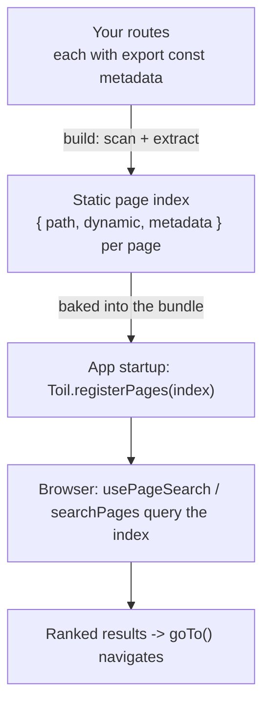

# Page search

toiljs ships a built-in search over your own pages: at build time it indexes every route's metadata (title, description, keywords, Open Graph), and at runtime you query that index to build a search box or a command palette that jumps straight to a page. It is entirely static (no server, no search service), and there is no equivalent in Next.js, so this page explains it from scratch.

## What it is

Every route in your app can export `metadata` (its title, description, and so on, see [Metadata and SEO](./metadata.md)). The toiljs compiler reads that metadata from all your routes at build time and bakes a small **page index** into your bundle: a list of `{ path, title, description, keywords, ... }` for every page. When your app starts, that index is registered in the browser. You can then search it instantly, offline, with zero network calls, and turn a match into a navigation.

This is what powers a "jump to any page" box or a `Cmd+K` command palette without you maintaining a list of pages or standing up a search backend.



Only **statically-known** metadata is indexed. A route whose `<head>` comes from a dynamic `generateMetadata` (a per-request title) has nothing to index by default; to include it anyway, export `searchHints` (see below).

## The `usePageSearch` hook

`usePageSearch` is the React way in. Give it the current query string, and it hands back ranked results plus a helper to navigate:

```tsx
const { results, pages, goTo } = Toil.usePageSearch(query);
```

It returns an object with three fields:

| Field | Type | What it is |
| --- | --- | --- |
| `results` | `readonly PageSearchResult[]` | The ranked matches for `query`, best first. Empty when the query is blank. |
| `pages` | `readonly PageMeta[]` | The full page index, handy for showing an "all pages" listing. |
| `goTo` | `(target, options?) => void` | Navigates to a result, a page, or a raw path string. A stable reference (safe to pass to a child or destructure). |

Each item in `results` is a `PageSearchResult`:

- `page`: the matched `PageMeta`, which is `{ path, dynamic, metadata }`. `path` is the route URL (`'/about'`), `dynamic` says whether it has `:param` segments, and `metadata` is the indexed title/description/etc.
- `score`: a relevance number (higher is better; always above zero for a returned result).
- `matches`: which fields matched, for example `['title', 'keywords']`.

The results are memoised, so they recompute only when the query (or options) change, not on every render.

### A full search box

Here is a complete search page: an input, a ranked result list, and a click that navigates to the chosen page.

```tsx
// client/routes/search.tsx
import { useState } from 'react';

export const metadata: Toil.Metadata = {
  title: 'Search',
  description: 'Find any page and jump straight to it.',
  keywords: ['search', 'find', 'pages'],
};

export default function SearchPage() {
  const [query, setQuery] = useState('');
  const { results, pages, goTo } = Toil.usePageSearch(query);

  return (
    <main>
      <h1>Search</h1>
      <input
        type="search"
        value={query}
        onChange={(e) => {
          setQuery(e.target.value);
        }}
        placeholder={`Search ${pages.length} pages...`}
        aria-label="Search pages"
        autoFocus
      />

      {query.trim() !== '' && (
        <ul>
          {results.length === 0 && <li>No pages match "{query}".</li>}
          {results.map((r) => (
            <li key={r.page.path}>
              <button
                type="button"
                onClick={() => {
                  goTo(r);
                }}
              >
                <strong>{r.page.metadata.title ?? r.page.path}</strong>{' '}
                <code>{r.page.path}</code>
                {r.page.metadata.description !== undefined && (
                  <p>{r.page.metadata.description}</p>
                )}
              </button>
            </li>
          ))}
        </ul>
      )}
    </main>
  );
}
```

`goTo` accepts a result (as above), a `PageMeta`, or a plain path string, and takes the same options as `navigate` (see [Routing](./routing.md)). Passing a result is the common case.

### Options

`usePageSearch` takes a second argument to tune the search:

```tsx
const { results } = Toil.usePageSearch(query, {
  limit: 8,               // cap the number of results (after ranking)
  includeDynamic: true,   // include :param routes (see below); default false
  fields: ['title', 'keywords'], // only match these fields; default all fields
});
```

| Option | Type | Default | Effect |
| --- | --- | --- | --- |
| `limit` | `number` | no cap | Keep only the top N results after ranking. |
| `includeDynamic` | `boolean` | `false` | Include dynamic (`:param` / `*catch-all`) routes. Off by default because you cannot navigate to them without filling in the params. |
| `fields` | array of field names | all fields | Restrict matching to a subset of `'title'`, `'description'`, `'keywords'`, `'path'`, `'openGraph'`. |

## Making dynamic routes searchable with `searchHints`

A dynamic route like `client/routes/blog/[id].tsx` usually produces its `<head>` with a per-post `generateMetadata`, so there is nothing static to index, and the route is missing from search. To surface it anyway, export `searchHints`: a small static object the compiler merges into the index for that route (winning ties against any static `metadata`).

```tsx
// client/routes/blog/[id].tsx

// The per-post <title> is dynamic, so it cannot be indexed. These static hints
// put the blog into the search index so it shows up when someone searches "blog".
export const searchHints: Toil.SearchHints = {
  title: 'Blog',
  description: 'Articles and updates.',
  keywords: ['blog', 'posts', 'articles'],
};
```

`SearchHints` has three optional fields: `title`, `description`, and `keywords` (a string or an array of strings).

Two things to keep in mind. First, `searchHints` only affects the index; the route is still dynamic, so it appears in results only when you pass `includeDynamic: true`. Second, you cannot `goTo` a dynamic page directly (it needs concrete params), so `goTo` is a no-op for one unless you hand it a real, filled-in path string. In practice you use `searchHints` to make a *section* discoverable (typing "blog" surfaces the blog), and point the user at a concrete landing URL.

## The lower-level API

The hook is a thin wrapper over a small, framework-agnostic core you can use directly (outside React, in tests, or to build your own UI). All of these are on the `Toil` global:

- `Toil.searchPages(query, options?)`: the pure ranking function behind the hook. Returns `PageSearchResult[]`. Same options as the hook.
- `Toil.getPages()`: the full registered index (`readonly PageMeta[]`), including dynamic routes. Empty before registration.
- `Toil.pagePath(target)`: normalises a result, a page, or a raw string down to its path string.
- `Toil.registerPages(pages)`: replaces the live index. toiljs calls this for you at startup with the compiler-built index, so you rarely call it yourself. It exists for tests and advanced setups that build a custom index.

```tsx
import { searchPages } from 'toiljs/client';

// Outside a component: the top 5 title/keyword matches for "billing".
const hits = searchPages('billing', { limit: 5, fields: ['title', 'keywords'] });
```

## How ranking works

The matcher is simple and predictable:

- The query is lower-cased and split on whitespace into terms. **Every** term must match somewhere (AND semantics), or the page is dropped. A blank query returns nothing.
- Matching is case-insensitive and substring-based, with bonuses: an exact field match ranks highest, then a match at the start of the field, then a match at the start of a word inside the field, then a plain mid-word substring.
- Each field carries a weight, so a hit in the title counts for much more than a hit in the description:

| Field | Weight |
| --- | --- |
| `title` | 10 |
| `path` | 6 |
| `keywords` | 5 |
| `description` | 3 |
| `openGraph` | 2 |

- The `path` field is made word-searchable: `/get-started` matches "get" or "started".
- Results are sorted by score (highest first), ties broken alphabetically by path for a stable order, then cut to `limit` if you set one.

## Gotchas

- **Only static metadata is indexed.** A route whose title comes from `generateMetadata` is invisible to search until you add `searchHints`.
- **Dynamic routes are excluded by default.** They need `includeDynamic: true` to appear, and even then `goTo` cannot navigate to one without concrete params.
- **The index is built, not live.** It reflects the metadata at build time. Add a route or change a title and you must rebuild for search to see it.
- **A blank query returns no results**, not every page. If you want an "all pages" listing for an empty box, render `pages` yourself.
- **The type names** `PageSearchResult`, `PageSearchOptions`, and `SearchField` are importable from `'toiljs/client'` if you need to annotate them; `PageMeta` and `SearchHints` are also available as `Toil.PageMeta` / `Toil.SearchHints`.

## Related

- [Metadata and SEO](./metadata.md): the `metadata` the search index is built from.
- [Routing](./routing.md): route paths, dynamic segments, and `navigate` (what `goTo` calls).
- [Rendering and SSR](./rendering.md): where `searchHints` fits alongside `generateStaticParams` for dynamic routes.
- [Frontend overview](./README.md): the `Toil` global and the rest of the client API.
