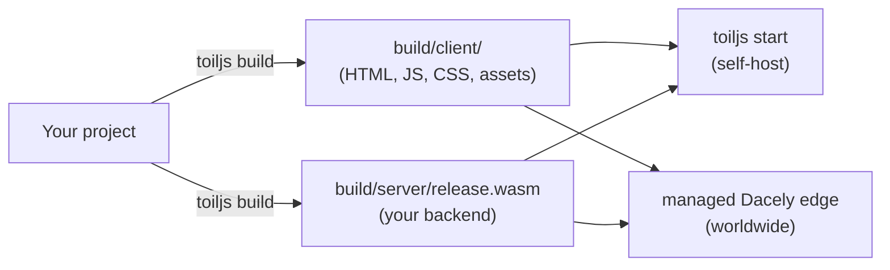

# Deploying a toiljs app

This page is an honest look at how you get a toiljs app in front of real users. There are two paths, and it helps to be clear about which one exists today.

- **Self-host it yourself.** You build the app and run it on a machine you control, with `toiljs build` then `toiljs start`. This works right now, on your laptop, a VPS, or any server that can run Node.js.
- **Run it on the managed Dacely edge.** This is the platform toiljs is built for: a worldwide fleet of servers that runs your compiled backend close to every user. It is the target the whole framework is designed around.

One thing up front, so you do not go looking for it: **there is no `toiljs deploy` command.** The CLI can build and self-host; pushing a build onto the managed edge is a platform step, not a CLI subcommand. The rest of this page covers what you can do today (self-hosting) and what the managed edge gives you.

## The one build powers both

Both paths serve the exact same artifacts. `toiljs build` produces them once:



So you never build differently for the two targets. You build once, then either run it yourself or hand the same output to the edge.

## Self-hosting with `toiljs start`

`toiljs start` runs your built app on a fast production HTTP server. It serves your static client, dispatches dynamic requests into your `release.wasm`, does server-side rendering, runs daemons, and exposes a `/_toil` websocket channel. Use it to put your app on your own machine or server instead of the managed edge.

### Step 1: build

`start` serves whatever is in `build/`, so you must build first. If there is no build, `start` exits with an error (it looks for `build/client/index.html`).

```bash
npm run build
```

### Step 2: start

```bash
# Serve on http://127.0.0.1:3000 (loopback only, one worker per CPU).
npx toiljs start

# Accept outside connections, on port 8080, with 4 worker processes.
npx toiljs start --host 0.0.0.0 --port 8080 --threads 4
```

### start flags

| Flag | Meaning |
| --- | --- |
| `--port <n>` | Port to listen on. Default `3000` (or `client.port` from your config). |
| `--host <host>` | Address to bind. Default `127.0.0.1`, which is **loopback only** (reachable just from the same machine). Pass `0.0.0.0` to accept connections from other machines. |
| `--threads <n>` | Number of HTTP worker processes. Default is automatic (one per available CPU). Pass `1` to disable the worker pool. `--workers` is an accepted alias, and you can also set `server.threads` in your config or the `TOILJS_THREADS` environment variable. |
| `--root <dir>` | Run against a project in another directory instead of the current one. |

These flags are verified against the CLI. Note that `--host` and `--threads` are `start`-only: `toiljs dev` always binds locally and does not take them. For the full command reference, see [the CLI](../cli/README.md#toiljs-start).

### A realistic self-host

On a small server (say a VPS), a minimal run looks like this:

```bash
# Install and build.
npm ci
npm run build

# Bind on all interfaces so a reverse proxy or the public can reach it.
npx toiljs start --host 0.0.0.0 --port 8080 --threads 4
```

Then put a reverse proxy (nginx, Caddy) in front for TLS and a real hostname, pointing it at `http://127.0.0.1:8080`. Keep the process alive with your usual tool (systemd, pm2, a container restart policy).

### Self-host gotchas

- **`start` needs a fresh build.** It serves `build/`, not your source. After any code change, run `toiljs build` again before restarting.
- **The default bind is loopback.** With no `--host`, only the same machine can reach it. Set `--host 0.0.0.0` (usually behind a reverse proxy) to serve real traffic.
- **Self-host is one place, not the whole world.** You get one server (or however many you run yourself). The latency and worldwide reach of the managed edge is exactly the thing self-hosting does not give you.
- **The database is different.** Self-hosting runs the built server, but ToilDB's worldwide data layer is an edge feature. Treat self-host as a way to run and test your build, not as a substitute for the managed edge's global database.

## The managed Dacely edge

The managed **Dacely edge** is the platform toiljs targets: a fleet of servers in many cities that runs your compiled backend as close to each user as possible, backed by the worldwide **ToilDB** database. You write one project, and the build already decides which part of your code belongs to which layer of the edge.

Your backend runs across four **compute tiers**, from a per-request handler at the very edge up to a single worldwide coordinator:

| Tier | Name | Where it runs | Typical code |
| --- | --- | --- | --- |
| **L1** | Hot / edge | The node nearest the user, fresh per request | `@rest`, `@service` / `@remote` |
| **L2** | Regional | One box per connection, per region | `@stream` (Regional) |
| **L3** | Continental | One box per connection, per continent | `@stream` (Continental) |
| **L4** | Global / daemon | Exactly one leader worldwide | `@daemon`, `@scheduled` |

Because the same `toiljs build` output feeds the edge, everything you built and tested with `toiljs dev` and `toiljs start` is what runs there. The edge decides each server's role for you; you do not configure tiers by hand. For the full picture of what each tier means and how to write for it, see [Compute tiers (L1 to L4)](../concepts/tiers.md).

## Related

- [The CLI](../cli/README.md): the full reference for `build` and `start` and every flag.
- [Configuration (`toil.config.ts`)](../concepts/config.md): `server.threads` and the other self-host knobs.
- [Compute tiers (L1 to L4)](../concepts/tiers.md): how your code maps onto the managed edge.
- [Getting started](./README.md): the path from install to a running feature.
