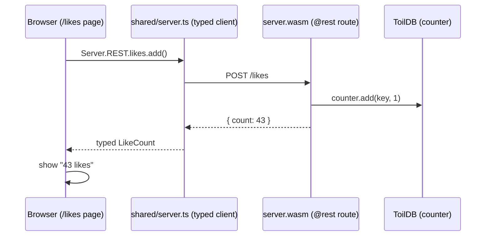
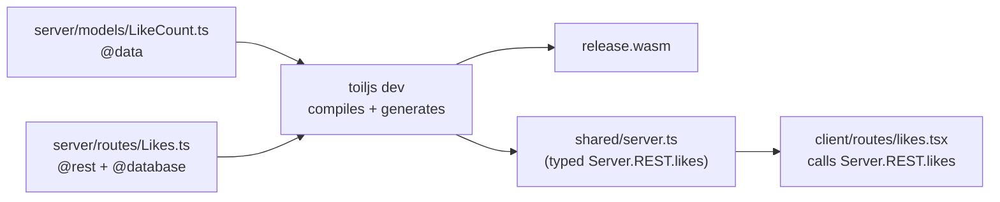

# Your first app

Build a tiny feature end to end: a page with a "Like" button that reads and writes a real number in ToilDB, so the count survives page reloads and restarts. Along the way you meet the typed client, an HTTP route, and the database, the three pieces you use in almost every toiljs app.

## What you will build

A `/likes` page that shows a running like count and a button to add one. The count lives in ToilDB, so it is shared by everyone and it persists.



## Before you start

You need a project. If you do not have one yet, create one and start the dev server:

```sh
toiljs create my-app
cd my-app
npm run dev
```

Leave `npm run dev` running in a terminal. It rebuilds your server, regenerates the typed client, and hot-reloads the browser every time you save. The app is at `http://localhost:3000`.

## Why the database (and not a variable)

Your first instinct might be to keep the count in a normal variable on the server. That will not work, and it is worth understanding why now.

**The server runs a fresh copy of your `.wasm` for every request, and wipes its memory when the request ends.** So a variable you set while handling one request is gone by the next request. Anything that must outlive a single request, a counter, a user, a post, has to go into a store. toiljs ships one: **ToilDB**, a database built into the edge.

ToilDB offers a few specialized shapes called **families**. For a running total, the right one is a **counter**: a value you can atomically add to and read back. (Others include documents, events, and views. See [Database overview](../database/index.md).)

## Step 1: add a data type for the response

Your server and client talk in typed messages called `@data` classes. A `@data` class can cross the wire and be parsed into a real typed object on the other side. Create one to hold the count.

Create `server/models/LikeCount.ts`:

```ts
// The response our route returns: just the current like count.
@data
export class LikeCount {
    count: i64 = 0;
    constructor(count: i64 = 0) {
        this.count = count;
    }
}
```

Two things to notice:

- `@data` is a decorator that marks this class as a wire type. You use it with no import (it is a compiler built-in). See [Data types](../backend/data.md).
- The field type is `i64`, a 64-bit integer. The server uses precise integer types like `i64` and `u64`. On the client side these arrive as JavaScript `bigint`. More on this in [Types](../concepts/types.md).

## Step 2: add the HTTP route

Now the backend endpoint. Create `server/routes/Likes.ts`:

```ts
import { RouteContext } from 'toiljs/server/runtime';

import { LikeCount } from '../models/LikeCount';

// The KEY that names one counter. A counter is a map from a key to a number,
// so a single fixed key ("home") gives us one global tally.
@data
class LikeKey {
    page: string = 'home';
    constructor(page: string = 'home') {
        this.page = page;
    }
}

// A @database declares your ToilDB collections. Each @collection is one named
// store. Here we declare a single counter keyed by LikeKey.
@database
class LikesDb {
    @collection static likes: Counter<LikeKey>;
}

// A @rest controller exposes HTTP endpoints. 'likes' is the URL prefix, so the
// routes below live under /likes.
@rest('likes')
class Likes {
    // GET /likes  ->  read the current count.
    // A @get handler is a "query": it may read but not write. Reading one
    // counter by its key is a point read, which queries are allowed to do.
    @get('/')
    public show(): LikeCount {
        const key = new LikeKey('home');
        return new LikeCount(LikesDb.likes.get(key));
    }

    // POST /likes  ->  add one, then return the new count.
    // A @post handler is an "action": it may write. `add` bumps the counter.
    // (A body-less POST takes the RouteContext; we do not need it here.)
    @post('/')
    public add(_ctx: RouteContext): LikeCount {
        const key = new LikeKey('home');
        LikesDb.likes.add(key, 1);
        return new LikeCount(LikesDb.likes.get(key));
    }
}
```

What each decorator does:

- **`@rest('likes')`** turns the class into an HTTP controller mounted at `/likes`.
- **`@get('/')`** and **`@post('/')`** map a method to a verb and path. A `@get` is a read-only **query**; a `@post` is a write-capable **action**. This split is how toiljs keeps expensive or unsafe operations out of read paths.
- **`@database`** and **`@collection`** declare your ToilDB stores. `Counter<LikeKey>` is a counter you look up by a `LikeKey`.

The counter gives you two operations: `add(key, delta)` to change it and `get(key)` to read it. See [Counters](../database/counters.md) and [HTTP routes](../backend/rest.md) for the full API.

## Step 3: register the route

Open `server/main.ts` and add an import for your new route, next to the others:

```ts
import './routes/Likes';
```

The build actually discovers decorated files under `server/` on its own, but importing them from `main.ts` is the convention: it keeps a direct `toilscript` build finding the same code. (Every `app` project already imports its demo routes this way.)

Save. Watch the terminal: `toiljs dev` recompiles the server to wasm and regenerates `shared/server.ts`. A moment later your new endpoint exists, fully typed.

## Step 4: add the client page

Now the frontend. Create `client/routes/likes.tsx`. The file name is the URL, so this page is at `/likes`.

```tsx
import { useEffect, useState } from 'react';

export default function LikesPage() {
    // The count is a bigint because the server field is i64.
    const [count, setCount] = useState(0n);

    // Read the current count once, when the page first loads.
    useEffect(() => {
        Server.REST.likes.show().then((res) => setCount(res.count));
    }, []);

    // Add a like, then update the UI with the fresh count the server returns.
    const like = async () => {
        const res = await Server.REST.likes.add();
        setCount(res.count);
    };

    return (
        <main>
            <h1>{String(count)} likes</h1>
            <button onClick={like}>Like</button>
        </main>
    );
}
```

The magic here is `Server.REST.likes`. You never wrote it. toiljs generated it into `shared/server.ts` from your `@rest` controller, so:

- `Server.REST.likes.show()` returns a `Promise<LikeCount>`, and `res.count` is typed for you.
- `Server.REST.likes.add()` sends the POST and returns the updated `LikeCount`.
- `Server` is a global in client code, so you do not import it. Its types come from the generated file.

If you rename the route or change its return type on the server, this client code stops type-checking until you fix it. That is the whole point: the browser and the backend cannot silently disagree.

## Step 5: try it

Open `http://localhost:3000/likes`. You should see "0 likes" and a button. Click **Like** a few times and the number climbs.

Now the important test: **reload the page.** The count is still there. Stop the dev server, start it again, reload: still there. That is ToilDB persisting your counter, exactly as it would on the real edge. The same code that ran against the local dev database runs against the worldwide database in production, with no connection string to configure.

## What just happened



You wrote three small files. toiljs compiled the server to WebAssembly, generated a typed client from your route, and your React page called it with full type safety. The like count lives in ToilDB, so it persists.

## Gotchas and notes

- **`res.count` is a `bigint`, not a `number`.** That is why the page uses `useState(0n)` and `String(count)`. Server integer types map to `bigint` on the client. See [Types](../concepts/types.md).
- **A `@get` cannot write, and a `@post` can.** If you try to call `.add(...)` from a `@get`, the compiler rejects it. Reads that scan many rows are also blocked in handlers; a single-key `get` is fine.
- **You do not edit `shared/server.ts`.** It is regenerated on every server build. Change the route, and the client updates itself.
- **If the editor does not know `Server.REST.likes` yet**, it is because the server has not rebuilt since you added the route. Save a server file (or restart `toiljs dev`) to regenerate `shared/server.ts`.
- **The counter is global.** Everyone hitting `/likes` shares the same "home" tally, because we used one fixed key. Use a different key per page or per user to split the count.

## Where to go next

- Return richer objects and lists: [Data types](../backend/data.md) and [HTTP routes](../backend/rest.md).
- Call the server without URLs, as plain function calls: [Typed RPC](../backend/rpc.md).
- Store more than a number: [Documents](../database/documents.md), [Events](../database/events.md), and [Views](../database/views.md).
- Add login and sessions: [Auth](../auth/index.md).
- Style your pages: [Styling](../frontend/styling.md) and [Routing](../frontend/routing.md).

## Related

- [Project structure](./project-structure.md)
- [Database overview](../database/index.md)
- [Counters](../database/counters.md)
- [Backend overview](../backend/index.md)
