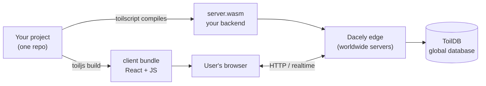
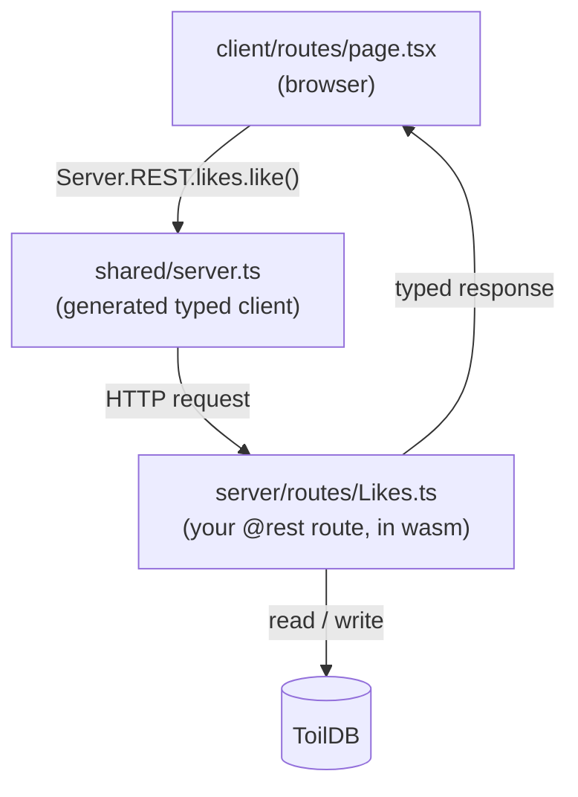

# Getting started

toiljs is a full-stack web framework: you write a React frontend and a TypeScript backend in one project, and toiljs ships both together. This section takes you from "nothing installed" to "a small feature running end to end."

## What toiljs is

Think of a normal web app as two programs that have to agree with each other:

- A **frontend**: the React code that runs in your user's browser.
- A **backend**: the code that runs on a server, answers requests, and talks to a database.

Normally these live in separate projects, speak to each other over hand-written HTTP calls, and drift apart until something breaks at runtime. toiljs puts both in one repository and wires them together with types, so a change on one side shows up as a compile error on the other side instead of a bug in production.

The twist is what your backend becomes. You write it in TypeScript, but toiljs does not run it in Node.js. Instead, a compiler called **toilscript** turns your backend into **WebAssembly** (often shortened to "Wasm"): a small, fast, sandboxed program that runs at the **edge**. "Edge" just means servers spread all over the world, close to your users, so requests do not have to travel to one far-away data center. A worldwide database called **ToilDB** is built in, so you can store and read data without setting up or connecting to a database yourself.

New terms, defined once:

- **WebAssembly / Wasm**: a compact binary format that runs code in a locked-down sandbox at near-native speed. Your backend compiles to a single `.wasm` file.
- **toilscript**: the compiler that turns your TypeScript backend into that `.wasm` file. It accepts a strict subset of TypeScript (more on that below).
- **Dacely edge**: the global network of servers that runs your `.wasm` backend.
- **ToilDB**: the built-in database that lives on the edge next to your code.

## The client / server / shared mental model

Every toiljs project is organized into three folders. The most important thing to learn first is **where each piece of code actually runs**.

- **`client/`** is your React app: pages, components, and styles. It is bundled by [Vite](https://vitejs.dev) and runs **in the browser**.
- **`server/`** is your backend: HTTP routes, database access, auth. It is compiled by toilscript to `build/server/release.wasm` and runs **on the edge** (and locally when you run the dev server).
- **`shared/`** holds a file that toiljs **generates for you** (`shared/server.ts`). It is a fully typed client: the browser calls your backend through a `Server` object, and TypeScript checks every call. You do not write this file by hand.

Here is the loop in one picture:

You write both ends in TypeScript, and the generated `shared/server.ts` in the middle keeps them in sync.

## Two rules to keep in mind

These two facts explain most of how toiljs backends behave. They are covered in depth later, but it helps to meet them now.

1. **The server runs one fresh instance per request.** Every request gets a brand-new copy of your `.wasm`, and its memory is wiped when the request ends. So a normal variable you set in one request is gone by the next request. Anything that must survive (accounts, counters, posts) has to go into **ToilDB** or another store. Nothing in a plain module-level variable persists.

2. **The server is not Node.js.** toilscript compiles a strict subset of TypeScript, so you cannot `import` an arbitrary npm package into `server/` or use Node APIs like `fs`. Instead, toiljs gives you built-in globals for the common needs: `crypto`, cookies, email, the database, and more. See [Types](../concepts/types.md) and [Decorators](../concepts/decorators.md) for the details.

The client side, by contrast, is normal React. You can use React libraries and browser APIs there as usual.

## The getting-started path

Work through these pages in order:

1. **[Installation](./installation.md)**: check your Node.js version and install the toiljs command-line tool.
2. **[Create a project](./create-project.md)**: scaffold a new app and see what you get.
3. **[Project structure](./project-structure.md)**: a tour of every folder and file, and where each one runs.
4. **[Your first app](./first-app.md)**: build a tiny feature end to end, a page that calls a backend route and reads and writes one piece of ToilDB data.
5. **[Migrating an existing app](./migrating.md)**: bring a React app you already have into toiljs.

## Related

- [Documentation home](../index.md)
- [The CLI reference](../cli/index.md)
- [Frontend overview](../frontend/index.md)
- [Backend overview](../backend/index.md)
- [Database overview](../database/index.md)
- [Compute tiers (where code runs)](../concepts/tiers.md)
