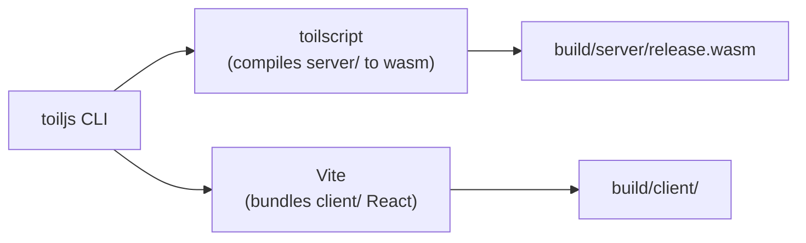

# Installation

Install the toiljs command-line tool (CLI) so you can create and run projects. This takes a couple of minutes.

## Why and when

You need the toiljs CLI once, before you create your first project. The CLI is the single tool you use to scaffold, run, build, and check toiljs apps. After a project exists, the same CLI is also installed inside that project, so day-to-day you can run it through your package scripts (`npm run dev`) without a global install.

## Prerequisites

You need **Node.js version 24.0.0 or newer**. Node.js is the JavaScript runtime that powers the toiljs CLI, the dev server, and the build. (Your backend does not run on Node.js, but the tools that build it do.)

Check your version:

```sh
node --version
```

If it prints `v24.0.0` or higher, you are set. If it is older or the command is not found, install a current Node.js from [nodejs.org](https://nodejs.org), or use a version manager like [nvm](https://github.com/nvm-sh/nvm) or [fnm](https://github.com/Schniz/fnm):

```sh
# with nvm
nvm install 24
nvm use 24
```

You also need a package manager. **npm** comes with Node.js, so you already have it. toiljs also supports **pnpm**, **yarn**, and **bun** if you prefer one of those.

## Install the CLI

The package is called `toiljs`, and it provides a command named `toiljs`. You have two ways to use it.

### Option A: run it on demand with npx (no install)

`npx` comes with npm and runs a package without installing it globally. This is the quickest way to create your first project:

```sh
npx toiljs create my-app
```

### Option B: install it globally

If you plan to create projects often, install it once so `toiljs` is always on your path:

```sh
npm install -g toiljs
```

Then you can run `toiljs` directly:

```sh
toiljs create my-app
```

Both options end up at the same place. The rest of these docs write `toiljs <command>`; if you did not install globally, just put `npx` in front (`npx toiljs <command>`).

## Verify it works

Check the version:

```sh
toiljs --version
```

You should see a version number printed (for example, `0.0.86`).

To see every command and flag, run help:

```sh
toiljs --help
```

Inside a project, there is a deeper health check called **doctor**. It inspects your setup and dependencies and tells you exactly what to fix. You will use it after you create a project, but it is good to know it exists:

```sh
toiljs doctor
```

`toiljs doctor` reads your project (its `package.json`, config, routes, and build output), runs a series of checks, and prints a grouped report. One of the first checks is your Node.js version against the required `>=24.0.0`, so if your Node is too old, doctor will say so. Add `--fix` to let it repair the things it can (such as the typed-RPC wiring), or `--json` for machine-readable output in a CI pipeline.

## How the tooling fits together

The `toiljs` CLI is a friendly front end over two underlying tools. You rarely call them directly, but it helps to know they exist.



When you create a project, both `toiljs` and `toilscript` are added to it as dependencies, so everything is pinned to versions that work together. You do not install `toilscript` separately.

## Gotchas and notes

- **"command not found: toiljs"** after a global install usually means npm's global bin folder is not on your `PATH`. Either fix your `PATH` or just use `npx toiljs ...` instead.
- **Node too old** is the most common first-time failure. WebAssembly tooling and the build depend on features in Node 24 and up. Upgrade before creating a project.
- **Every command checks for updates.** On each run, the CLI quietly checks npm for a newer toiljs and prints a note if you are behind. It never blocks the command. To turn it off, set the environment variable `TOILJS_NO_UPDATE_CHECK=1`.
- You do **not** need to install a database, a Docker container, or any cloud account to develop locally. The dev server includes a local ToilDB so your data-backed features run out of the box.

## Related

- [Create a project](./create-project.md)
- [The CLI reference](../cli/index.md)
- [Getting started overview](./index.md)
