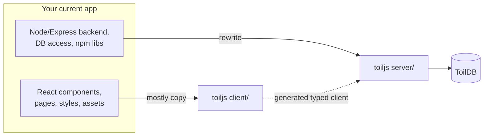

# Migrating an existing React app

How to bring a React app you already have into toiljs. The frontend usually moves over with small changes. The backend is the real work, because a toiljs server is not Node.js, and this page is honest about what that means.

## Why and when

Move to toiljs when you want your frontend and backend in one typed repo, deployed to the edge, with a built-in global database, and you are willing to rewrite your server logic against toiljs's rules. If you only want a React bundler, toiljs is more than you need. If you want the full-stack, typed, edge model, this is the payoff.

The safest approach is **not** to convert your old project in place. Instead, scaffold a fresh toiljs project and move code into it piece by piece. A fresh project comes with the required presets, config, and routing already wired, so you spend your time on your code, not on plumbing.

```sh
toiljs create my-app
cd my-app
```

## The big picture: what moves where



- Your **React frontend** copies into `client/` with modest changes (routing and asset paths).
- Your **backend** is **rewritten** into `server/` as toilscript, because it compiles to WebAssembly, not Node.

## The frontend: what changes

`client/` is a normal Vite + React app, so most of your frontend works as is. The common adjustments:

- **Routing becomes file-based.** toiljs has no `<Routes>`/`<Route>` config. A file at `client/routes/about.tsx` is the `/about` page; `client/routes/blog/[slug].tsx` is `/blog/:slug`. Move each page component to the matching file and delete your router setup. Use `Toil.Link` for navigation instead of your router's `Link`. See [Routing](../frontend/routing.md).
- **Static assets move to `client/public/`.** Files there are served as is (images at `/images/...`, plus `favicon` and `robots.txt`).
- **Global styles move to `client/styles/`**, and are imported from `client/toil.tsx`. See [Styling](../frontend/styling.md).
- **Your React npm packages are fine.** The client is regular JavaScript, so component libraries, state managers, and browser APIs all work.
- **Data fetching changes** if you want the typed client: replace hand-written `fetch('/api/...')` calls with the generated `Server.REST.*` methods. You can keep raw `fetch` too, but you lose the type safety. See [Fetching data](../frontend/data-fetching.md).

Metadata and SEO that you used a helmet library for is built in: set a `metadata` export per route, or use `Toil.Head`. See [Metadata and SEO](../frontend/metadata.md).

## The backend: the honest part

This is where migration takes real effort. Read this section carefully before you plan the work.

Your toiljs server is compiled by **toilscript** into WebAssembly. toilscript accepts a **strict subset of TypeScript**. It looks like TypeScript, but treat it as a small, separate language that happens to share the syntax. The practical consequences:

### What is NOT available on the server

- **No arbitrary npm packages.** You cannot `import` a library from `node_modules` into `server/`. There is no `express`, no `pg`, no `stripe` SDK, no `lodash`. If your route logic leans on npm libraries, that logic has to be reworked.
- **No Node.js APIs.** No `fs`, `http`, `process`, `Buffer`, `path`, or other Node built-ins. The server runs in a sandbox, not in Node.
- **No DOM or browser APIs**, because it is not a browser either.
- **No connecting to your existing database.** There is no connection string and no driver. Your data moves to **ToilDB**, the built-in database.

### What you use instead

toiljs replaces the common needs with built-in globals and decorators, so you rarely miss the missing libraries:

| You used to reach for | On the toiljs server you use |
| --- | --- |
| `express` routes / a router | `@rest` controllers with `@get` / `@post` ([HTTP routes](../backend/rest.md)) |
| A REST client between services | `@service` / `@remote` typed RPC ([RPC](../backend/rpc.md)) |
| Postgres / Mongo / Redis | [ToilDB](../database/README.md) families (documents, counters, events, views) |
| `jsonwebtoken`, session middleware | Built-in [auth](../auth/README.md) and cookies |
| `crypto` from Node | the `crypto` global (synchronous Web Crypto) ([Crypto](../services/crypto.md)) |
| `nodemailer` / an email SDK | the built-in email service ([Email](../services/email.md)) |
| `process.env` | `Environment.get()` / `Environment.getSecure()` ([Environment](../services/environment.md)) |
| `Date.now()`, timers | the `Time` global ([Time](../services/time.md)) |

### Type system differences

toilscript uses precise, explicit numeric types instead of JavaScript's single `number`. You will write `i32`, `u64`, `f64`, and even `u256`, and be explicit about integer sizes. Values that must cross the wire are `@data` classes with concrete fields, not free-form objects. There is no `any`-style duck typing to lean on. The full rules, and how server types map to `bigint` and friends on the client, are in [Types](../concepts/types.md).

### Two behaviors to design around

- **Memory resets every request.** Each request gets a fresh `.wasm` instance and its memory is wiped afterward. A module-level variable does not persist. Anything durable goes in ToilDB. (This is the same rule you met in [Your first app](./first-app.md).)
- **Reads and writes are split.** A `@get` is a read-only query; a `@post` is a write action. Operations that scan unbounded data are not allowed in a request handler; they move to a [`@derive`](../background/derive.md) or a background [daemon](../background/daemons.md).

## Configuration

Two config files replace the various configs you may have had:

- **`toil.config.ts`** is your client and build config: SEO defaults, image optimization, page transitions, and dev-server options. It uses `defineConfig`. See [Configuration](../concepts/config.md).
- **`toilconfig.json`** is the low-level server (wasm) build config. The scaffold sets sensible defaults, and you usually leave it alone.

Environment variables move from a `.env` you read with `process.env` to `.env` / `.env.secrets` files you read with `Environment.get()` / `Environment.getSecure()`. Secrets and plain vars are kept in separate buckets. See [Environment and secrets](../services/environment.md).

## Step by step

1. **Scaffold a fresh project** with `toiljs create` and get it running with `npm run dev`. Start from something that works.
2. **Move the frontend.** Copy components into `client/components/`, turn each page into a file under `client/routes/`, move styles into `client/styles/`, and static assets into `client/public/`. Swap your router's `Link` for `Toil.Link`. Install your client-side npm dependencies.
3. **Get the client rendering** against the routes, even if the data is still stubbed or points at your old backend. Fix routing and asset paths first.
4. **Rebuild the backend, one route at a time.** For each old endpoint, add a `@data` model in `server/models/`, a `@rest` controller in `server/routes/`, and move its data into a ToilDB family. Import each new route in `server/main.ts`. This is the bulk of the effort; go endpoint by endpoint.
5. **Move persistence to ToilDB.** Map each table or collection to a ToilDB family (a document store, a counter, an event log, or a view). See [Database overview](../database/README.md) for choosing a family.
6. **Switch the client to the typed client.** Replace `fetch('/api/...')` calls with `Server.REST.*` (or `Server.<service>.*` for RPC). Now a backend change that breaks the contract shows up as a client type error.
7. **Run the doctor.** `toiljs doctor` checks your wiring (routes, RPC generation, config, dependencies) and points at anything still off. Add `--fix` to let it repair what it can.

## When toiljs is not the right move

Be honest with yourself about the backend rewrite. Migration is a poor fit if:

- Your server depends heavily on npm libraries or Node-only APIs that have no toiljs equivalent, and rewriting them is not worth it.
- You must keep talking to an existing external database or service that toiljs cannot reach. (Daemons can make outbound HTTP calls in some cases, but general server-side networking is limited by design.)
- You need long-lived in-process server state that does not fit the per-request, database-backed model.

In those cases, you can still adopt toiljs for the frontend and keep your existing backend, calling it with plain `fetch`. You just give up the single-repo, end-to-end-typed benefits for that part.

## Gotchas and notes

- **Do not try to `import` server code into the client or vice versa.** They compile with different rules. The only bridge is the generated `shared/server.ts`.
- **One `@data` type per file** under `models/` matches the tooling's expectations.
- **`shared/server.ts` is generated**, so it will not exist until your first build, and you never edit it.
- **Plan the backend as a rewrite, not a port.** The frontend moves; the backend is re-expressed in toiljs's model. Budget for that.

## Related

- [Getting started overview](./README.md)
- [Backend overview](../backend/README.md)
- [Types](../concepts/types.md)
- [Database overview](../database/README.md)
- [The CLI reference](../cli/README.md)
- [Configuration](../concepts/config.md)
