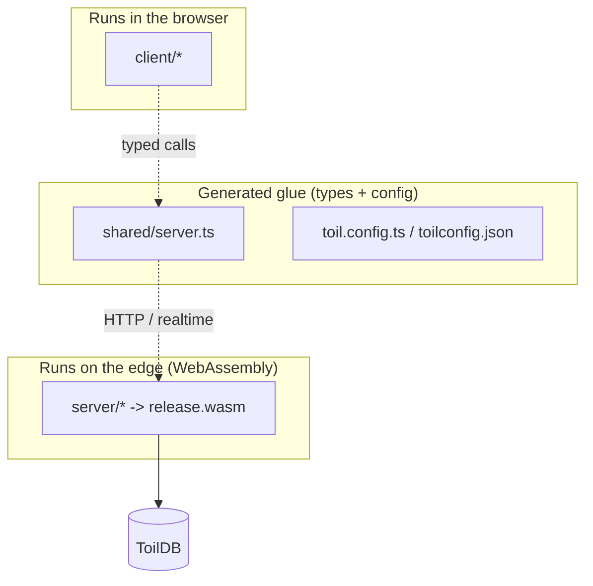
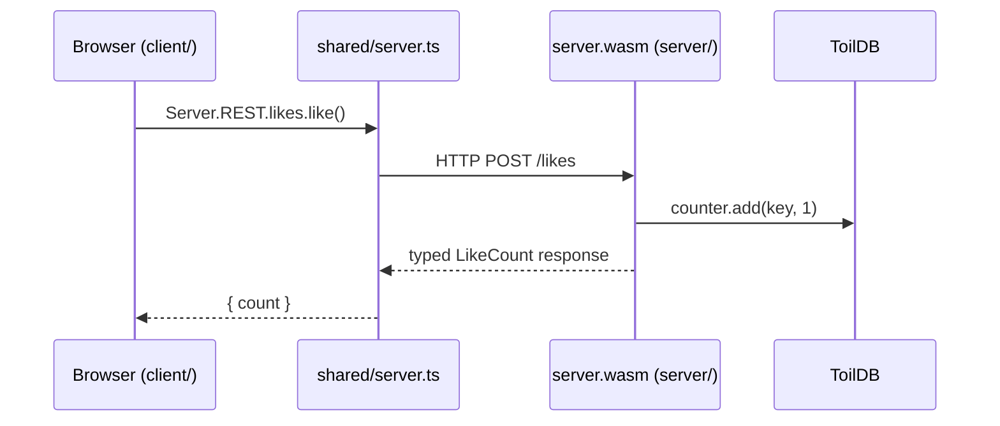

# Project structure

A tour of every folder and file in a toiljs project, what each one is for, and the single most important question: **where does this code run, the browser or the edge?**

## Why this matters

toiljs blends frontend and backend into one repo, so the same `.ts` file extension can mean two very different things. A file in `client/` becomes JavaScript that runs in your user's browser. A file in `server/` becomes WebAssembly that runs on the edge, with different rules and different available APIs. Knowing which folder you are in tells you what you are allowed to do. Keep this mental split and everything else falls into place.



## The top level

These files sit in your project root.

| File | What it is | Runs where |
| --- | --- | --- |
| `package.json` | Scripts (`dev`, `build`, `lint`, `typecheck`, `format`) and dependencies (`toiljs`, `react`, `toilscript`, ...) | tooling only |
| `toil.config.ts` | **Client and build config.** Uses `defineConfig` to set SEO, images, page transitions, and dev options. | tooling only |
| `toilconfig.json` | **Server (wasm) build config** for toilscript: the entry file, the output `.wasm` path, and low-level compile options. You rarely edit this. | tooling only |
| `tsconfig.json` | TypeScript config for the client (`client/`, `shared/`, `emails/`). Extends `toiljs/tsconfig`. | tooling only |
| `eslint.config.js` | Linting preset (`toiljs/eslint`). | tooling only |
| `.prettierrc` | Formatting preset (`toiljs/prettier`). | tooling only |
| `.prettierignore` | Files Prettier should skip (generated files). | tooling only |
| `.gitignore` | Ignores `build/`, `.toil/`, generated files, and your `.env` files. | tooling only |
| `.vscode/settings.json` | Tells VS Code to use the project's TypeScript so the toilscript editor plugin loads. | editor only |
| `toil-env.d.ts` | **Generated** editor types for client globals like `Toil.Link` and `Toil.Image`. Do not edit. | editor only |
| `toil-routes.d.ts` | **Generated** list of your real route names, so `Toil.Link href="..."` type-checks. Filled in on the first build. | editor only |
| `README.md` | Your project's readme. | docs |
| `CLAUDE.md`, `AGENTS.md`, etc. | Optional AI-assistant hint files that point tools at the toiljs docs. | docs |

Two folders you may also see at the root:

- **`.toil/`** is a working directory toiljs manages (a build cache and a copy of the docs). It is gitignored. You never edit it.
- **`.env` and `.env.secrets`** are files **you** create when you need local environment variables or secrets during `toiljs dev`. They are gitignored so you never commit them, and the edge loads their real values out of band in production. Your server reads them with `Environment.get("KEY")` and `Environment.getSecure("KEY")`. See [Environment and secrets](../services/environment.md).

## `client/` (runs in the browser)

This is a normal React app. You can use React libraries and browser APIs here freely.

```text
client/
  toil.tsx              the entry point; mounts your app
  layout.tsx            the root layout wrapping every page
  404.tsx               the not-found page
  global-error.tsx      the top-level error page
  routes/               file-based pages
  components/           shared React components
  styles/               global stylesheets
  public/               static files served as-is
```

- **`toil.tsx`** is the entry file. It imports your global styles and calls `Toil.mount(...)` to start the app. You rarely change it beyond the style imports.
- **`layout.tsx`** is your root layout: the header, footer, and page shell that wrap every route. Its `children` prop is the current page.
- **`404.tsx`** renders when no route matches. **`global-error.tsx`** renders when a route throws.
- **`routes/`** is where pages live, and the file name **is** the URL. `routes/index.tsx` is `/`, `routes/about.tsx` is `/about`, `routes/blog/[slug].tsx` is `/blog/:slug`. This is called **file-based routing**. See [Routing](../frontend/routing.md).
- **`components/`** holds React components you reuse across pages. Nothing here is a route.
- **`styles/`** holds your global CSS (or Sass, Less, or Stylus, if you chose one). See [Styling](../frontend/styling.md).
- **`public/`** holds static files served exactly as they are: `favicon`, `robots.txt`, and an `images/` folder (reachable at `/images/...`). The `public/index.html` is the base HTML shell your app mounts into.

A single global, `Toil`, is available in client code without an import (for `Toil.Link`, `Toil.Image`, and `Toil.Head`). It is typed by the generated `toil-env.d.ts`.

## `server/` (runs on the edge, as WebAssembly)

This is your backend. It is compiled by toilscript into one `.wasm` file. Remember the two rules: **memory resets every request**, and **this is not Node.js** (a strict TypeScript subset, no arbitrary npm packages). See [Backend overview](../backend/README.md) and [Types](../concepts/types.md).

```text
server/
  main.ts               the entry: wires the handler + imports your modules
  tsconfig.json         server-only TS config (loads the toilscript editor plugin)
  toil-server-env.d.ts  generated editor types for server globals
  core/                 your request handler and shared logic
  models/               @data classes
  routes/               @rest controllers (HTTP)
  services/             @service / @remote (typed RPC)
  migrations/           ToilDB schema migrations
  scheduled/            reserved for scheduled tasks
```

- **`main.ts`** is the entry the build compiles. It does three required things: it sets `Server.handler` (a factory that returns one fresh handler per request), it re-exports the wasm entry points (`export * from 'toiljs/server/runtime/exports'`), and it defines the `abort` hook. It also `import`s your other server modules so a direct toilscript run builds the same code.
- **`core/`** holds your top-level `ToilHandler` (often `AppHandler.ts`): the first code that sees each request. It can dispatch to your `@rest` controllers and then fall through to any hand-written logic.
- **`models/`** holds your `@data` classes, one type per file. A `@data` class is a typed message that can cross the wire between client and server (and into ToilDB). See [Data types](../backend/data.md).
- **`routes/`** holds your `@rest` controllers: classes decorated with `@rest`, `@get`, and `@post` that expose HTTP endpoints. See [HTTP routes](../backend/rest.md).
- **`services/`** holds `@service` classes and free `@remote` functions: typed remote calls the client makes as plain function calls (no URLs). See [Typed RPC](../backend/rpc.md).
- **`migrations/`** holds ToilDB schema migrations. When you change the shape of a stored `@data` type, you add a `<Type>.migration.ts` here that carries old records forward. The compiler enforces this convention. See [Documents](../database/documents.md).
- **`scheduled/`** is reserved for scheduled tasks. New decorated files anywhere under `server/` are picked up automatically by the build.
- **`tsconfig.json`** and **`toil-server-env.d.ts`** are editor-support files. They teach your editor about the server globals (`crypto`, `Cookie`, `Environment`, and friends) so it stops flagging them. They do not affect the build.

### How the build discovers your server code

You do not register routes in a config file. The compiler scans every `.ts` file under `server/` and picks up anything that declares a decorated surface (`@rest`, `@service`, `@remote`, `@data`, `@user`, `@database`, and so on). Importing those files from `main.ts` is still good practice: it keeps a direct `toilscript` run building the exact same server.

## `shared/` (generated glue)

```text
shared/
  server.ts             GENERATED typed client (do not edit)
```

**`shared/server.ts` is written for you** by the server build. It contains:

- A typed `Server` object the browser uses to call your backend: `Server.REST.*` for HTTP routes and `Server.<service>.*` for RPC.
- The client-side codecs for every `@data` class, so responses come back as real typed objects.
- A `getUser()` helper for reading the signed-in user on the client.

Because it is generated, it does not exist in a fresh project and it is gitignored. It appears the first time you run `toiljs dev` or `toiljs build`. Never hand-edit it; change your server code and it regenerates.

## `build/` (compiled output)

```text
build/
  server/release.wasm   your compiled backend (+ release.wat, a readable text form)
  client/               the bundled React app (from Vite)
```

This is what actually ships. It is gitignored and recreated by `toiljs build`. You do not edit anything here.

## Putting it together: one request



The browser calls a typed method, the generated client turns it into an HTTP request, your `.wasm` handles it and touches ToilDB, and a typed result comes back. You wrote both ends; the middle is generated.

## Gotchas and notes

- **A `.ts` file's folder decides its rules.** The same code that works in `client/` may not compile in `server/`, because the server is a strict subset without Node APIs.
- **Do not edit generated files.** `shared/server.ts`, `toil-env.d.ts`, `toil-routes.d.ts`, and `toil-server-env.d.ts` are all regenerated by the build and will overwrite your changes.
- **One `@data` type per file** under `models/` keeps things tidy and matches the convention the tooling expects.
- **`build/` and `.toil/` are disposable.** Delete them and the next build recreates them.

## Related

- [Your first app](./first-app.md)
- [Frontend overview](../frontend/README.md) and [Routing](../frontend/routing.md)
- [Backend overview](../backend/README.md)
- [Database overview](../database/README.md)
- [Configuration](../concepts/config.md)
- [Decorators reference](../concepts/decorators.md)
