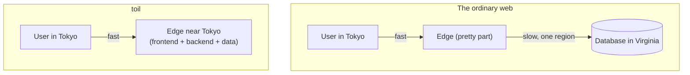

# Understanding toil

This section is the "why." The rest of the docs teach you how to build with toil. These pages explain what
toil is, the problem it solves, how it works underneath, and why it is built the way it is. If you read
nothing else first, read this. It is what turns "another framework" into "oh, that is the point."

## The one big idea

Almost every website you use has a split personality. The pretty part (the pages, the buttons) is served
from servers all over the world, close to you, so it loads fast. The important part (the database, where
your data actually lives and changes) sits in **one place**, one region, often one machine. When you post a
comment in Tokyo and the database is in Virginia, your click flies halfway around the planet and back
before anything happens.

toil removes the split. Your **frontend** (React) and your **backend** (TypeScript, compiled to a tiny
WebAssembly program) both run at the **edge**, on servers near your users, worldwide. And the database
(**ToilDB**) is distributed too, so writes do not have to travel to one far-away box. One language, one
project, one deploy, and the whole thing runs close to everyone.

That is the entire pitch. Everything else on these pages is the detail of how toil pulls it off and why
almost nobody else does.

## Read these in order

1. **[Why toil? Who is it for?](./why-toil.md)** The problem with today's stacks, what toil gives you in
   return, who benefits most, and the honest cases where you should not use it.
2. **[How toil works](./how-it-works.md)** The whole machine end to end: your React client, your
   TypeScript backend compiled to WebAssembly, the edge that runs it, ToilDB, and the four compute tiers.
3. **[What makes toil hyper-scalable](./hyperscale.md)** What "hyper-scale" actually means, and the
   specific mechanisms (edge compute, WebAssembly isolation, an allocation-free hot path, no origin server)
   that let one small program serve the planet.
4. **[How toil is distributed](./distributed.md)** The hardest problem in web infrastructure, distributing
   the writes, why it makes truly distributed websites so rare, and how ToilDB solves it.
5. **[toil versus other frameworks](./vs-other-frameworks.md)** An honest comparison with Next.js, Rails and
   Django, serverless functions, edge runtimes, and backend-as-a-service platforms.
6. **[Why toil is built this way (the RSG bar)](./design-principles.md)** The rubric toil grades itself
   against, and why hitting the top grade forces almost every design decision.

## The short version

- **Who it is for:** people building real products who want global speed and reliability without hiring a
  platform team or stitching together ten vendors. See [Why toil](./why-toil.md).
- **Why it is fast:** the code runs next to the user, there is no slow trip to a central origin, and the hot
  path does no wasted work. See [Hyper-scale](./hyperscale.md).
- **Why it is different:** it distributes the writes, not just the reads, which is the thing that usually
  quietly caps a "global" system. See [Distributed](./distributed.md).
- **Why it is safe:** the backend is a sandbox, passwords never reach the server in a usable form, secrets
  never ship in the code, and the browser verifies every asset it loads. See
  [Security](../concepts/security.md).

When you are ready to build, jump to [Getting started](../getting-started/README.md).
