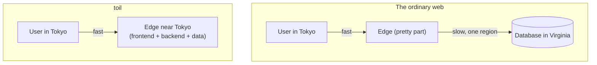

# Understanding toil

This section is the "why." It explains what toil is, the problem it solves, how it works underneath, and why it is built the way it is. If you read nothing else first, read this: it is what turns "another framework" into "oh, that is the point."

## The one big idea

Almost every website has a split personality. The pretty part (pages, buttons) is served from servers all over the world, close to you. The important part (the database, where your data lives and changes) sits in **one place**, one region, often one machine. Post a comment in Tokyo when the database is in Virginia and your click flies halfway around the planet and back before anything happens.

toil removes the split. Your **frontend** (React) and **backend** (TypeScript, compiled to a tiny WebAssembly program) both run at the **edge**, near your users, and **ToilDB** is distributed too, so writes do not travel to one far-away box. One language, one project, one deploy, running close to everyone.

That is the entire pitch. The rest of these pages is how toil pulls it off, and why almost nobody else does.

## Read these in order

1. **[Why toil? Who is it for?](./why-toil.md)** The problem with today's stacks, who benefits most, and the honest cases against.
2. **[The modern stack](./modern-stack.md)** The full catalog of modern tech baked in with zero setup.
3. **[How toil works](./how-it-works.md)** The whole machine end to end: React client, WebAssembly backend, the edge, ToilDB, the four compute tiers.
4. **[What makes toil hyper-scalable](./hyperscale.md)** What "hyper-scale" means, and the mechanisms that let one small program serve the planet.
5. **[How toil is distributed](./distributed.md)** The hardest problem in web infrastructure, distributing the writes, and how ToilDB solves it.
6. **[toil versus other frameworks](./vs-other-frameworks.md)** An honest comparison with Next.js, Rails, Django, serverless, edge runtimes, and backend-as-a-service.
7. **[Why toil is built this way (the RSG bar)](./design-principles.md)** The rubric toil grades itself against.

## The short version

- **Who it is for:** people building real products who want global speed and reliability without a platform team or ten stitched-together vendors. See [Why toil](./why-toil.md).
- **Why it is fast:** the code runs next to the user, with no slow trip to a central origin. See [Hyper-scale](./hyperscale.md).
- **Why it is different:** it distributes the writes, not just the reads. See [Distributed](./distributed.md).
- **Why it is safe:** the backend is a sandbox, passwords never reach the server in a usable form, secrets never ship in the code, and the browser verifies every asset it loads. See [Security](../concepts/security.md).

When you are ready to build, jump to [Getting started](../getting-started/README.md).
