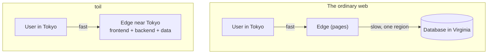

# Understanding toil

toil is one framework for a whole web app: the frontend, the backend, and the database, in a single project, all running close to your users.

You write React for the client and TypeScript for the server. toil compiles the server to WebAssembly and runs it at the edge, next to whoever is asking. Auth, database, email, realtime, and background jobs are already built in. Nothing to wire up, nothing to configure. A pizza site gets the same infrastructure a funded team would rent from ten separate vendors.

This section explains what that means and why it holds up. Start here, then follow the links at the end.

## What toil is

A toil project has three parts in one folder:

- `client/` is your React app: file-based routing, data loaders, and a typed client for calling the server.
- `server/` is your backend, plain TypeScript marked up with decorators like `@rest`, `@data`, and `@auth`. toil compiles it to a small sandboxed WebAssembly module.
- ToilDB is your database. It is already there. No connection string, no instance to spin up.

Types tie the three together. Change a field on the server and the client stops compiling until you fix it. Edge deployment, post-quantum login, and asset tamper-proofing are on by default, not features you bolt on later.

## The problem it solves

Most apps read fast and write slow. Pages load from caches everywhere, but a write, say a comment or an order, has to reach one database in one region. A user in Tokyo writing to Virginia waits for the trip there and back. That single region is also a single point of failure.

toil closes the gap in two moves. Your code runs at the edge instead of one origin. And ToilDB is built to distribute the writes, not just the reads: every key has a home region that orders its writes, while the data copies outward so reads stay local and quick.

Spreading reads is easy, and everyone does it. Spreading writes is the hard part, and it is why most "global" apps are only global for reading.

## Where to go from here

Read these in order. Each one builds on the last.

1. **[Why toil, and who it is for](./why-toil.md)** What is wrong with a modern stack, who gains most from toil, and the honest cases against it.
2. **[What comes built in](./modern-stack.md)** The full list of what toil owns and runs for you, and what it does not.
3. **[How toil works](./how-it-works.md)** The whole path, from a React click through WebAssembly to ToilDB and back.
4. **[Why it scales cheaply](./hyperscale.md)** How one small program can serve the whole planet without a per-app server bill.
5. **[How toil distributes writes](./distributed.md)** The hardest problem in web infrastructure, and how ToilDB is built to solve it.
6. **[toil next to other stacks](./vs-other-frameworks.md)** A fair comparison with Next.js, Rails, serverless, and the rest, wins and losses both.
7. **[The bar toil holds itself to](./design-principles.md)** The RSG rubric, and its one rule: your grade is your weakest part.

## The short answer

- **Who it is for:** anyone shipping a real product who wants global speed without a platform team or ten stitched-together services.
- **Why it is fast:** the code runs next to the user, with no trip to a distant origin.
- **Why it is different:** it distributes writes, not only reads.
- **Why it is safe:** the backend is sandboxed, passwords never reach the server in a usable form, secrets never ship in the code, and the browser checks every file it loads.

Ready to build? Jump to [Getting started](../getting-started/README.md).
