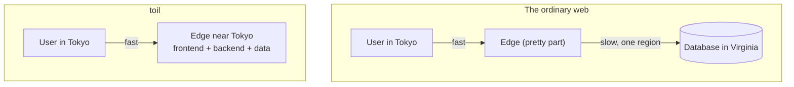

# Understanding toil

toil is one framework that gives you AAA-grade, hyper-scale infrastructure with zero configuration and no networking or distributed-systems knowledge required. You write a React frontend and a TypeScript backend in one project; toil runs both, plus a database, close to your users worldwide. Post-quantum login is one line. It just works out of the box.

Top-tier infrastructure is normally something a funded team assembles from ten rented vendors and babysits with deep expertise. toil makes the good version the default version, in a single framework, so a solo builder starts from the same baseline as that team. This section is the "why": what toil is, the problem it solves, how it works underneath, and why it is built the way it is. If you read nothing else first, read this. It is what turns "another framework" into "oh, that is the point."

## The one big idea

Almost every website has a split personality. The pretty part (pages, buttons) is served from machines all over the world, close to you. The important part (the database, where your data lives and changes) sits in **one place**, one region, often one machine. Post a comment in Tokyo when that database is in Virginia and your click flies halfway around the planet and back before anything happens.

toil is built to remove the split. Your **frontend** (React) and **backend** (TypeScript, compiled to a tiny WebAssembly program) both run at the **edge**, near your users. And **ToilDB** is built to distribute the writes too, so a write does not have to travel to one far-away box: every key has a home region that orders its writes, while the data replicates outward for fast local reads. One language, one project, one deploy, running close to everyone.

That is the entire pitch. Distributing reads is easy and everyone does it; distributing the **writes** is the hard part almost nobody does, and it is the reason most "global" apps are only half global. The rest of these pages is how toil pulls it off, and why it stays honest about what is live today versus what is built and deployment-gated.

## Read these in order

1. **[Why toil? Who is it for?](./why-toil.md)** The problem with today's stacks, who benefits most, and the honest cases against.
2. **[The modern stack](./modern-stack.md)** The full catalog of modern tech baked in, owned by toil, with zero setup.
3. **[How toil works](./how-it-works.md)** The whole machine end to end: React client, WebAssembly backend, the edge node, and ToilDB.
4. **[What makes toil hyper-scalable](./hyperscale.md)** What "hyper-scale" means, and the mechanisms that let one tiny program serve the planet.
5. **[How toil is distributed](./distributed.md)** The hardest problem in web infrastructure, distributing the writes, and how ToilDB is built to solve it.
6. **[toil versus other frameworks](./vs-other-frameworks.md)** An honest comparison with Next.js, Rails, Django, serverless, edge runtimes, and backend-as-a-service.
7. **[Why toil is built this way (the RSG bar)](./design-principles.md)** The internal rubric, graded AAA down to D on its weakest axis, that toil holds itself against.

## The short version

- **Who it is for:** people building real products who want global speed and reliability without a platform team or ten stitched-together vendors. See [Why toil](./why-toil.md).
- **Why it is fast:** the code runs next to the user, with no slow trip to a central origin. See [Hyper-scale](./hyperscale.md).
- **Why it is different:** it is built to distribute the writes, not just the reads. See [Distributed](./distributed.md).
- **Why it is safe:** the backend is a sandbox, passwords never reach the server in a usable form (real post-quantum auth), secrets never ship in the code, and the browser verifies every asset it loads. See [Security](../concepts/security.md).

One framework, zero config, AAA-grade from the first line. When you are ready to build, jump to [Getting started](../getting-started/README.md).
