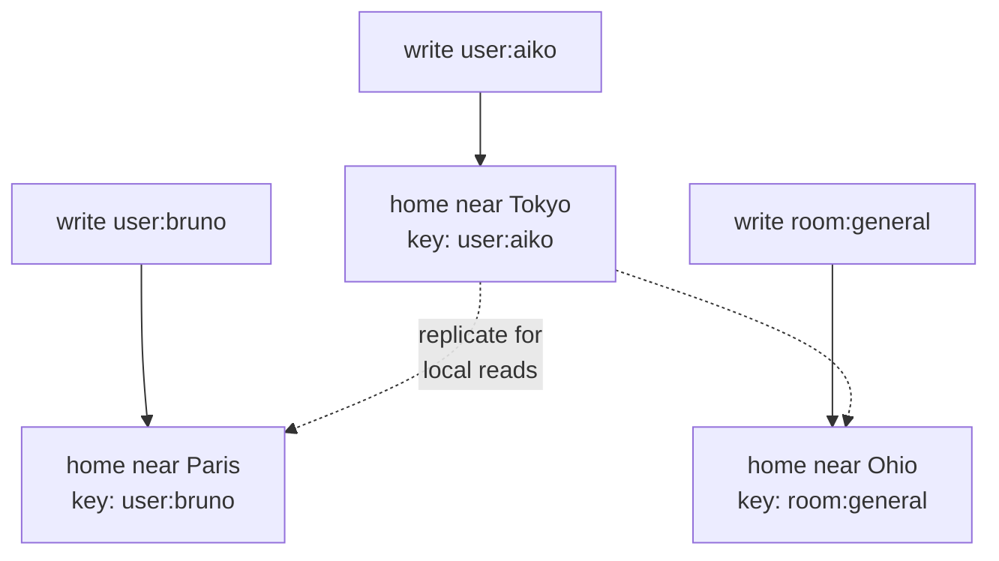

# How toil is distributed

Spreading a website's reads across the world is easy. Spreading its writes is hard, and almost nobody solves it. That is why most "global" apps are only global for reading. This page covers the problem and how ToilDB, the database built into toil, is built to distribute the writes.

## Why writes are the hard part

A read changes nothing, so you copy your data to servers worldwide and let each user read the nearest copy. Every copy agrees. A reader in Tokyo and one in Paris both get a fast, local answer.

A write is a change, and two writes to the same key can collide. A counter says `10`. Tokyo and Paris both read `10`, both add one, both write `11`. The real answer was `12`. One add vanished, with no error. That is a **write conflict**.

You could make every copy agree before accepting a write. The network, though, will eventually split into a **partition**. During a split the **CAP tradeoff** says you keep only two of three: consistency, availability, and partition tolerance. You either refuse the write, which is correct but unavailable, or accept it on one side and reconcile later, which is available but briefly inconsistent. Distributing writes is a tradeoff to design around. There is no patch that removes it.

## The usual fix: one write database

So nearly every stack keeps **one** primary write database in **one** region and spreads only read replicas worldwide. Every write funnels to that one box, one at a time, so conflicts cannot happen.

It is a reasonable choice. It also hides two costs the [RSG rubric](./design-principles.md) flags on its data-path axis:

- **Far writes are slow.** Post from Tokyo to a primary in Virginia, and the write crosses the planet and back before anything saves. The page loaded locally. The write did not.
- **The primary is a single point of failure.** One region holds every write. If it has a bad day, nothing anywhere can change.

The read path is global. The write path is one machine in one city. Under RSG's weakest-link rule, that single data path caps the whole system.

## ToilDB's model: one home per key

ToilDB gives **every key its own home**. A key is the label you store data under: a user id, a username, a room name. See the [database overview](../database/README.md). Each key gets one home: the single source of truth that orders its writes.

Two things follow from that:

- **Writes to one key are safe.** Every write to a key travels to that key's home, which **serializes** them: it applies them one at a time, in order. Both counter adds are ordered at the counter's home, so the result is `12`. No global lock over the whole database.
- **Writes spread worldwide.** Different keys get different homes, so total write load spreads out. Tokyo users' data can home near Tokyo, Paris users' near Paris. No single box carries every write, so no single bottleneck.

Reads stay local. Each key still replicates outward, so a reader anywhere gets a nearby copy. Those copies are **eventually consistent**. For a brief moment after a write lands at the home, a far read can lag before it catches up. That moment is usually a few milliseconds, and for almost all app data it is invisible. The [database overview](../database/README.md) has the full picture.

A shared formula decides which location owns a key. It is called rendezvous hashing, and every node computes it the same way, so any node routes a write to the right home with no central coordinator. A key's home can move to follow demand, without rehashing the database.

## The seven families

One "home orders the writes" rule fixes the counter. Different jobs, though, want different guarantees. So ToilDB ships **seven families**. Each is a collection type tuned for one shape of data, and each exposes only the operations that are safe and fast for it.

| Family | What it gives |
| --- | --- |
| [Documents](../database/documents.md) | A record you look up by id |
| [Counters](../database/counters.md) | Conflict-free tallies: adds from anywhere merge, no lost updates |
| [Unique](../database/unique.md) | A one-of-a-kind claim (a username); the home picks exactly one winner |
| [Capacity](../database/capacity.md) | Limited stock (tickets); reserve/confirm/cancel holds prevent overselling |
| [Events](../database/events.md) | An append-only log in one agreed order |
| [Membership](../database/membership.md) | Sets of who belongs to what |
| [View](../database/views.md) | A read-optimized result a background job builds |

Distributing writes has no single answer. Each family is the right tool for one shape of data.

## The machinery underneath

The per-key-home model only works if a lot of unglamorous machinery runs reliably across a flaky network. ToilDB owns all of it:

- Per-key **placement** and safe **rehoming**: a rising epoch plus a fencing token, so the old owner stops the instant the new one takes over.
- Ordered **cross-region replication** with per-stream cursors that detect and backfill gaps.
- **Idempotent apply**, so a redelivered write cannot double-count.
- **Capacity escrow** and **tenant quotas**.
- **Failover** with snapshot re-seeding for a cell that has fallen too far behind.

Getting all of these right at once is why truly distributed websites are rare.

## What is real today

This is the hard part that almost nobody ships, so here is a straight account of where it stands.

The per-key-home model and all its core logic are **built and tested**: placement, rehoming, replication, idempotent apply, escrow, quotas, failover. This is running code, and it passes its tests.

The **live multi-region deployment** is not on by default. Wiring many real regions into one running mesh (the WAN routing) and the [ScyllaDB](https://www.scylladb.com/) storage that backs a production cluster are **configuration-gated**. You switch them on for a real deployment. You do not get a live global write cluster automatically. The full database-level **leader fencing** on the write path is also still landing, and a host-side leader gate is the current version. The design is settled. What remains is the last-mile host wiring.

On your laptop, `toiljs dev` runs a single **in-process** database. Everything homes in one place, so your code behaves exactly as it will worldwide. The distribution only spreads out once you deploy with the multi-cell backing configured. You write your app the same way either way.

toil is **built** to distribute writes worldwide. The mechanism runs today. Turning it on across live regions is a deployment step, not a rewrite of your app.

## Related

- [The database (ToilDB)](../database/README.md): families, keys and values, and eventual consistency in depth.
- [Compute tiers](../concepts/tiers.md): where your code runs, the compute side of the same story.
- [What makes toil hyper-scalable](./hyperscale.md): the mechanisms that let one small program serve the planet.
- [Why toil is built this way (the RSG bar)](./design-principles.md): the rubric behind the data-path axis.
