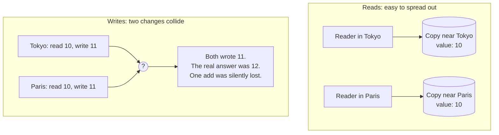
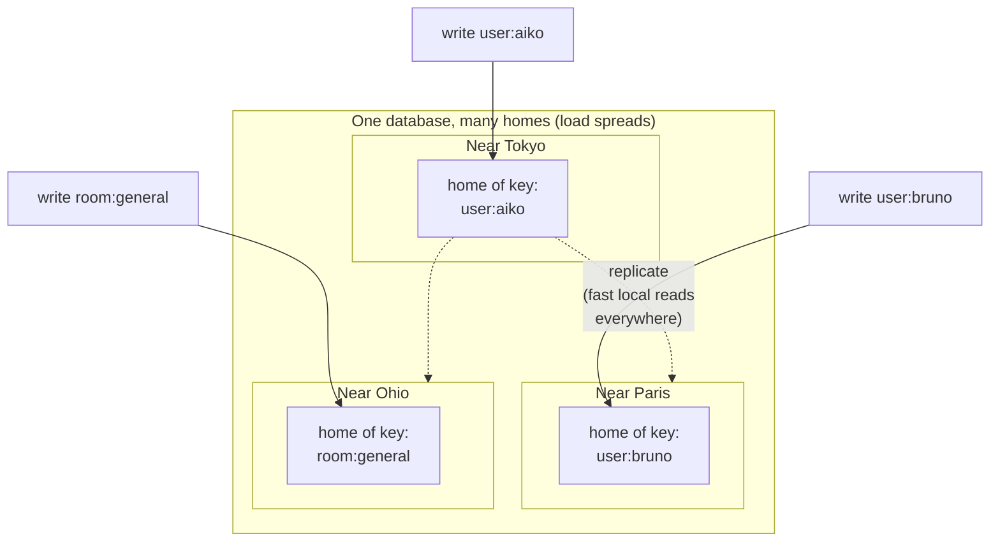

# How toil is distributed (and why distributed websites barely exist)

Distributing a website's reads is easy. Distributing its writes is the hard problem almost
nobody solves, and it is the reason "global" apps are usually only half global. This page
explains the problem in plain terms and shows how ToilDB, the database built into toil,
actually distributes the writes.

## Reads are easy, writes are hard

Start with two words. **Consistency** means everyone sees the same data. **Replication** means
keeping copies of that data in more than one place so a reader nearby can be served quickly.

Reads are easy to distribute. You take your data, copy it to servers all over the world, and
let each user read from the copy nearest them. Nobody is changing anything, so every copy can
say the same thing. A reader in Tokyo and a reader in Paris both get a fast, local answer. Done.

Writes are where it falls apart. A **write** is a change: a new comment, an updated profile, one
more like. The trouble is what happens when two changes to the *same thing* arrive at the same
moment in two different places.

Picture a shared counter that says `10`. Two servers, one in Tokyo and one in Paris, both try to
add one at the same instant:

Each server read `10`, each added one, each wrote back `11`. The counter should say `12`. One of
the two increments just vanished, and nobody got an error. This is a **write conflict**: two
changes to one thing that cannot both be right, and no obvious way to pick.

You might think "just make every copy agree before accepting the write." That works, but it is
slow, and there is a deeper catch. It is called the **CAP tradeoff**, and here it is in plain
words. C, A, and P stand for Consistency, Availability, and Partition tolerance. A **partition**
is when the network breaks for a moment and two parts of your system cannot talk to each other,
which on a worldwide network is not an "if" but a "when". CAP says that during that break you
only get to keep two of the three:

- Keep **consistency**: refuse to accept the write until everyone can agree again. Correct, but
  the user is now stuck waiting or getting an error. You gave up availability.
- Keep **availability**: accept the write on whichever side is reachable and reconcile later.
  Fast and always-on, but for a moment two regions disagree. You gave up strict consistency.

There is no third option that keeps all three when the network splits. So distributing writes
is not a matter of trying harder. It is a genuine tradeoff you have to design around, on purpose.

## So almost everyone centralizes the write database

Faced with that, nearly every stack makes the same move: keep **one** primary write database, in
**one** region, and distribute only read replicas (the copies) around the world. Writes all
travel to that one box, where they are handled one at a time, so conflicts cannot happen. Reads
are served locally and feel global.

It is a reasonable choice, and it hides two costs that the [RSG rubric](./design-principles.md)
(toil's internal design bar) calls out on its **data path** axis, the axis it considers the
hardest to lift:

- **Far writes are slow.** If the primary is in Virginia and you post a comment from Tokyo, your
  write flies across the planet and back before anything is saved. The pretty pages loaded from a
  server down the street, but the *action* took a round trip across an ocean.
- **The primary is a single point of failure.** One region holds every write. If it has a bad
  day, the whole app cannot accept changes anywhere on earth, no matter how many read replicas
  are still up.

This is the quiet lie behind most "global scale" claims. The read path is global. The write path
is one machine in one city. Under RSG's weakest-link rule, that caps the whole system at the
level of its centralized data path, however fast and worldwide everything else looks.

## ToilDB's answer: every key has a home

ToilDB's answer is not to have one home for the whole database. It is to give **every key its own
home**.

A **key** is the label you store data under: a user id, a username, a room name (see
[the database overview](../database/README.md) for the key-then-value model shared by all
families). In ToilDB, each individual key is assigned one **home**: a single owning location that
is the source of truth for that key and the only place its writes are ordered.

Two things follow from that, and together they are the whole trick.

**Writes to one key are safe.** Every write to a given key travels to that key's home, where the
home **serializes** them, meaning it lines them up and applies them one at a time, in order. Go
back to the counter: both the Tokyo and Paris adds are ordered at that counter's home, so the
result is `12`, not `11`. Concurrent writes to the same thing are race-safe, without one global
lock sitting over the entire database.

**Writes spread across the world.** Because *different* keys get *different* homes, the total
write load is spread out. Your Tokyo users' data can home near Tokyo while your Paris users' data
homes near Paris. There is no single box every write funnels through, so no single bottleneck and
no single point of failure for writes in general.

And reads stay local. Each key's data still replicates out to other regions, so a reader
anywhere gets a fast copy nearby. Those local reads are **eventually consistent**: right after a
write lands at the home, it takes a brief moment (usually milliseconds) to fan out, so a far-away
read can lag the home for that moment. The home is always the source of truth; the copies always
catch up. This is the honest tradeoff, and for the vast majority of app data it is invisible. The
database page has the full picture: see [eventual consistency](../database/README.md).

Which location owns a given key is decided by a shared formula (rendezvous hashing) that every
edge node computes the same way, so any node can route a write to the right home without asking a
central coordinator. When traffic patterns shift (a user emigrates and their writes now come from
a new region), a key's home can move to follow the demand, without rehashing the whole database.

## The seven families pick the right consistency tool

A single "home orders the writes" rule already fixes the counter. But different jobs want
different guarantees, and forcing all of them through one mechanism would be slower than it needs
to be. So ToilDB ships **seven families**, each a collection type tuned for one shape of data,
each exposing only the operations that are safe and fast for that shape. Three of them show off
three different distributed-write strategies:

- **Counter** is a **CRDT**, a conflict-free replicated data type. That is a fancy name for a
  simple property: its only write is "add this delta," and deltas from anywhere in the world
  **merge** with no lost updates, in any order. Because addition does not care about order, a
  counter does not even need a round trip to its home to be correct. Concurrent adds from Tokyo
  and Paris both count. See [Counters](../database/counters.md).
- **Unique** and **Capacity** are the opposite: they need a single referee. Unique claims a
  one-of-a-kind value, like a username, and the home picks **exactly one winner** when two people
  race for the same name. Capacity hands out a limited quantity, like tickets, and the home
  prevents overselling with a reserve/confirm/cancel hold, so two buyers can never both get the
  last seat. These lean directly on "the home decides." See [Unique](../database/unique.md) and
  [Capacity](../database/capacity.md).
- **Events** is an ordered, append-only **log**: you add entries and read the newest, but never
  edit history. The home gives the log its single agreed order. See [Events](../database/events.md).

The other three round out the set: **Documents** (a record you look up by id), **Membership**
(sets of who belongs to what), and **View** (a read-optimized published result a background job
builds). The [database overview](../database/README.md) has a decision guide for picking one. The
point for this page: distributing writes is not one problem with one answer. It is a handful of
different problems, and each family is the right tool for one of them.

## The hard machinery toil provides so you do not have to

Everything above sounds tidy in a diagram. Making it real is where truly distributed websites go
to die, because the per-key-home model only works if a large amount of unglamorous machinery
works, all the time, across an unreliable network. ToilDB builds that machinery so your app does
not have to:

- **Placement and rehoming.** Deciding each key's home, agreeing on it across every node without a
  central lookup, and safely moving a home when demand shifts, using a rising epoch and a fencing
  token so the old owner stops accepting writes the instant the new one takes over.
- **Cross-region replication.** Streaming each home's writes to the other regions' copies, in
  order, with a per-stream **cursor** (a bookmark of how far each copy has caught up), so a
  dropped message is detected as a gap and backfilled instead of silently skipped.
- **Deduplication and idempotency.** The network redelivers messages, so the same write can arrive
  twice. ToilDB tags each write with an id and applies it **idempotently**, meaning applying it a
  second time changes nothing, so retries and duplicates cannot corrupt the data.
- **Capacity escrow and tenant quotas.** A two-phase hold (reserve, then confirm or cancel, with
  a timeout that auto-releases) so limited stock is never oversold, plus per-tenant ceilings so
  one noisy app cannot starve the shared database.
- **Failover and recovery.** Ownership roles are leased and fenced, so if a node dies a standby
  takes over cleanly. A cell that has fallen so far behind that the change log no longer covers
  the gap is re-seeded from a **snapshot** (a full copy of the current state) and then resumes
  streaming.

That list is exactly why this is rare. Any one item is a serious engineering project; a stack has
to get all of them right at once, and most teams reasonably decide that centralizing the write
database is cheaper than building this. toil's bet is that owning this machinery once, inside the
platform, is what lets an ordinary app be genuinely distributed without a dedicated infra team.

### What is shipped, and what is still being finished

Being honest about the boundary matters here:

- **Shipped:** the per-key home model, all seven families end to end, per-key placement and the
  rehome decision logic, replication with cursors plus dedup plus idempotent apply, capacity
  escrow, tenant quotas, and snapshot-based recovery. These are built and tested in the toildb
  crate.
- **Still being finished:** the live multi-cell **WAN routing** (wiring many real regions across
  the wide-area network into one running mesh) and the full database-level **leader fencing** on
  the write path (the host-side leader gate is the current version; the deeper end-to-end write
  fence is in progress). The design is settled; the last-mile host wiring is the work that remains.

## Related

- [The database (ToilDB)](../database/README.md): families, keys and values, and eventual
  consistency in depth.
- [Compute tiers](../concepts/tiers.md): where your code runs, from the per-request edge (L1) to a
  single global coordinator (L4), the compute side of the same distribution story.
- [What makes toil hyper-scalable](./hyperscale.md): the mechanisms that let one small program
  serve the planet.
- [Why toil is built this way (the RSG bar)](./design-principles.md): the design rubric that makes
  the distributed data path a non-negotiable axis.
