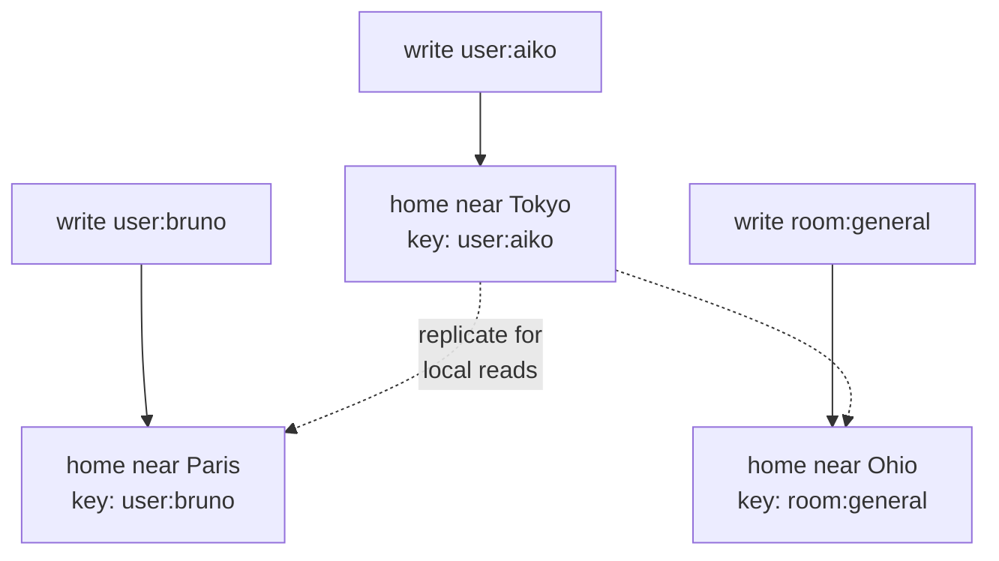

# How toil is distributed

Distributing a website's reads is easy. Distributing its writes is the hard part almost nobody solves, and it is why "global" apps are usually only half global. Here is the problem, and how ToilDB (the database built into toil) is built to distribute the writes.

## Reads are easy, writes are hard

A read never changes anything, so you copy your data to servers worldwide and let each user read the nearest copy. Every copy agrees: a reader in Tokyo and one in Paris both get a fast, local answer.

A write is a change, and two writes to the *same thing* can collide. A counter says `10`. Tokyo and Paris both read `10`, both add one, both write `11`. The real answer was `12`, so one add vanished with no error. That is a **write conflict**.

You could make every copy agree before accepting a write, but the network will eventually split (a **partition**), and the **CAP tradeoff** says that during a split you keep only two of consistency, availability, and partition tolerance. You either refuse the write (correct but unavailable) or accept it on one side and reconcile later (available but briefly inconsistent). Distributing writes is a real tradeoff to design around, not a bug to patch away.

## So almost everyone centralizes the write database

Faced with that, nearly every stack keeps **one** primary write database in **one** region and spreads only read replicas worldwide. All writes funnel to that one box, one at a time, so conflicts cannot happen.

It is a reasonable choice, and it hides two costs the [RSG rubric](./design-principles.md) flags on its data-path axis:

- **Far writes are slow.** Post from Tokyo to a primary in Virginia and your write crosses the planet and back before anything saves. The page was local; the action was not.
- **The primary is a single point of failure.** One region holds every write, so if it has a bad day, nothing anywhere can be changed.

The read path is global; the write path is one machine in one city. Under RSG's weakest-link rule, that single data path caps the whole system.

## ToilDB's answer: every key has a home

ToilDB gives **every key its own home**. A key is the label you store data under (a user id, a username, a room name; see the [database overview](../database/README.md)). Each key is assigned one home: the single source of truth that orders its writes.

Two things follow, and together they are the whole trick:

- **Writes to one key are safe.** Every write to a key travels to that key's home, which **serializes** them (applies them one at a time, in order). Both counter adds are ordered at the counter's home, so the result is `12`. No global lock over the whole database.
- **Writes spread worldwide.** Different keys get different homes, so total write load spreads out. Tokyo users' data can home near Tokyo, Paris users' near Paris. No single box every write funnels through, so no single bottleneck.

Reads stay local: each key still replicates out, so a reader anywhere gets a nearby copy. Those copies are **eventually consistent**, meaning that for a brief moment (usually milliseconds) after a write lands at the home, a far read can lag before it catches up. For almost all app data this is invisible; the [database overview](../database/README.md) has the full picture.

Which location owns a key is decided by a shared formula (rendezvous hashing) every node computes the same way, so any node routes a write to the right home with no central coordinator. A key's home can move to follow demand, without rehashing the database.

## The seven families pick the right consistency tool

One "home orders the writes" rule fixes the counter, but different jobs want different guarantees. So ToilDB ships **seven families**, each a collection type tuned for one shape of data, each exposing only the operations that are safe and fast for it:

| Family | What it gives |
| --- | --- |
| [Documents](../database/documents.md) | A record you look up by id |
| [Counters](../database/counters.md) | Conflict-free tallies: adds from anywhere merge, no lost updates |
| [Unique](../database/unique.md) | A one-of-a-kind claim (a username); the home picks exactly one winner |
| [Capacity](../database/capacity.md) | Limited stock (tickets); reserve/confirm/cancel holds prevent overselling |
| [Events](../database/events.md) | An append-only log in one agreed order |
| [Membership](../database/membership.md) | Sets of who belongs to what |
| [View](../database/views.md) | A read-optimized result a background job builds |

Distributing writes is not one problem with one answer; each family is the right tool for one shape.

## The hard machinery toil provides so you do not have to

The per-key-home model only works if a lot of unglamorous machinery runs reliably across a flaky network, and ToilDB owns it: per-key **placement** and safe **rehoming** (a rising epoch plus a fencing token so the old owner stops the instant the new one takes over), ordered **cross-region replication** with per-stream cursors that detect and backfill gaps, **idempotent apply** so redelivered writes cannot double-count, **capacity escrow** and **tenant quotas**, and **failover** with snapshot re-seeding for a cell that has fallen too far behind. Getting all of these right at once is exactly why truly distributed websites are rare.

## What is real today, honestly

This is the hard part almost nobody does, so here is a straight account of where it stands.

The per-key-home model and all of its core logic (placement, rehoming, replication, idempotent apply, escrow, quotas, failover) are **built and tested**. The mechanism is real, not a diagram.

What is not on by default is the **live multi-region deployment**: wiring many real regions into one running mesh (WAN routing) and the [ScyllaDB](https://www.scylladb.com/) storage that backs a production cluster are **configuration-gated**, so you switch them on for a real deployment rather than getting a live global write cluster automatically. The full database-level **leader fencing** on the write path is also still landing (a host-side leader gate is the current version). The design is settled; the last-mile host wiring is what remains.

On your laptop, `toiljs dev` runs a single **in-process** database: everything homes in one place, so your code behaves exactly as it will worldwide, but the distribution only spreads out once you deploy with the multi-cell backing configured. You write your app the same way either way; that is the point.

The honest one-liner: toil is **built** to distribute writes worldwide, the mechanism is real, and turning it on across live regions is a deployment step, not a rewrite of your app.

## Related

- [The database (ToilDB)](../database/README.md): families, keys and values, and eventual consistency in depth.
- [Compute tiers](../concepts/tiers.md): where your code runs, the compute side of the same story.
- [What makes toil hyper-scalable](./hyperscale.md): the mechanisms that let one small program serve the planet.
- [Why toil is built this way (the RSG bar)](./design-principles.md): the rubric behind the data-path axis.
