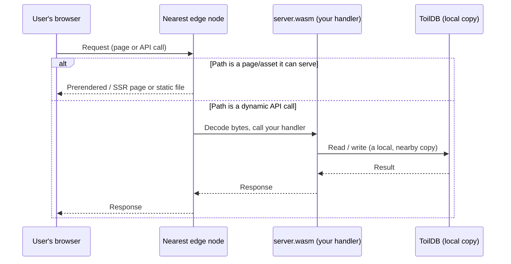

# How toil works

What your project compiles into, and what happens when a user makes a request. Every term is defined as it appears.

## What "build" produces

`toiljs build` turns your one TypeScript project into three outputs, because your code has two homes: the browser and the edge.

- **Client bundle.** Your React app plus any pages toil renders ahead of time, packaged as ordinary web files (HTML, JS, CSS, images). Runs in the browser.
- **`server.wasm`.** Your backend. You write it as normal TypeScript classes in `server/`, and the **toilscript** compiler turns it into WebAssembly. It runs on the edge, not in the browser and not in Node.
- **Generated typed client (`shared/`).** A small browser-side client toil generates from the shape of your backend. Your React code calls a normal-looking async function, and the types line up end to end: rename a field on the server and the frontend stops compiling until you fix it.

**WebAssembly** (WASM), in two sentences: a compact binary format that runs at close to native speed with no interpreter warm-up, and runs **sandboxed**, in a locked box that cannot open files, reach the operating system, or make network calls on its own. It touches the outside world only through the small, fixed set of functions the host hands it (read the request, build a response, query the database), which is what makes it safe to pack many apps onto one shared box. ([Why that matters for scale](./hyperscale.md).)

## The request lifecycle

It all happens on the **edge node nearest the user**, with no trip to a central origin.

Two terms first:

- **The edge** is a fleet of servers spread across many cities. A request is served by whichever node is physically closest, which means lower latency (the delay before something happens).
- An **origin server** is the single far machine a traditional site calls back to for anything real. toil has none: your backend and its database are replicated out to the edge, so there is nothing far away to call.

1. **The request lands on the closest edge node.** The network routes the user there automatically.
2. **Page or code?** If the path is a prerendered page, a server-rendered page, or a static asset, the edge serves it and never wakes your backend. This is the fast path for most page loads.
3. **Otherwise it runs your backend.** The edge decodes the raw bytes into a `Request` object and calls the single entry point of your `server.wasm`, which routes to your handler.
4. **Your handler reads and writes locally.** When it needs stored data it talks to [ToilDB](../database/README.md), which has a copy right there at the edge. No ocean crossing.
5. **Your handler returns a `Response`,** toil encodes it back to bytes, and the edge sends it to the browser.

The mental model for your backend: a function of the request. Bytes in, bytes out, one request at a time.

### Stateless by default

A fresh copy of your handler serves each request, and the next request might be served by a node on the other side of the planet. So anything you set on a field does not survive. This is a feature: interchangeable copies with nothing to coordinate are what let the backend scale worldwide. When you need something to persist, write it to ToilDB. See the [backend overview](../backend/README.md#stateless-by-default).

## The pieces

Five parts make up a running toil app; you have now met all of them.

| Piece | What it is | Where it runs |
| --- | --- | --- |
| **React client** | Your frontend UI, the client bundle from the build. | The user's browser |
| **toilscript backend** | Your TypeScript backend compiled to `server.wasm`. | The edge |
| **The Dacely edge** | The Rust runtime that terminates the connection, serves pages, and runs your WASM. | Servers in many cities |
| **ToilDB** | The globally distributed database, replicated next to your code. | The edge |
| **The four tiers** | Where and for how long a piece of backend code lives. | L1 nearest, up to L4 worldwide |

Most of your backend is the stateless, per-request handler above (tier **L1**). Long-lived connections (L2/L3) and single-worldwide scheduled jobs (L4 daemons) run on other tiers. Full detail, and how the build assigns them, is on the [tiers page](../concepts/tiers.md).

## Related

- [Backend overview](../backend/README.md): the request/response model and the sandbox in depth.
- [The database (ToilDB)](../database/README.md): where persistent, shared state lives.
- [Compute tiers](../concepts/tiers.md): L1 request, L2/L3 stream, L4 daemon.
- [What makes toil hyper-scalable](./hyperscale.md): why this design serves the planet cheaply.
