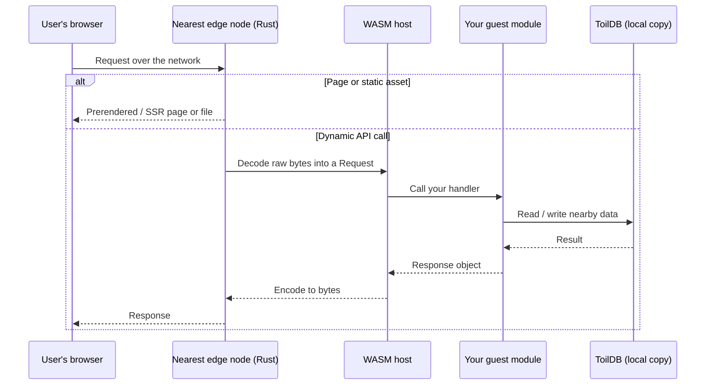

# How toil works

The whole machine, end to end: what you write, what the build produces, and what happens when a user makes a request. Every term is defined as it appears. You configure none of the moving parts below; this page just explains them.

## One project, two homes

You build a toil app as a single project, and your code lives in two places.

- **`client/`** is a **React** frontend (with Vite): file-based routing, data loaders, the usual components. It runs in the user's browser.
- **`server/`** is your backend, written in **TypeScript with decorators**. You mark a class `@rest` to expose HTTP endpoints, `@service` for typed RPC, `@stream` for realtime, `@daemon` for background jobs, `@database`/`@collection` for stored data, and `@auth`/`@user` for login. There are no servers to provision and no routes to wire by hand: the decorator is the wiring.

That is the whole surface. One repo, one language family, one `toiljs dev`.

## What the build produces

`toiljs build` turns that one project into three kinds of output, because the browser and the edge need different things.

**1. The client bundle.** Your React app plus any pages toil renders ahead of time, packaged as ordinary web files (HTML, JS, CSS, images) that run in the browser. Every shipped asset is fingerprinted with SHA-384 Subresource Integrity, so a browser refuses a file that was tampered with in transit.

**2. The server WASM.** Your `server/` backend, compiled by the **toilscript** compiler into a small, sandboxed **WebAssembly** module. It runs on the edge, not in the browser and not in Node. The build emits three artifacts, one per compute tier:

| Artifact | Holds | Runs |
| --- | --- | --- |
| `release.wasm` | the hot request path (`@rest`, `@service`) | on every request |
| `release-stream.wasm` | realtime handlers (`@stream`) | for the life of a connection |
| `release-cold.wasm` | background and scheduled jobs (`@daemon`) | on a timer, worldwide-singleton |

**3. The generated typed client (`shared/server.ts`).** toil reads the shape of your backend and generates a small browser-side client from it. Your React code calls a normal async function (`Server.REST.*`, `Server.Stream.*`, `Server.<service>`) and the types line up end to end: rename a field on the server and the frontend stops compiling until you fix it. No hand-written `fetch`, no drift.

**WebAssembly, in two sentences:** a compact binary format that runs at close to native speed with no interpreter warm-up, inside a **sandbox**, a locked box that cannot open files, reach the operating system, or make network calls on its own. It touches the outside world only through the small, fixed set of functions the host hands it (read the request, build a response, query the database), which is exactly what makes it safe to pack many apps onto one shared machine. ([Why that matters for scale](./hyperscale.md).)

toilscript is a strict TypeScript dialect (explicit value types, no `any`, no runtime `RegExp`); the [decorators reference](../concepts/decorators.md) covers the full set.

## The edge node

Your WASM does not run on a laptop or in one central data center. It runs on the **edge**: a fleet of Rust runtime nodes spread across many cities, where each user is served by whichever node is physically closest. There is no **origin server**, no single far machine every request funnels back to, because your backend and its data are already at the edge.

Two things make this work at the density it needs.

- **Multi-tenant on shared boxes.** Because each app is a tiny sandboxed module, one edge box safely runs many apps at once. That shared density is what makes putting compute near everyone affordable instead of a luxury.
- **A custom userspace datapath.** The node handles network packets itself in userspace (multi-queue, bypassing the operating system's network stack) to keep the per-request cost low as traffic grows. **QUIC** and **WebTransport** ride on top to power realtime `@stream` connections.

## The request lifecycle

A request never leaves the neighborhood. It lands on the nearest edge node, and everything happens right there.

1. **The request lands on the closest edge node.** The network routes the user there automatically.
2. **Page or code?** If the path is a prerendered page, a server-rendered page, or a static asset, the edge serves it directly and never wakes your backend. This is the fast path for most page loads.
3. **Otherwise the host runs your guest.** The **WASM host** (trusted Rust) decodes the raw bytes into a `Request`, then calls into your **guest module** (your sandboxed WASM) at its single entry point, which routes to the handler you wrote.
4. **Your handler reads and writes locally.** When it needs stored data it talks to [ToilDB](../database/README.md), which has a copy right there at the edge. No ocean crossing.
5. **Your handler returns a `Response`,** the host encodes it back to bytes, and the edge sends it to the browser.

The mental model for your backend: a function of the request. Bytes in, bytes out, one request at a time.

### Stateless by default

A fresh copy of your handler serves each request, and the next request might be served by a node on the other side of the planet, so anything you set on an instance field does not survive. This is a feature: interchangeable copies with nothing to coordinate are what let the backend scale worldwide by simply adding more nodes. When you need something to persist, write it to ToilDB. (See the [backend overview](../backend/README.md#stateless-by-default).)

## Where the data lives: ToilDB

State lives in [ToilDB](../database/README.md), toil's own database, replicated next to your code at the edge. It offers seven purpose-built families (Documents, Unique, Counter, Events, Membership, Capacity, View), so you pick the shape that fits instead of forcing everything into one table.

Its hard trick is **distributed writes**. Every key has one **home region** that orders its writes, while the data replicates outward so reads stay fast and local everywhere. Most stacks distribute reads but keep writes pinned to one region; toil is built to distribute both.

Be honest about where this stands. The home-region model and its core logic are real and tested, but a *live* multi-region deployment (WAN routing, the ScyllaDB backing) is configuration-gated, not switched on for every app by default, and a far read can lag its home by a few milliseconds (eventual consistency). Your local `toiljs dev` database is a single in-process store. The write model and its trade-off are covered in [how toil is distributed](./distributed.md).

## The compute tiers

Not all backend code has the same lifespan. toil sorts it into four tiers, and the build assigns each piece automatically from its decorator.

| Tier | What runs here | Status |
| --- | --- | --- |
| **L1** | the stateless per-request hot path (`@rest`, `@service`) | live, the default |
| **L2 / L3** | longer-lived regional and continental work, `@stream` realtime | opt-in, deployment-gated |
| **L4** | a single worldwide `@daemon` for background and scheduled jobs | opt-in, deployment-gated |

Most apps live entirely on **L1**, and that tier is real and running today. L2 through L4 are built and opt-in, not always-on for every app. Full detail is on the [tiers page](../concepts/tiers.md).

## The pieces

Five parts make up a running toil app. You have now met all of them.

| Piece | What it is | Where it runs |
| --- | --- | --- |
| **React client** | your frontend UI, the client bundle from the build | the user's browser |
| **toilscript backend** | your `server/` code compiled to sandboxed WASM | the edge |
| **The edge node** | the Rust runtime that terminates the connection, serves pages, and runs your WASM | servers in many cities |
| **ToilDB** | the database with distributed writes, replicated next to your code | the edge |
| **The four tiers** | where and for how long a piece of backend code lives | L1 nearest, up to L4 worldwide |

None of these need configuring to get the good version. You write React and decorated TypeScript; the build, the edge, and the database are the default, not a stack you assemble and babysit.

## Related

- [Backend overview](../backend/README.md): the request/response model and the sandbox in depth.
- [The database (ToilDB)](../database/README.md): families, home regions, and eventual consistency.
- [Compute tiers](../concepts/tiers.md): L1 request, L2/L3 stream, L4 daemon.
- [Realtime streams](../realtime/streams.md) and [background daemons](../background/daemons.md): the other two artifacts.
- [What makes toil hyper-scalable](./hyperscale.md): why this design serves the planet cheaply.
