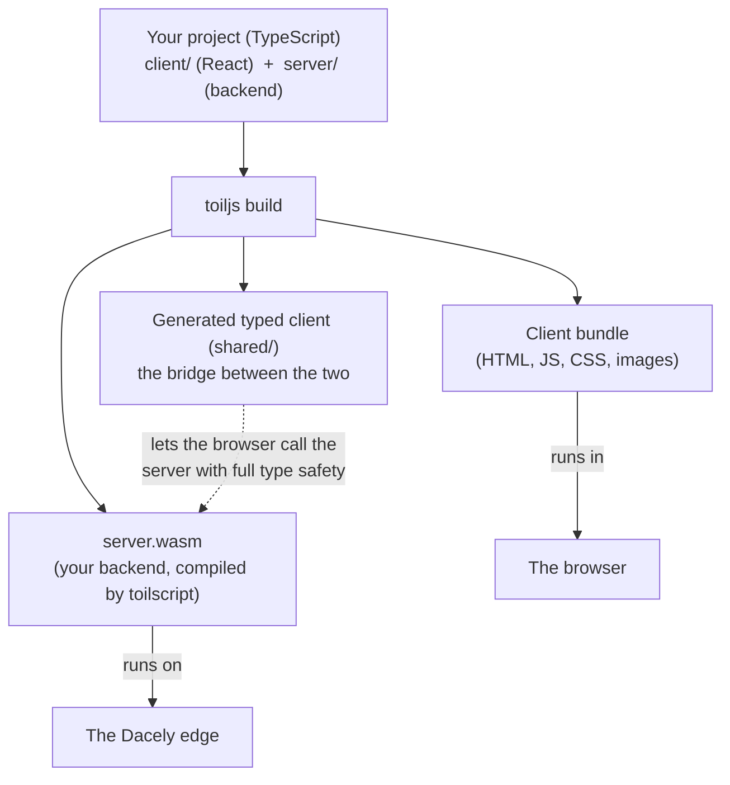
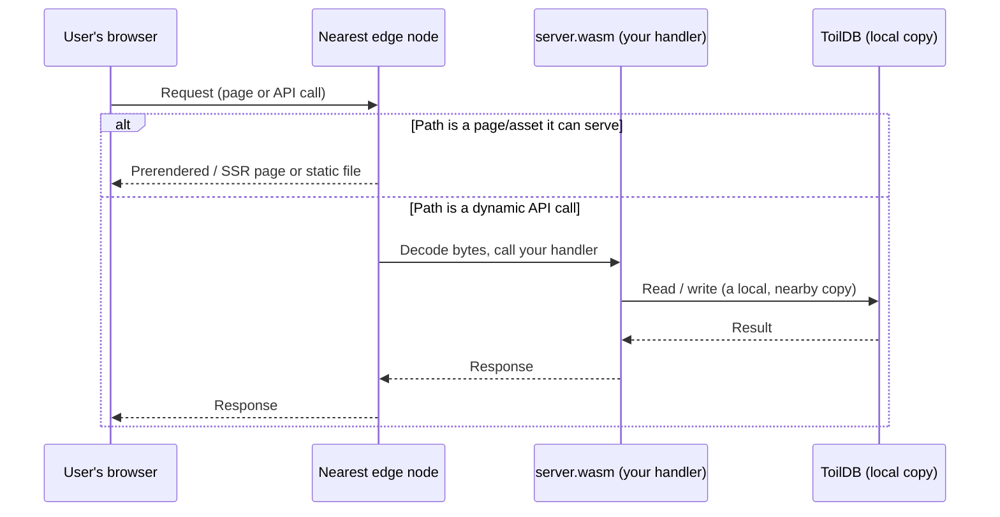
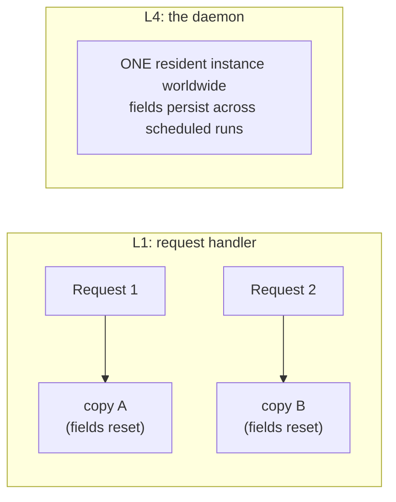

# How toil works

This page walks the whole machine end to end for a newcomer: what your project compiles into, what happens when a user makes a request, and the handful of pieces that fit together to serve it. No prior systems knowledge assumed; every term is defined as it appears.

## The one-paragraph version

You write one project in TypeScript: a React frontend and a backend, in the same repo, in the same language. When you build it, toil produces two things: a **client bundle** that runs in the browser, and a **server program** compiled to WebAssembly that runs out on servers near your users. Those servers (the **edge**) either hand back a ready-made page or run your server program to answer an API call, reading and writing a database (**ToilDB**) that lives right there next to them. Nothing has to travel back to a single far-away machine. That is the whole trick, and the rest of this page is how it is done.

## What "build" produces

Running `toiljs build` turns your one project into two separate outputs, because your code has two homes: the user's browser and the edge.

1. **The client bundle.** This is your React app, plus the pages toil can render ahead of time, packaged as ordinary web files (HTML, JavaScript, CSS, images). It runs in the user's browser, exactly like any modern web app.

2. **`server.wasm`.** This is your backend. You write it as normal TypeScript classes in `server/`, and a compiler called **toilscript** turns it into **WebAssembly**. It does not run in the browser and it does not run in Node; it runs on the edge.

3. **The generated typed client (`shared/`).** toil reads the shape of your backend and generates a small client for the browser to use. When your React code calls a server function, it calls a normal-looking async function, and the types line up end to end: if you change a field name on the server, the frontend stops compiling until you fix it. You get the safety of one program even though it runs in two places.

### What WebAssembly is, in plain words

**WebAssembly** (usually shortened to **WASM**) is a compact, fast, portable binary format for programs. Think of it as a tiny executable that many different environments (browsers, and servers like the edge) can run safely and quickly. Two properties matter here:

- **Fast.** WASM runs at close to native speed, far faster than interpreting source code line by line.
- **Sandboxed.** A **sandbox** is a locked box around a running program. A WASM module cannot open files, reach the operating system, or make network connections on its own. The only way it touches the outside world is through a small, fixed set of functions the host chooses to hand it (read the request, build a response, query the database). Everything else is walled off.

### Why compile TypeScript to WebAssembly

You could imagine running the backend as plain JavaScript on a server. toil compiles it to WASM instead, for three reasons:

- **Speed.** The compiled module runs fast and starts fast, with no interpreter warm-up.
- **Safety.** The sandbox means a buggy or even hostile backend cannot escape its box, crash the machine, or read another app's data. That is what makes it safe to run many different apps on one shared server.
- **Density.** Because each module is tiny and isolated, one edge box can safely hold many of them at once. More apps per machine means the whole system is cheaper to run near everyone. ([Why that matters for scale](./hyperscale.md).)

## The request lifecycle

Here is what happens, start to finish, when a person opens your site or your app makes an API call. The key point: it all happens on the **edge node nearest that user**, with no trip to a central origin server.

First, two terms:

- **The edge** is a fleet of servers spread across many cities worldwide. A user's request is served by whichever edge node is physically closest to them. Closer means less distance for the data to travel, which means lower latency (the delay before something happens).
- An **origin server** is the single central machine that a traditional site calls back to for anything real. toil has **no origin**: your compiled backend and its database are replicated out to the edge, so there is nothing far away to call.

Step by step:

1. **The request lands on the closest edge node.** The network routes the user to nearby infrastructure automatically.
2. **The edge decides: page or code?** If the path is something it can serve directly (a prerendered page, a server-rendered page, or a static asset like a JavaScript bundle or image), it serves that and never wakes your backend. This is the fast, cheap path for most page loads.
3. **Otherwise it runs your backend.** For a dynamic request (an API call, a form submission), the edge decodes the raw bytes into a friendly `Request` object and calls the single entry point of your `server.wasm`, which routes it to your handler.
4. **Your handler reads and writes the database locally.** When it needs stored data, it talks to [ToilDB](../database/README.md), which has a copy right there at the edge. No ocean crossing.
5. **Your handler returns a `Response`,** toil encodes it back to bytes, and the edge sends it to the browser.

The mental model for your backend is simple: it is a function of the request. Bytes in, bytes out, one request at a time.

### Stateless by default

A **fresh copy** of your handler serves each request, and the next request might be served by a different node on the other side of the planet. So anything you set on a field does not survive to the next request. This is called being **stateless**, and it is a feature: it is what lets your backend scale to the whole world with no coordination between nodes. When you need something to persist (a user account, a like count, a post), you write it to ToilDB. See the [backend overview](../backend/README.md#stateless-by-default).

## The pieces, and how they fit

Five parts make up a running toil app. You have now met all of them.

| Piece | What it is | Where it runs |
| --- | --- | --- |
| **React client** | Your frontend UI, the client bundle from the build. | The user's browser |
| **toilscript backend** | Your TypeScript backend compiled to `server.wasm`. | The edge |
| **The Dacely edge** | The Rust runtime that terminates the network connection, serves pages, and runs your WASM. | Servers in many cities |
| **ToilDB** | The globally distributed database, replicated next to your code. | The edge |
| **The four tiers** | Where and for how long a piece of backend code lives (see below). | L1 nearest, up to L4 worldwide |

The **Dacely edge** is worth one extra sentence, because it is doing quiet heavy lifting. It is a Rust runtime that speaks modern network protocols (HTTP/3 over QUIC, and WebTransport for realtime, with graceful fallback to HTTP/2 and HTTP/1.1) and uses userspace networking (DPDK, multi-queue) to move packets at high throughput. It is the thing that receives the connection, serves your pages, and runs your `server.wasm`. You never configure it directly; you deploy your project and it does the rest. Why that design scales is the subject of [the next page](./hyperscale.md).

## The four tiers, made concrete

Most of your backend runs as the stateless, per-request handler described above. That is the first and most common of four **compute tiers**, which is toil's word for "where and for how long a piece of code lives." They range from **L1** (a fresh copy per request, on the node nearest the user) up to **L4** (exactly one copy in the entire world). Full detail is on the [tiers page](../concepts/tiers.md); here is just enough to make the idea click.

The clearest contrast is L1 versus L4, and the **daemon** (L4) makes it concrete:

- An **L1 handler is forgetful.** A new copy serves each request and forgets everything when it finishes. That is why persistent data goes in the database.
- An **L4 daemon remembers.** A daemon is a single resident instance, exactly one worldwide, held by a **lease** (a right-to-run token) with automatic failover to a warm standby if it fails. Because that one instance stays alive between runs, its fields persist across scheduled runs. It is the one place where "do this exactly once, globally, on a schedule" is naturally true, which is what you want for jobs that must not double-fire (rolling up analytics, cleaning up expired rows, polling an upstream API).

The two in-between tiers, L2 (regional) and L3 (continental), are for long-lived connections like chat sockets, where the server keeps state per connected client. The full picture, including how the build routes code to each tier, is on the [tiers page](../concepts/tiers.md).

## Related

- [Backend overview](../backend/README.md): the request/response model and the sandbox in depth.
- [The database (ToilDB)](../database/README.md): where persistent, shared state lives.
- [Compute tiers](../concepts/tiers.md): L1 request, L2/L3 stream, L4 daemon, and how the build assigns them.
- [What makes toil hyper-scalable](./hyperscale.md): why this design serves the planet cheaply.
