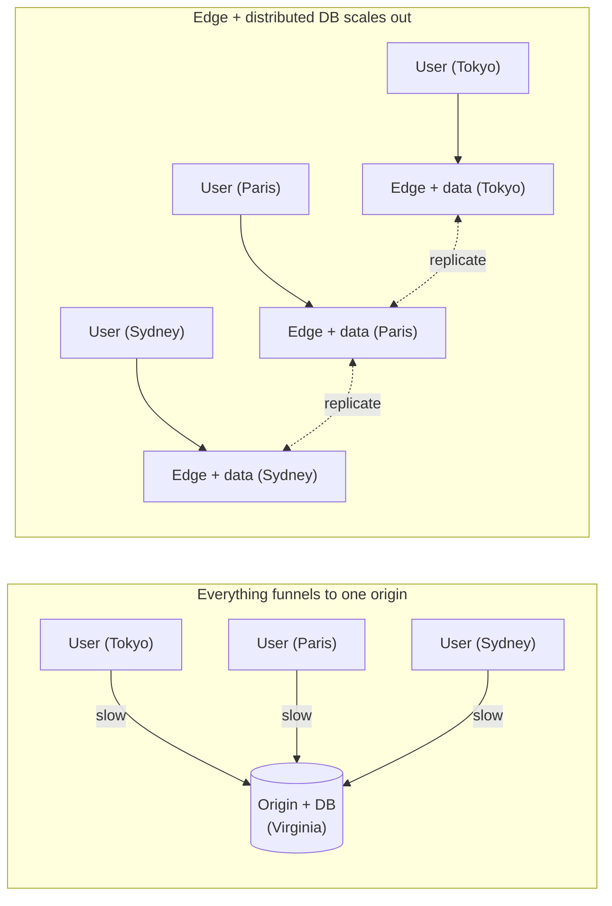

# What makes toil hyper-scalable

**Hyper-scale** is serving very large, worldwide traffic at low latency without rebuilding your app as it grows. The test: when traffic goes from a thousand users to a hundred million across every continent, do you rewrite the system, or just run more of it?

Most stacks scale the easy half (serving pages and cached reads from many places) but leave the hard half (writes, where data actually changes) in one region, so they slow down at once when enough far-away users start writing. toil scales both halves out together. It promises a design where scaling is cheap, adding more identical edge nodes with no central part everything funnels through, not a specific requests-per-second number.

## The mechanisms

**1. Compute next to the user.** toil has no origin server. Your `server.wasm` and its database are replicated to the [edge](../concepts/tiers.md) and run on the node nearest each user, so there is no slow hop to a faraway box. This is the biggest latency win, and the rest of the design exists to support it.

The left side has one hot center every user drags a request to and back from, a bottleneck no amount of caching removes. The right side has no center: add a city, add an edge node.

**2. WASM isolation and density.** Each site compiles to its own tiny, [sandboxed](./how-it-works.md#what-build-produces) WASM module that starts fast and cannot touch another tenant's files, memory, or network. Hard per-request limits (a memory cap in the tens of MiB, a **hard compute cap** that cuts off a looping handler, rate limits, and hostile-wasm containment) let one box safely hold many tenants at once, which is what makes compute in many cities affordable instead of a luxury.

**3. Allocation-free hot path.** The code that runs on every request wastes nothing: no per-request allocations, and no garbage-collection pauses (so no random latency spikes under load). This earns latency with lean code rather than by overprovisioning hardware to hide slow code, which is a bar toil holds itself to explicitly ([the RSG rubric](./design-principles.md)).

**4. Stateless tier over a distributed database.** A fresh copy of your handler serves each request and keeps nothing, so every node is interchangeable and you scale out purely by adding more. The data they share lives in [ToilDB](../database/README.md), which distributes **writes** too, not just reads, so there is no single box every write funnels through. The write mechanism and its honest trade-off (eventual consistency) are in [how toil is distributed](./distributed.md).

**5. Modern transport.** The edge speaks HTTP/3 over QUIC (with graceful fallback to HTTP/2 and HTTP/1.1, plus WebTransport for realtime), and its networking is tuned to keep the connection-level cost of each request low as traffic grows. You configure none of it.

The five reinforce each other: take any one away and a bottleneck reappears. No density and edge compute is too expensive to spread; no distributed writes and the database caps you; a wasteful hot path and you are back to buying latency with servers.

## An honest note on numbers

This describes a design, not a benchmark: real throughput and latency depend on your hardware, where your users are, how your data is shaped, and how your handler is written, and toil removes central bottlenecks and keeps per-request cost low without making a slow handler fast or repealing the speed of light between continents.

## Related

- [How toil is distributed](./distributed.md): distributing the writes, the hard problem this rests on.
- [Why toil is built this way (the RSG bar)](./design-principles.md): the efficiency check behind the hot path.
- [Compute tiers](../concepts/tiers.md): L1 through L4, and the stateless request model.
- [How toil works](./how-it-works.md): the build outputs and the request lifecycle.
- [The database (ToilDB)](../database/README.md): families, homes, and eventual consistency.
