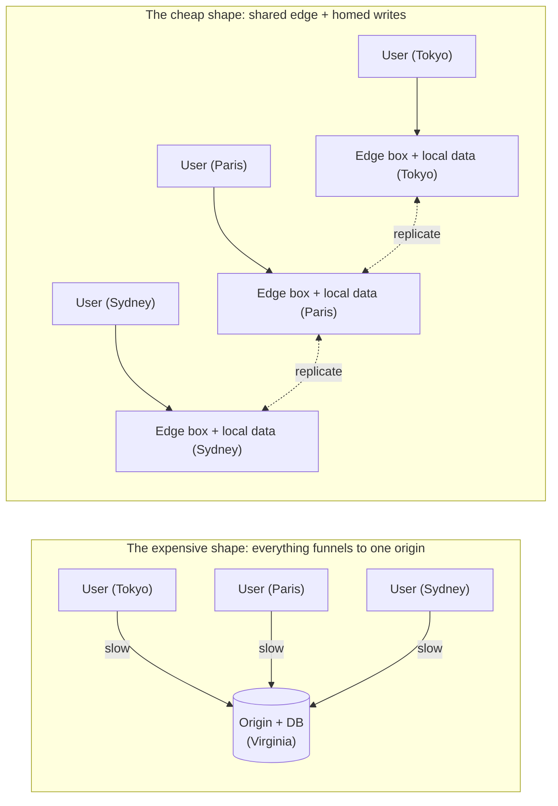

# What makes toil hyper-scalable

**Hyper-scale** is serving very large, worldwide traffic at low latency without rebuilding your app as it grows. The test: when traffic goes from a thousand users to a hundred million across every continent, do you rewrite the system, or just run more of it?

Plenty of stacks can reach that scale if you throw money at it: dedicated infrastructure per app, a rented vendor for each moving part, and an ops team to keep the seams from tearing. toil was built for the same scale from the other direction: **cheaply and efficiently**. The whole design is aimed at making top-tier reach the default, not a budget line. Cost is the point of this page.

## Why hyper-scale is normally expensive

Running near your users usually means paying for it in three places at once:

- **Dedicated infrastructure per app.** Each app gets its own boxes, its own containers, its own always-warm capacity. Spread that across many cities and you are renting a lot of mostly-idle hardware.
- **A far-away origin.** Most stacks serve pages from everywhere but send anything real back to one origin server in one region. Every write and every dynamic call pays for a round trip across the planet.
- **A centralized write database.** The reads scale out; the writes funnel into one primary in one city. That box is both the bottleneck and the thing you overprovision to keep ahead of.

Each of those is a cost multiplier, and they stack. toil removes all three.

## How toil makes it cheap

Three mechanisms do the work, and they reinforce each other.

**1. Density: one box safely runs many apps.** Your backend compiles to its own tiny, [sandboxed](./how-it-works.md#what-build-produces) WebAssembly module that starts fast, runs at near-native speed, and cannot touch another tenant's files, memory, or network. Because the sandbox is that tight, **one shared edge box holds many apps at once** instead of one app per machine. That multi-tenant density is what makes running near everyone affordable: you are not renting dedicated hardware in fifty cities, you are one tenant on boxes that are already there and already busy.

**2. Edge locality: no trip to a central origin.** toil has no origin server. Every request runs on the [edge](../concepts/tiers.md) node nearest the user, on the per-request **L1 hot path**: the network hands the bytes to the WASM host, your handler runs, a response goes back, all in one place. There is no slow hop to a faraway box to make the request "real." Removing the origin removes both the latency and the standing cost of running one.

**3. Local reads, homed writes.** The data your handlers share lives in [ToilDB](../database/README.md), replicated outward so every edge node reads from a copy right next to it. Writes are not centralized either: every key has one **home region** that orders its writes, while the data replicates out for fast local reads. So you get nearby reads everywhere without a single primary that every write funnels through, and without paying to overprovision one. The mechanism and its honest trade-off (eventual consistency) are in [how toil is distributed](./distributed.md).

The left side has one hot center every user drags a request to and back from, plus its dedicated fleet, a cost no amount of caching removes. The right side has no center and no per-app fleet: add a city, add a shared box, and every tenant on it gets that city for near nothing.

## Why this is cheap, in one line each

- **Density** means the cost of an edge presence is split across many tenants, not carried by one app.
- **Edge locality** means no origin fleet to run and no cross-planet round trip to pay for on every real request.
- **No dedicated infra** means you scale by adding interchangeable shared nodes, not by standing up a new stack per app.

Take any one away and a cost reappears: no density and running near everyone is a luxury again; no edge locality and you are back to paying for an origin; a centralized write path and the database caps you and gets overprovisioned to compensate.

## An honest note

This is the design, not a benchmark. Real throughput and latency depend on your hardware, where your users are, how your data is shaped, and how your handler is written. toil removes the central bottlenecks and keeps per-request cost low; it does not make a slow handler fast or repeal the speed of light between continents.

A few things are honestly staged, not "already everywhere":

- The per-request **L1** edge path is live and real. The **L2** regional, **L3** continental, and **L4** global-daemon tiers are opt-in and deployment-gated, not always-on for every app. See the [tiers page](../concepts/tiers.md).
- ToilDB's home-region write model and its core logic are real and tested, but **live multi-cell deployment** (WAN routing, the ScyllaDB backing) is configuration-gated, not on by default. The local dev database is a single in-process store. [How toil is distributed](./distributed.md) is honest about what is finished.

## Related

- [How toil is distributed](./distributed.md): distributing the writes, the hard problem this rests on.
- [Compute tiers](../concepts/tiers.md): L1 through L4, and the stateless request model.
- [How toil works](./how-it-works.md): the build outputs and the request lifecycle.
- [The database (ToilDB)](../database/README.md): families, homes, and eventual consistency.
- [Why toil is built this way (the RSG bar)](./design-principles.md): the efficiency check behind the hot path.
