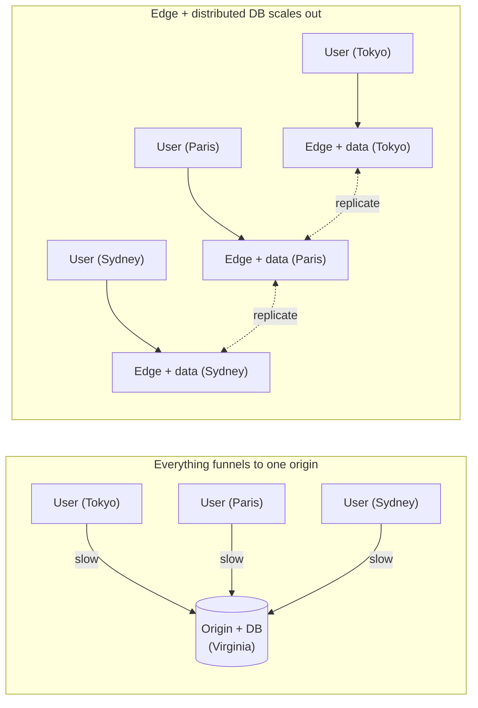

# What makes toil hyper-scalable

toil is built to serve very large, globally spread traffic without you re-architecting the app as it grows. This page defines what "hyper-scale" actually means, then walks the specific mechanisms that make it true, honestly, including where the real numbers depend on your deployment.

## What "hyper-scale" means

**Hyper-scale** is the ability to serve very large, worldwide traffic at low latency without having to rebuild your app as you grow. **Latency** is the delay a user waits before something happens. The test is simple: when your traffic goes from a thousand users to a hundred million, spread across every continent, do you rewrite the system, or do you just run more of it?

Most stacks fail that test quietly. They scale the easy half (serving pages and cached reads from many places) while the hard half (the database, where data actually changes) stays in one region. So the app looks global until enough users far from that one region start writing data, and then everything slows down at once. Hyper-scale means both halves scale out together.

toil does not promise a specific requests-per-second number, because throughput and latency depend on your hardware, your traffic, and your code. What it offers is a **design where scaling is cheap**: adding capacity means adding more identical edge nodes, with no central part that everything funnels through. The mechanisms below are how it gets there.

## Mechanism 1: compute next to the user

In an ordinary stack, the interesting work happens on an **origin server**, one central machine (or one region) that the rest of the world calls back to. A user in Tokyo whose origin is in Virginia pays for that whole round trip on every real action.

toil has **no origin**. Your compiled backend (`server.wasm`) and its database are replicated out to the [edge](../concepts/tiers.md) and run on the node nearest each user. The work happens where the user already is, so there is no slow hop to a faraway box. This is the single biggest latency win, and it is why the rest of the design exists to support it.

The left side has one hot center that every user drags a request to and back from; it is the bottleneck no amount of caching removes. The right side has no center: add a city, add an edge node, done.

## Mechanism 2: WebAssembly isolation and density

Running compute near every user only pays off if you can pack a lot of it onto each box cheaply. That is what **WebAssembly** buys.

Each site or tenant is compiled to its own tiny, sandboxed [WASM](./how-it-works.md#what-webassembly-is-in-plain-words) module. **Sandboxed** means the module runs in a locked box: it cannot touch files, the operating system, the network, or another tenant's memory, except through a small fixed set of host functions. Two consequences make this scale:

- **Fast start.** WASM modules are small and start quickly, so a box can bring one up, serve, and move on without heavyweight warm-up.
- **Density with hard limits.** Because each tenant is isolated and bounded, one physical box safely holds many of them at once. Each host is fenced in by hard, per-request limits so no one can hog the machine:
  - a **memory cap**: committed RAM is hard-capped at tens of MiB per host (the edge caps what a tenant may declare at 16 MiB, with a bounded growth ceiling that a compile-time invariant keeps well under 64 MiB);
  - a **gas meter**: a compute budget spent per request, so a slow or looping handler is cut off instead of stealing CPU from its neighbors ("gas" is a running count of work done; when it runs out, the request stops);
  - **rate limits** on how often a host can be called;
  - **hostile-wasm containment**: a buggy or malicious tenant cannot escape its sandbox or reach another tenant's data.

The payoff is economic. Many small, cheap, capped tenants per box means running compute in many cities does not require a data center's worth of hardware per app. Density is what makes "compute next to everyone" affordable rather than a luxury.

## Mechanism 3: the allocation-free hot path

Isolation and density get compute near the user cheaply. The next question is whether that compute is itself fast, or just plentiful. toil's answer is a **hot path** (the code that runs on every single request) built to do no wasted work:

- **Zero-copy request and response envelopes:** the bytes off the wire are handed to your handler and back without being copied around.
- **Bytes-based headers and thread-local scratch:** reused buffers instead of fresh allocations per request.
- **No garbage-collection pauses:** the runtime does not stop to sweep memory mid-request, so there are no random latency spikes under load.

Here is why this matters more than it looks. The lazy way to hit a latency target is to throw hardware at slow code: run thousands of overprovisioned instances so that even wasteful code answers quickly on average. toil rejects that explicitly. Its internal quality bar, the [RSG rubric](./design-principles.md), grades a system by its **weakest** axis, and the program-and-architecture axis includes an **efficiency check**: if your cost-per-request is far above what the work actually needs, that axis drops even when latency looks fine. In RSG's words, a good network must never be allowed to flatter bad code. The allocation-free hot path is how toil earns the latency honestly, with lean code, instead of buying it with a server bill. Cheap per request is what lets scaling stay cheap in aggregate.

## Mechanism 4: a stateless tier plus a distributed database

This is the mechanism that separates "global reads" from truly global scale.

The request tier is **stateless**: a fresh copy of your handler serves each request and keeps nothing between requests (see [how it works](./how-it-works.md#stateless-by-default)). Stateless code has a superpower: since no node holds anything special, every node is interchangeable, and you scale out purely by adding more of them. There is no leader to coordinate with and no shared memory to contend on.

But stateless code still needs somewhere to put data that lasts. If that somewhere is a single database in one region, you have just moved the bottleneck: reads might be fast everywhere, but every **write** still funnels to one box, and that is the thing that quietly caps most "global" systems. Distributing reads is easy; distributing writes is the hard problem, and it is where toil is different.

[ToilDB](../database/README.md) distributes the writes too. Every key has a single **home** region that serializes writes to that key (so concurrent writers can never corrupt it), while the data replicates outward so reads are served from a nearby copy. Different keys have different homes, so write load spreads across the whole fleet instead of piling onto one machine. The result is a system with no central bottleneck on either half: a stateless tier you scale by adding edges, over a database that scales writes by spreading their homes. The full story, and the honest trade-off it carries (eventual consistency), is on [how toil is distributed](./distributed.md).

## Mechanism 5: modern transport

The last mechanism is lower down, at the network itself. The edge terminates modern protocols and moves packets efficiently, which keeps the connection-level cost of each request low:

- **HTTP/3 over QUIC** (with graceful fallback to HTTP/2 and HTTP/1.1) sets up connections with fewer round trips and survives changing networks better than older protocols, and **WebTransport** carries realtime traffic.
- **Userspace networking (DPDK, multi-queue)** means the edge handles packets directly in the application, across many CPU queues in parallel, instead of paying the overhead of the general-purpose operating-system network path for every packet. That is what lets one box push high throughput.

You do not configure any of this. It is the foundation the tiers and the database sit on, and it is part of why the per-request overhead stays small as traffic grows.

## Putting it together

No single mechanism is the whole answer; they reinforce each other:

1. Compute runs **next to the user** (no origin hop), which is only affordable because
2. **WASM density** packs many capped tenants per box, whose per-request work stays cheap because
3. the **hot path wastes nothing** (and the RSG bar refuses to let hardware hide slow code), while
4. a **stateless tier over a write-distributed database** means adding capacity is just adding interchangeable edges, all riding on
5. **modern, efficient transport**.

Take any one away and a bottleneck reappears: no density and edge compute is too expensive to spread; no distributed writes and the database caps you; a wasteful hot path and you are back to buying latency with servers.

## An honest note on numbers

This page describes a **design**, not a benchmark. Real throughput and latency depend on your hardware, where your users are, how your data is shaped, and how your own handler code is written. toil makes scaling cheap by removing central bottlenecks and keeping per-request cost low; it does not make a slow handler fast or repeal the speed of light between continents. What it does guarantee is that when you grow, the answer is "run more identical edges," not "re-architect the app."

## Related

- [How toil is distributed](./distributed.md): distributing the writes, the hard problem this all rests on.
- [Why toil is built this way (the RSG bar)](./design-principles.md): the rubric and the efficiency check behind the hot path.
- [Compute tiers](../concepts/tiers.md): L1 through L4, and the stateless request model.
- [How toil works](./how-it-works.md): the build outputs and the request lifecycle.
- [The database (ToilDB)](../database/README.md): families, homes, and eventual consistency.
