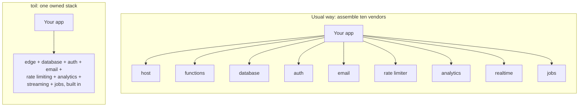

# Why toil? Who is it for?

toil is a full-stack framework: you write a React frontend and a TypeScript backend in one project, and toil runs both (plus a database) close to every user, worldwide.

The thesis in one line: toil is the modern full-stack tech a developer would actually want, AAA-grade from the very first line, and hyper-scalable at the same time. Even a simple pizza site gets top-tier infrastructure with zero setup. Distributed writes are one pillar of that. The modern stack that just works is the heart.

## The problem with today's stacks

Two problems, really.

**Read-global, write-central.** Your pages load fast from caches worldwide. But a *write* (a comment, a like, an order) usually travels to one database in one region. A user in Sydney writing to a database in Virginia pays for the round trip. That single region is also a single point of failure.

**The ten-vendor tax.** A typical production stack is stitched from rented services: a frontend host, serverless functions, a managed database, auth, email, a queue, a cache, analytics, realtime. Each is its own account, bill, SDK, and failure mode. You did not set out to be a systems integrator, but the stack hands you the job.

And every third-party service on your **critical path** (what must work for a request to succeed) is a black box you cannot inspect, patch, or fully secure. When it is slow, you are slow. When it is breached, part of you is breached.

The result: a solo builder and a funded startup hit the *same* wall. Good, safe, fast infrastructure means assembling and babysitting a lot of parts, so most people settle for less.

## What toil does instead

Close the gap, own the pieces, and make the good version the *default* version. Four pillars.

### 1. AAA-grade from the first line

Top-tier infrastructure on day one, on the smallest project, with zero setup: edge compute (your code runs near users worldwide), one-line post-quantum login, automatic tamper-proofing of your app's code, HTTP/3, and a global database already there.

A pizza site and a planet-scale app start from the same baseline. "AAA-grade" is the actual bar toil grades itself against; see [design principles](./design-principles.md).

### 2. Batteries-included, and owned

Auth, database, email, rate limiting, analytics, realtime streaming, and background jobs are all built in and are toil's own. Nothing third-party sits on your critical path.

Because they are one system, the parts already fit. You are not gluing ten SDKs together and praying they agree. Full catalog: [The modern stack](./modern-stack.md).

Honest boundary: "owned" means the *core* of a working app is toil's, not that outside services are banned. Call a payment provider or another API and you still can.

### 3. A modern DX that just works

TypeScript end to end, one repo, one deploy, wired by types: change a field on the server and the frontend stops compiling until you fix it (a compile error at your desk, not a production bug).

The toolchain is set up for you: ESLint, Prettier (with a plugin for toil's decorators), an editor plugin, one CLI, and a `doctor` that fixes common problems in place. The docs are even LLM-friendly, so an AI assistant reads your current conventions instead of guessing. More in [The modern stack](./modern-stack.md).

### 4. Hyper-scalable and distributed (one pillar, not the whole story)

Your backend compiles to a tiny sandboxed **WebAssembly** module (a compact, locked-down binary that runs at near-native speed), so one edge box safely runs many apps, which makes running near everyone affordable.

And the database, **ToilDB**, distributes the *writes*, not just the reads: every key has one **home** region that orders its writes, while data replicates outward for fast local reads. Distributing writes is the hard part almost nobody does. The trade is eventual consistency: a far read can lag a few milliseconds. See [How toil works](./how-it-works.md) and [How toil is distributed](./distributed.md).

## Who it is for

- **Solo builders and small teams:** a full, global, secure stack without hiring a platform team. The pizza site is first-class.
- **Latency-sensitive apps:** writes that resolve near the user, not across an ocean.
- **Global apps:** logic and data near users on every continent.
- **Realtime apps:** chat, presence, and live cursors on built-in streaming, not a bolted-on vendor.

Same install for the smallest project and the largest. You grow into the scale; you do not rebuild to reach it.

## When not to use toil

- **You need SQL or heavy joins.** ToilDB is seven purpose-built families, not a general SQL engine. See the [database overview](../database/README.md).
- **You lean on the Node ecosystem.** The server is a strict TypeScript subset compiled to WebAssembly: no arbitrary npm packages, no Node APIs, built-in globals instead.
- **You are happy single-region and simple.** If one region already fits, toil's distribution is effort you do not need.
- **You need a big integration catalog today.** toil is younger, and that catalog is smaller.

None of these are permanent, and the right tool is the one that fits the job in front of you.

## Related

- [The modern stack](./modern-stack.md): the full, verified catalog of what is built in.
- [How toil works](./how-it-works.md): the whole machine end to end, from React client to ToilDB.
- [toil versus other frameworks](./vs-other-frameworks.md): an honest, axis-by-axis comparison.
- [Security](../concepts/security.md): the defaults that are already on.
- [Getting started](../getting-started/README.md): install the tool and build a small feature.
