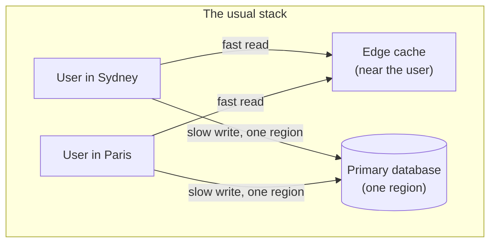

# Why toil? Who is it for?

toil is a full-stack framework that runs your frontend, your backend, and your database close to every user, worldwide. This page explains the problem it exists to fix, what you get in return, who benefits most, and the honest cases where you should reach for something else.

## The problem with today's stacks

Almost every modern web app has a split personality. The read path is global and the write path is central, and that gap is where the trouble hides.

### Read-global, write-central

Your pages, images, and scripts are served from a content network with servers all over the world, so they load fast no matter where you are. That is the "global" part, and it is real. But the moment a user *changes* something (posts a comment, likes a photo, places an order), that write usually has to travel to one database, in one region, often one primary machine. A user in Sydney writing to a database in Virginia pays for the round trip whether the marketing says "global" or not.

This matters for two reasons:

- **Speed.** Far-from-user writes feel slow in exactly the moments users care about most: the tap that is supposed to do something. Reads can be cached and copied everywhere; a write cannot be faked.
- **Fragility.** A single-region database is a single point of failure. When that region has a bad day, every user everywhere has a bad day, no matter how many edge locations served the pretty part.

The RSG rubric that toil grades itself against (see [design principles](./design-principles.md)) has a blunt name for this: the **data path** axis, and it is the one that quietly caps most "global" systems. Reads are easy to distribute. Writes are hard. A system is only as strong as its weakest link, so a globally cached frontend on a single-region database is graded by the database, not by the cache.

### The tax of assembling ten vendors

The single database is only the start. A typical production stack is stitched together from many separate services: a host for the frontend, a serverless platform for functions, a managed database, an auth provider, a payment provider, an email sender, a queue, a cache, a search index, a log aggregator, an analytics tool. Each is a separate account, a separate bill, a separate SDK, a separate set of failure modes, and a separate thing to keep in sync.

You did not set out to become a systems integrator, but that is the job the stack quietly hands you.

### The platform-team tax

Wiring those pieces into something reliable, observable, and secure is real work, and at scale it becomes a full-time team: a platform or infrastructure group whose job is the plumbing, not the product. Small teams either pay for that team or pay in nights and weekends. Either way it is time not spent on the thing users actually came for.

### Critical-path dependencies you cannot inspect or fix

The subtlest cost is trust. Every third-party service on your **critical path** (the sequence of things that must work for a request to succeed) is a system you cannot see inside, cannot patch, and cannot fully secure. When your login provider is slow, your login is slow. When their security is breached, part of your security is breached. You inherit their outages and their incidents, and your only lever is a status page and a support ticket.

Under the RSG rubric this is the **dependencies** axis, and it is deliberately unforgiving at the top: one auth vendor or one managed queue on the hot path is enough to cap an otherwise excellent system, because your reliability and your security are now only as good as someone else's, and you cannot fix theirs.

## What toil gives you instead

toil's answer is to close the gap and own the pieces, so the whole request lives near the user and nothing critical is a black box you rent.

- **Global speed for reads and writes.** Your React frontend and your TypeScript backend both compile down and run on the **Dacely edge** (a fleet of servers near your users). The backend is compiled by a compiler called **toilscript** into a small sandboxed **WebAssembly** module (a compact, locked-down binary that runs at near-native speed). The database, **ToilDB**, is distributed too. Its core trick: every key has a single **home** region that lines up that key's writes so they are correct and race-free, while the data replicates outward so reads are fast locally. That distributes the *writes*, not just the reads, which is the hard part almost nobody does. The honest trade is that reads in far regions are eventually consistent (they can be a beat behind for a few milliseconds after a write). The mechanism is covered in [how it works](./how-it-works.md) and [how toil is distributed](./distributed.md).
- **An owned, batteries-included stack.** Auth, database, email, rate limiting, streaming, and background jobs are all built in and self-owned, with no third-party service on the critical path. You are not assembling ten vendors; the parts already fit, because they are one system.
- **One language, one project, one deploy.** You write the frontend and the backend in TypeScript, in a single repository, and ship them together. The two ends are wired by types, so a mismatch is a compile error at your desk instead of a runtime bug in production. One build, one deploy, one thing to reason about.
- **Security designed in, not bolted on.** Password login is **post-quantum** and shaped so the password never reaches the server in a form anyone can replay: a breached server yields no usable credentials (contrast the ordinary pattern, where the server receives the raw password over TLS and hashes it, so a memory dump or a stray log line at the wrong moment leaks live passwords). Secrets are injected per host and never compiled into the WebAssembly module, and the client bundle is protected by Subresource Integrity (the browser checks each asset against a hash and refuses a tampered one). See [auth](../auth/how-it-works.md).

The point is not that each piece is individually novel. It is that owning all of them at once is what lets a system be strong on every axis *at the same time*, instead of being great at reads and quietly capped somewhere you did not look.

## Who benefits most

toil is aimed squarely at people who want top-tier global behavior without running an infrastructure org to get it.

- **Product builders and small teams.** If you want a fast, reliable, global app but do not have (or want) a platform team to stitch and babysit ten services, toil hands you the plumbing already assembled so you can spend your time on the product.
- **Latency-sensitive apps.** Anything where the *write* has to feel instant (a like, a message send, a save, a reservation) benefits directly from writes that resolve near the user instead of across an ocean.
- **Global apps.** If your users are spread across continents, a single-region backend punishes everyone far from it. toil puts logic and data near all of them.
- **Realtime apps.** Chat, presence, live cursors, and collaborative features get built-in streaming over modern transports, next to the user, rather than tacked on through a separate realtime vendor.

## When not to use toil

toil is opinionated, and the honest flip side of "owns the whole stack" is "you live inside its choices." Reach for something else when:

- **You need a specific existing SQL schema or heavy relational joins.** ToilDB is a set of purpose-built families (Documents, Unique, Counter, Events, View, Membership, Capacity), not a general SQL engine. If your app is built around complex ad-hoc joins, foreign-key-heavy relational modeling, or an existing schema you must keep, a traditional SQL database fits your shape better. See the [database overview](../database/README.md).
- **You depend on a mature server-side npm ecosystem.** toilscript compiles a strict *subset* of TypeScript to WebAssembly. You cannot import arbitrary npm packages or call Node APIs on the server; you use built-in globals instead. That is what makes the sandbox small, fast, and safe, but if your backend leans on a rich tree of Node libraries, that reliance does not come along.
- **You are happy single-region and simple.** If your users are concentrated in one area and a boring single-region app already meets your needs, toil's distribution is effort you do not need. A simple, fast, centralized app is a perfectly good answer, and RSG agrees: a tight single-region app outranks a global-but-slow one.
- **You need a large third-party integration ecosystem today.** toil is younger, and its catalog of prebuilt integrations is smaller than long-established platforms. If your project is defined by plugging into many existing services out of the box, that ecosystem is not there yet.

None of these are permanent verdicts, and some (the ecosystem in particular) are a matter of maturity over time. But the right tool is the one that fits the job in front of you, and pretending otherwise would be exactly the kind of marketing this documentation is trying not to be.

## Related

- [How toil works](./how-it-works.md): the whole machine end to end, from your React client to ToilDB.
- [toil versus other frameworks](./vs-other-frameworks.md): an honest, axis-by-axis comparison with the stacks you already know.
- [Getting started](../getting-started/README.md): install the tool and build a small feature end to end.
