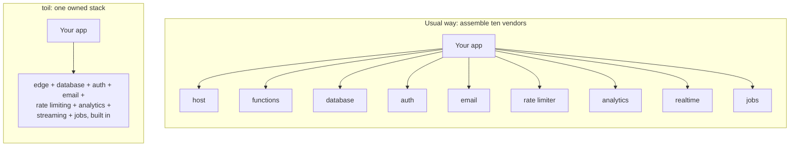

# Why toil? Who is it for?

toil is a full-stack framework: you write a React frontend and a TypeScript backend in one project, and toil runs both (plus a database) close to every user, worldwide.

The thesis in one line: toil is the modern full-stack tech a developer would actually want, AAA-grade from the very first line, and hyper-scalable at the same time. Even a simple pizza site gets top-tier infrastructure with zero setup. Distributed writes are one pillar of that; the modern stack that just works is the heart.

## The problem with today's stacks

Shipping a good app today means fighting your own infrastructure. Five ways it fights back.

**Reads go global, writes go to one region.** Your pages load fast from caches worldwide, but a *write* (a comment, a like, an order) crawls back to a single database in a single region. A user in Sydney writing to Virginia pays for the whole round trip, and that one region is a single point of failure for everyone.

**You became a systems integrator by accident.** A production stack is a dozen rented services stitched together: a frontend host, serverless functions, a managed database, auth, email, a queue, a cache, analytics, realtime. Each is its own account, bill, SDK, and outage. And every one on your *critical path* (what must work for a request to succeed) is a black box you cannot inspect, patch, or secure: when it is slow you are slow, when it is breached part of you is breached.

**It runs on yesterday's tooling.** The typical stack sits on a decade of accumulated legacy: bundler configs, transpiler shims, CommonJS-versus-ESM interop, framework churn, and a `node_modules` folder heavier than the app itself. You fight the toolchain and chase version bumps instead of building. The modern web platform moved on; the stack did not.

**Overhead at every layer.** Heavy runtimes, slow builds, serverless cold starts, oversized JavaScript shipped to the browser, and a network hop between every service. Each layer piles on latency and cost that the user feels and you debug.

**Fast and safe are opt-in, never the default.** Good performance and real security are things you assemble by hand: a CDN here, a cache there, careful data fetching, region tuning, hardened auth, current cryptography. Miss a piece and you are slow or exposed. The good version is always the extra work, so most people ship the lesser one.

The result: a solo builder and a funded startup hit the *same* wall. Top-tier infrastructure means assembling and babysitting a lot of parts, so most settle for less.

## What toil does instead

Every design decision in toil serves one goal: AAA-grade infrastructure as the *default*, not the thing you assemble by hand. All of it in one framework, not ten rented vendors. Zero configuration, and no distributed-systems or networking expertise required. It just works out of the box, quantum-proof login included, on a stack built for modern tech instead of a decade of legacy tooling.

Four pillars.

### 1. AAA-grade from the first line

Top-tier infrastructure on day one, on the smallest project, with zero setup: edge compute (your code runs near users worldwide), a global database already there, automatic tamper-proofing of every shipped asset (SHA-384 Subresource Integrity), and quantum-proof login in about one line.

That login is real post-quantum cryptography. Your password is stretched into a signing key on your device and never reaches the server in a usable form, and the handshake uses ML-DSA and ML-KEM, the NIST-standardized algorithms meant to survive a quantum computer. Most stacks bolt current crypto on by hand, if at all; here it is the default.

A pizza site and a planet-scale app start from the same baseline. "AAA-grade" is the actual bar toil grades itself against; see [design principles](./design-principles.md).

### 2. Batteries-included, and owned

Auth, database, email, rate limiting, analytics, realtime streaming, and background jobs are all built in and are toil's own. Nothing third-party sits on your critical path.

Because they are one system, the parts already fit. You are not gluing ten SDKs together and praying they agree. Full catalog: [The modern stack](./modern-stack.md).

Honest boundary: "owned" means the *core* of a working app is toil's, not that outside services are banned. Call a payment provider or another API and you still can.

### 3. A modern DX that just works

Built on today's web platform, not a decade of accumulated legacy: TypeScript end to end, one repo, one deploy, wired by types. Change a field on the server and the frontend stops compiling until you fix it (a compile error at your desk, not a production bug).

The toolchain is set up for you: ESLint, Prettier (with a plugin for toil's decorators), an editor plugin, one CLI, and a `doctor` that fixes common problems in place. The docs are even LLM-friendly, so an AI assistant reads your current conventions instead of guessing. More in [The modern stack](./modern-stack.md).

### 4. Hyper-scalable and distributed

Your backend compiles to a tiny sandboxed **WebAssembly** module (a compact, locked-down binary that runs at near-native speed), modern tech rather than a heavyweight legacy runtime, so one edge box safely runs many apps and running near everyone stays affordable.

And the database, **ToilDB**, distributes the *writes*, not just the reads: every key has one **home** region that orders its writes, while data replicates outward for fast local reads. Distributing writes is the hard part almost nobody does. toil is built to do it worldwide and the mechanism is real and tested; live multi-region deployment is configuration-gated rather than on by default, and once it is on, a far read can lag a few milliseconds (the eventual-consistency trade). See [How toil works](./how-it-works.md) and [How toil is distributed](./distributed.md).

## Who it is for

- **Solo builders and small teams:** a full, global, secure stack without hiring a platform team. The pizza site is first-class.
- **Latency-sensitive apps:** writes that resolve near the user, not across an ocean.
- **Global apps:** logic and data near users on every continent.
- **Realtime apps:** chat, presence, and live cursors on built-in streaming, not a bolted-on vendor.

Same install for the smallest project and the largest. You grow into the scale; you do not rebuild to reach it.

## When not to use toil

- **You need SQL or heavy joins.** ToilDB is seven purpose-built families, not a general SQL engine. See the [database overview](../database/README.md).
- **You lean on the Node ecosystem.** The server is a strict TypeScript subset compiled to WebAssembly: no arbitrary npm packages, no Node APIs, built-in globals instead.
- **You are happy single-region and simple.** If one region already fits, toil's distribution is effort you do not need.
- **You need a big integration catalog today.** toil is younger, and that catalog is smaller.

None of these are permanent, and the right tool is the one that fits the job in front of you.

## Related

- [The modern stack](./modern-stack.md): the full, verified catalog of what is built in.
- [How toil works](./how-it-works.md): the whole machine end to end, from React client to ToilDB.
- [toil versus other frameworks](./vs-other-frameworks.md): an honest, axis-by-axis comparison.
- [Security](../concepts/security.md): the defaults that are already on.
- [Getting started](../getting-started/README.md): install the tool and build a small feature.
